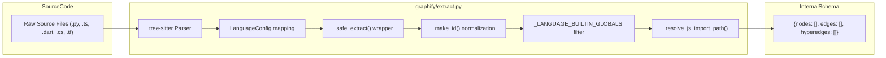
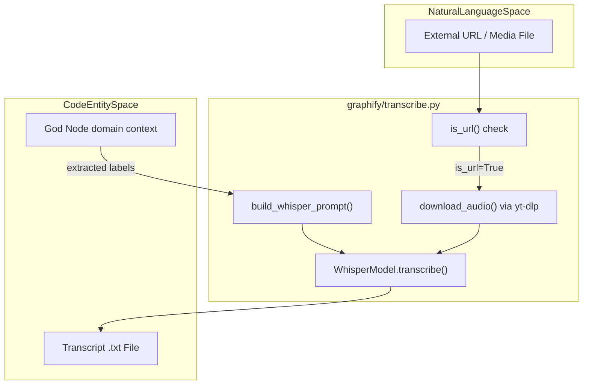

# 추출 엔진

관련 소스 파일

다음 파일들은 이 위키 페이지를 생성하기 위한 컨텍스트로 사용되었습니다.

- [graphify/detect.py](graphify/detect.py)
- [graphify/extract.py](graphify/extract.py)
- [graphify/llm.py](graphify/llm.py)
- [graphify/mcp_ingest.py](graphify/mcp_ingest.py)
- [graphify/transcribe.py](graphify/transcribe.py)
- [graphify/validate.py](graphify/validate.py)
- [tests/fixtures/dynamic_import.ts](tests/fixtures/dynamic_import.ts)
- [tests/fixtures/sample.mcp.json](tests/fixtures/sample.mcp.json)
- [tests/test_claude_cli_backend.py](tests/test_claude_cli_backend.py)
- [tests/test_extract.py](tests/test_extract.py)
- [tests/test_languages.py](tests/test_languages.py)
- [tests/test_llm_backends.py](tests/test_llm_backends.py)
- [tests/test_mcp_ingest.py](tests/test_mcp_ingest.py)
- [tests/test_provider_registry.py](tests/test_provider_registry.py)
- [tests/test_terraform.py](tests/test_terraform.py)

**추출 엔진**은 `graphify`의 주요 수집 및 파싱 계층입니다. 원시 소스 코드, 학술 논문, 웹 콘텐츠, 오디오/비디오 미디어를 통합 그래프 스키마로 변환합니다. 이 엔진은 하이브리드 접근 방식을 사용합니다. 20개 이상의 언어에 대해 `tree-sitter`를 통한 결정적 Abstract Syntax Tree(AST) 파싱, 특화 웹 수집, AI 기반 전사, 의미 추출을 위한 직접 LLM 백엔드를 결합합니다.

## AST 기반 구조 추출

엔진은 `tree-sitter`를 사용하여 코드 엔터티와 그 관계를 결정적으로 추출합니다 [graphify/extract.py:1-1](). LLM 기반 추출과 달리 이 프로세스는 순수하게 구조적이므로 클래스 계층, 메서드 정의, import graph에 대한 정확성을 보장합니다.

### 지원 언어 및 추출기 함수
엔진은 Dart, Verilog/SystemVerilog, PHP, BYOND DreamMaker, .NET 프로젝트 파일에 대한 특화 지원을 포함해 20개 이상의 언어를 지원합니다.

| 언어 | 추출기 함수 | 캡처되는 주요 엔터티 |
| :--- | :--- | :--- |
| **Python** | `extract_python` | Classes, Methods, Functions, Imports, Inheritance, Calls [tests/test_extract.py:23-50]() |
| **JS / TS** | `extract_js` | Classes, Methods, Functions, Exports, Calls, `.mjs/.ejs` support [tests/test_languages.py:5-9]() |
| **Go** | `extract_go` | Structs, Methods, Constructors, Calls [tests/test_languages.py:5-9]() |
| **Rust** | `extract_rust` | Structs, Impl Blocks, Methods, Functions, Calls [tests/test_languages.py:5-9]() |
| **Java** | `extract_java` | Classes, Interfaces, Methods, Imports [tests/test_languages.py:72-107]() |
| **C / C++** | `extract_c`, `extract_cpp` | Functions, Classes, Includes, Calls [tests/test_languages.py:110-205]() |
| **PHP** | `extract_php` | Classes, Traits, Static Properties, Container Binds [tests/test_languages.py:7-9]() |
| **.NET** | `extract_sln`, `extract_csproj` | Project dependencies, references, solutions, `.razor` support [tests/test_languages.py:9-12]() |
| **Dart** | `extract_dart` | Classes, Mixins, Extensions, Methods [tests/test_languages.py:5-9]() |
| **DreamMaker** | `extract_dm`, `extract_dmi` | BYOND DM/DMI/DMM/DMF structures [tests/test_languages.py:10-12]() |
| **Terraform** | `extract_terraform` | Resources, Providers, Variables, Data Sources [tests/test_terraform.py:7-12]() |
| **Pascal** | `extract_pascal` | Units, Procedures, Functions, Classes (Lazarus support) [tests/test_languages.py:5-9]() |

### 결정적 ID 생성
엔진은 `_make_id`를 사용해 심볼 이름에서 안정적인 노드 ID를 생성합니다. 비 ASCII 식별자가 충돌로 접히지 않도록 Unicode 문자(NFKC 정규화)를 보존합니다 [graphify/extract.py:65-78](). 서로 다른 디렉터리에 있는 같은 이름의 파일 간 충돌을 방지하기 위해 `_file_stem`은 상위 디렉터리 이름으로 stem을 한정합니다 [graphify/extract.py:81-87]().

### 심볼 해석 및 필터링
파일 간 심볼 해석은 결정적으로 처리됩니다. JavaScript/TypeScript의 경우 `_resolve_js_import_path`는 import가 `.js` 확장자를 사용하지만 소스는 `.ts`인 ESM 관례를 처리하고, 디렉터리 index 파일을 해석합니다 [graphify/extract.py:146-177]().

그래프 오염을 방지하기 위해 `_LANGUAGE_BUILTIN_GLOBALS`는 일반 built-ins(예: `String`, `Promise`, `int`, `list`)가 그래프 노드가 되는 것을 필터링합니다 [graphify/extract.py:24-43](). 또한 `_PYTHON_ANNOTATION_NOISE`는 일반 type hint가 허위 edge를 생성하지 않도록 억제합니다.

**AST 추출 흐름**

**출처:** [graphify/extract.py:24-43](), [graphify/extract.py:65-87](), [graphify/extract.py:146-177](), [tests/test_extract.py:7-22]()

---

## 멀티모달 수집

### URL 수집(`ingest.py`)
`ingest` 모듈은 외부 URL을 그래프 준비가 된 Markdown 파일로 변환합니다.
*   **arXiv**: 논문의 초록, 제목, 저자를 대상으로 합니다.
*   **Tweets**: oEmbed를 사용해 트윗 텍스트와 메타데이터를 추출합니다.
*   **Webpages**: `markdownify`를 사용해 HTML을 깔끔한 Markdown으로 변환합니다.

### 오디오/비디오 전사(`transcribe.py`)
엔진은 전사에 `faster-whisper`를 사용합니다 [graphify/transcribe.py:1-9]().
*   **도메인 인식 프롬프트**: `build_whisper_prompt`는 "God Nodes"(코퍼스의 최상위 추상화)를 사용해 Whisper에 기술적 컨텍스트 힌트를 제공함으로써, 특화 용어의 정확도를 높입니다 [graphify/transcribe.py:93-114]().
*   **URL 지원**: `download_audio`는 `yt-dlp`를 사용해 오디오 스트림을 가져옵니다 [graphify/transcribe.py:48-90]().

### 특화 수집
*   **MCP Config**: `extract_mcp_config`는 `.mcp.json` 및 `claude_desktop_config.json`을 파싱해 도구 이름과 서버를 매핑합니다 [graphify/mcp_ingest.py:1-10]().
*   **SCIP Ingestion**: `graphify/scip_ingest.py`는 LLM이 생성한 심볼 그래프를 위한 SCIP JSON 수집을 지원합니다.

**데이터 수집에서 엔터티 공간으로**

**출처:** [graphify/transcribe.py:48-114](), [graphify/mcp_ingest.py:1-15]()

---

## LLM 백엔드(`llm.py`)

AST 파싱만으로 충분하지 않은 의미 추출을 위해, `graphify`는 Claude, Gemini, OpenAI, Ollama, Bedrock, Kimi K2.6을 지원하는 직접 LLM 백엔드를 제공합니다 [graphify/llm.py:48-119]().

*   **직접 API 경로**: `extract_files_direct`는 전체 Claude Code 스킬 환경 없이 LLM을 호출할 수 있게 합니다 [graphify/llm.py:1-5]().
*   **청크 처리**: 큰 파일 목록은 컨텍스트 창 오버플로를 피하기 위해 토큰 예산을 기준으로 청크로 나뉩니다 [graphify/llm.py:17-25]().
*   **적응형 재시도**: `_extract_with_adaptive_retry`는 컨텍스트 창 오버플로에 대해 이분법을 구현하여, 모델 한계에 맞을 때까지 청크를 절반으로 나눕니다 [graphify/llm.py:134-191]().
*   **사용자 정의 Provider**: 사용자는 `~/.graphify/providers.json`을 통해 사용자 정의 LLM 백엔드를 정의할 수 있습니다 [graphify/llm.py:122-162]().

---

## 검증, 캐싱 및 보안

### 의미 및 AST 캐시(`cache.py`)
증분 업데이트 중 성능을 보장하기 위해, `graphify`는 SHA256 기반 캐시 시스템을 구현합니다.
*   **Stat 기반 Fastpath**: 가능한 경우 전체 파일 읽기를 건너뛰기 위해 `size`와 `mtime_ns`를 사용합니다.
*   **저장소**: 캐시된 추출 결과는 `graphify-out/cache/ast/` 또는 `graphify-out/cache/semantic/`에 저장됩니다.

### 보안 및 검증(`validate.py`)
*   **스키마 강제**: `validate_extraction`은 필수 필드를 확인하고 신뢰도 수준(`EXTRACTED`, `INFERRED`, `AMBIGUOUS`)을 강제합니다 [graphify/validate.py:10-38]().
*   **파일 유형 안전성**: `code`, `document`, `paper`, `image`, `video`, `rationale`, `concept`을 포함한 유효한 유형을 강제합니다 [graphify/validate.py:4-5]().
*   **의미 정리**: `graphify/semantic_cleanup.py`는 의미 fragment를 검증하고 rationale node를 정제해 그래프 팽창을 방지합니다.

---

## 추출 스키마

### 노드 스키마
| 키 | 타입 | 설명 |
| :--- | :--- | :--- |
| `id` | `str` | `_make_id`를 통해 생성되는 안정적인 ID [graphify/extract.py:65-78](). |
| `label` | `str` | 사람이 읽을 수 있는 이름(예: `process()`). |
| `file_type` | `str` | `code`, `document`, `paper`, `image`, `video`, `rationale`, 또는 `concept` [graphify/validate.py:4-5](). |
| `source_file`| `str` | 원본 파일의 경로. |

### 엣지 스키마
| 키            | 타입    | 설명                                                                                                             |
| :----------- | :---- | :------------------------------------------------------------------------------------------------------------- |
| `source`     | `str` | 소스 노드의 `id`.                                                                                                   |
| `target`     | `str` | 대상 노드의 `id`.                                                                                                   |
| `relation`   | `str` | `inherits`, `implements`, `calls`, `imports`, `references`, `depends_on`, etc [graphify/extract.py:107-110](). |
| `confidence` | `str` | `EXTRACTED`, `INFERRED`, 또는 `AMBIGUOUS` [graphify/validate.py:5-5]().                                          |
| `context`    | `str` | 특정 참조 컨텍스트(예: `field`, `parameter_type`, `return_type`) [graphify/extract.py:112-114]().                       |

**출처:** [graphify/extract.py:1-177](), [graphify/llm.py:48-191](), [graphify/transcribe.py:48-114](), [graphify/validate.py:4-64](), [tests/test_terraform.py:7-12]()
