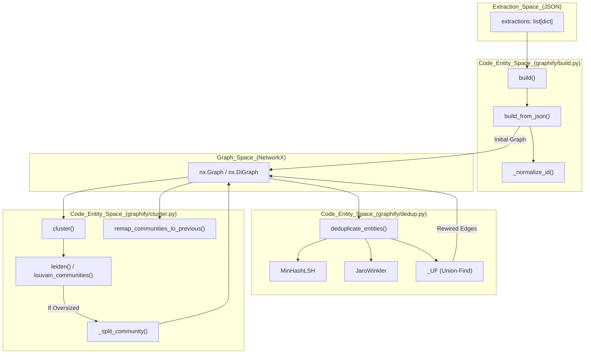
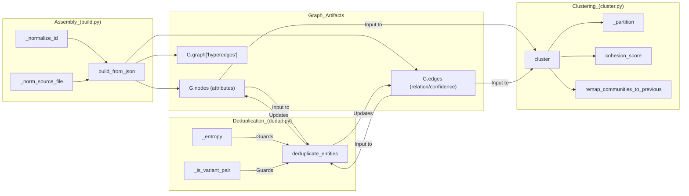

# 그래프 조립, 중복 제거 및 클러스터링

관련 소스 파일

다음 파일들은 이 위키 페이지를 생성하기 위한 컨텍스트로 사용되었습니다.

- [graphify/build.py](graphify/build.py)
- [graphify/cluster.py](graphify/cluster.py)
- [graphify/dedup.py](graphify/dedup.py)
- [tests/test_build.py](tests/test_build.py)
- [tests/test_claude_md.py](tests/test_claude_md.py)
- [tests/test_cli_export.py](tests/test_cli_export.py)
- [tests/test_cluster.py](tests/test_cluster.py)
- [tests/test_dedup.py](tests/test_dedup.py)
- [tests/test_rationale.py](tests/test_rationale.py)

파이프라인의 이 단계는 원시 추출 딕셔너리를 구조화된 **NetworkX** 그래프로 변환하고, 다단계 중복 제거 파이프라인을 통해 엔터티 모호성을 해소하며, 커뮤니티 감지 알고리즘을 적용해 데이터를 의미 있는 클러스터로 구성합니다.

## 그래프 조립

조립 프로세스는 `graphify/build.py`가 처리합니다. 이 프로세스는 여러 추출 출력(`graphify/extract.py` 또는 `graphify/ingest.py`에서 온 것)을 하나의 통합 그래프 구조로 병합하면서, 스키마 무결성을 보장하고, 관계 방향을 보존하며, 의미 메타데이터를 주입합니다.

### 구현 세부 사항

핵심 로직은 세 가지 주요 함수에 있습니다.
*   `build(extractions, *, directed=False)`: 추출 딕셔너리 목록을 결합하고, 토큰 수를 합산하며, node, edge, hyperedge 목록을 이어 붙이는 wrapper입니다 [graphify/build.py:171-196]().
*   `build_from_json(extraction, *, directed=False, root=None)`: `networkx.DiGraph`(directed인 경우) 또는 `networkx.Graph` 객체를 초기화하는 주요 constructor입니다. 레거시 스키마 정규화(예: `links`를 `edges`로, `source`를 `source_file`로 재매핑)와 `_FILE_TYPE_SYNONYMS`를 통한 잘못된 `file_type` 값 강제 변환을 처리합니다 [graphify/build.py:107-168]().
*   `build_merge(extractions, existing_graph_path, ...)`: edge 방향과 community label을 보존하면서 새 추출 결과를 기존 `graph.json`과 병합하여 증분 업데이트를 처리합니다 [graphify/build.py:199-252]().

### 노드 중복 제거 및 우선순위
시스템은 3계층 해소 전략을 통해 중복 엔터티를 처리합니다.
1.  **파일 내부(AST)**: 추출기는 `seen_ids` 집합을 사용해 파일당 노드 ID를 최대 한 번만 방출하며, 중복 class/function 정의를 첫 번째 발생으로 접습니다 [graphify/build.py:5-7]().
2.  **파일 간(Build)**: `G.add_node()`는 idempotent입니다. 노드는 추출 순서(AST 먼저, 이후 semantic)대로 추가됩니다. 마지막 attribute set이 이기므로, **semantic nodes가 AST nodes를 덮어써** 더 풍부한 label과 cross-file context가 우선하도록 보장합니다 [graphify/build.py:9-16]().
3.  **Semantic Merge**: 호출하는 skill은 그래프 생성 전에 `node["id"]`를 key로 하는 명시적 `seen` 집합을 사용해 캐시된 의미 결과와 새 의미 결과를 병합합니다 [graphify/build.py:18-21]().

### 경로 및 ID 정규화
LLM이 생성한 ID와 AST가 추출한 ID 사이의 불일치를 처리하기 위해 `graphify`는 정규화를 사용합니다.
*   **_normalize_id**: NFKC 정규화, Unicode 인식 영숫자 대체, underscore 접기를 사용해 ID를 조정합니다 [graphify/build.py:54-65](). 이를 통해 구두점이나 대소문자가 달라져도 edge가 살아남을 수 있습니다(예: `Session_Validate` vs `session_validate`) [graphify/build.py:159-163]().
*   **_norm_source_file**: 경로 구분자를 forward slash로 정규화하고, 절대 경로를 프로젝트 루트 기준 상대 경로로 만들어 모든 노드가 일관된 path key를 공유하도록 합니다 [graphify/build.py:68-83]().

### Multigraph 및 Hyperedge 지원
*   **Multigraph 호환성**: `graphify/multigraph_compat.py`는 향후 `--multigraph` mode 지원을 위한 capability probe를 제공합니다 [graphify/multigraph_compat.py:1-24]().
*   **Hyperedges**: `build_from_json`은 JSON payload에서 `hyperedges`를 추출하여 graph-level metadata `G.graph["hyperedges"]`에 저장합니다 [graphify/build.py:166-167]().

**출처:** [graphify/build.py:1-252](), [graphify/multigraph_compat.py:1-24]()

---

## 엔터티 중복 제거 파이프라인

`graphify/dedup.py`는 서로 다른 label로 추출되었을 수 있는 거의 동일한 엔터티(예: "GraphExtractor" vs "Graph Extractor")를 병합하기 위한 정교한 파이프라인을 제공합니다.

### 중복 제거 단계
`deduplicate_entities` 함수는 다중 pass 전략을 실행합니다 [graphify/dedup.py:129-158]().

1.  **정확한 정규화**: 같은 파일 안에서 소문자 영숫자 label이 동일한 노드를 병합합니다 [graphify/dedup.py:172-195]().
2.  **Entropy Gate**: false positive를 방지하기 위해 낮은 entropy label(예: "AI", "ML")에 대한 fuzzy matching을 건너뜁니다 [graphify/dedup.py:24-33, 119]().
3.  **MinHash/LSH Blocking**: k-gram 문자 shingle과 Locality Sensitive Hashing을 사용해 후보 pair를 효율적으로 식별합니다 [graphify/dedup.py:36-48, 206-217]().
4.  **Jaro-Winkler Verification**: 후보 pair에 대해 similarity score(threshold 92.0)를 계산합니다 [graphify/dedup.py:121, 221]().
5.  **Community Boost**: 두 노드가 이미 같은 community에 속한 경우 +5.0 score bonus를 추가하여 관련 subsystem 내부 병합을 선호합니다 [graphify/dedup.py:122, 225-228]().
6.  **Union-Find Merge**: Union-Find 자료구조를 사용해 식별된 모든 중복을 그룹화하고 "winner" 노드를 선택합니다 [graphify/dedup.py:92-114, 238-248]().

### Variant 보호
비슷하지만 서로 다른 엔터티(예: "ASR1603" vs "ASR1605")가 잘못 병합되는 것을 방지하기 위해, 파이프라인에는 특정 guard가 포함됩니다.
*   **_is_variant_pair**: stem은 공유하지만 숫자/revision suffix가 다른 sibling model/SKU variant를 감지합니다 [graphify/dedup.py:58-70]().
*   **_short_label_blocked**: 같은 길이의 단일 문자 대체(typo)가 아닌 한, 12자 미만의 label에 대한 fuzzy merge를 차단합니다 [graphify/dedup.py:73-87]().

**출처:** [graphify/dedup.py:1-248]()

---

## 커뮤니티 감지(클러스터링)

그래프가 조립되면 `graphify/cluster.py`는 **Leiden algorithm**을 사용해 노드를 community로 분할합니다.

### 클러스터링 로직
`cluster()` 함수는 그래프를 안정적이고 탐색 가능한 단위로 구성합니다 [graphify/cluster.py:86-106]().

| 기능 | 구현 로직 |
| :--- | :--- |
| **알고리즘 선택** | 품질을 위해 Leiden(`graspologic`)을 시도하고, Louvain(`networkx`)으로 fallback합니다 [graphify/cluster.py:22-77](). |
| **Hub 제외** | degree percentile을 초과하는 노드는 partitioning에서 제외한 뒤 majority-vote로 다시 붙일 수 있어, "utility super-hubs"가 무관한 subsystem을 병합하는 것을 방지합니다 [graphify/cluster.py:114-160](). |
| **초대형 분할** | 그래프의 25%보다 큰 community는 재귀적으로 분할됩니다 [graphify/cluster.py:80-81, 161-168](). |
| **Cohesion 분할** | cohesion score가 0.05 미만인 community를 다시 분할해 `CLAUDE.md` 같은 "doc-hub" 노드를 격리합니다 [graphify/cluster.py:82-83, 170-181](). |
| **안정성** | `remap_communities_to_previous`는 이전 실행의 ID를 재사용하여 증분 업데이트 전반에서 안정적인 community identity를 유지합니다 [graphify/cluster.py:210-234](). |

### Cohesion Scoring
감지된 모든 community에 대해 `graphify`는 **Cohesion Score**(community 내부 edge의 density)를 계산합니다 [graphify/cluster.py:191-207](). 1.0 score는 clique 또는 단일 노드 community를 나타냅니다 [graphify/cluster.py:195-196]().

**출처:** [graphify/cluster.py:1-234]()

---

## 데이터 흐름: 추출에서 그래프로

다음 다이어그램은 원시 데이터가 `Extraction Engine`에서 조립, 중복 제거, 클러스터링을 거쳐 흐르는 방식을 보여줍니다.

### 파이프라인: 추출에서 클러스터로

**출처:** [graphify/build.py:107-196](), [graphify/dedup.py:129-164](), [graphify/cluster.py:86-234]()

---

## 컴포넌트 매핑

다음 다이어그램은 코드 엔터티를 해당 아키텍처 역할에 매핑합니다.

**출처:** [graphify/build.py:54-168](), [graphify/dedup.py:1-125](), [graphify/cluster.py:22-234]()
