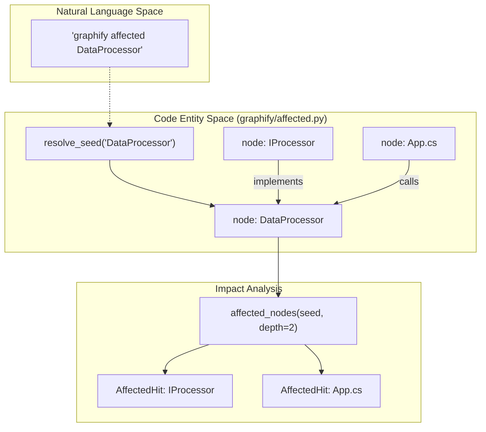
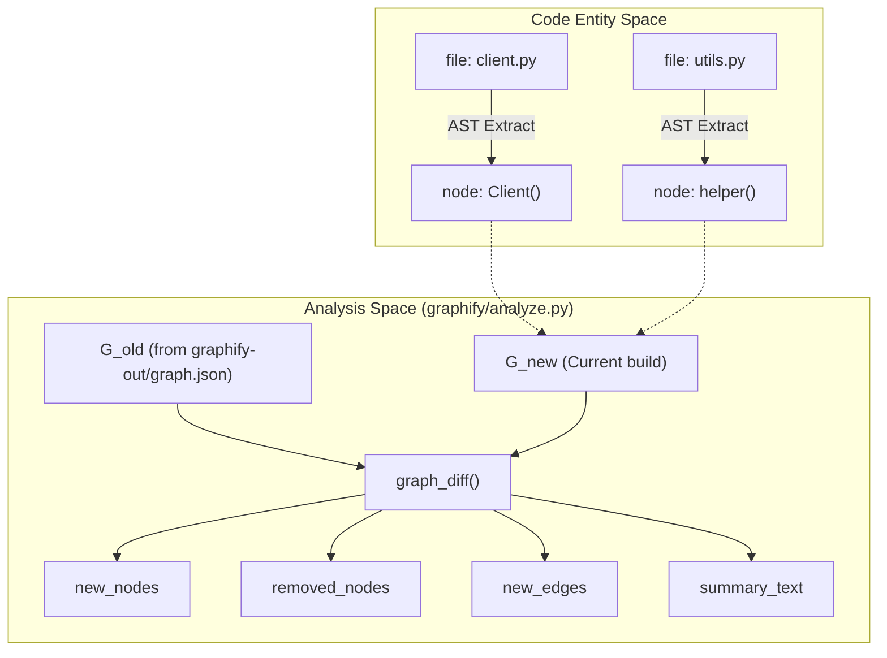
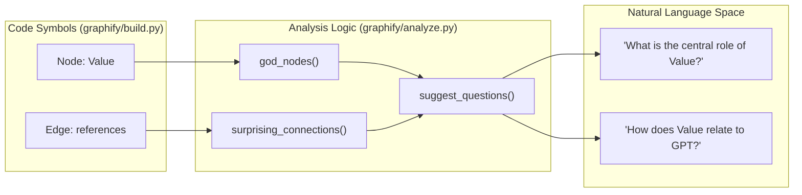

# 그래프 분석

관련 소스 파일

다음 파일들은 이 위키 페이지를 생성하기 위한 컨텍스트로 사용되었습니다.

- [graphify/affected.py](graphify/affected.py)
- [graphify/analyze.py](graphify/analyze.py)
- [graphify/report.py](graphify/report.py)
- [tests/test_affected_cli.py](tests/test_affected_cli.py)
- [tests/test_analyze.py](tests/test_analyze.py)

`graphify`의 그래프 분석 단계는 원시 NetworkX 그래프를 실행 가능한 아키텍처 insight로 변환합니다. 구조적 휴리스틱과 community-aware 알고리즘을 적용하여 가장 중요한 엔터티를 식별하고, 서로 다른 소스 유형(코드, 논문, 이미지) 사이의 명확하지 않은 관계를 발견하며, 코드 변경의 잠재적 영향 영역을 식별합니다.

## 핵심 분석 로직

분석 엔진은 `graphify/analyze.py`에 있으며, 조립 및 클러스터링 단계에서 생성된 `nx.Graph`에서 동작합니다. "God Nodes"(중앙 hub), "Surprising Connections"(경계를 넘는 edge)를 식별하고 반복 업데이트를 위한 증분 diff를 제공하는 데 초점을 둡니다.

### God Nodes 식별
`god_nodes` 함수는 degree centrality(총 연결 수)에 따라 노드 순위를 매겨 코드베이스의 핵심 추상화를 식별합니다 [graphify/analyze.py:95-102]().

이 결과가 구조적 artifact가 아니라 의미 있는 아키텍처 엔터티를 나타내도록, 알고리즘은 `_is_file_node`, `_is_concept_node`, `_is_json_key_node`를 통해 엄격한 필터링 프로세스를 적용합니다 [graphify/analyze.py:105-106](). 또한 `_BUILTIN_NOISE_LABELS`에 정의된 일반 built-in 타입과 mock 객체를 필터링합니다 [graphify/analyze.py:11-16](), [graphify/analyze.py:107-108]().

| 필터링되는 엔터티 유형 | 식별 신호 | 제외 이유 |
| :--- | :--- | :--- |
| **파일 수준 Hub** | Label이 `source_file` 이름과 일치 [graphify/analyze.py:62-67]() | 논리적 추상화가 아니면서 기계적인 `import` 및 `contains` edge를 축적합니다. |
| **메서드 Stub** | Label이 `.`로 시작하고 `()`로 끝남 [graphify/analyze.py:68-70]() | AST가 추출한 메서드는 클래스의 자식입니다. 클래스 자체가 God Node가 되어야 합니다. |
| **고립된 함수** | Label이 `()`로 끝나고 degree $\le 1$ [graphify/analyze.py:73-75]() | 구조적으로 고립된 함수는 중앙 hub를 나타내지 않습니다. |
| **JSON 노이즈** | Label이 `_JSON_NOISE_LABELS`에 포함됨(예: 'id', 'type') [graphify/analyze.py:78-92]() | JSON 파일의 일반 key는 아키텍처 의미가 없는 인공 hub를 만듭니다. |
| **Concept Nodes** | 빈 `source_file` 또는 파일 확장자가 없음 [graphify/analyze.py:151-167]() | 수동으로 주입되었거나 추론된 의미 label은 의도된 것이며, 발견된 구조적 hub가 아닙니다. |

**출처:** [graphify/analyze.py:11-16](), [graphify/analyze.py:50-75](), [graphify/analyze.py:78-93](), [graphify/analyze.py:95-116](), [graphify/analyze.py:151-167]()

---

## Surprising Connections 및 Scoring

`surprising_connections` 함수는 시스템의 멀리 떨어진 부분을 연결하는 edge를 감지합니다. 이 전략은 코퍼스가 multi-source인지 single-source인지에 따라 달라집니다 [graphify/analyze.py:119-149]().

### Cross-File vs. Cross-Community 전략

1.  **Multi-File Corpora:** `_cross_file_surprises`를 사용해 서로 다른 파일을 연결하는 edge를 찾고, 복합 **Surprise Score**로 순위를 매깁니다 [graphify/analyze.py:145-146]().
2.  **Single-File Corpora:** `_cross_community_surprises`를 사용해 Leiden이 감지한 community를 연결하는 edge를 식별합니다 [graphify/analyze.py:147-148]().

### Surprise Scoring 알고리즘
multi-file graph의 경우 모든 cross-file edge는 `_surprise_score`로 평가되며, 구조적 신호를 기반으로 점수를 집계합니다 [graphify/analyze.py:189-252]().

| 신호 | 점수 보너스 | 근거 |
| :--- | :--- | :--- |
| **Confidence** | +3 (AMBIGUOUS), +2 (INFERRED) | 소스 코드에 명시되지 않은 연결(예: LLM 추론을 통한 연결)은 더 주목할 만합니다 [graphify/analyze.py:203-206](). |
| **Cross-Type** | +2 | 서로 다른 category 사이의 edge(예: `code` 엔터티와 `paper` PDF)는 매우 명확하지 않은 연결입니다 [graphify/analyze.py:216-221](). |
| **Cross-Repo** | +2 | 서로 다른 top-level directory 사이의 연결(`_top_level_dir`로 감지) [graphify/analyze.py:223-226](). |
| **Cross-Community** | +1 | Leiden algorithm이 서로 다른 cluster에 배치한 노드 사이의 bridge [graphify/analyze.py:229-233](). |
| **Semantic Similarity**| x1.5 Multiplier | 명확하지 않은 개념적 연결(relation: `semantically_similar_to`)은 더 높은 점수를 받습니다 [graphify/analyze.py:236-238](). |
| **Peripheral-to-Hub** | +1 | $\le 2$개의 edge를 가진 노드가 $\ge 5$개의 edge를 가진 hub에 직접 연결되는 경우 [graphify/analyze.py:241-247](). |

**출처:** [graphify/analyze.py:119-149](), [graphify/analyze.py:189-252](), [tests/test_analyze.py:40-107](), [tests/test_analyze.py:130-147]()

---

## 영향 분석(Affected Nodes)

`graphify/affected.py` 모듈은 `graphify affected` 명령을 위한 로직을 제공하여, 개발자가 특정 노드 변경으로 어떤 코드가 영향을 받을 수 있는지 확인할 수 있게 합니다 [graphify/affected.py:1-152]().

### Affected Traversal 로직
`affected_nodes` 함수는 "seed" 노드에서 시작해 edge를 **역방향**(in-edges)으로 순회하는 Breadth-First Search(BFS)를 수행하여 caller 또는 dependant를 찾습니다 [graphify/affected.py:74-110]().

1.  **Seed Resolution:** `resolve_seed`는 사용자 query 문자열을 `node_id`, `label`, `source_file`과 매칭하려고 시도합니다 [graphify/affected.py:46-71]().
2.  **Relation Filtering:** `DEFAULT_AFFECTED_RELATIONS`에 포함된 relation(예: `calls`, `inherits`, `imports`)을 가진 edge만 순회합니다 [graphify/affected.py:11-23]().
3.  **Depth Control:** 과도한 노이즈를 방지하기 위해 순회는 `depth` parameter(기본값 2)로 제한됩니다 [graphify/affected.py:79]().

### Affected Traversal 데이터 흐름

**출처:** [graphify/affected.py:11-23](), [graphify/affected.py:46-110](), [tests/test_affected_cli.py:11-44]()

---

## 증분 분석: Graph Diffs

`--update` mode와 file watching을 지원하기 위해, `graph_diff`는 이전 그래프 상태와 새 그래프 상태를 비교하여 변경 사항을 요약합니다 [graphify/analyze.py:362-404]().

### 데이터 흐름: 코드에서 Diff Insights로

**출처:** [graphify/analyze.py:362-404]()

---

## 질문 제안 휴리스틱

`suggest_questions` 함수는 사용자를 그래프의 덜 탐색된 영역 또는 복잡한 영역으로 안내하기 위해 자연어 prompt를 생성합니다 [graphify/analyze.py:320-359](). 세 가지 주요 휴리스틱을 사용합니다.

1.  **Hub Exploration:** `god_nodes`를 대상으로 합니다(예: "`Client` class가 연결된 15개 엔터티 사이를 어떻게 조정하는가?") [graphify/analyze.py:332-334]().
2.  **Surprise Investigation:** 높은 점수의 `surprising_connections`를 대상으로 합니다(예: "`auth.py`가 `README.md`와 inferred connection을 갖는 이유는 무엇인가?") [graphify/analyze.py:341-343]().
3.  **Community Context:** 더 넓은 아키텍처 안에서 특정 Leiden community의 역할을 묻습니다 [graphify/analyze.py:352-354]().

### 분석을 자연어로 매핑

**출처:** [graphify/analyze.py:320-359](), [graphify/analyze.py:95-116](), [graphify/analyze.py:119-149]()

---

## 주요 함수 요약

| 함수 | 파일:라인 | 설명 |
| :--- | :--- | :--- |
| `god_nodes` | [graphify/analyze.py:95-116]() | degree 기준 상위 $N$ 엔터티를 식별하며, 파일 수준 hub, noise, method stub을 필터링합니다. |
| `surprising_connections` | [graphify/analyze.py:119-149]() | 코퍼스 크기에 따라 cross-file 또는 cross-community surprise detection으로 dispatch합니다. |
| `_surprise_score` | [graphify/analyze.py:189-252]() | confidence와 구조적 거리를 기반으로 edge의 숫자 "surprise" 값을 계산합니다. |
| `affected_nodes` | [graphify/affected.py:74-110]() | seed node 변경으로 영향을 받는 노드를 찾기 위해 그래프를 BFS 역방향으로 순회합니다. |
| `suggest_questions` | [graphify/analyze.py:320-359]() | hub와 bridge edge를 기반으로 3-5개의 가치 높은 질문을 생성합니다. |
| `graph_diff` | [graphify/analyze.py:362-404]() | 두 그래프를 비교하여 새/제거된 node 및 edge 목록과 사람이 읽을 수 있는 summary를 반환합니다. |

**출처:** [graphify/analyze.py:1-404](), [graphify/affected.py:1-152]()
