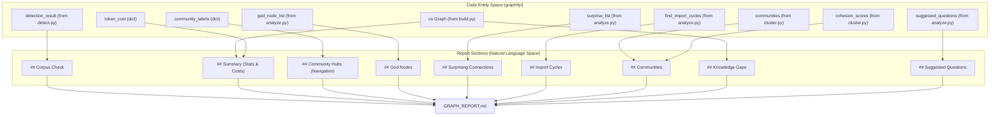
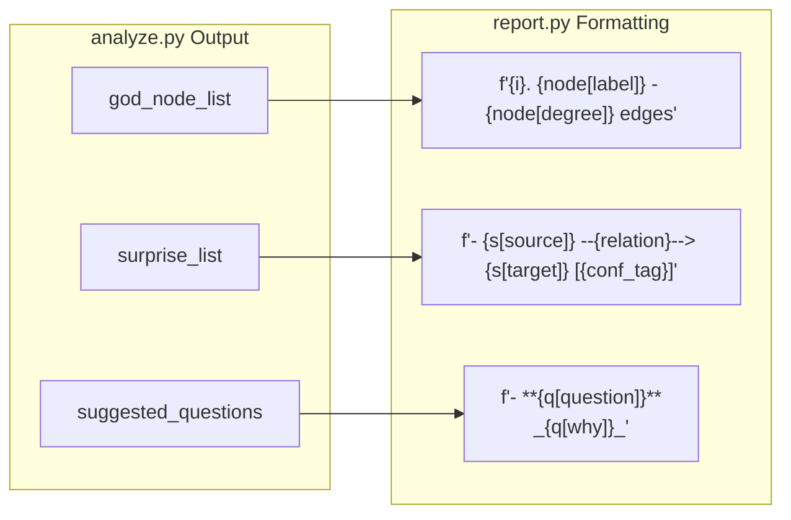

# 보고서 생성

관련 소스 파일

다음 파일들은 이 위키 페이지를 생성하기 위한 컨텍스트로 사용되었습니다.

- [graphify/analyze.py](graphify/analyze.py)
- [graphify/report.py](graphify/report.py)
- [tests/test_analyze.py](tests/test_analyze.py)
- [tests/test_report.py](tests/test_report.py)

`graphify/report.py` 모듈은 분석 파이프라인의 다양한 출력을 하나의 사람이 읽을 수 있는 Markdown 파일인 `GRAPH_REPORT.md`로 종합하는 역할을 합니다. 이 보고서는 지식 그래프 구조의 감사 추적이자 executive summary 역할을 하며, 핵심 추상화, 예상치 못한 관계, 문서 또는 코드 구조의 잠재적 공백을 강조합니다.

## `generate()` 개요

주요 진입점은 `generate()` 함수입니다 [graphify/report.py:15-28](). 이 함수는 파이프라인의 거의 모든 선행 단계(detection, clustering, analysis)에서 데이터를 소비하여 최종 문서를 조립합니다. 또한 git history 대비 그래프 최신성을 추적하기 위한 선택적 `built_at_commit` 문자열도 받습니다 [graphify/report.py:27](), [graphify/report.py:77-84]().

### 보고서 조립을 위한 데이터 흐름

다음 다이어그램은 서로 다른 코드 엔터티가 최종 보고서 문자열에 데이터를 제공하는 방식을 보여줍니다.

**보고서 데이터 집계**

출처: [graphify/report.py:15-28](), [graphify/report.py:45-184](), [graphify/report.py:123-124]()

## 보고서 섹션

### 1. Corpus Check 및 Summary
보고서는 코퍼스가 그래프 분석의 이점을 얻을 만큼 충분히 큰지에 대한 판정으로 시작합니다 [graphify/report.py:48-56](). 또한 상위 수준 통계를 제공합니다.
*   **Node/Edge counts**: 그래프의 전체 크기 [graphify/report.py:70]().
*   **Community count**: Leiden algorithm이 감지한 cluster 수 [graphify/report.py:70]().
*   **Confidence Breakdown**: `EXTRACTED`(구조적), `INFERRED`(LLM 감지), `AMBIGUOUS`(낮은 신뢰도)로 label된 edge의 백분율 기반 분포 [graphify/report.py:35-39]().
*   **Token Cost**: 추출 및 분석 단계에서 소비된 총 input 및 output token [graphify/report.py:74]().

### 2. Community Hubs (Navigation)
보고서가 "dead-end"가 되는 것을 방지하기 위해 `_COMMUNITY_*.md` 파일로 향하는 Wikilink를 생성합니다 [graphify/report.py:88-93](). 이를 통해 Obsidian 또는 wiki를 통해 탐색하는 사용자가 감사 보고서에서 특정 community deep-dive로 바로 이동할 수 있습니다. `_safe_community_name` helper는 filename이 export logic과 일관되게 sanitize되도록 보장합니다 [graphify/report.py:8-12]().

### 3. God Nodes 및 Surprising Connections
*   **God Nodes**: `analyze.god_nodes`가 식별한 상위 연결 노드를 나열하며, 시스템의 핵심 추상화를 나타냅니다 [graphify/report.py:97-100]().
*   **Surprising Connections**: 파일 또는 community 경계를 넘는 관계를 표시합니다. relation type, source files, confidence tags(예: `INFERRED 0.85`)를 포함합니다 [graphify/report.py:102-120]().

### 4. Import Cycles
그래프에서 감지된 순환 의존성을 드러냅니다 [graphify/report.py:123-135](). `analyze.py`의 `find_import_cycles`를 사용해 시작 파일로 되돌아가는 경로를 식별하고, "length-file cycle" summary를 제공합니다 [graphify/report.py:133]().

### 5. Community Summaries
각 community에 대해 보고서는 다음을 나열합니다.
*   **Label**: cluster를 위해 생성된 설명적 이름.
*   **Cohesion Score**: cluster의 density(0.0에서 1.0) [graphify/report.py:150](), [graphify/report.py:162]().
*   **Representative Nodes**: community 내용의 감을 주기 위해 최대 8개 node를 나열합니다 [graphify/report.py:157](). 보고서는 구조적 노이즈를 줄이기 위해 `_ifn`(`analyze._is_file_node`에 매핑됨)을 사용해 "file nodes"(합성 AST hub)를 명시적으로 필터링합니다 [graphify/report.py:58](), [graphify/report.py:152]().

### 6. Knowledge Gaps 및 Ambiguity
이 섹션은 그래프 연결성의 약점을 식별합니다.
*   **Isolated Nodes**: degree $\le 1$인 node 중 파일 또는 일반 개념이 아닌 node [graphify/report.py:176-182]().
*   **Thin Communities**: non-file node가 3개 미만인 cluster로, 노이즈 또는 문서화가 부족한 영역을 나타낼 수 있습니다 [graphify/report.py:61-64](), [graphify/report.py:155-156]().
*   **Ambiguous Edges**: `AMBIGUOUS`로 표시된 edge를 위한 전용 섹션으로, 개발자가 낮은 신뢰도의 inference를 검토할 수 있게 합니다 [graphify/report.py:166-174]().

## 구현 세부 사항

### Edge Confidence 계산
보고서는 edge metadata를 기반으로 백분율을 계산합니다 [graphify/report.py:35-43]().

| Confidence Level | `report.py`의 로직 |
| :--- | :--- |
| **EXTRACTED** | AST 파싱을 통해 발견된 구조적 edge(예: 함수 호출, import) [graphify/report.py:37](). |
| **INFERRED** | LLM 분석이 발견한 의미 edge. 평균 confidence score를 포함합니다 [graphify/report.py:38](), [graphify/report.py:43](). |
| **AMBIGUOUS** | 수동 검토를 위해 표시된 낮은 신뢰도의 edge [graphify/report.py:39](), [graphify/report.py:166-174](). |

출처: [graphify/report.py:35-43](), [graphify/report.py:166-174]()

### 분석을 보고서 섹션에 매핑
`generate` 함수는 `graphify/analyze.py`가 반환하는 복잡한 객체의 formatter 역할을 합니다.

**분석에서 Markdown으로의 매핑**

출처: [graphify/report.py:99-100](), [graphify/report.py:116-118](), [graphify/report.py:189-190]()

## 주요 함수

| 함수 | 파일 | 설명 |
| :--- | :--- | :--- |
| `generate` | [graphify/report.py:15]() | 모든 분석 문자열을 최종 Markdown 문서로 결합하는 주요 orchestrator입니다. |
| `_is_file_node` | [graphify/analyze.py:50]() | (`_ifn`으로 import됨) community member를 나열할 때 파일 수준 node(hub/stub)를 필터링하는 데 사용됩니다 [graphify/report.py:58](). |
| `_is_concept_node` | [graphify/analyze.py:151]() | (Import됨) 일반 개념 node와 구체적 entity를 식별하는 데 사용됩니다 [graphify/report.py:177](). |
| `_safe_community_name`| [graphify/report.py:8]() | Wikilink가 생성된 filename과 일치하도록 community label을 sanitize합니다. |

출처: [graphify/report.py:8-195](), [graphify/analyze.py:50](), [graphify/analyze.py:151]()
