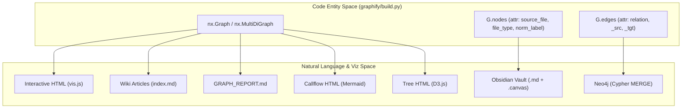
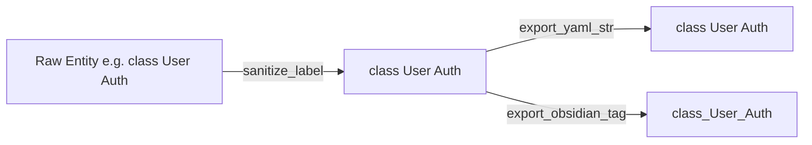

# Export 및 시각화

관련 소스 파일

다음 파일들은 이 위키 페이지를 생성하기 위한 컨텍스트로 사용되었습니다.

- [graphify/__main__.py](graphify/__main__.py)
- [graphify/export.py](graphify/export.py)
- [graphify/hooks.py](graphify/hooks.py)
- [tests/test_export.py](tests/test_export.py)
- [tests/test_hooks.py](tests/test_hooks.py)

`graphify` 파이프라인은 export 단계로 마무리되며, 내부 NetworkX 그래프와 community 구조를 **사람이 읽을 수 있고 기계 간 상호운용이 가능한 다양한 형식으로 변환**합니다. 이러한 export는 대화형 탐색, 계층적 탐색, 깊은 지식 관리, 데이터베이스 통합을 지원하도록 설계되었습니다.

### 데이터 흐름 개요

export 함수들은 주로 NetworkX 그래프 객체를 소비합니다. 이 그래프는 노드의 `source_file`, `file_type`, `norm_label`, edge의 `relation` 같은 구조 데이터와 메타데이터를 보존합니다 [graphify/export.py:10-17](). export 시스템은 클러스터링 단계에서 생성된 "hyperedges"와 community assignment도 처리합니다 [graphify/export.py:16-17]().

다음 다이어그램은 내부 코드 엔터티를 최종 자연어 및 시각화 출력에 연결합니다.

**출처:** [graphify/export.py:1-17](), [graphify/callflow_html.py:15-18](), [graphify/tree_html.py:22-23]()

---

### 대화형 및 아키텍처 시각화

Graphify는 그래프 구조를 대화형으로 시각화하거나 아키텍처 검토에 사용할 수 있는 여러 방법을 제공합니다.

*   **HTML Visualization:** `vis.js`를 사용해 브라우저 기반 대화형 그래프를 만듭니다. physics engine, `COMMUNITY_COLORS` palette를 사용하는 community 기반 색상 코딩 [graphify/export.py:149-152](), 검색 가능한 sidebar를 제공합니다. 성능을 위해 `MAX_NODES_FOR_VIZ`(5,000 nodes)로 제한됩니다 [graphify/export.py:154](). 이 제한은 `GRAPHIFY_VIZ_NODE_LIMIT` 환경 변수로 override할 수 있습니다 [graphify/export.py:164-171]().
*   **Callflow HTML:** `graphify export callflow-html`을 통한 아키텍처 분석용 특화 export입니다. Mermaid 기반 flowchart와 call detail table을 포함하는 dark-themed HTML 파일을 생성합니다 [graphify/callflow_html.py:1-12]().
*   **Tree HTML:** `graphify tree`를 통해 생성되며, module hierarchy의 D3 v7 collapsible-tree view를 제공합니다 [graphify/tree_html.py:1-12](). 접힌 node에서도 descendant leaf count를 보여주기 위해 `total_count` 필드를 사용합니다 [graphify/tree_html.py:14-20]().
*   **SVG Export:** `to_svg`를 통해 `matplotlib`을 사용하여 정적 vector graphic을 생성합니다.

자세한 내용은 [HTML 및 SVG 시각화](#3.1), [Callflow HTML Export](#3.5), [Tree HTML Export](#3.6)를 참조하세요.

**출처:** [graphify/export.py:149-171](), [graphify/callflow_html.py:1-12](), [graphify/tree_html.py:1-33]()

---

### 지식 관리

이 형식들은 추출된 지식의 장기 저장과 탐색을 위해 설계되었습니다.

*   **Obsidian Vault:** 각 node가 파일이 되는 Markdown 파일을 생성합니다. wikilink에는 `to_obsidian`을, grid 기반 2D layout에는 `to_canvas`를 활용합니다 [graphify/export.py:6](). canvas의 node file path는 이식성을 위해 vault-root-relative입니다 [graphify/export.py:168-181]().
*   **Wiki Export:** `to_wiki` 함수는 community summary와 "god node" article을 포함하는 Wikipedia 스타일 article 집합을 생성합니다 [graphify/wiki.py:1-5]().

자세한 내용은 [Obsidian Vault 및 Canvas Export](#3.2)와 [Wiki Export](#3.3)를 참조하세요.

**출처:** [graphify/export.py:6](), [graphify/export.py:168-181](), [graphify/wiki.py:1-5]()

---

### 기계 상호운용성 및 백업

그래프 데이터베이스와 외부 분석 도구를 위한 표준 교환 형식입니다.

| 형식 | 함수 | 목적 |
| :--- | :--- | :--- |
| **JSON** | `to_json` | 표준 `node_link_data` export [graphify/export.py:6](). |
| **GraphML** | `to_graphml` | Gephi 및 yEd용 XML 형식 [graphify/export.py:6](). |
| **Cypher** | `to_cypher` / `push_to_neo4j` | Neo4j용 MERGE 문 [graphify/export.py:6](). |

Graphify에는 `backup_if_protected` 메커니즘도 포함되어 있습니다. 그래프에 사람의 curation 또는 비싼 semantic data가 포함된 경우, overwrite 전에 `graph.json`, `GRAPH_REPORT.md`, `.graphify_labels.json` 같은 artifact를 날짜가 지정된 하위 폴더로 snapshot합니다 [graphify/export.py:21-43]().

자세한 내용은 [Neo4j, GraphML 및 JSON Export](#3.4)를 참조하세요.

**출처:** [graphify/export.py:6-43]()

---

### Export 정제

export가 안전하고 호환되도록 graphify는 여러 정제 루틴을 사용합니다.

*   `sanitize_label`: control character를 제거하고 HTML escaping을 처리합니다 [graphify/export.py:15]().
*   `_yaml_str`: YAML double-quoted scalar에 안전하게 포함되도록 값을 escape하며, backslash, quote, C0 control character를 처리합니다 [graphify/export.py:111-146]().
*   `_obsidian_tag`: Obsidian tag 호환성을 위해 community name을 sanitize합니다 [graphify/export.py:96-102]().

**출처:** [graphify/export.py:15-146]()
