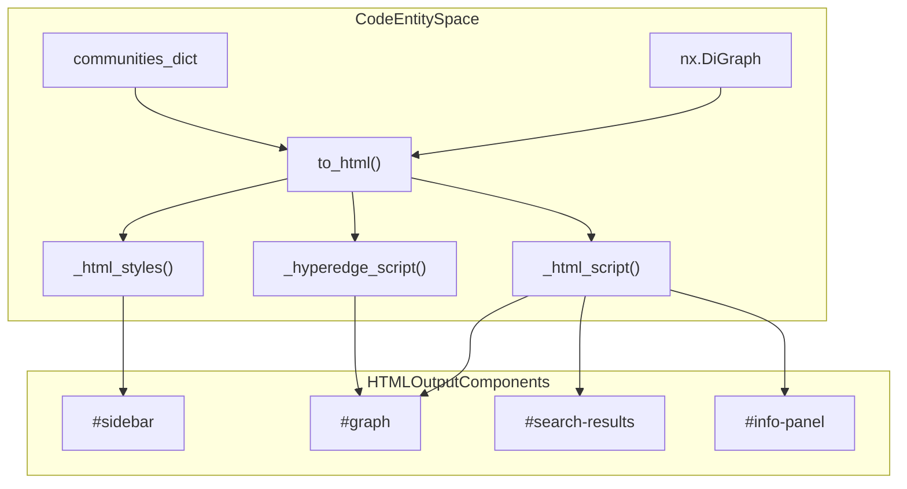
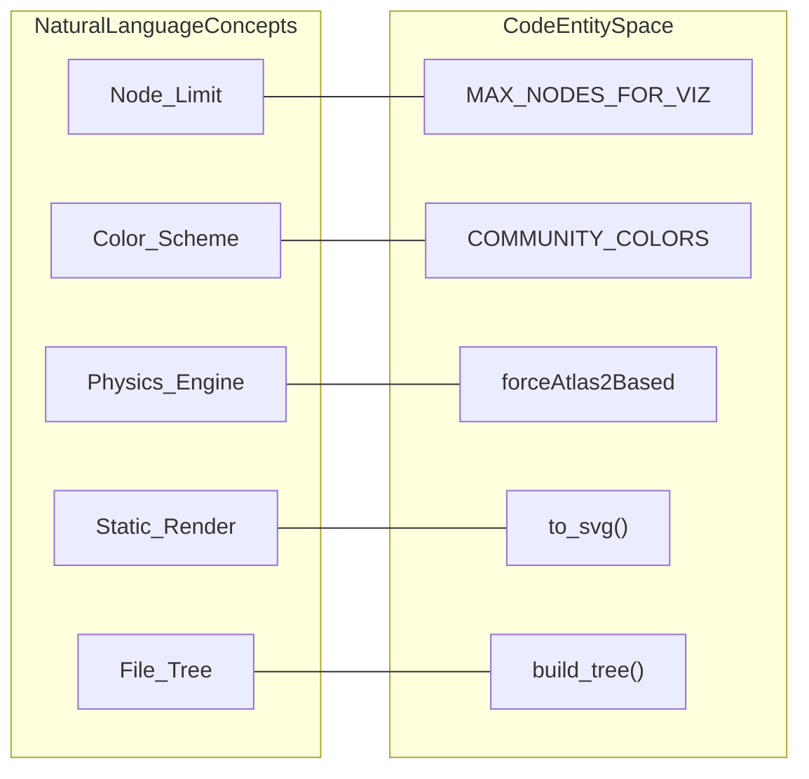

# HTML 및 SVG 시각화

관련 소스 파일

다음 파일들은 이 위키 페이지를 생성하기 위한 컨텍스트로 사용되었습니다.

- [graphify/export.py](graphify/export.py)
- [graphify/hooks.py](graphify/hooks.py)
- [tests/test_export.py](tests/test_export.py)
- [tests/test_hooks.py](tests/test_hooks.py)

Graphify는 `vis.js` 기반 대화형 HTML dashboard, `matplotlib`을 통한 정적 SVG render, `D3.js`를 통한 collapsible tree view라는 세 가지 주요 시각적 export 형식을 제공합니다. 이러한 시각화는 사용자가 파이프라인 중 추출된 구조적 관계, community cluster, filesystem hierarchy를 탐색할 수 있게 합니다.

### 대화형 HTML Export(`to_html`)

`to_html` 함수는 **검색, 필터링, 상호작용이 가능한 그래프를 포함하는 standalone HTML 파일을 생성**합니다 [graphify/export.py:284-442](). 렌더링에는 `vis.js` 라이브러리를 사용하며, 메타데이터 검사를 위한 custom sidebar를 포함합니다.

#### 시각화 제약 및 Scaling
브라우저 성능을 보장하기 위해, 시각화는 `MAX_NODES_FOR_VIZ` 상수를 통해 **5,000 nodes**의 hard limit을 강제합니다 [graphify/export.py:154-154](). 이 제한은 `GRAPHIFY_VIZ_NODE_LIMIT` 환경 변수로 override할 수 있습니다 [graphify/export.py:157-171](). v0.4.23부터 그래프가 이 제한을 초과하면 `to_html`은 사용할 수 없는 파일 생성을 방지하기 위해 `ValueError`를 발생시킵니다 [graphify/export.py:287-289]().

노드는 degree에 따라 동적으로 크기가 정해지며, `15 + (math.sqrt(G.degree(node_id)) * 5)`로 계산되고 최대 45로 clamp됩니다 [graphify/export.py:293-293]().

#### Styling 및 Scripting 아키텍처
HTML 생성은 복잡성을 관리하기 위해 별개의 컴포넌트로 나뉩니다.
*   **`_html_styles()`**: dark-mode aesthetic(`#0f0f1a` background), sidebar layout, search result styling을 정의하는 CSS block을 반환합니다 [graphify/export.py:173-211]().
*   **`_html_script()`**: `vis.DataSet` 초기화, search functionality, node focus handler를 포함한 핵심 JavaScript 로직을 주입합니다 [graphify/export.py:236-281]().
*   **`_hyperedge_script()`**: HTML5 Canvas API를 사용해 hyperedge를 shaded convex hull로 렌더링하는 특화 로직을 주입합니다 [graphify/export.py:214-233]().

#### Physics 및 Interaction
대화형 그래프는 physics engine으로 `forceAtlas2Based` solver를 사용합니다 [graphify/export.py:221-229](). 리소스 사용을 최적화하기 위해 그래프가 안정화되면 physics가 자동으로 비활성화됩니다 [graphify/export.py:243-245](). 상호작용 기능은 다음을 포함합니다.
*   **Search**: label을 기준으로 node를 필터링하는 실시간 search bar [graphify/export.py:179-184]().
*   **Community Legend**: `COMMUNITY_COLORS` palette를 사용하여 특정 community를 dim 또는 highlight할 수 있는 clickable legend [graphify/export.py:149-152](), [graphify/export.py:194-201]().
*   **Info Panel**: node가 선택되면 `source_file`, `file_type`, degree statistics로 채워지는 sidebar [graphify/export.py:185-193]().

**HTML 시각화 데이터 흐름**
"이 다이어그램은 내부 Graph Data가 Interactive HTML component로 변환되는 방식을 보여줍니다."

출처: [graphify/export.py:149-152](), [graphify/export.py:173-211](), [graphify/export.py:214-233](), [graphify/export.py:236-281](), [graphify/export.py:284-442]()

---

### 정적 SVG Export(`to_svg`)

`to_svg` 함수는 문서화 또는 빠른 preview를 위한 정적 대안을 제공합니다 [graphify/export.py:445-480](). `matplotlib`과 NetworkX의 layout engine을 활용하여 **vector image를 생성**합니다.

#### 구현 세부 사항
*   **Layout**: node 위치 지정에 `nx.spring_layout`을 활용합니다 [graphify/export.py:459-459]().
*   **Coloring**: node는 community ID에 따라 `COMMUNITY_COLORS` palette의 색상을 할당받습니다 [graphify/export.py:149-152](), [graphify/export.py:462-462]().
*   **Label Filtering**: 밀도 높은 그래프에서 가독성을 유지하기 위해, label은 degree가 특정 threshold보다 높은 node 또는 식별된 "God Nodes"에 대해서만 렌더링됩니다 [graphify/export.py:466-469]().

**시각화 로직 Bridge**
"이 다이어그램은 상위 수준 시각화 개념을 특정 구현 상수 및 함수에 매핑합니다."

출처: [graphify/export.py:149-152](), [graphify/export.py:154-154](), [graphify/export.py:445-480](), [graphify/tree_html.py:68-80]()

---

### Tree HTML Export(`tree_html.py`)

`tree_html` 모듈은 D3 v7 collapsible-tree HTML view를 내보냅니다 [graphify/tree_html.py:1-13](). 이는 module과 symbol의 filesystem 중심 hierarchy를 보여주어 force-directed graph를 보완하도록 설계되었습니다.

*   **`build_tree()`**: NetworkX 그래프를 중첩 JSON 구조(`{name, total_count, children}`)로 변환합니다 [graphify/tree_html.py:68-169]().
*   **Truncation**: 넓은 디렉터리에서 사용성을 유지하기 위해 `max_children` cap(기본값 200)을 사용하며, overflow를 합성 `(+N more)` leaf로 대체합니다 [graphify/tree_html.py:43-43](), [graphify/tree_html.py:64-65]().
*   **Visual Elements**: expand/collapse all button, multi-line label wrapping, depth-based color palette를 포함합니다 [graphify/tree_html.py:7-12]().

출처: [graphify/tree_html.py:1-43](), [graphify/tree_html.py:68-169]()

---

### Export 함수 비교

| 함수 | 출력 형식 | 주요 라이브러리 | 핵심 기능 |
| :--- | :--- | :--- | :--- |
| `to_html` | `.html` | `vis.js` | Interactive, Search, Community Filtering, Physics Engine [graphify/export.py:284-442]() |
| `to_svg` | `.svg` | `matplotlib` | Static, Vector-based, Degree-based scaling [graphify/export.py:445-480]() |
| `build_tree` | `.html` | `D3.js` | Collapsible Hierarchy, Filesystem-centric, Symbol counts [graphify/tree_html.py:68-169]() |

### 보안 및 정제
node label 또는 metadata가 output에 쓰이기 전에 `sanitize_label`을 거칩니다 [graphify/export.py:15-15](). 이는 control character를 제거하고 256자 cap을 강제합니다. `to_html` JavaScript payload 안에서는 DOM의 `innerHTML`에 데이터를 주입할 때 XSS를 방지하기 위해 추가 `esc()` helper가 사용됩니다 [graphify/export.py:195-197](). YAML export는 `_yaml_str`을 사용해 control character와 line break를 escape합니다 [graphify/export.py:111-146]().

출처: [graphify/export.py:15-15](), [graphify/export.py:111-146](), [graphify/export.py:284-480]()
