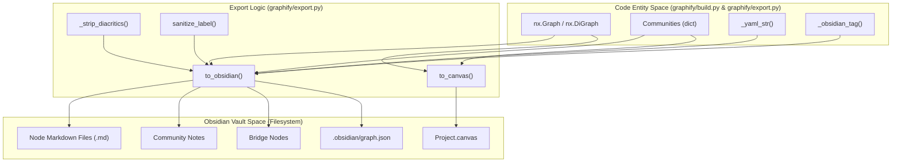
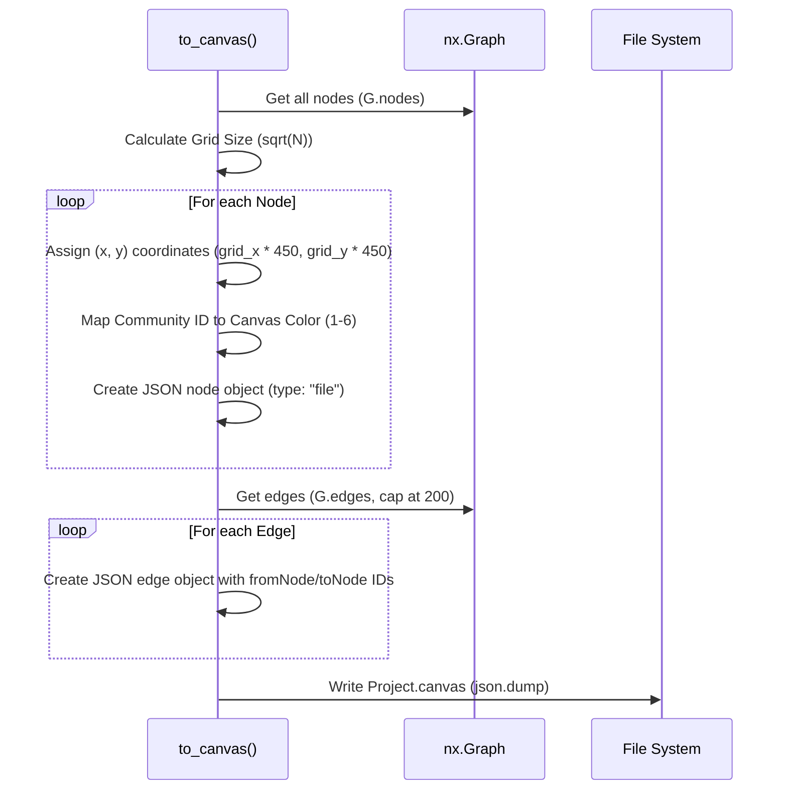

# Obsidian Vault 및 Canvas Export

관련 소스 파일

다음 파일들은 이 위키 페이지를 생성하기 위한 컨텍스트로 사용되었습니다.

- [graphify/export.py](graphify/export.py)
- [graphify/hooks.py](graphify/hooks.py)
- [tests/test_export.py](tests/test_export.py)
- [tests/test_hooks.py](tests/test_hooks.py)
- [tests/test_obsidian_filename_cap.py](tests/test_obsidian_filename_cap.py)

Obsidian export 하위 시스템은 분석된 그래프를 완전히 동작하는 **Obsidian vault로 변환**합니다. 이를 통해 사용자는 local-first, markdown 기반 인터페이스를 사용해 추출된 지식 기반을 탐색할 수 있습니다. 여기에는 YAML frontmatter가 있는 node별 markdown 파일, community 수준 overview, 자동화된 Dataview query, Obsidian Canvas 형식을 통한 시각적 표현이 포함됩니다.

## Export 메커니즘 개요

export 프로세스는 주로 `graphify/export.py`의 두 함수가 처리합니다.
1.  `to_obsidian`: 그래프의 모든 node가 YAML frontmatter를 가진 `.md` 파일이 되는 디렉터리 구조를 생성합니다 [graphify/export.py:330-459]().
2.  `to_canvas`: Obsidian 안에서 node와 그 관계를 시각화하기 위해 grid 기반 layout algorithm을 사용하는 `.canvas` JSON 파일을 생성합니다 [graphify/export.py:461-518]().

### 데이터 흐름: 그래프에서 Vault로

다음 다이어그램은 내부 NetworkX 그래프 구조에서 Obsidian vault의 물리 파일 구조로 변환되는 과정을 보여주며, 사용되는 sanitization 및 mapping utility를 강조합니다.

**출처:** [graphify/export.py:96-102](), [graphify/export.py:105-108](), [graphify/export.py:111-146](), [graphify/export.py:330-331](), [graphify/export.py:461-462](), [graphify/build.py:42-74]()

---

## `to_obsidian` Export

`to_obsidian` 함수는 사람이 읽는 용도와 자동화 도구(agent) crawling 모두를 위해 설계된 구조화된 vault를 생성합니다.

### 1. Node 정제 및 Filename Cap
파일시스템 및 Obsidian 내부 linking과의 호환성을 보장하기 위해, node name은 `sanitize_label`을 통해 sanitization regex로 처리됩니다 [graphify/export.py:335-338](). 또한 시스템은 filename 안전성을 위해 문자를 정규화하는 `_strip_diacritics`를 활용합니다 [graphify/export.py:105-108](). 

중요하게도 긴 node label에서 `OSError ENAMETOOLONG`을 방지하기 위해(issue #1094), filename은 **255-byte** 파일시스템 제한 아래에 머물도록 cap이 적용됩니다 [tests/test_obsidian_filename_cap.py:1-3](). 이 cap은 ASCII와 CJK 문자 모두에 적용되어, multi-byte UTF-8 sequence도 buffer를 넘치지 않도록 보장합니다 [tests/test_obsidian_filename_cap.py:32-36](). Wikilink는 graph integrity를 유지하기 위해 잘린 filename을 가리키도록 업데이트됩니다 [tests/test_obsidian_filename_cap.py:49-63]().

### 2. 파일 구조 및 Frontmatter
각 node는 다음을 포함하는 markdown 파일로 export됩니다.
*   **YAML Frontmatter**: `type`, `source_file`, `community`, `degree` 같은 metadata를 포함합니다 [graphify/export.py:387-393](). 문자열 값은 source code의 특수 문자로 인한 injection attack 또는 YAML syntax error를 방지하기 위해 `_yaml_str`로 escape됩니다 [graphify/export.py:111-146]().
*   **Relationships**: incoming 및 outgoing edge 목록을 관계 유형(예: "calls", "inherits", "defines")별로 분류해 나열합니다 [graphify/export.py:397-410]().
*   **Dataview Integration**: 사용자가 Dataview plugin을 설치한 경우 neighbor를 동적으로 나열하기 위한 자동 query가 주입됩니다 [graphify/export.py:415-420]().

### 3. Community 및 Bridge Notes
*   **Community Notes**: Leiden algorithm이 식별한 각 community에 대해 note가 생성됩니다(예: `_COMMUNITY_Name.md`). 모든 member node를 나열하고 상위 수준 summary를 제공합니다 [graphify/export.py:435-445]().
*   **Bridge Nodes**: 여러 community를 연결하는 node는 아키텍처 coupling을 강조하기 위해 "Bridge Nodes"로 표시됩니다 [graphify/export.py:448-450]().
*   **Tags**: community name은 `_obsidian_tag`를 사용해 Obsidian 호환 tag로 변환됩니다. 이 함수는 공백을 underscore로 바꾸고 영숫자가 아닌 문자를 제거합니다 [graphify/export.py:96-102]().

### 4. Graph View 설정
export는 `.obsidian/graph.json`을 자동으로 생성합니다. 이 파일은 `COMMUNITY_COLORS` palette를 사용해 community ID 기반으로 node 색상을 지정하도록 Obsidian native graph view를 설정합니다 [graphify/export.py:149-152](), [graphify/export.py:452-458]().

**출처:** [graphify/export.py:96-102](), [graphify/export.py:111-146](), [graphify/export.py:149-152](), [graphify/export.py:330-459](), [graphify/export.py:105-108](), [tests/test_obsidian_filename_cap.py:1-74]()

---

## `to_canvas` Export

`to_canvas` 함수는 Obsidian Canvas(`.canvas`) 파일을 생성하여 그래프의 공간적 layout을 제공합니다.

### 구현 로직

Canvas export는 node overlap을 방지하기 위해 grid 기반 positioning system을 활용합니다.

| 기능 | 구현 세부 사항 |
| :--- | :--- |
| **Layout Algorithm** | node는 grid에 배치됩니다. grid width는 전체 node 수의 제곱근으로 계산됩니다: `int(math.sqrt(len(G))) + 1` [graphify/export.py:476-480](). |
| **Node Representation** | 각 node는 Canvas JSON의 `file` type card이며, 해당 `.md` 파일을 가리킵니다 [graphify/export.py:482-490](). |
| **Edge Cap** | Obsidian UI의 성능을 유지하기 위해 **200 edges**의 hard limit이 강제됩니다. 처음 200개 edge만 canvas로 export됩니다 [graphify/export.py:465-467](). |
| **Color Mapping** | Canvas node에는 vault의 visual theme과 일치하도록 community ID를 기준으로 색상(1-6)이 할당됩니다 [graphify/export.py:472-474](). |
| **Path Safety** | canvas의 파일 경로는 절대 경로가 아니라 vault root 기준 상대 경로(단순 `filename.md`)입니다 [graphify/export.py:488-490](), [tests/test_export.py:168-180](). |

### Canvas 생성 다이어그램

**출처:** [graphify/export.py:461-518](), [graphify/export.py:465-467](), [tests/test_export.py:168-180]()

---

## 기술 참조: 주요 함수

### `_strip_diacritics(text: str) -> str`
`graphify/export.py`에 정의되어 있습니다. Unicode text를 NFKD 형식으로 정규화하고 combining character를 제거하여 filename이 여러 운영체제에서 호환되도록 보장합니다 [graphify/export.py:105-108]().

### `_yaml_str(s: str) -> str`
YAML double-quoted scalar에 안전하게 포함되도록 값을 escape합니다. backslash, double-quotes, line breaks(Unicode U+2028/U+2029 포함), control character를 처리하여 frontmatter에 injection되는 것을 방지합니다 [graphify/export.py:111-146]().

### `to_obsidian(G, communities, path, ...)`
`graphify/export.py`에서 vault 생성을 위한 주요 진입점입니다.
1.  `G.nodes(data=True)`를 순회합니다 [graphify/export.py:383]().
2.  `edge_data` helper를 사용해 edge `relation` 또는 `type` 기준으로 neighbor를 그룹화합니다 [graphify/export.py:397-400](), [graphify/build.py:12-25]().
3.  `Path(path).mkdir(parents=True, exist_ok=True)`를 사용해 markdown content를 작성합니다 [graphify/export.py:341-343]().

### `to_canvas(G, communities, path)`
`graphify/export.py`에서 Canvas 생성을 위한 진입점입니다.
1.  그래프에 존재하는지 확인하기 위해 node를 필터링합니다 [graphify/export.py:471]().
2.  modulo를 사용해 community integer를 Obsidian의 1-6 color range로 매핑합니다 [graphify/export.py:472-474]().
3.  결과를 `.canvas` extension의 JSON 파일로 직렬화합니다 [graphify/export.py:516-518]().

**출처:** [graphify/export.py:105-108](), [graphify/export.py:111-146](), [graphify/export.py:330-518](), [graphify/build.py:12-25](), [tests/test_obsidian_filename_cap.py:6-19]()
