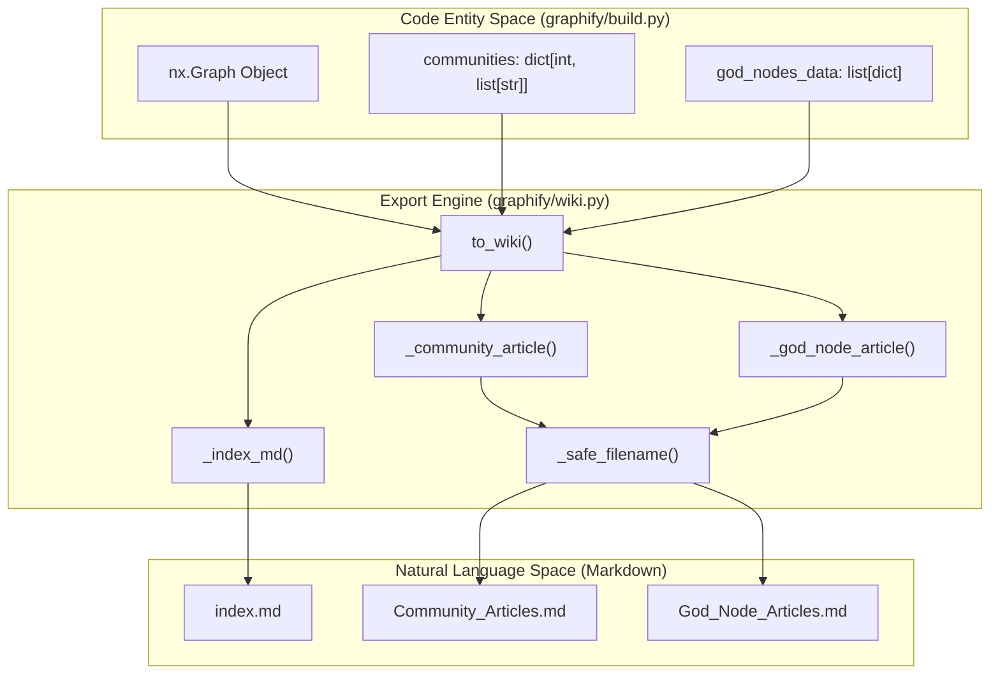
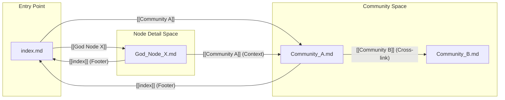

# Wiki Export

관련 소스 파일

다음 파일들은 이 위키 페이지를 생성하기 위한 컨텍스트로 사용되었습니다.

- [graphify/wiki.py](graphify/wiki.py)
- [tests/test_wiki.py](tests/test_wiki.py)

Wiki Export 모듈은 구조화된 **지식 그래프를 사람이 읽을 수 있고** agent가 crawl할 수 있는 Wikipedia 스타일 문서 세트로 변환하는 메커니즘을 제공합니다. community를 요약하는 Markdown article 컬렉션, 자세한 "god node" profile, 탐색을 위한 중앙 index를 생성합니다.

## 개요

이 하위 시스템의 주요 진입점은 `to_wiki` 함수입니다 [graphify/wiki.py:181-188](). 이 함수는 NetworkX 그래프 객체와 community metadata를 소비하여 `.md` 파일 디렉터리를 생성합니다. 이 export 형식은 LLM agent가 내부 wikilink(`[[Article Name]]`)를 따라가며 코드베이스의 아키텍처를 "crawl"할 수 있도록 특별히 설계되었습니다.

### 데이터 흐름 및 파일 구조

export 프로세스는 세 가지 고유한 Markdown 파일 유형을 생성합니다.

| 파일 유형 | 목적 | 명명 규칙 |
| :--- | :--- | :--- |
| **Index** | 진입점. 모든 community와 god node를 나열합니다. | `index.md` |
| **Community Article** | Leiden community의 상위 수준 summary입니다. | `<CommunityLabel>.md` |
| **God Node Article** | 높은 degree를 가진 중심 node를 심층 분석합니다. | `<NodeLabel>.md` |

**시스템 흐름: 그래프에서 Wiki로**

**출처:** [graphify/wiki.py:181-212](), [tests/test_wiki.py:26-50]()

---

## Community Articles

community article은 관련 node cluster에 대한 주제별 overview를 제공합니다. metadata, 핵심 개념, 구조적 metric을 포함합니다.

### Article 구성 요소
1.  **Metadata Header**: node count와 **Cohesion Score**(clustering 단계에서 계산됨)를 표시합니다 [graphify/wiki.py:62-65]().
2.  **Key Concepts**: community 안의 상위 25개 node를 degree(연결 수) 기준으로 정렬해 나열합니다 [graphify/wiki.py:46-74](). community가 25개 node를 초과하면 truncation notice가 추가됩니다 [graphify/wiki.py:75-77](), [tests/test_wiki.py:128-140]().
3.  **Cross-Community Links**: `_cross_community_links` helper를 사용해 다른 community와의 관계를 식별합니다 [graphify/wiki.py:26-35](). 이를 통해 agent는 서로 다른 module 또는 subsystem이 어떻게 상호작용하는지 이해할 수 있습니다 [graphify/wiki.py:81-85](). 이 로직은 `node_community` mapping을 활용하므로 node에 `community` attribute가 없어도 동작합니다 [graphify/wiki.py:47](), [tests/test_wiki.py:143-154]().
4.  **Audit Trail**: community 내부 edge confidence level(`EXTRACTED`, `INFERRED`, `AMBIGUOUS`)에 대한 통계 breakdown입니다 [graphify/wiki.py:94-98]().

**출처:** [graphify/wiki.py:38-102](), [tests/test_wiki.py:68-89](), [tests/test_wiki.py:128-140](), [tests/test_wiki.py:143-154]()

---

## God Node Articles

"God nodes"는 코드베이스의 load-bearing abstraction입니다(degree가 가장 높은 node). 해당 article은 시스템에서 이들이 맡는 역할을 세부적으로 보여줍니다.

### Neighbor Grouping
community article이 node를 나열하는 것과 달리, god node article은 neighbor를 **Relation Type**(예: `calls`, `references`, `contains`)별로 그룹화합니다 [graphify/wiki.py:119-128]().

*   **Logic**: neighbor는 각자의 degree 기준으로 정렬되어, 가장 중요한 관련 개념이 먼저 나타나도록 합니다 [graphify/wiki.py:121]().
*   **Confidence Labels**: 각 연결은 추출 confidence로 annotation됩니다(예: `[[OtherNode]] (EXTRACTED)`) [graphify/wiki.py:127-128]().
*   **Community Context**: article은 god node가 속한 community로 명시적으로 link합니다 [graphify/wiki.py:116-117](), [tests/test_wiki.py:98-103]().

**출처:** [graphify/wiki.py:105-138](), [tests/test_wiki.py:91-104]()

---

## 구현 세부 사항

### Filename Sanitization
여러 운영체제에서의 호환성을 보장하고 path traversal 문제를 방지하기 위해, `_safe_filename` 함수는 node 및 community label을 sanitize합니다 [graphify/wiki.py:11-23]().

*   공백은 underscore(`_`)로 변환됩니다 [graphify/wiki.py:20]().
*   slash(`/`)와 colon(`:`)은 dash(`-`)로 변환됩니다 [graphify/wiki.py:20]().
*   예약 문자(`< > " \ | ? *`)는 underscore로 대체됩니다 [graphify/wiki.py:21]().
*   trailing dot과 space는 제거되며, 길이는 200자로 제한됩니다 [graphify/wiki.py:22-23]().

### Navigation 및 Crawlability
생성된 모든 article에는 `index.md`로 돌아가는 footer link가 포함됩니다 [graphify/wiki.py:101, 137](). index 자체는 community를 size 기준(큰 것부터)으로 정렬하고 god node를 edge count 기준으로 정렬합니다 [graphify/wiki.py:162-171](). 이 계층은 LLM agent가 일반적인 아키텍처 overview에서 구체적인 구현 세부 사항으로 이동하도록 안내합니다.

**Internal Link Mapping**

**출처:** [graphify/wiki.py:141-178](), [tests/test_wiki.py:121-126]()

### 성능 및 제한
*   **Truncation**: 막대한 token consumption을 방지하기 위해 community article은 node 목록을 25개 item 이후로 truncate하고 [graphify/wiki.py:46](), relationship 목록은 12개로 제한됩니다 [graphify/wiki.py:82](). God node connection은 relation type마다 20개로 제한됩니다 [graphify/wiki.py:133]().
*   **Safety**: metadata에 제공된 god node ID가 그래프에 없으면 export crash를 방지하기 위해 조용히 건너뜁니다 [graphify/wiki.py:203-207](), [tests/test_wiki.py:105-111]().
*   **Stale Nodes**: communities dictionary 안의 stale node ID(예: 오래된 cache에서 온 것)는 export 중 조용히 제거됩니다 [tests/test_wiki.py:172-174]().
*   **Fallbacks**: community label이 제공되지 않으면 시스템은 article 이름을 기본적으로 `Community_N.md`로 지정합니다 [graphify/wiki.py:205](), [tests/test_wiki.py:114-119]().

**출처:** [graphify/wiki.py:46](), [graphify/wiki.py:82](), [graphify/wiki.py:133](), [graphify/wiki.py:203-207](), [tests/test_wiki.py:172-174]()
