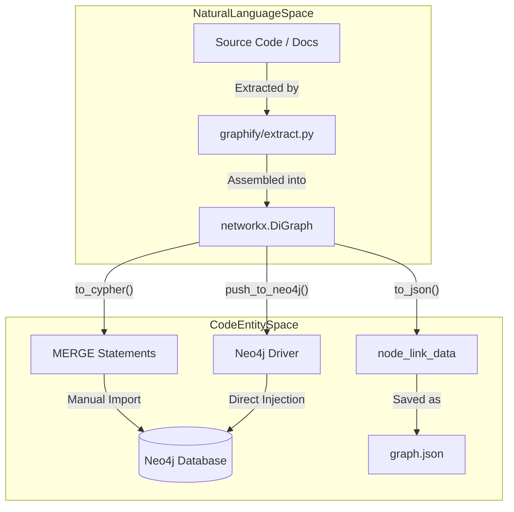
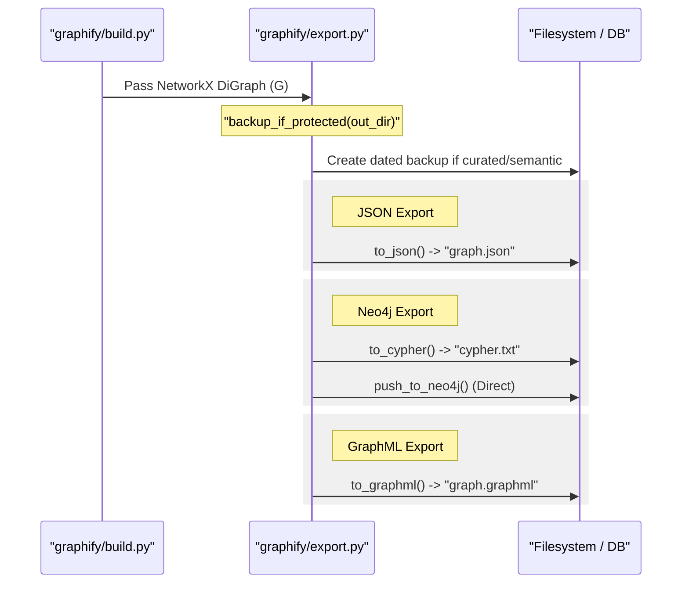

# Neo4j, GraphML 및 JSON Export

관련 소스 파일

다음 파일들은 이 위키 페이지를 생성하기 위한 컨텍스트로 사용되었습니다.

- [graphify/export.py](graphify/export.py)
- [graphify/hooks.py](graphify/hooks.py)
- [tests/test_export.py](tests/test_export.py)
- [tests/test_hooks.py](tests/test_hooks.py)

이 페이지는 `graphify`의 구조화된 데이터 export 기능을 자세히 설명합니다. 사람이 읽을 수 있는 보고서와 대화형 HTML 시각화를 넘어, `graphify`는 프로그래밍 방식 분석, 그래프 데이터베이스 통합, Gephi 또는 yEd 같은 외부 시각화 도구를 위한 업계 표준 형식을 지원합니다.

## 구조화된 Export 개요

`graphify/export.py`의 export engine은 내부 NetworkX 그래프를 여러 특화 형식으로 변환합니다. 이러한 export는 node attribute(file type, confidence score)와 clustering 단계에서 생성된 community assignment를 포함하여 그래프의 구조적 무결성을 보존합니다 [graphify/export.py:1-13]().

### 구현 흐름

구조화된 export의 데이터 흐름은 일관된 패턴을 따릅니다.
1.  **Graph Retrieval**: 처리된 `networkx.DiGraph`(또는 `Graph`)가 export 함수로 전달됩니다 [graphify/export.py:13-14]().
2.  **Attribute Mapping**: 내부 metadata(예: `community_id`)는 `_node_community_map` 같은 helper를 사용해 형식별 attribute로 매핑됩니다 [graphify/export.py:16-16]().
3.  **Sanitization**: 대상 형식에서 injection attack 또는 syntax error를 방지하기 위해 label과 property value는 `sanitize_label`을 통해 정리됩니다 [graphify/export.py:15-15]().
4.  **Serialization**: 그래프는 filesystem에 직렬화되거나 remote instance로 push됩니다.

**출처:** [graphify/export.py:1-17]()

## JSON Export(`to_json`)

`to_json` 함수는 NetworkX의 `node_link_data` 형식을 활용합니다 [graphify/export.py:14-14](). 이는 web visualizer와 persistent cache 같은 `graphify` 컴포넌트 간 상호운용에 사용되는 주요 형식입니다.

-   **Schema**: `nodes`와 `links` 배열을 가진 JSON 객체를 생성합니다(`edges`에서 호환성을 위해 remap됨).
-   **Metadata**: 각 node는 검색 최적화를 위해 `community`, `file_type`, `source_file`, `norm_label`을 포함합니다 [tests/test_export.py:31-40]().
-   **Idempotency 및 Backup**: `graph.json`을 overwrite하기 전에 시스템은 기존 semantic marker 또는 curated label을 확인합니다. 발견되면 `backup_if_protected`를 통해 현재 artifact를 날짜가 지정된 하위 폴더로 snapshot합니다 [graphify/export.py:32-43]().

**출처:** [graphify/export.py:14-14](), [graphify/export.py:32-95](), [tests/test_export.py:13-40]()

## Neo4j 통합

`graphify`는 Neo4j 통합을 위한 두 가지 방법을 제공합니다. offline Cypher script 생성과 직접 driver 기반 injection입니다.

### Cypher Script 생성(`to_cypher`)

`to_cypher` 함수는 `MERGE` 문을 포함하는 `.txt` 또는 `.cypher` 파일을 생성합니다 [tests/test_export.py:41-46](). 이를 통해 `graphify` 실행 중 live connection이 필요하지 않아도 Neo4j instance로 idempotent import할 수 있습니다.

-   **Node Labels**: node에는 `file_type`에 기반한 label이 할당됩니다(예: `:Code`, `:Paper`, `:Document`, `:Image`).
-   **Idempotency**: unique `id` property에 `MERGE`를 사용하여 script를 여러 번 실행해도 중복 entity가 생성되지 않도록 보장합니다 [tests/test_export.py:48-55]().
-   **Relationship Mapping**: edge는 추출 단계에서 파생된 type으로 생성됩니다(예: `CONTAINS`, `REFERENCES`, `CALLS`).

### 직접 Injection(`push_to_neo4j`)

자동화 workflow를 위해 `push_to_neo4j`는 공식 Neo4j Python driver를 사용해 실행 중인 instance에 그래프를 직접 주입합니다. 대형 그래프를 효율적으로 업로드하기 위해 connection pooling과 transaction management를 처리합니다.

#### Neo4j Mapping 로직

| Graphify Attribute | Neo4j Equivalent |
| :--- | :--- |
| Node ID | `id` property (Unique Constraint) |
| `file_type` | Node Label (e.g., `(:Code {id: "..."})`) |
| `community` | `community` property |
| Edge Type | Relationship Type (UPPERCASE) |

### 구현 매핑 다이어그램

다음 다이어그램은 상위 수준 export 로직을 관련된 특정 코드 엔터티에 연결합니다.

**Export Logic Mapping**

**출처:** [graphify/export.py:1-17](), [tests/test_export.py:41-55]()

## GraphML Export(`to_graphml`)

`to_graphml` 함수는 그래프를 XML 기반 GraphML 형식으로 export합니다 [tests/test_export.py:56-62](). 이는 heavy-duty graph analysis tool을 위한 표준입니다.

-   **Tool Compatibility**: **Gephi** 및 **yEd**와의 호환성이 구체적으로 테스트되었습니다.
-   **Attribute Encoding**: 모든 node attribute(community, weight, type)는 XML의 `<data>` key로 인코딩됩니다 [tests/test_export.py:74-82]().
-   **Prune Dangling Edges**: build 프로세스 중 `graphify`는 존재하지 않는 node를 가리키는 edge를 처리하여 graph integrity를 유지합니다.

**출처:** [graphify/export.py:1-14](), [tests/test_export.py:56-82]()

## 데이터 흐름: 내부에서 외부로

다음 다이어그램은 내부 Python object가 backup mechanism을 포함한 다양한 export 형식으로 변환되는 방식을 보여줍니다.

**내부 파이프라인에서 Export 형식으로**

**출처:** [graphify/export.py:1-95](), [tests/test_export.py:13-90]()

## Artifact 보존

`graphify`는 LLM token 없이는 재생성할 수 없거나 수동 curation을 포함하기 때문에 rebuild 전반에서 보존할 가치가 있는 특정 artifact를 식별합니다 [graphify/export.py:20-29]().

| Artifact | 보존 이유 |
| :--- | :--- |
| `graph.json` | 주요 구조 데이터 |
| `GRAPH_REPORT.md` | 사람이 읽을 수 있는 분석 |
| `.graphify_labels.json` | 사람이 curate한 community name |
| `.graphify_semantic_marker` | LLM token 지출을 나타냄 |
| `manifest.json` | 파일 발견 상태 |

`backup_if_protected` 함수는 `.graphify_semantic_marker`가 있거나 `.graphify_labels.json`에 non-default label이 포함되어 있으면 snapshot을 트리거합니다 [graphify/export.py:32-61](). 이 함수는 `graphify` update 중 curated data가 우발적으로 손실되지 않도록 날짜가 지정된 하위 폴더(예: `graphify-out/2023-10-27/`)에 daily snapshot이 유지되게 합니다 [graphify/export.py:64-70]().

**출처:** [graphify/export.py:20-90](), [tests/test_export.py:184-194]()
