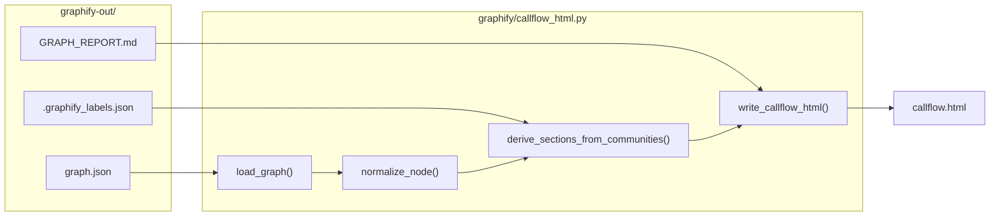
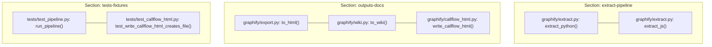

# Callflow HTML Export

<details>
<summary>관련 소스 파일</summary>

다음 파일들은 이 위키 페이지를 생성하기 위한 컨텍스트로 사용되었습니다.

- [graphify/callflow_html.py](graphify/callflow_html.py)
- [graphify/diagnostics.py](graphify/diagnostics.py)
- [graphify/multigraph_compat.py](graphify/multigraph_compat.py)
- [graphify/prs.py](graphify/prs.py)
- [tests/test_callflow_html.py](tests/test_callflow_html.py)
- [tests/test_prs.py](tests/test_prs.py)

</details>


`graphify/callflow_html.py`에 구현된 **Callflow HTML Export** 하위 시스템은 코드베이스의 상위 수준 아키텍처 시각화를 제공합니다. `to_html`이 생성하는 대화형 force-directed graph와 달리, callflow export는 사람이 읽기 쉽고 아키텍처 감사에 최적화된 구조화된 dark-themed standalone HTML 보고서를 생성합니다 [graphify/callflow_html.py:3-13]().

이 시스템은 low-level AST 관계를 community detection 결과에 기반한 상위 수준 "Sections"로 집계하고, section 간 의존성과 section 내부 call flow를 모두 설명하는 Mermaid 기반 flowchart를 렌더링합니다 [graphify/callflow_html.py:24-32]().

## 파이프라인 및 데이터 흐름

`callflow-html` 명령은 표준 `graphify` 출력의 post-processor 역할을 합니다. 통합 `graph.json`을 읽고, `GRAPH_REPORT.md`의 metadata와 `.graphify_labels.json`의 community label을 사용해 시각화를 보강합니다 [graphify/callflow_html.py:5-6]().

### 데이터 흐름 다이어그램

다음 다이어그램은 exporter가 원시 graph data를 구조화된 HTML 보고서로 변환하는 방식을 보여줍니다.

**Callflow 데이터 변환**

출처: [graphify/callflow_html.py:92-102](), [graphify/callflow_html.py:136-155](), [graphify/callflow_html.py:284-300](), [graphify/callflow_html.py:461-480]()

## Section 추론 로직

callflow export의 핵심 기능은 코드 엔터티를 논리적 "Sections"로 자동 그룹화하는 것입니다. 수동 sections 설정이 제공되지 않으면 exporter는 `derive_sections_from_communities`를 사용해 이를 추론합니다 [graphify/callflow_html.py:284-285]().

알고리즘은 해당 community 안의 node label과 file path를 분석하여 Leiden community를 section ID에 매핑합니다. 특정 아키텍처 키워드를 찾습니다.
- **`extract-pipeline`**: "extract", "parse", "ast" 같은 키워드로 트리거됩니다 [graphify/callflow_html.py:315-320]().
- **`outputs-docs`**: "export", "report", "html", "markdown"으로 트리거됩니다 [graphify/callflow_html.py:321-325]().
- **`tests-fixtures`**: "test", "fixture", "mock"으로 트리거됩니다 [graphify/callflow_html.py:331-335]().

### 코드 엔터티에서 Section으로의 매핑

이 다이어그램은 export 프로세스 중 `graphify`의 특정 코드 엔터티가 source file path와 label에 따라 section으로 그룹화되는 방식을 보여줍니다.

**엔터티 그룹화 예시**

출처: [graphify/callflow_html.py:315-340](), [tests/test_callflow_html.py:157-171](), [graphify/callflow_html.py:461-480]()

## 구현 세부 사항

### 주요 함수 및 보안

| 함수 | 책임 |
| :--- | :--- |
| `normalize_node` | 다양한 `graph.json` schema version을 일관된 내부 dict로 표준화합니다 [graphify/callflow_html.py:136-155](). |
| `derive_sections_from_communities` | node를 `community` attribute 기준으로 그룹화하고 content에 기반해 논리적 이름을 할당합니다 [graphify/callflow_html.py:284-345](). |
| `write_callflow_html` | 파일을 읽고, Mermaid 문자열을 생성하며, 최종 HTML을 작성하는 주요 orchestrator입니다 [graphify/callflow_html.py:461-480](). |
| `endpoint_id` | node identifier가 유효한 Mermaid node ID가 되도록 sanitize합니다 [graphify/callflow_html.py:129-134](). |
| `load_graph` | security check와 함께 `graph.json`을 로드하며, resource exhaustion을 방지하기 위해 parsing 전 size limit을 강제합니다 [graphify/callflow_html.py:173-187](). |

### Mermaid 다이어그램 생성
exporter는 두 가지 유형의 Mermaid 다이어그램을 생성합니다.
1.  **Architecture Overview**: 추론된 section들이 서로 어떻게 의존하는지 보여주는 상위 수준 `graph LR`입니다.
2.  **Section Callflows**: 각 section에 대한 자세한 `graph LR` 다이어그램으로, function과 class 사이의 대표적인 내부 call을 보여줍니다 [graphify/callflow_html.py:9-10]().

exporter에는 렌더링된 SVG에 zoom, pan, drag-to-scroll 기능을 추가하는 custom JavaScript 기반 "Mermaid Viewport"가 포함되어 있으며, `.mermaid-viewport` 및 `.mermaid-toolbar` CSS/JS component를 통해 구현됩니다 [graphify/callflow_html.py:53-61]().

## CLI 사용법

callflow export는 `export callflow-html` 명령을 통해 트리거됩니다. 출력을 사용자화하기 위한 여러 flag를 지원합니다.

```bash
# Basic usage (defaults to graphify-out/graph.json)
graphify export callflow-html

# Specify custom paths
graphify export callflow-html --graph custom/graph.json --output docs/arch.html

# Limit the number of sections for clarity
graphify export callflow-html --max-sections 5
```
출처: [graphify/callflow_html.py:14-18](), [tests/test_callflow_html.py:71-95]()

## HTML Template 기능

생성된 파일은 다음 기능을 갖춘 standalone dark-themed HTML 문서입니다.
- **Navigation Bar**: 빠르게 이동할 수 있도록 각 architectural section으로 향하는 sticky link를 제공합니다 [graphify/callflow_html.py:81-83]().
- **Graph Report Highlights**: 컨텍스트 제공을 위해 `GRAPH_REPORT.md`에서 "God Nodes"와 "Summary" 데이터를 직접 가져옵니다 [graphify/callflow_html.py:530-545]().
- **Call Detail Tables**: 빠른 식별을 위해 `.tag-func`, `.tag-class`, `.tag-async`, `.tag-endpoint` 같은 semantic tag와 함께 대표 node를 나열합니다 [graphify/callflow_html.py:62-72]().
- **Sanitization**: source code comment 또는 string에서 발생하는 XSS를 방지하기 위해 모든 node label과 description은 `html.escape`를 사용해 HTML-escape됩니다 [graphify/callflow_html.py:31](), [tests/test_callflow_html.py:67-68]().

출처: [graphify/callflow_html.py:38-85](), [graphify/callflow_html.py:461-600]()
