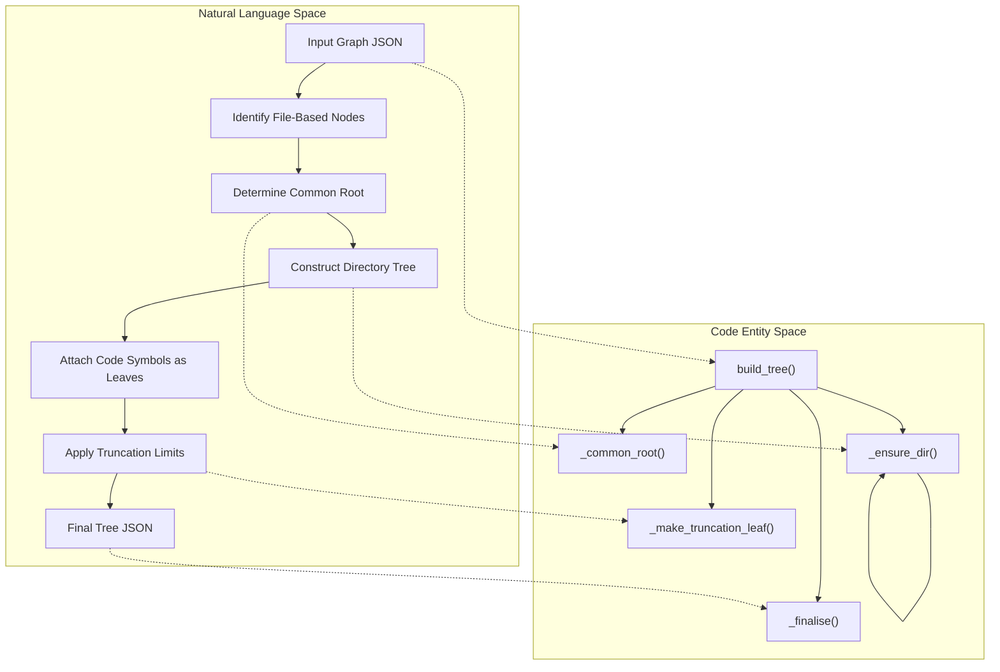
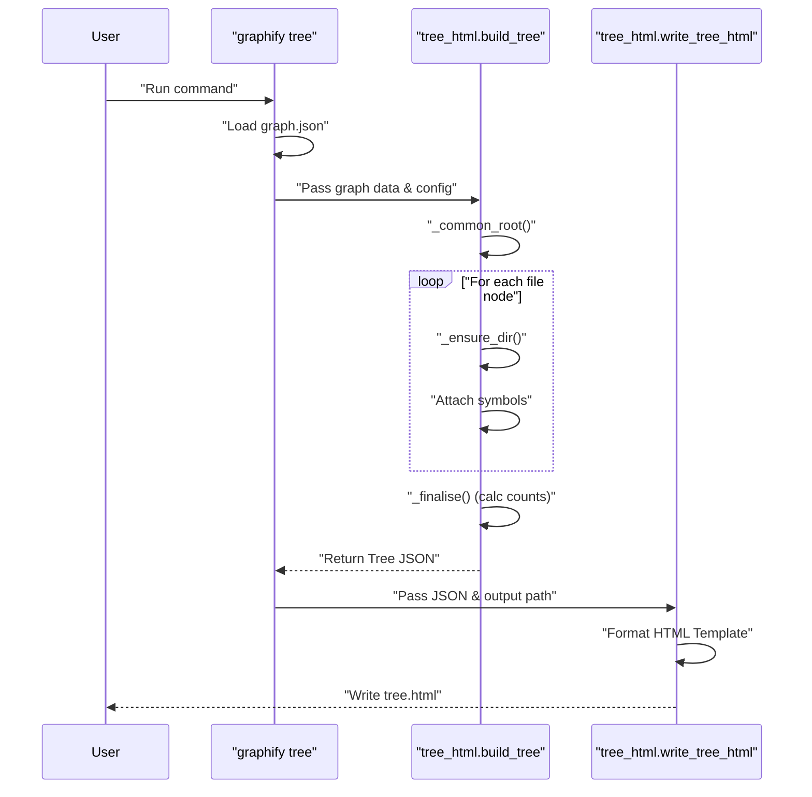

# Tree HTML Export

<details>
<summary>관련 소스 파일</summary>

다음 파일들은 이 위키 페이지를 생성하기 위한 컨텍스트로 사용되었습니다.

- [graphify/tree_html.py](graphify/tree_html.py)

</details>


`graphify tree` 명령은 지식 그래프에 대한 계층적이고 모듈 중심적인 시각화를 제공합니다. 표준 `graph.html`의 force-directed layout과 달리, Tree HTML export는 **D3 v7**을 사용해 프로젝트의 파일시스템 구조와 symbol hierarchy를 반영하는 collapsible tree를 렌더링합니다.

## 개요 및 목적

Tree HTML export는 코드베이스의 구조화되고 탐색 가능한 "map"을 제공하여 graph 기반 view를 보완하도록 설계되었습니다 [graphify/tree_html.py:1-4](). 사용자는 상위 수준 디렉터리에서 개별 코드 symbol(class 및 function)까지 탐색할 수 있으며, descendant leaf count를 통해 프로젝트 규모를 명확히 파악할 수 있습니다.

### 주요 시각 기능
*   **Collapsible Nodes:** 집중적인 탐색을 위해 subtree를 click-to-toggle할 수 있습니다 [graphify/tree_html.py:12-12]().
*   **Global Controls:** Expand-all, Collapse-all, Reset-view 버튼을 제공합니다 [graphify/tree_html.py:7-7]().
*   **Depth-Based Coloring:** 상위 수준 디렉터리에는 고유한 accent color가 주어지고, 더 깊은 level에는 level-specific palette가 사용됩니다 [graphify/tree_html.py:10-11]().
*   **Intelligent Labeling:** `wrapText`를 통한 multi-line label이 entity name과 total descendant count를 함께 표시합니다 [graphify/tree_html.py:8-9]().
*   **Wide Directory Handling:** 합성 `(+N more)` leaf를 사용해 큰 디렉터리를 자동으로 truncate합니다 [graphify/tree_html.py:28-30]().

**출처:** [graphify/tree_html.py:1-33]()

---

## 데이터 흐름 및 구현

export 프로세스는 flat NetworkX-style graph JSON을 D3의 hierarchy layout에 적합한 중첩 tree structure로 변환하는 과정을 포함합니다.

### Tree 데이터 구조
export된 데이터는 각 node가 name, 미리 계산된 leaf count, children을 포함하는 재귀적 형태를 따릅니다 [graphify/tree_html.py:14-20]().

| 필드 | 설명 |
| :--- | :--- |
| `name` | node의 label입니다(예: directory name, filename, symbol name) [graphify/tree_html.py:17-17](). |
| `total_count` | 이 branch 안에 포함된 leaf node(symbol)의 총 개수입니다 [graphify/tree_html.py:18-18](). |
| `children` | child node object 목록입니다 [graphify/tree_html.py:19-19](). |

### Logic Space에서 Code Entity Space로: Tree 구성

이 다이어그램은 `build_tree` 함수가 raw graph node를 계층적 JSON 구조로 변환하는 방식을 보여줍니다.


**출처:** [graphify/tree_html.py:49-169]()

---

## 기술 세부 사항

### 계층 구조 구성
1.  **Root Detection:** `--root`가 제공되지 않으면, 시스템은 `_common_root`를 사용해 `source_file` attribute가 있는 모든 node 중 가장 깊은 공통 디렉터리를 계산합니다 [graphify/tree_html.py:49-61, 86-88]().
2.  **Directory Indexing:** `_ensure_dir` helper는 directory path object를 재귀적으로 구성하여 interior node가 folder structure를 나타내도록 보장합니다 [graphify/tree_html.py:102-113]().
3.  **Symbol Attachment:** 각 파일에 대해 해당 파일을 구성하는 symbol(function, class)이 child로 추가됩니다. 일부 extractor가 생성하는 중복 file-name node는 명확성을 유지하기 위해 필터링됩니다 [graphify/tree_html.py:125-135]().
4.  **Sorting:** child는 sub-directory가 file보다 먼저 나타나도록 정렬되며, symbol은 알파벳순으로 정렬됩니다(`_`로 시작하는 private symbol은 마지막에 나타남) [graphify/tree_html.py:137-140, 155-159]().

### Truncation 및 성능
대규모 코드베이스에서도 tree가 사용 가능하도록, `--max-children` flag(기본값 200)는 단일 parent 아래에 렌더링되는 node 수를 제한합니다 [graphify/tree_html.py:43-43, 72-72](). 이 제한에 도달하면 숨겨진 item 수를 표시하는 합성 leaf가 `_make_truncation_leaf`를 통해 생성됩니다 [graphify/tree_html.py:64-65, 141-145]().

### HTML 생성
`write_tree_html` 함수는 생성된 JSON을 self-contained HTML template에 주입합니다 [graphify/tree_html.py:456-466](). 이 template에는 다음이 포함됩니다.
*   **D3 v7 script:** CDN을 통해 로드됩니다 [graphify/tree_html.py:238-238]().
*   **CSS Styles:** hover effect와 control styling을 갖춘 깔끔하고 현대적인 UI [graphify/tree_html.py:181-231]().
*   **D3 Logic:** tree layout, diagonal link path, multi-line SVG text를 위한 `wrapText` 함수를 처리합니다 [graphify/tree_html.py:240-440]().

**출처:** [graphify/tree_html.py:43-169, 176-466]()

---

## CLI 사용법

tree export는 `tree` subcommand를 통해 호출됩니다.

```bash
# Basic usage
graphify tree

# Customizing output and root
graphify tree --graph graphify-out/graph.json --output docs/tree.html --root src/

# Controlling tree density
graphify tree --max-children 50 --label "My Project Hierarchy"
```

### CLI Flags
| Flag | 설명 | 기본값 |
| :--- | :--- | :--- |
| `--graph` | 입력 `graph.json` 경로 | `graphify-out/graph.json` |
| `--output` | HTML 파일의 destination | `graphify-out/tree.html` |
| `--root` | tree root로 취급할 filesystem path | Auto-detected |
| `--max-children` | truncation 전 node당 최대 children 수 | `200` |
| `--label` | tree 상단에 표시되는 title | Root folder name |

**출처:** [graphify/tree_html.py:22-23, 471-497]()

---

## 시스템 상호작용 다이어그램

이 다이어그램은 command line에서 최종 HTML 파일 생성까지의 흐름을 보여줍니다.



**출처:** [graphify/tree_html.py:471-508, 68-169, 443-467]()
