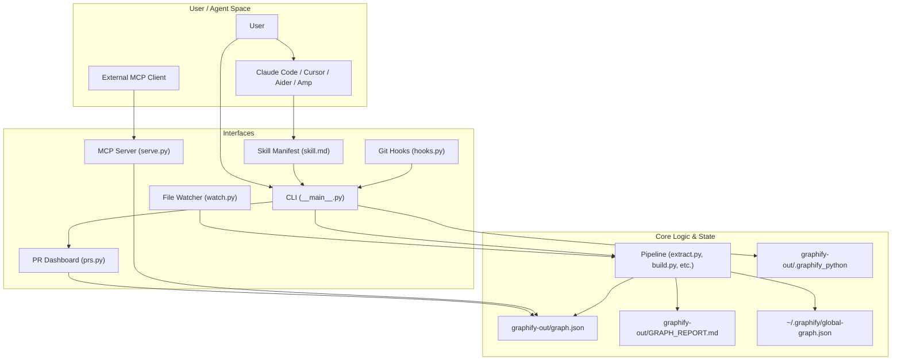
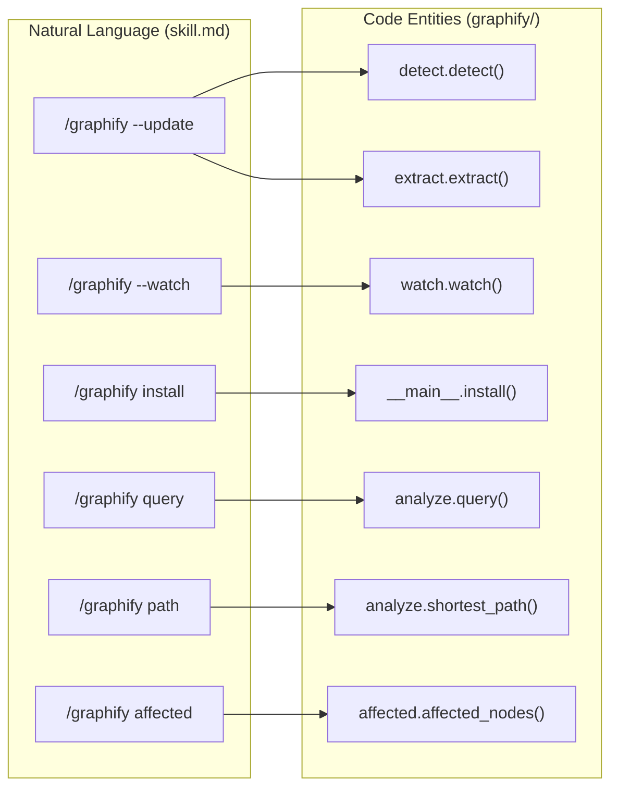

# 인터페이스 및 통합

관련 소스 파일

다음 파일들은 이 위키 페이지를 생성하기 위한 컨텍스트로 사용되었습니다.

- [graphify/__main__.py](graphify/__main__.py)
- [graphify/skill.md](graphify/skill.md)

이 페이지는 사용자와 외부 시스템이 `graphify`와 상호작용하는 방식을 상위 수준에서 개관합니다. 이 시스템은 interface-agnostic하게 설계되어 **Command Line Interface(CLI)** 를 통한 직접적인 사람 상호작용, **Model Context Protocol(MCP)** 을 통한 자동화된 agentic workflow, file **watcher를 통한 background synchronization**, custom skill, Git hook, PR analysis tool을 통한 AI coding assistant와의 깊은 통합을 지원합니다.

## 상호작용 개요

`graphify`는 원시 file system data와 구조화된 지식 사이의 간극을 연결합니다. 다음 다이어그램은 다양한 interface가 core logic 및 생성된 `graphify-out/` artifact와 상호작용하는 방식을 보여줍니다.

### 시스템 인터페이스 맵

**출처:** [graphify/skill.md:1-42](), [graphify/__main__.py:20-22](), [graphify/skill.md:44-57]()

---

## CLI Reference
주요 진입점은 `graphify/__main__.py`에서 관리되는 `graphify` 명령입니다. Claude, Cursor, Kiro, Amp, 특화 Windows 환경을 포함한 20개 이상의 플랫폼에 걸친 설치를 처리합니다 [graphify/__main__.py:129-165]().

- **Installation**: `graphify install`은 도구를 등록하고 플랫폼별 manifest를 업데이트합니다. 적절한 `skill.md`를 복사하고 호환성을 보장하기 위해 `.graphify_version` stamp를 작성합니다 [graphify/__main__.py:94-114]().
- **Execution**: 전체 pipeline 실행, 증분 업데이트(`--update`), `--cluster-only` 또는 `--mode deep` 같은 특화 mode를 지원합니다 [graphify/skill.md:14-23]().
- **Subcommands**: URL ingestion을 위한 `add`, BFS/DFS traversal을 위한 `query`, connectivity analysis를 위한 `path`, hierarchical visualization을 위한 `tree`, impact analysis를 위한 `affected`를 포함합니다 [graphify/skill.md:34-42]().
- **Query Logging**: `GRAPHIFY_QUERY_LOG` 같은 환경 변수를 통해 query와 response를 `~/.cache/graphify-queries.log`에 선택적으로 기록합니다 [graphify/skill.md:104-114]().

flag 및 subcommand의 전체 목록은 [CLI Reference](#4.1)를 참조하세요.

**출처:** [graphify/__main__.py:94-165](), [graphify/skill.md:13-42](), [graphify/__main__.py:26-47]()

---

## MCP Server(`serve.py`)
`graphify`에는 LLM이 표준화된 toolset을 사용해 프로그래밍 방식으로 그래프를 탐색할 수 있게 하는 Model Context Protocol(MCP) server가 포함되어 있습니다. 이는 전체 `GRAPH_REPORT.md`를 읽지 않고 관계를 탐색해야 하는 agent에게 특히 유용합니다.

- **Core Tools**: `query_graph`, `get_node`, `get_neighbors`, `get_community`, `god_nodes`, `graph_stats`, `shortest_path`, `list_prs`, `get_pr_impact`.
- **Search**: Unicode-safe, case-insensitive node lookup을 위해 `norm_label`을 사용합니다.
- **Constraints**: context window overflow를 방지하기 위해 tool output에 token budget을 강제합니다.

tool definition과 traversal logic에 대한 자세한 내용은 [MCP Server (serve.py)](#4.2)를 참조하세요.

**출처:** [graphify/skill.md:30]()

---

## File Watcher(`watch.py`)
`watch.py` 모듈은 그래프 동기화를 유지하기 위한 background monitoring을 제공합니다. 속도와 비용의 균형을 맞추기 위해 "bifurcated" update logic을 사용합니다.

- **Instant Rebuild**: 코드 변경은 AST 기반 rebuild(`_rebuild_code`)를 트리거하며, LLM API 호출을 피하므로 비용이 없습니다.
- **Deferred Update**: LLM credit이 필요한 Document/Image 변경은 `needs_update` flag를 통해 update 대상으로 표시됩니다.
- **Locking**: advisory lock(`.rebuild.lock`)과 pending changes queue(`.pending_changes`)를 사용해 concurrent update를 관리합니다.

`watch()` pipeline에 대한 자세한 내용은 [File Watcher (watch.py)](#4.3)를 참조하세요.

**출처:** [graphify/skill.md:31]()

---

## Claude Code Skill 통합
`graphify` skill은 agent에게 pipeline 호출 방법을 알려주는 manifest입니다. `/graphify` trigger를 정의하고 다단계 실행 계획을 제공합니다 [graphify/skill.md:1-5]().

- **Progressive Disclosure**: 최신 버전은 `github-and-merge` 또는 `transcribe` 같은 기능을 위해 `references/` sidecar에 on-demand reference를 두고, lean core skill file을 사용합니다 [graphify/__main__.py:102-110]().
- **Persistence**: 관계는 `graphify-out/graph.json`에 저장되어 session을 넘어 context가 유지되도록 합니다 [graphify/skill.md:46-48]().
- **Audit Trail**: skill은 코드베이스에 대한 "honest" view를 제공하기 위해 `EXTRACTED`, `INFERRED`, `AMBIGUOUS` edge type을 강조합니다 [graphify/skill.md:46-48]().
- **Fast Path**: 재추출 전에 기존 `graphify-out/graph.json`을 확인하여 단계를 건너뛰고 더 빠른 답변을 위해 바로 `graphify query`로 이동하도록 agent에게 지시합니다 [graphify/skill.md:52-54]().

### Skill-to-Code Entity 매핑
이 다이어그램은 상위 수준 agent instruction을 underlying Python implementation 및 configuration에 매핑합니다.

플랫폼별 manifest와 `skillgen` build system에 대한 자세한 내용은 [Claude Code Skill Integration](#4.4)를 참조하세요.

**출처:** [graphify/skill.md:1-10](), [graphify/skill.md:52-54](), [graphify/__main__.py:102-114]()

---

## Git Hooks 통합(`hooks.py`)
그래프가 source of truth에서 벗어나지 않도록 `graphify`는 `graphify hook` 명령을 통해 자동화된 Git hook을 제공합니다.

- **Post-Commit/Checkout**: commit 또는 branch switch 후 구조적 update를 자동으로 트리거하여 그래프가 source code와 최신 상태를 유지하도록 합니다.
- **Python Detection**: hook script에 `sys.executable`을 직접 임베딩하여 GUI git client와 CI runner에서 발생하는 silent no-op을 수정합니다 [graphify/skill.md:104-114]().
- **Idempotency**: marker system을 사용해 기존 `.git/hooks`를 손상시키지 않고 hook을 안전하게 설치 및 제거합니다.
- **Environment Control**: 자동화 script 중 rebuild를 우회하기 위해 `GRAPHIFY_SKIP_HOOK=1`을 지원합니다.

hook 설치와 interpreter detection logic에 대한 자세한 내용은 [Git Hooks Integration](#4.5)을 참조하세요.

**출처:** [graphify/skill.md:42](), [graphify/skill.md:67-104]()

---

## PR Dashboard 및 Global Graph
multi-repo management와 code review workflow를 위한 고급 통합 기능입니다.

- **PR Triage**: `graphify prs` 명령은 그래프를 사용해 PR을 triage하고, community conflict를 감지하며, PR impact를 graph node에 다시 매핑합니다.
- **Global Graph**: `graphify global` 명령은 `~/.graphify/global-graph.json`에 저장된 cross-repo graph를 관리하여 cross-project dependency analysis를 가능하게 합니다.
- **Cross-Repo Merging**: `merge-graphs` logic은 여러 local 또는 remote repo graph를 하나의 통합 view로 결합할 수 있게 합니다 [graphify/skill.md:60-62]().

이러한 기능에 대한 자세한 내용은 [PR Dashboard & Global Graph](#4.6)를 참조하세요.

**출처:** [graphify/skill.md:60-62]()
