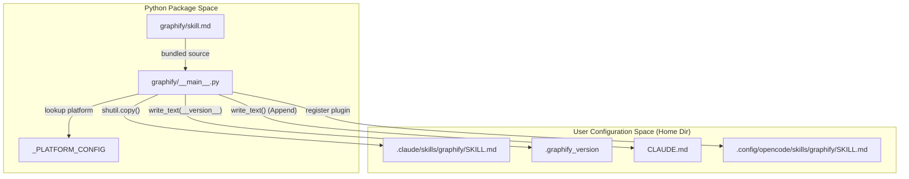
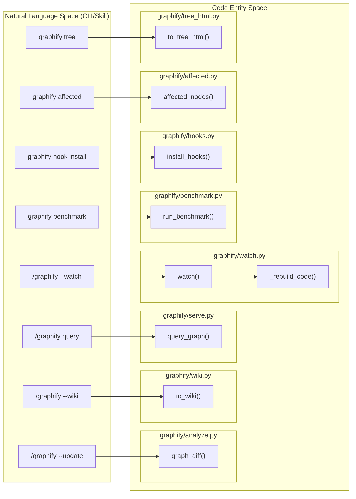

# CLI Reference

관련 소스 파일

다음 파일들은 이 위키 페이지를 생성하기 위한 컨텍스트로 사용되었습니다.

- [graphify/__main__.py](graphify/__main__.py)
- [graphify/querylog.py](graphify/querylog.py)
- [graphify/skill.md](graphify/skill.md)
- [tests/test_querylog.py](tests/test_querylog.py)

`graphify` command-line interface(CLI)는 지식 그래프 lifecycle을 관리하는 주요 진입점입니다. agent skill 설치, 성능 benchmarking, 핵심 extraction pipeline 실행을 처리합니다. 많은 사용자가 Claude Code 또는 다른 AI assistant 안에서 `/graphify` 명령을 통해 graphify와 상호작용하지만, CLI는 macOS, Linux, Windows, Amp 같은 특화 환경을 포함한 여러 플랫폼 전반에서 underlying execution engine과 administrative utility를 제공합니다.

## 설치 및 설정

### `graphify install [platform]`
이 명령은 graphify를 AI coding assistant용 "skill"로 등록합니다. `_PLATFORM_CONFIG` dictionary에 정의된 다양한 플랫폼을 지원합니다 [graphify/__main__.py:82-163]().

1.  **Skill Deployment**: package에서 플랫폼별 skill file(예: `skill.md`, `skill-windows.md`, `skill-codex.md`)을 assistant의 local configuration directory로 복사합니다 [graphify/__main__.py:1164-1180]().
2.  **Version Tracking**: update를 추적하고 stale-version warning을 방지하기 위해 destination에 `.graphify_version` 파일을 작성합니다 [graphify/__main__.py:96-114]().
3.  **Manifest Registration**: Claude Code의 경우 `/graphify` trigger를 활성화하기 위해 registration block을 `~/.claude/CLAUDE.md`에 append합니다 [graphify/__main__.py:173-180](), [graphify/__main__.py:1181-1194](). 
4.  **Plugin Injection**: OpenCode의 경우 `_install_opencode_plugin`을 통해 특정 plugin을 설치합니다 [graphify/__main__.py:1222-1240]().
5.  **Install Banner**: 버전 0.8.33부터 이 명령은 설치 성공 시 amber TTY-only brain graphic banner를 표시합니다 [graphify/__main__.py:1158-1162]().

**지원 플랫폼(`_PLATFORM_CONFIG`):**
- `claude`, `windows`(Claude Code) [graphify/__main__.py:83-87](), [graphify/__main__.py:153-157]().
- `codex`, `opencode`, `aider`, `copilot`, `claw`, `droid`, `trae`, `trae-cn`, `hermes`, `kiro`, `antigravity`, `kimi`, `amp` [graphify/__main__.py:88-162]().
- `gemini`와 `cursor`에는 `gemini_install` 및 `cursor_install`을 통한 특수 routing이 존재합니다 [graphify/__main__.py:1260-1283]().

**다이어그램: 설치 로직("graphify install")**

출처: [graphify/__main__.py:82-163](), [graphify/__main__.py:1164-1240]()

---

## Benchmarking

### `graphify benchmark [graph_path]`
그래프를 사용해 질문에 답하는 데 필요한 token과 "naive" 접근 방식(전체 raw corpus 읽기)을 비교하여 지식 그래프의 효율성을 측정합니다.

-   **Data Source**: built graph를 `graphify-out/graph.json`(기본값)에서 로드합니다 [graphify/benchmark.py:64-78]().
-   **Token Estimation**: token당 4자라는 표준 근사치(`_CHARS_PER_TOKEN`)를 사용합니다 [graphify/benchmark.py:9-13]().
-   **Metrics**: `_SAMPLE_QUESTIONS`와 일치하는 node(예: "how does authentication work")에서 BFS traversal을 실행하고, 해당 subgraph 크기를 전체 추정 corpus token과 비교하여 `reduction_ratio`를 계산합니다 [graphify/benchmark.py:64-111]().
-   **BFS Traversal**: `_query_subgraph_tokens` 함수는 상위 3개 matching node에서 breadth-first search(기본 depth=3)를 수행하여 대표 context window를 구성합니다 [graphify/benchmark.py:16-52]().

출처: [graphify/benchmark.py:9-111](), [graphify/__main__.py:11-15]()

---

## Skill Commands(/graphify)

`/graphify` 명령은 AI assistant가 트리거하는 주요 진입점입니다. skill manifest에 정의된 pipeline을 실행합니다 [graphify/skill.md:1-5]().

### 핵심 Pipeline Flags

| Flag | 설명 | 구현 세부 사항 |
| :--- | :--- | :--- |
| `--update` | 증분 업데이트. SHA256 hash를 기반으로 변경된 파일만 다시 추출합니다. | semantic hit에는 `graphify/cache.py`를, 비교에는 `graphify/analyze.py:graph_diff`를 사용합니다. |
| `--mode deep` | 공격적인 inferred edge extraction을 활성화합니다. | `graphify/llm.py`의 더 깊은 관계 휴리스틱을 트리거합니다. |
| `--cluster-only` | extraction을 건너뛰고 기존 graph에서 community detection만 다시 실행합니다. | Leiden community를 다시 계산하기 위해 `graphify/cluster.py`를 호출합니다. |
| `--watch` | 변경 사항을 감시합니다. | debounce mechanism과 함께 `graphify/watch.py`에 구현되어 있습니다. |
| `--no-viz` | HTML/SVG 생성을 비활성화합니다. | `graphify/export.py`의 visualization export를 건너뜁니다. |
| `--wiki` | Wikipedia 스타일 markdown vault를 생성합니다. | `graphify/wiki.py:to_wiki`를 호출합니다. |
| `--graphml` | Gephi 같은 외부 도구를 위해 그래프를 GraphML 형식으로 export합니다. | `graphify/export.py:to_graphml`을 호출합니다. |

### Query 및 Analysis Commands

-   **`query <text>`**: natural language query와 관련된 concept을 그래프에서 검색합니다. BFS(기본값) 또는 특정 path 추적을 위한 `--dfs`를 지원합니다 [graphify/skill.md:37-38]().
-   **`path <node_a> <node_b>`**: 두 entity 사이의 shortest path를 찾습니다 [graphify/skill.md:40]().
-   **`explain <node>`**: node와 그 context에 대한 자세한 summary를 제공합니다 [graphify/skill.md:41]().
-   **`affected <label>`**: seed node 변경으로 영향을 받는 node를 찾기 위해 BFS reverse traversal을 수행합니다.
    - **Implementation**: seed에서 역방향으로 그래프를 순회하기 위해 `graphify/affected.py:affected_nodes`를 사용합니다 [graphify/affected.py:10-30]().
    - **Flags**: impact scope를 필터링하기 위해 `--depth`와 `--relations`(예: `calls,imports`)를 지원합니다.
-   **`tree`**: 그래프의 module hierarchy에 대한 D3 기반 collapsible tree visualization을 생성합니다.
    - **Implementation**: `graphify/tree_html.py`가 self-contained HTML 파일을 생성합니다 [graphify/tree_html.py:15-40]().
    - **Flags**: `--max-children`(기본값 200, overflow용 synthetic leaf) 및 `--root` flag를 지원합니다 [graphify/tree_html.py:120-140]().
-   **`remember <file>`**: persistent semantic storage를 위해 파일을 `graphify-out/memory/` bypass로 ingest합니다.
-   **`add <url>`**: remote resource(arXiv, Tweet, Webpage)를 ingest하고 local graph에 병합합니다 [graphify/skill.md:34]().
-   **`save-result <name>`**: 현재 graph state를 named checkpoint로 저장합니다.
-   **`hook install`**: `graphify/hooks.py`를 통해 graph를 동기화 상태로 유지하기 위한 git hook(post-commit/post-checkout)을 설치합니다.

---

## Query Logging

Graphify는 auditing과 performance analysis를 위해 query에 대한 append-only JSONL log를 유지합니다 [graphify/querylog.py:1-43]().

-   **Location**: 기본값은 `~/.cache/graphify-queries.log`이지만 `GRAPHIFY_QUERY_LOG`로 override할 수 있습니다 [graphify/querylog.py:15-21]().
-   **Environment Variables**:
    - `GRAPHIFY_QUERY_LOG_DISABLE`: "1" 또는 "true"로 설정하면 logging을 비활성화합니다 [graphify/querylog.py:16-17]().
    - `GRAPHIFY_QUERY_LOG_RESPONSES`: 활성화하면 query result의 전체 text를 기록합니다 [graphify/querylog.py:24-25]().
-   **Format**: 각 line은 `ts`(timestamp), `kind`(query/path/explain), `question`, `corpus`, `nodes_returned`, `duration_ms`를 포함하는 JSON object입니다 [graphify/querylog.py:50-63]().

출처: [graphify/querylog.py:1-71](), [tests/test_querylog.py:1-179]()

---

## 시스템 아키텍처: 명령 실행

**다이어그램: CLI Command to Code Entity Mapping**

출처: [graphify/__main__.py:1-60](), [graphify/benchmark.py:64-77](), [graphify/watch.py:1-20](), [graphify/affected.py:10-30](), [graphify/tree_html.py:15-40]()

---

## 보안 및 제약

CLI는 resource exhaustion 또는 path traversal을 방지하기 위해 엄격한 safety boundary를 강제합니다.

-   **Size Caps**: `_enforce_graph_size_cap_or_exit`는 parsing 전에 byte cap을 초과하는 `graph.json` 파일을 거부합니다 [graphify/__main__.py:75-91]().
-   **Query Fail-Silence**: `log_query` 함수는 logging failure가 main CLI execution을 절대 crash시키지 않도록 try-except block으로 감싸져 있습니다 [graphify/querylog.py:43-70]().
-   **Platform Verification**: `_check_skill_version` 함수는 설치된 skill file이 현재 package version과 sync되지 않은 경우 사용자에게 경고합니다 [graphify/__main__.py:94-114]().

출처: [graphify/__main__.py:75-91](), [graphify/querylog.py:43-70](), [graphify/__main__.py:94-114]()
