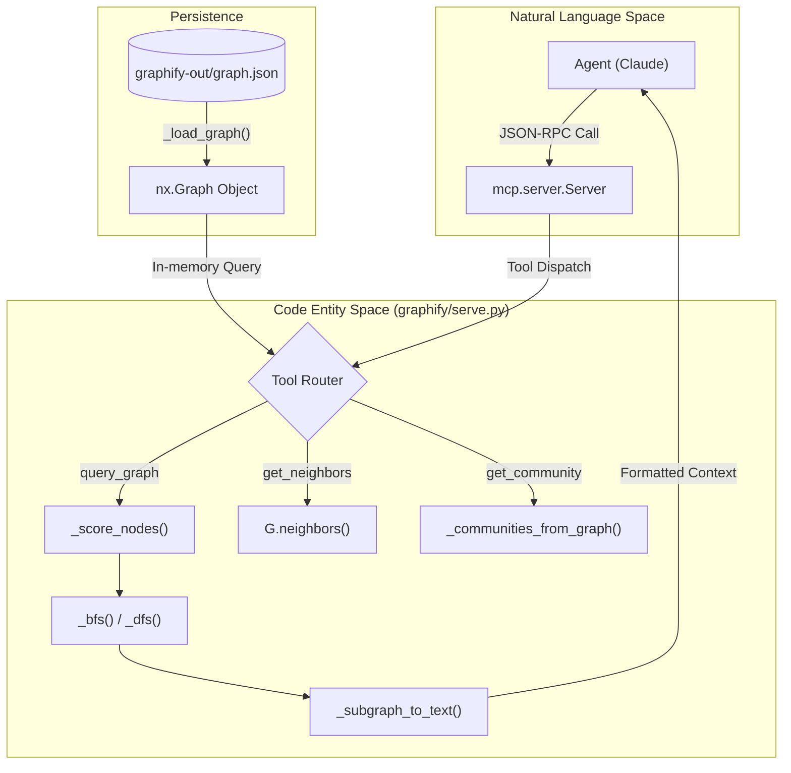
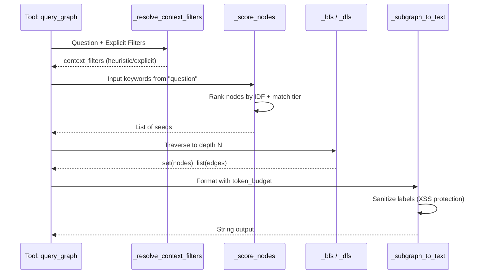

# MCP Server (serve.py)

<details>
<summary>관련 소스 파일</summary>

다음 파일들은 이 위키 페이지를 생성하기 위한 컨텍스트로 사용되었습니다.

- [graphify/benchmark.py](graphify/benchmark.py)
- [graphify/ingest.py](graphify/ingest.py)
- [graphify/serve.py](graphify/serve.py)
- [tests/test_benchmark.py](tests/test_benchmark.py)
- [tests/test_serve.py](tests/test_serve.py)

</details>


`graphify/serve.py` 모듈은 **Model Context Protocol (MCP)** stdio server를 구현합니다. 이 server는 처리된 지식 그래프를 AI agent(Claude 등)에게 interactive tool 집합으로 노출합니다. 이를 통해 agent는 전체 그래프를 context window에 로드하지 않고도 semantic search, relationship traversal, community structure 탐색을 수행할 수 있습니다.

### 아키텍처 및 데이터 흐름

server는 assembly pipeline이 생성한 `graph.json` 파일을 `networkx.Graph` 객체로 로드하여 동작합니다 [graphify/serve.py:19-35](). 이후 standard input/output(stdio)을 통해 JSON-RPC request를 수신합니다. Claude Desktop 같은 일부 MCP client가 보내는 blank line으로 인한 Pydantic validation error를 방지하기 위해 특화된 `_filter_blank_stdin` helper가 사용됩니다. 이 helper는 OS-level pipe를 설치하여 blank line을 drop하면서 stdin을 relay합니다 [graphify/serve.py:465-492]().

server에는 `graph.json` 파일의 `mtime`을 확인하는 hot-reload mechanism(`_maybe_reload`)이 포함되어 있습니다. 파일이 업데이트된 경우(예: background `graphify --watch` process에 의해), server는 자동으로 그래프를 다시 로드하고 IDF term cache를 비웁니다 [graphify/serve.py:495-510]().

#### 데이터 흐름 다이어그램
이 다이어그램은 agent의 natural language request가 `serve.py` toolset을 통해 graph operation으로 변환되는 방식을 보여줍니다.

Title: MCP Tool Execution Flow

출처: [graphify/serve.py:19-35](), [graphify/serve.py:44-51](), [graphify/serve.py:135-158](), [graphify/serve.py:527-534]()

### 핵심 컴포넌트

#### 1. Search 및 Scoring(norm_label 및 Unicode)
agent가 `query_graph`를 사용하면 server는 normalized label을 사용하는 multi-tier search를 수행합니다. `jieba`를 통한 중국어 segmentation을 지원하며 [graphify/serve.py:69-77](), robust Unicode matching을 위해 diacritics를 제거합니다 [graphify/serve.py:54-57]().
*   **IDF Weighting**: `_compute_idf`는 query term의 Inverse Document Frequency를 계산합니다. 수백 개 node와 match되는 "error"나 "exception" 같은 일반 term은 낮은 weight를 받고, "FooBarService" 같은 드문 identifier는 높은 weight를 받습니다 [graphify/serve.py:110-132](). cache는 graph object 자체에 저장되어 reload 시 자동으로 invalidate됩니다 [graphify/serve.py:118]().
*   **Three-Tier Scoring**: `_score_nodes`는 match quality에 따라 `_EXACT_MATCH_BONUS`(1000.0), `_PREFIX_MATCH_BONUS`(100.0), `_SUBSTRING_MATCH_BONUS`(1.0)를 적용합니다 [graphify/serve.py:104-107](). 또한 `_SOURCE_MATCH_BONUS`(0.5)를 사용해 `source_file` path도 검색합니다 [graphify/serve.py:154-155]().
*   **Seed Selection**: `_pick_seeds`는 상위 BFS/DFS 시작점을 선택하며, high-frequency noise term이 dominant identifier match의 slot을 빼앗지 않도록 `gap_ratio`(기본값 0.2)를 사용합니다 [graphify/serve.py:161-177]().

#### 2. Context Filtering
server는 edge의 "context"(예: `call` 또는 `import` 관계만 따르기)를 기반으로 traversal을 제한할 수 있습니다.
*   **Heuristic Inference**: `_infer_context_filters`는 "invoke", "parameter", "return" 같은 keyword를 사용자 질문에서 분석하여 filter를 자동 적용합니다 [graphify/serve.py:205-214]().
*   **Graph Filtering**: `_filter_graph_by_context`는 traversal이 시작되기 전에 허용된 context와 match되는 edge만 포함하는 subgraph를 생성합니다 [graphify/serve.py:227-240]().

#### 3. Token Budget Enforcement
context window overflow를 방지하기 위해 `_subgraph_to_text`는 발견된 node와 edge를 text format으로 변환하면서 `token_budget`을 강제합니다.
*   **Heuristic**: token당 약 4자(`token_budget * 4`)로 가정합니다 [graphify/serve.py:318]().
*   **Prioritization**: seed node가 먼저 렌더링되고, 그 다음 다른 node가 degree 기준으로 정렬되어 high-impact node가 포함되도록 보장합니다 [graphify/serve.py:320-322]().
*   **Truncation**: output이 budget을 초과하면 hard-truncate되고 warning이 추가됩니다 [graphify/serve.py:334-336]().

출처: [graphify/serve.py:110-177](), [graphify/serve.py:205-240](), [graphify/serve.py:312-336]()

### 사용 가능한 도구

server는 `@server.list_tools()` decorator를 통해 다음 도구를 MCP client에 노출합니다 [graphify/serve.py:527-534]().

| Tool Name | 목적 | 구현 참조 |
| :--- | :--- | :--- |
| `query_graph` | context filtering과 함께 BFS/DFS를 사용해 그래프를 검색합니다. | [graphify/serve.py:535-567]() |
| `get_node` | 특정 node의 전체 metadata와 neighbor를 가져옵니다. | [graphify/serve.py:569-586]() |
| `get_neighbors` | 직접 neighbor와 edge relation을 나열합니다. | [graphify/serve.py:588-604]() |
| `get_community` | 특정 Leiden cluster에 속한 모든 node를 나열합니다. | [graphify/serve.py:606-618]() |
| `god_nodes` | 가장 많이 연결된 "hub" node를 식별합니다. | [graphify/serve.py:620-631]() |
| `graph_stats` | node/edge count와 community distribution 요약입니다. | [graphify/serve.py:633-644]() |
| `shortest_path` | 두 특정 entity 사이의 logic path를 찾습니다. | [graphify/serve.py:646-668]() |
| `list_prs` | community impact score와 함께 모든 PR을 나열합니다. | [graphify/serve.py:670-681]() |
| `get_pr_impact` | 특정 PR에 대한 자세한 impact analysis를 가져옵니다. | [graphify/serve.py:683-698]() |

출처: [graphify/serve.py:527-698]()

### 구현 세부 사항: Traversal Logic

traversal 함수는 사용자 의도와 underlying `networkx` graph structure 사이의 간극을 연결합니다. `_bfs`는 layer-by-layer frontier를 사용하며 [graphify/serve.py:243-258](), `_dfs`는 지정된 depth까지 deep logic path를 추적하기 위해 stack을 사용합니다 [graphify/serve.py:261-276]().

Title: Traversal and Serialization Logic

출처: [graphify/serve.py:135-177](), [graphify/serve.py:217-225](), [graphify/serve.py:243-336]()

### 사용법 및 시작

server는 일반적으로 CLI를 통해 시작되지만, `serve()` 함수를 통해 프로그래밍 방식으로 호출할 수도 있습니다 [graphify/serve.py:513-525]().

```python
from graphify.serve import serve

# Starts the stdio server looking for the default graph path
serve(graph_path="graphify-out/graph.json")
```

**요구 사항**:
*   `mcp` Python package가 설치되어 있어야 합니다(`pip install graphifyy[mcp]`) [graphify/serve.py:515-520]().
*   대상 디렉터리에 유효한 `graph.json`이 존재해야 합니다 [graphify/serve.py:21-25]().
*   server는 로드하기 전에 graph file size에 대한 security check를 수행합니다 [graphify/serve.py:26]().

출처: [graphify/serve.py:513-525](), [graphify/serve.py:21-26]()
