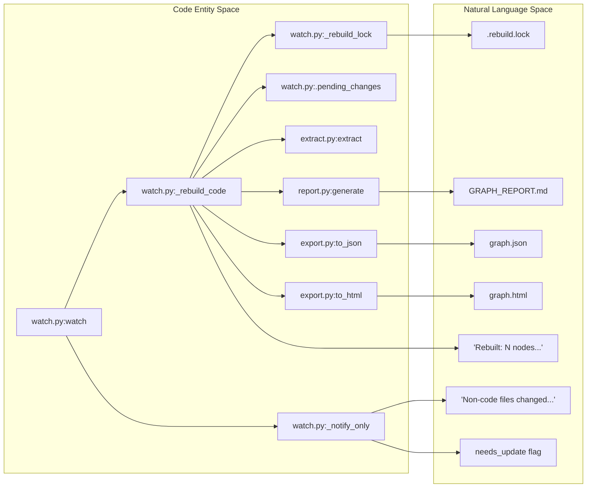

# File Watcher (watch.py)

<details>
<summary>관련 소스 파일</summary>

다음 파일들은 이 위키 페이지를 생성하기 위한 컨텍스트로 사용되었습니다.

- [graphify/cache.py](graphify/cache.py)
- [graphify/watch.py](graphify/watch.py)
- [tests/test_detect.py](tests/test_detect.py)
- [tests/test_watch.py](tests/test_watch.py)

</details>


`watch.py` 모듈은 underlying corpus가 변경될 때 지식 그래프를 자동으로 동기화하는 background monitoring service를 제공합니다. LLM 비용을 최소화하기 위해 bifurcated update logic을 사용하도록 설계되었습니다. 코드 변경은 즉시 결정적 AST rebuild를 트리거하고, semantic change(docs, papers, images)는 LLM 기반 update가 필요하다는 사실을 사용자에게 알립니다 [graphify/watch.py:1-10]().

## watch() 개요

`watch()` 함수는 file monitoring service의 진입점입니다. `watchdog` 라이브러리를 사용해 대상 디렉터리와 그 하위 디렉터리 전반의 filesystem event를 관찰합니다 [graphify/watch.py:286-290]().

### Debounce 메커니즘
빠른 파일 저장 중 pipeline이 반복적으로 트리거되는 것을 방지하기 위해(예: "Save All" 명령 또는 agent가 여러 파일을 작성하는 경우), `watch.py`는 debounce timer(기본값 3.0초)를 구현합니다 [graphify/watch.py:286-288]().

1.  **Event Capture**: `Handler` class(`FileSystemEventHandler`에서 상속)는 directory가 아니고 `_WATCHED_EXTENSIONS`와 일치하는 모든 event를 캡처합니다 [graphify/watch.py:301-310]().
2.  **Accumulation**: 변경된 path는 `changed` set에 추가되고, `last_trigger` timestamp는 `time.monotonic()`을 사용해 업데이트됩니다 [graphify/watch.py:313-315]().
3.  **Cooldown**: main loop는 누적된 파일 batch를 처리하기 전에 `(time.monotonic() - last_trigger) >= debounce`가 될 때까지 기다립니다 [graphify/watch.py:335-337]().

### 감시 대상 확장자
watcher는 build artifact 또는 숨김 디렉터리의 노이즈를 피하기 위해 `detect.py`에 정의된 특정 파일 유형을 필터링합니다 [graphify/watch.py:112-115]().

| Category | Source Variable | 일반적인 확장자 |
| :--- | :--- | :--- |
| **Code** | `CODE_EXTENSIONS` | `.py`, `.ts`, `.js`, `.go`, `.rs`, `.php`, `.dart`, etc. |
| **Docs** | `DOC_EXTENSIONS` | `.md`, `.txt`, `.rst`, `.pdf` |
| **Papers** | `PAPER_EXTENSIONS` | `.pdf`(paper heuristic으로 처리됨) |
| **Images** | `IMAGE_EXTENSIONS` | `.png`, `.jpg`, `.jpeg`, `.webp`, `.svg` |

출처: `[graphify/watch.py:189-200]()`, `[graphify/watch.py:307-308]()`, `[tests/test_watch.py:34-55]()`

## Update Logic Flow

watcher는 `_has_non_code()` helper를 사용해 structural change(code)와 semantic change(non-code)를 구분합니다 [graphify/watch.py:282-283]().

### Code-Only Rebuild(`_rebuild_code`)
변경된 파일 batch에 code extension만 포함되어 있으면 `watch.py`는 "instant" rebuild pipeline을 실행합니다. 이 pipeline은 `tree-sitter` AST extraction에 의존하므로 결정적이며 LLM token 비용이 발생하지 않습니다 [graphify/watch.py:339-340]().

**`_rebuild_code` Pipeline:**
1.  **Locking**: `graphify-out/`에 대한 concurrent write를 방지하기 위해 `_rebuild_lock`을 획득합니다. POSIX 시스템에서는 `fcntl.flock`을 사용해 현재 PID를 `.rebuild.lock`에 씁니다 [graphify/watch.py:91-105]().
2.  **Resource Limits**: `os.nice(10)`과 `RLIMIT_DATA`(macOS) 또는 `RLIMIT_AS`(Linux)를 통한 memory cap을 적용합니다 [graphify/watch.py:151-177]().
3.  **Pending Changes**: lock을 획득하지 못한 concurrent hook process가 queue에 넣은 파일을 병합하기 위해 `_drain_pending()`으로 `.pending_changes`를 비웁니다 [graphify/watch.py:38-67](), [graphify/watch.py:353-354]().
4.  **Detect & Extract**: 모든 파일을 찾기 위해 `detect()`를 호출하고 code file에 대해 `extract()`를 호출합니다 [graphify/watch.py:356-363]().
5.  **State Preservation**: 기존 `graph.json`을 로드합니다. code 관련 node를 새 AST data로 교체하면서 "semantic" node(docs/images)와 inferred/ambiguous edge를 보존합니다 [graphify/watch.py:368-383]().
6.  **Build**: `build_from_json()`을 호출해 NetworkX graph `G`를 생성합니다 [graphify/watch.py:395]().
7.  **Topology Check**: `_canonical_topology_for_compare()`를 사용해 새 graph topology를 이전 것과 비교합니다. 구조(nodes/edges)가 동일하면 비용이 큰 Leiden clustering 단계를 건너뜁니다 [graphify/watch.py:170-205](), [graphify/watch.py:397-402]().
8.  **Cluster & Analyze**: topology가 변경되었으면 `cluster()`와 `score_all()`을 실행한 뒤 `god_nodes()`, `surprising_connections()`, `suggest_questions()`를 실행합니다 [graphify/watch.py:403-408]().
9.  **Export**: `graphify-out/graph.json`을 업데이트하고 `GRAPH_REPORT.md`를 덮어씁니다. 그래프가 `MAX_NODES_FOR_VIZ`를 초과하지 않으면 `graph.html` 업데이트도 시도합니다 [graphify/watch.py:413-432]().
10. **Cleanup**: 이전에 설정되어 있었다면 `needs_update` flag를 삭제합니다 [graphify/watch.py:440-442]().

### Semantic Notification(`_notify_only`)
변경된 파일 중 document, paper, image가 하나라도 있으면 watcher는 LLM pass 없이 그래프를 안전하게 rebuild할 수 없습니다. 이 경우 `_notify_only()`를 호출합니다 [graphify/watch.py:271-280]().

1.  **Flagging**: 문자열 `"1"`을 포함하는 `graphify-out/needs_update` 파일을 생성합니다 [graphify/watch.py:220-222]().
2.  **Notification**: semantic re-extraction을 수행하기 위해 Claude Code에서 `/graphify --update`를 실행하라는 메시지를 console에 출력합니다 [graphify/watch.py:223-226]().

출처: `[graphify/watch.py:91-149]()`, `[graphify/watch.py:339-452]()`, `[graphify/watch.py:218-227]()`, `[graphify/watch.py:271-280]()`, `[tests/test_watch.py:13-30]()`

## 시스템 통합 다이어그램

### File Event에서 Action으로의 매핑
이 다이어그램은 filesystem event가 어떻게 분류되고 AST pipeline 또는 notification system으로 routing되는지 보여줍니다.

```mermaid
graph TD
    "FileSystem" -- "Event (File Modified)" --> "Handler.on_any_event"
    "Handler.on_any_event" -- "Filter _WATCHED_EXTENSIONS" --> "Pending Queue"
    "Pending Queue" -- "Debounce Timeout" --> "Batch Processor"
    "Batch Processor" -- "_has_non_code() == True" --> "_notify_only"
    "Batch Processor" -- "_has_non_code() == False" --> "_rebuild_code"
    
    subgraph "_rebuild_code Pipeline"
        "_rebuild_code" --> "extract.extract"
        "extract.extract" --> "build.build_from_json"
        "build.build_from_json" --> "cluster.cluster"
        "cluster.cluster" --> "report.generate"
    end

    "_notify_only" -- "Write Flag" --> "needs_update"
```
출처: `[graphify/watch.py:339-452]()`, `[graphify/watch.py:301-337]()`, `[graphify/watch.py:218-227]()`

### 데이터 흐름: Code Rebuild vs. Semantic Update
이 다이어그램은 "Natural Language Space"(사용자 알림)와 "Code Entity Space"(특정 함수 및 파일)를 연결합니다.


출처: `[graphify/watch.py:91-149]()`, `[graphify/watch.py:339-452]()`, `[graphify/watch.py:218-227]()`, `[graphify/watch.py:286-290]()`, `[graphify/watch.py:12-35]()`

## 구현 세부 사항

### Dependency Handling
`watchdog` 라이브러리는 optional dependency입니다. `watch()` 함수는 `watchdog.observers`와 `watchdog.events`를 late import합니다. 라이브러리가 없으면 설치 지침을 포함한 `ImportError`를 발생시킵니다 [graphify/watch.py:292-299](). macOS에서는 서로 다른 filesystem event 제한 전반의 호환성을 보장하기 위해 watcher가 기본적으로 `PollingObserver`를 사용합니다 [graphify/watch.py:327-330]().

### Pending Changes Queue
`.pending_changes` 파일은 rebuild가 이미 진행 중일 때 변경되는 file path를 위한 atomic append-only queue 역할을 합니다 [graphify/watch.py:12-35](). 
- **Concurrent Writes**: `_rebuild_lock`을 획득할 수 없는 post-commit hook은 변경 사항이 drop되지 않도록 `_queue_pending()`을 사용합니다 [graphify/watch.py:19-22]().
- **Draining**: lock-holder는 interleaved change를 포착하기 위해 rebuild 시작 전과 완료 후 `_drain_pending()`을 호출합니다 [graphify/watch.py:38-67](), [graphify/watch.py:353-354]().

### _rebuild_code의 State Merging
`_rebuild_code`의 중요한 기능 중 하나는 이전 LLM 실행의 semantic context를 보존한다는 점입니다. `file_type != "code"`인 기존 node를 유지하도록 필터링하고, `confidence`가 `INFERRED` 또는 `AMBIGUOUS`로 표시된 edge를 유지하도록 필터링합니다 [graphify/watch.py:372-376](). 이를 통해 code structure는 즉시 업데이트하면서도 code와 documentation 사이의 상위 수준 semantic link는 손실되지 않습니다.

### check_update Utility
`check_update()` 함수는 `needs_update` flag 존재 여부를 확인하는 utility입니다. flag 존재 여부와 관계없이 `True`를 반환하지만, semantic update가 pending 중이면 알림을 출력합니다. 이는 LLM-driven tool이 자신의 context가 stale인지 확인하는 데 유용합니다 [graphify/watch.py:208-216]().

### Advisory Locking (GH-858)
`_rebuild_lock` context manager는 cross-process advisory lock을 제공합니다. `fcntl.flock`을 사용해 여러 rebuild가 graph artifact를 손상시키는 것을 방지합니다. lock file에는 현재 holder의 PID가 포함되며, downstream poller에게 완료를 알리기 위해 release 시 자동으로 unlink됩니다 [graphify/watch.py:91-149]().

출처: `[graphify/watch.py:91-149]()`, `[graphify/watch.py:12-67]()`, `[graphify/watch.py:208-216]()`, `[graphify/watch.py:339-452]()`, `[graphify/watch.py:292-299]()`, `[tests/test_watch.py:59-102]()`, `[tests/test_watch.py:107-155]()`
