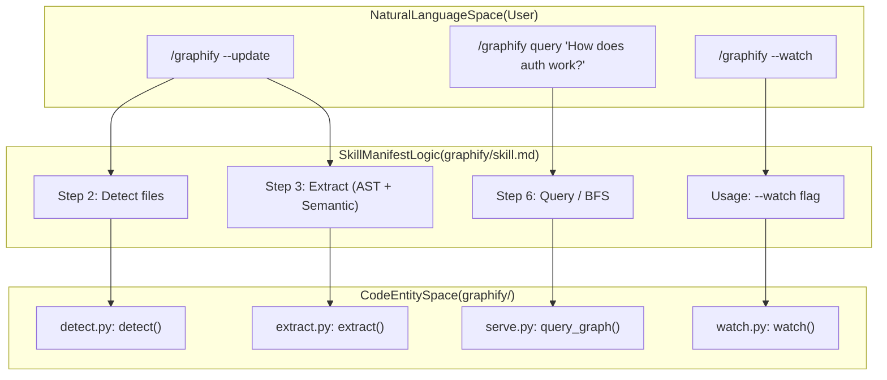
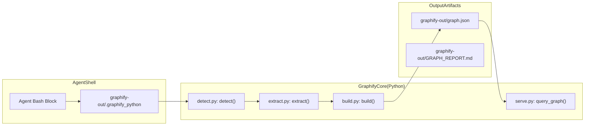

# Claude Code Skill 통합

관련 소스 파일

다음 파일들은 이 위키 페이지를 생성하기 위한 컨텍스트로 사용되었습니다.

- [.gitignore](.gitignore)
- [graphify/command-kilo.md](graphify/command-kilo.md)
- [graphify/skill-aider.md](graphify/skill-aider.md)
- [graphify/skill-amp.md](graphify/skill-amp.md)
- [graphify/skill-claw.md](graphify/skill-claw.md)
- [graphify/skill-codex.md](graphify/skill-codex.md)
- [graphify/skill-copilot.md](graphify/skill-copilot.md)
- [graphify/skill-devin.md](graphify/skill-devin.md)
- [graphify/skill-droid.md](graphify/skill-droid.md)
- [graphify/skill-kilo.md](graphify/skill-kilo.md)
- [graphify/skill-kiro.md](graphify/skill-kiro.md)
- [graphify/skill-opencode.md](graphify/skill-opencode.md)
- [graphify/skill-pi.md](graphify/skill-pi.md)
- [graphify/skill-trae.md](graphify/skill-trae.md)
- [graphify/skill-vscode.md](graphify/skill-vscode.md)
- [graphify/skill-windows.md](graphify/skill-windows.md)
- [graphify/skill.md](graphify/skill.md)
- [tests/test_devin.py](tests/test_devin.py)
- [tests/test_install.py](tests/test_install.py)
- [tests/test_install_references.py](tests/test_install_references.py)
- [tests/test_install_strings.py](tests/test_install_strings.py)
- [tests/test_install_upgrade.py](tests/test_install_upgrade.py)
- [tests/test_read_hook.py](tests/test_read_hook.py)
- [tests/test_skillgen.py](tests/test_skillgen.py)
- [tests/test_wheel_packaging.py](tests/test_wheel_packaging.py)
- [tools/skillgen/gen.py](tools/skillgen/gen.py)
- [tools/skillgen/platforms.toml](tools/skillgen/platforms.toml)

Claude Code Skill 통합을 통해 `graphify`는 Claude Code CLI와 기타 에이전트형 환경 안에서 네이티브 확장으로 동작할 수 있다. 특화된 skill manifest를 등록함으로써 `graphify`는 에이전트에게 디렉터리를 지식 그래프로 변환하고, 의미 기반 쿼리를 수행하며, 채팅 세션을 넘어서도 코드베이스에 대한 지속적인 정신적 모델을 유지하기 위한 구조화된 프로토콜을 제공한다.

## Skill Manifest와 Trigger

이 통합은 `graphify/skill.md`에 위치한 기본 skill manifest로 정의된다. 이 manifest는 `/graphify` trigger가 사용될 때 에이전트의 "system prompt" 역할을 한다 [graphify/skill.md:1-5]().

### 핵심 Manifest 구성 요소
*   **Trigger**: `/graphify` prefix는 에이전트에게 skill 로직을 호출하라고 알린다 [graphify/skill.md:4]().
*   **Capabilities**: 에이전트가 code, docs, papers, images, video를 처리해 clustered communities와 interactive reports를 생성할 수 있음을 알려준다 [graphify/skill.md:3, 9]().
*   **Persistence**: 관계가 `graphify-out/graph.json`에 저장되어 서로 다른 채팅 세션 간에도 그래프가 유지될 수 있음을 명시적으로 지시한다 [graphify/skill.md:45-46]().
*   **Interpreter Persistence**: 이 skill은 여러 bash block 호출에서 일관성을 보장하기 위해 올바른 Python interpreter의 경로를 `graphify-out/.graphify_python`에 기록한다 [graphify/skill.md:95-97]().
*   **GitHub Integration**: manifest의 Step 0은 에이전트가 remote repositories를 clone하고 cross-repo graphs에 merge할 수 있게 한다 [graphify/skill.md:60-63]().

### 자연어에서 Code Entity로의 매핑
다음 다이어그램은 에이전트형 환경에서 사용자의 자연어 command가 skill manifest에 정의된 특정 code entities와 file system operations로 어떻게 매핑되는지 보여준다.

**그림 1: Command Mapping Flow**

출처: [graphify/skill.md:20, 31, 37, 106-110]()

## Progressive Disclosure와 Build System

버전 0.8.29부터 `graphify`는 skill files에 **progressive-disclosure** 아키텍처를 사용한다. 하나의 거대한 prompt 대신, 시스템은 `references/` 디렉터리의 주문형 sidecar files로 보강되는 가벼운 core(약 615줄)를 사용한다.

### Skill Fragments와 `skillgen`
Platform-specific skills는 `tools/skillgen/` build system을 사용해 공유 fragments에서 생성된다.
*   **`gen.py`**: skill files를 조립하는 core generator script [tools/skillgen/gen.py:1]().
*   **`platforms.toml`**: 지원되는 모든 platforms의 configuration과 target paths를 정의한다 [tools/skillgen/platforms.toml:1]().
*   **`fragments/`**: 각 platform의 최종 `SKILL.md`를 만들기 위해 결합되는 재사용 가능한 markdown blocks(예: `core/`, `always_on/`)를 포함한다.
*   **CI Guards**: build system에는 개발 중 skill files가 동기화 상태를 유지하고 coverage requirements를 충족하도록 보장하는 `--check`, `--bless`, `--audit-coverage` flags가 포함되어 있다.

### Sidecar Reference Files
core skill file은 복잡한 작업을 위해 에이전트를 특정 reference files로 안내한다.
*   `extraction-spec.md`: graph extraction을 위한 상세 schema.
*   `query.md`: BFS/DFS query logic.
*   `update.md`: incremental update procedures.
*   `exports.md`: visualization과 export formats.
*   `transcribe.md`: Whisper-based transcription workflows.
*   `github-and-merge.md`: remote repository handling.

출처: [graphify/skill.md:62, 147-150](), [tools/skillgen/gen.py:1](), [tools/skillgen/platforms.toml:1]()

## Installation과 Platform Routing

`graphify install` command는 다양한 platforms 전반에서 skill 설정을 자동화한다. 이 command는 manifest를 platform-specific hidden directories로 복사하고 `CLAUDE.md`에 skill을 등록한다 [tests/test_install.py:32-34]().

### Platform-Specific Skills
`graphify`에는 다양한 AI coding assistants를 위한 맞춤형 manifests가 포함되어 있다.

| Platform | Manifest File | Target Path Example |
| :--- | :--- | :--- |
| **Claude** | `skill.md` | `~/.claude/skills/graphify/SKILL.md` [tests/test_install.py:10]() |
| **Codex** | `skill-codex.md` | `~/.agents/skills/graphify/SKILL.md` [tests/test_install.py:11]() |
| **OpenCode** | `skill-opencode.md`| `~/.config/opencode/skills/graphify/SKILL.md` [tests/test_install.py:12]() |
| **Windows** | `skill-windows.md` | PowerShell 인식 `SKILL.md` [graphify/skill-windows.md:1-5]() |
| **Kiro** | `skill-kiro.md` | `.config/kilo/skills/graphify/SKILL.md` [tests/test_install.py:13-16]() |
| **VS Code** | `skill-vscode.md` | VS Code Copilot 통합 [graphify/skill-vscode.md:1]() |
| **Amp** | `skill-amp.md` | Amp platform 지원 [graphify/skill-amp.md:1]() |
| **Devin** | `skill-devin.md` | Devin agentic platform 지원 [graphify/skill-devin.md:1]() |

지원되는 기타 platforms에는 **aider**, **claw**, **droid**, **trae**, **hermes**, **antigravity**, **cursor**, **gemini**, **pi**가 포함된다.

출처: [tests/test_install.py:9-22](), [graphify/skill-windows.md:1-5](), [graphify/skill-vscode.md:1]()

## Execution Pipeline과 Interpreter Detection

trigger되면 에이전트는 엄격하게 정의된 execution pipeline을 따른다. 여기서 중요한 구성 요소는 **uv-aware interpreter detection**이다.

### Interpreter Resolution Logic
`uv tool`, `pipx`, virtual environments를 처리하기 위해 skill manifest는 여러 단계의 detection block을 사용한다.
1.  **uv tool**: `uv tool run graphifyy`가 Python path를 resolve할 수 있는지 확인한다 [graphify/skill.md:71-74]().
2.  **Shebang**: `graphify` binary에서 shebang을 읽는다 [graphify/skill.md:76-82]().
3.  **Fallback**: 기본값을 `python3`로 설정하고 package가 없으면 quiet install을 시도한다 [graphify/skill.md:84-94]().

### Component Interaction
**그림 2: Component Interaction**

출처: [graphify/skill.md:95-97, 109-111, 147-150]()

## Agent Instructions와 Token Optimization

`graphify install` command는 에이전트 동작을 안내하기 위해 `CLAUDE.md` 같은 project-local files에 rules를 주입한다.

### Query-First Policy (Issue #580)
과도한 token usage를 방지하기 위해 `graphify`는 "query-first" policy를 강제한다. 지침은 에이전트에게 codebase questions에 대해 전체 `GRAPH_REPORT.md`를 읽기보다 첫 번째 action으로 `graphify query`를 사용하라고 명시적으로 알려준다 [tests/test_install_strings.py:49-54]().

*   **`CLAUDE.md` Section**: skill을 등록하고 에이전트가 `graphify-out/` directory를 참조하도록 안내한다 [tests/test_install_strings.py:36]().
*   **Dirty File Handling**: `AGENTS.md`의 rules는 `graphify-out/` 안의 "dirty" files가 예상되는 상태이며, 에이전트가 tool을 사용하는 것을 막아서는 안 된다고 명확히 한다 [tests/test_install_strings.py:125-128]().

출처: [tests/test_install_strings.py:9-10, 49-54, 125-128]()
