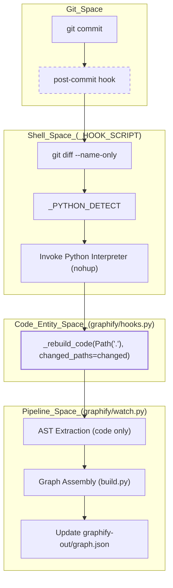
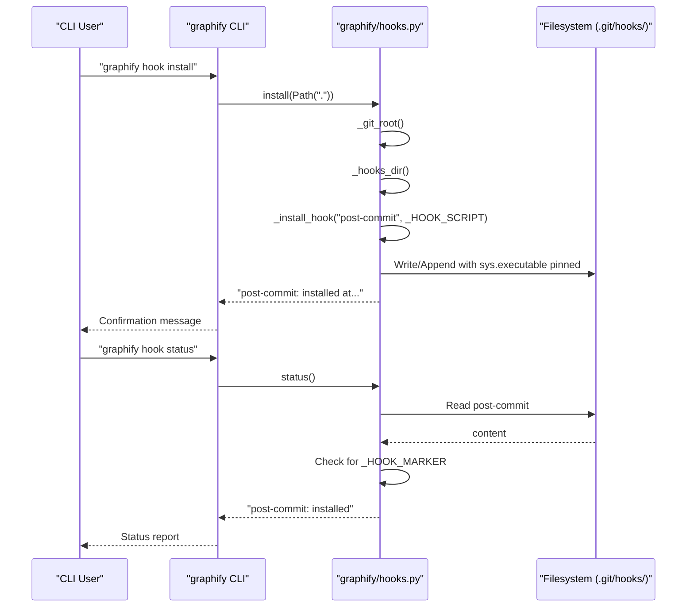

# Git Hooks 통합

관련 소스 파일

다음 파일들은 이 위키 페이지를 생성하기 위한 컨텍스트로 사용되었습니다.

- [graphify/export.py](graphify/export.py)
- [graphify/hooks.py](graphify/hooks.py)
- [tests/test_export.py](tests/test_export.py)
- [tests/test_hooks.py](tests/test_hooks.py)

`graphify`의 Git hooks 통합은 기반 source code가 변화함에 따라 knowledge graph가 계속 동기화되도록 보장한다. Git lifecycle events를 가로채 `graphify`는 모든 변경마다 수동 개입이나 비용이 큰 LLM 재처리를 요구하지 않고도 선택적이고 가벼운 graph rebuild를 트리거한다.

## 개요

이 통합은 `graphify/hooks.py`를 통해 관리되며, 이 파일은 repository 안에서 Git hooks를 install, uninstall, verify status할 수 있는 utilities를 제공한다 [graphify/hooks.py:1-6](). 이 hooks는 두 가지 특정 Git events를 대상으로 한다.
1.  **Post-Commit**: local changes가 commit된 뒤 graph를 rebuild한다 [graphify/hooks.py:77-80]().
2.  **Post-Checkout**: branch를 전환할 때 visualization과 analysis가 현재 HEAD를 반영하도록 graph를 rebuild한다 [graphify/hooks.py:148-151]().

이 시스템은 **idempotent**하고 **non-destructive**하도록 설계되어, 기존 hooks에 안전하게 append할 수 있으며 marker system을 사용해 자신이 inject한 code blocks만 clean up할 수 있다 [graphify/hooks.py:8-11]().

## Hook Architecture

이 통합은 Git hooks directory에 inject되는 shell scripts에 의존한다. 이 scripts는 environment detection을 수행한 다음 `graphify` Python logic을 호출한다.

### Python Interpreter Detection (`_PYTHON_DETECT`)
Git hooks에서 중요한 과제는 올바른 Python interpreter를 찾는 것이다. 특히 `graphify`가 `uv tool`, `pipx`, virtual environment 또는 system-wide path를 통해 설치된 경우가 그렇다. GUI git clients와 CI runners는 종종 `~/.local/bin`을 생략한 최소 `PATH`를 사용하므로, 조용한 no-op으로 이어질 수 있다.

이를 해결하기 위해 `graphify`는 버전 0.8.31부터 multi-stage detection strategy를 사용한다.

| 단계 | 로직 | 출처 |
| :--- | :--- | :--- |
| **Pinned Interpreter** | `sys.executable`의 absolute path가 install time에 script 안에 embedded된다(`__PINNED_PYTHON__`). | [graphify/hooks.py:13-27](), [graphify/hooks.py:244-245]() |
| **State File Probe** | 보조 source로 `graphify-out/.graphify_python`(CLI/Skill이 작성)을 읽는다. | [graphify/hooks.py:28-41]() |
| **Shebang Parsing** | `PATH`에서 `graphify`를 resolve하고 그 shebang을 parse한다. extraction을 건너뛰는 방식으로 Windows `.exe`를 처리한다. | [graphify/hooks.py:42-63]() |
| **System Fallback** | `python3` 또는 `python`을 시도하고, `import graphify`가 실패하면 `stderr`에 명확한 error를 출력한다. | [graphify/hooks.py:64-74]() |

### 선택적 Rebuild Triggering
hooks는 전체 `graphify` pipeline을 실행하지 않는다. 대신 detached background process에서 빠른 AST-based extraction을 수행하기 위해 `graphify.watch._rebuild_code()`를 호출한다 [graphify/hooks.py:115-135]().

*   **Post-Commit Hook**: `git diff`를 사용해 changed files를 식별한다. 여기에는 infinite dirty-tree loops를 방지하기 위한 fix가 포함되어 있다. `graphify-out/` artifacts만 변경된 경우 execution을 건너뛴다 [graphify/hooks.py:101-105](). 또한 active rebases, merges, cherry-picks 중에는 execution을 건너뛴다 [graphify/hooks.py:87-92]().
*   **Post-Checkout Hook**: `graphify-out/` directory가 이미 존재하고 checkout이 branch switch(flag `$3 == 1`)였을 때만 trigger된다 [graphify/hooks.py:163-170]().
*   **Background Execution**: 두 hooks 모두 `nohup`과 `disown`을 사용해 rebuild를 background에서 실행하므로 Git command가 즉시 반환된다 [graphify/hooks.py:115-143](). Logs는 `~/.cache/graphify-rebuild.log`에 append된다 [graphify/hooks.py:112-114]().

**출처:** [graphify/hooks.py:13-75](), [graphify/hooks.py:77-145](), [graphify/hooks.py:148-185]()

## Implementation Detail: Idempotent Marker System

안전한 installation과 uninstallation을 가능하게 하기 위해 `graphify`는 marker-based system을 사용해 inject된 shell code를 감싼다.

**`graphify/hooks.py`의 Markers:**
*   `_HOOK_MARKER`: `# graphify-hook-start` [graphify/hooks.py:8]()
*   `_HOOK_MARKER_END`: `# graphify-hook-end` [graphify/hooks.py:9]()
*   `_CHECKOUT_MARKER`: `# graphify-checkout-hook-start` [graphify/hooks.py:10]()
*   `_CHECKOUT_MARKER_END`: `# graphify-checkout-hook-end` [graphify/hooks.py:11]()

### Git Hooks Directory Resolution (`_hooks_dir`)
`_hooks_dir` function은 `core.hooksPath` Git configuration을 존중한다 [graphify/hooks.py:204-210](). 이는 hooks를 custom directory로 redirect하는 **Husky** 같은 tools와의 compatibility를 보장한다. 이 function은 Git이 반환한 absolute paths와 relative paths를 모두 처리한다 [graphify/hooks.py:211-217]().

### Configuration과 Control
*   **`GRAPHIFY_SKIP_HOOK=1`**: 사용자가 특정 commits에 대해 hook execution을 우회할 수 있게 하는 environment variable [graphify/hooks.py:94]().
*   **Resource Limits**: hooks는 background process에 resource constraints를 적용하기 위해 `graphify.watch`의 `_apply_resource_limits()`를 호출한다 [graphify/hooks.py:128-129]().
*   **Deterministic Clustering**: hooks는 Leiden/Louvain community assignments가 background runs 전반에서 stable하게 유지되도록 `PYTHONHASHSEED=0`을 export한다 [graphify/hooks.py:85](), [graphify/hooks.py:156]().

**출처:** [graphify/hooks.py:8-11](), [graphify/hooks.py:204-217](), [graphify/hooks.py:241-248]()

## Data Flow: Git Event에서 Graph Update까지

다음 다이어그램은 Git commit이 hook system을 통해 graph update를 어떻게 trigger하는지 보여준다.

**Git Hook Execution Flow**

**출처:** [graphify/hooks.py:19-75](), [graphify/hooks.py:77-145](), [graphify/hooks.py:115-142]()

## CLI와의 통합

사용자는 `graphify hook` command group을 통해 이 hooks와 상호작용한다.

| CLI Command | Python Function | 설명 |
| :--- | :--- | :--- |
| `graphify hook install` | `hooks.install()` | 가장 가까운 git repo에 `post-commit`과 `post-checkout` hooks를 등록한다 [graphify/hooks.py:302-313](). |
| `graphify hook uninstall` | `hooks.uninstall()` | 기존 Git hooks에서 `graphify` blocks를 제거한다 [graphify/hooks.py:316-327](). |
| `graphify hook status` | `hooks.status()` | 현재 repo의 hooks에 markers가 있는지 확인한다 [graphify/hooks.py:330-349](). |

## System Interaction Diagram

이 다이어그램은 CLI commands를 기반 hook management functions와 filesystem에 연결한다.

**Hook Management Logic**

**출처:** [graphify/hooks.py:204-217](), [graphify/hooks.py:231-255](), [graphify/hooks.py:302-349]()
