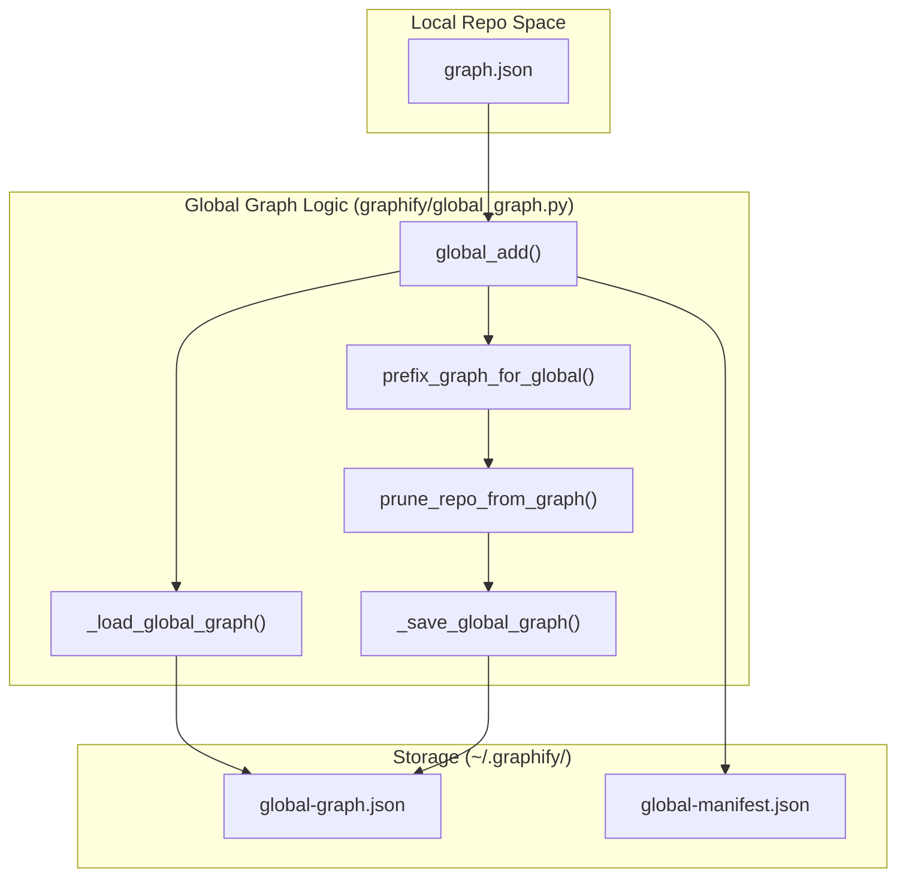
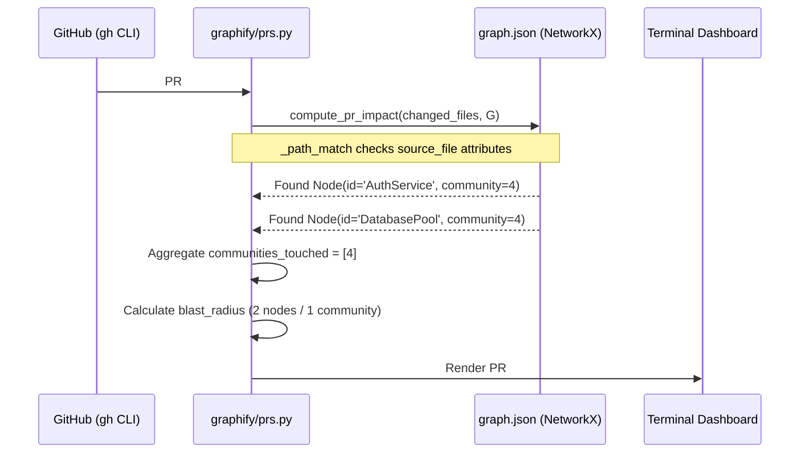

# PR Dashboard와 Global Graph

관련 소스 파일

다음 파일들은 이 위키 페이지를 생성하기 위한 컨텍스트로 사용되었습니다.

- [graphify/callflow_html.py](graphify/callflow_html.py)
- [graphify/diagnostics.py](graphify/diagnostics.py)
- [graphify/global_graph.py](graphify/global_graph.py)
- [graphify/multigraph_compat.py](graphify/multigraph_compat.py)
- [graphify/prs.py](graphify/prs.py)
- [tests/test_callflow_html.py](tests/test_callflow_html.py)
- [tests/test_global_graph.py](tests/test_global_graph.py)
- [tests/test_prs.py](tests/test_prs.py)

PR Dashboard와 Global Graph 모듈은 여러 pull requests와 여러 repositories 전반에 대한 상위 수준의 가시성을 제공한다. `graphify/prs.py`는 code changes를 graph communities에 매핑해 pull requests를 관리하는 graph-aware dashboard를 구현하며, `graphify/global_graph.py`는 사용자의 home directory에 저장되는 cross-repo knowledge graph를 관리한다.

## PR Dashboard (`graphify prs`)

`graphify prs` command는 GitHub PR metadata와 graph-based impact analysis를 통합한 terminal-based dashboard를 제공한다. 이를 통해 developers는 어떤 files가 변경되었는지만이 아니라 어떤 architectural communities가 영향을 받는지도 확인할 수 있다.

### Data Flow와 Classification
dashboard는 GitHub CLI(`gh`)에서 데이터를 가져오고 PRs를 action 가능한 states로 분류한다.

1.  **Fetch**: `fetch_prs`는 `gh pr list`를 호출해 CI status, review decisions, update timestamps를 포함한 JSON metadata를 가져온다 [graphify/prs.py:189-201](). target branch(예: `main` 또는 `v8`)를 결정하기 위해 `_detect_default_branch`를 사용한다 [graphify/prs.py:148-169]().
2.  **Classify**: 각 PR에는 `_classify`를 통해 status(예: `READY`, `CI-FAIL`, `STALE`, `WRONG-BASE`)가 할당된다 [graphify/prs.py:98-113](). CI status는 `_parse_ci`를 사용해 `statusCheckRollup`에서 추출 및 요약된다 [graphify/prs.py:175-186]().
3.  **Impact Analysis**: `graph.json`이 존재하면 `compute_pr_impact`가 PR의 changed files를 특정 graph nodes와 communities에 매핑한다 [graphify/prs.py:348-378]().

### Implementation Details
*   **Conflict Detection**: `--conflicts`를 사용하면 시스템은 동일한 graph communities를 "touch"하는 PRs를 식별하여, 직접적인 git line-conflicts가 없더라도 잠재적인 merge-order risks를 알린다 [graphify/prs.py:12-12]().
*   **Worktree Mapping**: `--worktrees` flag는 `fetch_worktrees`를 사용해 local git worktrees를 active branches와 해당 PRs에 매핑한다 [graphify/prs.py:284-311]().
*   **AI Triage**: `--triage` flag는 LLM(Opus)을 사용해 title, author, graph impact를 기준으로 review queue의 우선순위를 매긴다 [graphify/prs.py:10-10]().
*   **Impact Summary**: `PRInfo` dataclass는 변경의 "blast radius"를 계산하기 위해 `communities_touched`와 `nodes_affected`를 추적한다 [graphify/prs.py:57-90]().

### PR Impact Mapping Logic
이 시스템은 path matching을 사용해 "Git Space"(file paths)를 "Code Entity Space"(graph nodes)에 연결한다.

| Component | Logic | Source |
| :--- | :--- | :--- |
| **Path Matcher** | `_path_match`는 absolute paths와 relative paths를 처리하고, partial filename collisions를 피하기 위해 matches가 path boundaries에서 발생하도록 보장한다. | [graphify/prs.py:330-345]() |
| **Impact Calculator** | `compute_pr_impact`는 `G.nodes(data=True)`를 순회하면서 `source_file` attributes를 PR diffs와 match한다. | [graphify/prs.py:348-378]() |
| **Community Labels** | `build_community_labels`는 dashboard를 위한 사람이 읽을 수 있는 summaries로 community IDs를 aggregate한다. | [graphify/prs.py:381-396]() |

**출처:** [graphify/prs.py:1-400](), [tests/test_prs.py:1-210]()

---

## Global Graph (`graphify global`)

Global Graph subsystem을 통해 사용자는 여러 독립 project graphs를 `~/.graphify/global-graph.json`에 위치한 단일 unified graph로 aggregate할 수 있다. 이를 통해 cross-repo impact analysis와 shared dependency tracking이 가능해진다.

### Architecture와 Storage
global graph는 어떤 repositories가 indexed되었는지 추적하기 위해 manifest-based system을 사용한다.

*   **Global Directory**: `~/.graphify/`에 위치한다 [graphify/global_graph.py:10-10]().
*   **Global Manifest**: `global-manifest.json`은 redundant updates를 방지하기 위해 metadata, source paths, source graphs의 SHA256 hashes를 저장한다 [graphify/global_graph.py:12-21]().
*   **ID Namespacing**: 서로 다른 repos 간 collision을 방지하기 위해(예: 두 repos 모두 `utils.py`를 갖는 경우), `prefix_graph_for_global`은 모든 node ID 앞에 `repo_tag`를 붙이고(예: `repoA::node_id`) 원래 ID를 `local_id`에 저장한다 [graphify/global_graph.py:96-96](), [tests/test_global_graph.py:40-56]().

### Global Graph Operations
`graphify/global_graph.py` module은 cross-repo state를 관리하기 위한 core logic을 제공한다.

**출처:** [graphify/global_graph.py:29-155](), [tests/test_global_graph.py:40-90]()

### Key Functions
*   **`global_add(source_path, repo_tag)`**: local graph를 load하고, nodes에 namespace를 적용하며, `prune_repo_from_graph`를 통해 global graph에서 해당 tag의 기존 nodes를 prune한 뒤 새 data를 merge한다 [graphify/global_graph.py:58-133]().
*   **`global_remove(repo_tag)`**: `prune_repo_from_graph`를 사용해 특정 repository와 관련된 모든 nodes를 global storage에서 제거하고 manifest를 update한다 [graphify/global_graph.py:136-150]().
*   **`_file_hash(path)`**: 마지막 global update 이후 source graph가 변경되었는지 감지하기 위해 truncated SHA256 hash를 생성한다 [graphify/global_graph.py:52-55]().

### Entity Deduplication (Cross-Repo)
graphs를 merge할 때 `global_add`는 external library nodes의 deduplication을 수행한다. 여러 repositories가 동일한 external library(`source_file` attribute가 없는 nodes)에 의존하는 경우, 중복 library nodes로 global graph가 복잡해지는 것을 방지하기 위해 이 nodes를 `label` 기준으로 merge한다 [graphify/global_graph.py:102-111]().

**출처:** [graphify/global_graph.py:1-160](), [tests/test_global_graph.py:93-152]()

---

## Callflow HTML Export

`graphify export callflow-html` command는 codebase의 self-contained, dark-themed architectural overview를 생성한다. 이 command는 `graphify/callflow_html.py`를 활용해 `graph.json`, `GRAPH_REPORT.md`, community labels의 data를 합성한다.

### Export Pipeline
generation process는 graph data를 structured HTML document로 변환하기 위해 특정 sequence를 따른다.

1.  **Loading**: `load_graph`는 `graph.json` file을 읽고, `check_graph_file_size_cap`을 통해 security size cap을 강제한다 [graphify/callflow_html.py:173-188]().
2.  **Section Inference**: explicit sections가 제공되지 않으면 `derive_sections_from_communities`가 nodes를 community ID별로 group화하고 file path keywords(예: "extract", "export", "test")를 기반으로 section 이름을 지정하려고 시도한다 [graphify/callflow_html.py:157-171]().
3.  **Diagram Generation**: 시스템은 Mermaid.js flowcharts를 생성한다. architecture overview diagram은 sections 간 aggregated edges를 보여주고, per-section diagrams는 대표적인 intra-section calls를 보여준다 [graphify/callflow_html.py:9-10]().
4.  **Sanitization**: XSS를 방지하기 위해 labels와 content가 escape되어, graph 안의 `<script>` 같은 entities가 browser에서 실행되지 않도록 보장한다 [tests/test_callflow_html.py:67-68]().

### Visualization Components
*   **Mermaid Viewport**: zooming과 panning을 지원하는 Mermaid diagrams용 enhanced container [graphify/callflow_html.py:53-56]().
*   **Call Detail Tables**: functions, classes, endpoints를 각각의 sections에 mapping하기 위한 scaffolding [graphify/callflow_html.py:62-72]().
*   **Tagging System**: Nodes는 metadata를 기준으로 `tag-async`, `tag-class`, `tag-func` 등으로 시각적으로 tagged된다 [graphify/callflow_html.py:66-72]().

**출처:** [graphify/callflow_html.py:1-188](), [tests/test_callflow_html.py:1-188]()

---

## Technical Mapping: PR에서 Graph Entities까지

이 다이어그램은 Pull Request의 code change가 affected architectural communities와 nodes를 식별하기 위해 시스템을 통해 어떻게 mapping되는지 보여준다.

**출처:** [graphify/prs.py:57-90](), [graphify/prs.py:348-378](), [tests/test_prs.py:153-180]()
