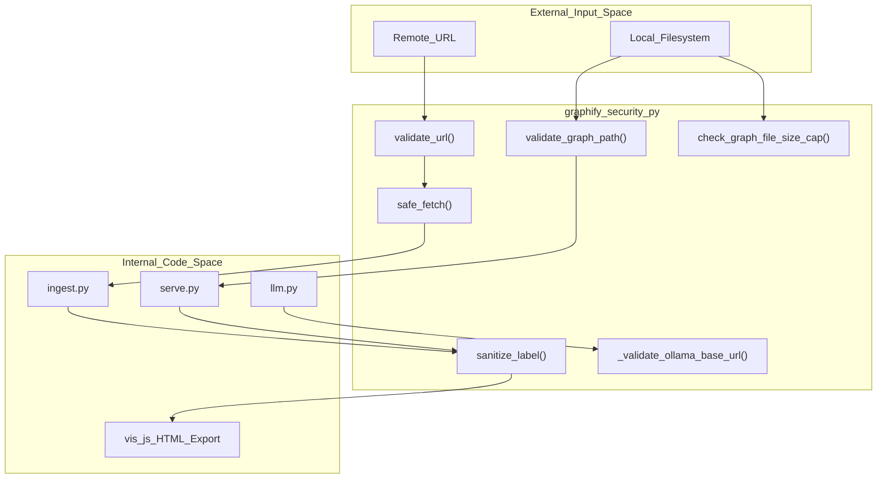
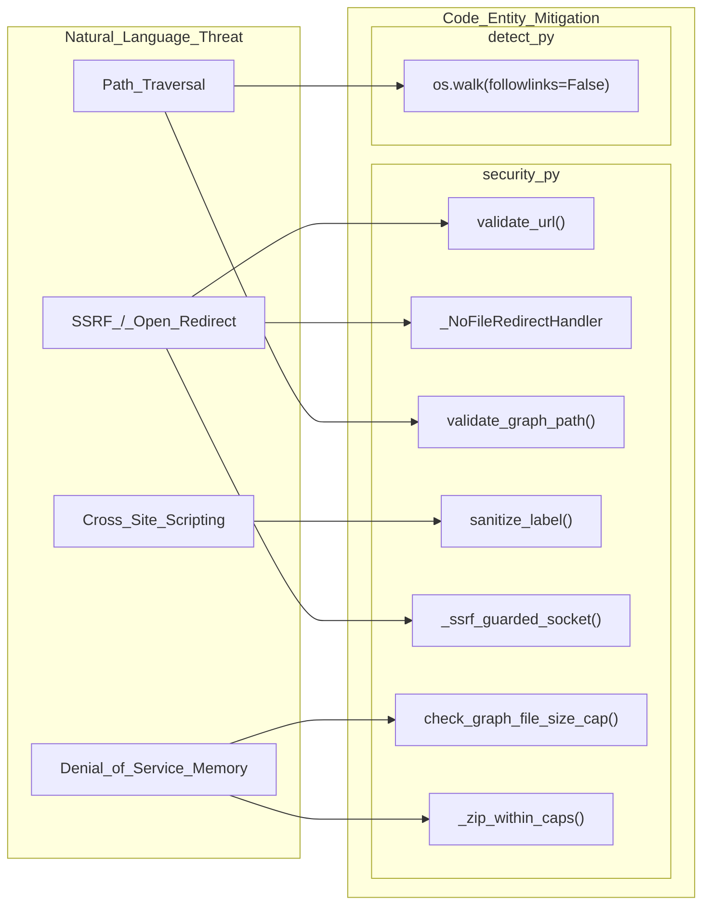

# Security Model

관련 소스 파일

다음 파일들은 이 위키 페이지를 생성하기 위한 컨텍스트로 사용되었습니다.

- [SECURITY.md](SECURITY.md)
- [graphify/security.py](graphify/security.py)
- [tests/test_cache.py](tests/test_cache.py)
- [tests/test_security.py](tests/test_security.py)

`graphify`는 **local development tool**로 설계되었다 [SECURITY.md:25-25](). 주로 Claude Code skill 또는 local MCP stdio server로 동작하므로 network listener를 실행하지 않으며, standard input/output을 통해서만 통신한다 [SECURITY.md:44-44]().

security architecture는 세 가지 주요 영역에 초점을 맞춘다. path traversal로부터 local filesystem을 보호하고, optional ingestion 중 Server-Side Request Forgery(SSRF)를 방지하며, graph visualizations와 LLM contexts가 Cross-Site Scripting(XSS) 또는 prompt injection으로부터 안전하도록 보장하는 것이다.

## Threat Surface와 Mitigations

다음 표는 주요 attack vectors와 `graphify/security.py`에 구현된 대응 mitigations를 요약한다.

| Vector | Mitigation | Code Entity |
| :--- | :--- | :--- |
| **SSRF via URL fetch** | Scheme allowlist(http/https), private/cloud IPs 차단, redirect 재검증. | `validate_url` [graphify/security.py:42-86](), `_NoFileRedirectHandler` [graphify/security.py:120-129]() |
| **Resource Exhaustion** | download sizes에 대한 hard caps(50MB binary / 10MB text)와 JSON memory-bomb 보호. | `_MAX_FETCH_BYTES` [graphify/security.py:18-18](), `_MAX_GRAPH_FILE_BYTES` [graphify/security.py:25-25]() |
| **Path Traversal** | path resolution과 `graphify-out/` boundary 강제. | `validate_graph_path` [graphify/security.py:244-273]() |
| **XSS / Prompt Injection** | control character 제거, length capping, metadata sanitization. | `sanitize_label` [graphify/security.py:276-292](), `sanitize_metadata` [graphify/security.py:302-315]() |
| **Symlink Attacks** | file discovery 중 link following을 명시적으로 비활성화. | `os.walk(..., followlinks=False)` [SECURITY.md:39-39]() |
| **Ollama SSRF** | Ollama backends에 대해 link-local과 cloud metadata addresses 차단. | `_validate_ollama_base_url` [graphify/security.py:328-348]() |
| **Local Provider Hijack** | Project-local `providers.json`은 더 이상 opt-in 없이 auto-loaded되지 않음. | `GRAPHIFY_ALLOW_LOCAL_PROVIDERS` [graphify/security.py:320-325]() |

### Security Architecture Overview
다음 다이어그램은 external inputs(URLs/Files)와 internal graph representation 사이에 security guards가 어떻게 배치되는지 보여준다.

**Security Guard Placement**

**출처:** [graphify/security.py:1-348](), [SECURITY.md:23-41]()

## URL Validation과 Safe Fetch

사용자가 URL ingestion(예: tweet, arXiv paper, YouTube video)을 명시적으로 요청하면 `graphify`는 content를 가져오기 위해 `safe_fetch`를 사용한다. 여기에는 multi-layered defenses가 적용된다.
1.  **Scheme Validation**: `http`와 `https`만 허용된다 [graphify/security.py:51-55]().
2.  **IP/Host Blocking**: private/reserved IP ranges(127.x, 10.x 등)와 cloud metadata endpoints(예: `metadata.google.internal`)로의 requests를 차단한다 [graphify/security.py:59-80]().
3.  **DNS Rebinding Protection**: `_ssrf_guarded_socket` context manager는 fetch 중 resolve되는 모든 IP를 validate하도록 `socket.getaddrinfo`를 patch하여 TOCTOU attacks를 방지한다 [graphify/security.py:89-118]().
4.  **Redirect Protection**: `_NoFileRedirectHandler`는 malicious server가 `http` request를 local `file://` resource로 redirect할 수 없도록 보장한다 [graphify/security.py:120-129]().
5.  **Streaming Size Limits**: data는 chunks 단위로 읽히며, total이 hard cap(binary는 50MB [graphify/security.py:18-18](), text는 10MB [graphify/security.py:19-19]())을 초과하면 process가 abort된다 [graphify/security.py:175-178]().
6.  **Ollama Guard**: Ollama의 Base URLs는 cloud metadata에 흔히 사용되는 link-local addresses(169.254.169.254)에 대한 SSRF를 방지하기 위해 validate된다 [graphify/security.py:328-348]().

자세한 내용은 [URL Validation & Safe Fetch](#5.1)를 참조하라.

## Path와 Label Safety

`graphify`는 authorized files와만 상호작용하고 outputs가 browsers 또는 LLM contexts에 표시하기에 안전하도록 보장한다.

*   **Path Traversal**: `validate_graph_path`는 제공된 paths를 resolve하고 그것들이 `graphify-out/` directory 안에 있는지 verify한다 [graphify/security.py:244-273](). 또한 graph가 build되기 전에 tool이 files를 읽도록 속이는 것을 방지하기 위해, reads를 허용하기 전에 base directory가 존재할 것을 요구한다 [graphify/security.py:252-253]().
*   **Sanitization**: `sanitize_label`은 node labels와 edge titles에 적용된다 [graphify/security.py:276-292](). control characters를 제거하고 length를 256 characters로 제한한다 [graphify/security.py:282-285](). 이는 user-controlled source code names가 `serve.py`에서 agents에게 반환되는 text format이나 interactive `vis.js` visualizations를 깨뜨리는 것을 방지한다 [SECURITY.md:35-36]().
*   **Memory Protection**: large JSON graphs를 parsing하기 전에 `check_graph_file_size_cap`은 memory exhaustion을 방지하기 위해 file size를 `_MAX_GRAPH_FILE_BYTES`(512 MiB)와 비교해 verify한다 [graphify/security.py:21-25](), [graphify/security.py:231-241]().
*   **Logic Guards**: 이 시스템에는 Office files를 위한 zip-bomb protection과 DOCTYPE/ENTITY 기반 Denial of Service attacks를 방지하기 위한 XML files pre-screening이 포함된다 [graphify/security.py:351-384]().

자세한 내용은 [Path Traversal & Label Sanitization](#5.2)를 참조하라.

### Code Entity Association: Security Implementation
이 다이어그램은 security concepts를 이를 enforce하는 특정 functions와 files에 매핑한다.

**Security Logic Mapping**

**출처:** [graphify/security.py:42-384](), [SECURITY.md:29-41]()

## Explicit Non-Goals

최소한의 security footprint를 유지하기 위해 `graphify`는 여러 위험한 patterns를 명시적으로 피한다.
*   **No Code Execution**: `graphify`는 ASTs를 parse하기 위해 `tree-sitter`를 사용하며, `eval()`, `exec()`를 사용하거나 분석하는 source code를 import하지 않는다 [SECURITY.md:45-45]().
*   **No Shell Invocations**: command injection을 방지하기 위해 Subprocess calls는 `shell=True`를 피한다 [SECURITY.md:46-46]().
*   **No Network Listening**: 이 시스템은 ports를 열지 않으며, communication은 stdio를 통해 strictly local로 이루어진다 [SECURITY.md:44-44]().
*   **No Credential Storage**: 이 tool은 API keys나 secrets를 manage하거나 store하지 않는다 [SECURITY.md:47-47]().

**출처:** [SECURITY.md:42-48](), [graphify/security.py:1-384]()
