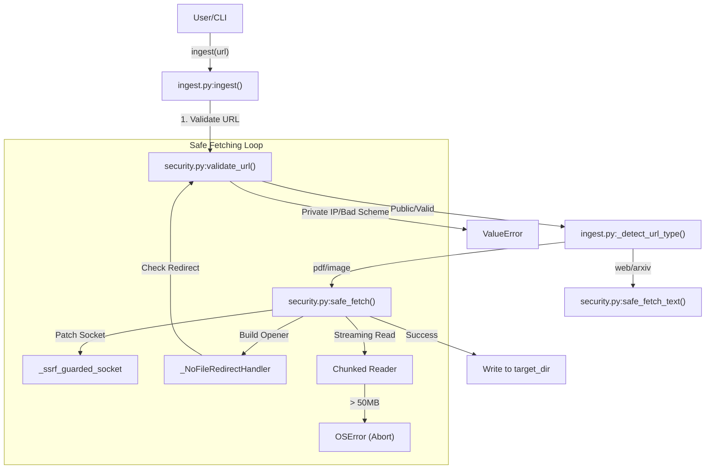
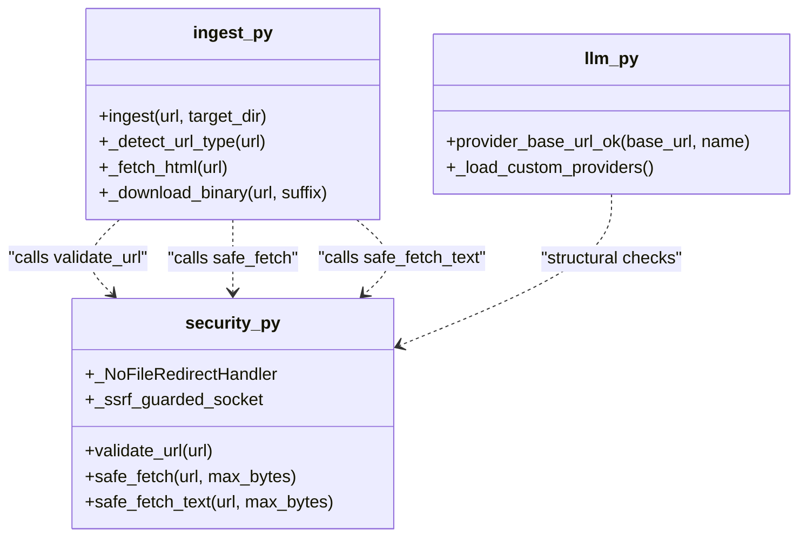

# URL Validation과 Safe Fetch

관련 소스 파일

다음 파일들은 이 위키 페이지를 생성하기 위한 컨텍스트로 사용되었습니다.

- [graphify/benchmark.py](graphify/benchmark.py)
- [graphify/ingest.py](graphify/ingest.py)
- [graphify/llm.py](graphify/llm.py)
- [graphify/security.py](graphify/security.py)
- [graphify/serve.py](graphify/serve.py)
- [tests/test_benchmark.py](tests/test_benchmark.py)
- [tests/test_cache.py](tests/test_cache.py)
- [tests/test_claude_cli_backend.py](tests/test_claude_cli_backend.py)
- [tests/test_llm_backends.py](tests/test_llm_backends.py)
- [tests/test_provider_registry.py](tests/test_provider_registry.py)
- [tests/test_security.py](tests/test_security.py)
- [tests/test_serve.py](tests/test_serve.py)

이 섹션은 external content와 provider configurations를 안전하게 처리하기 위해 `graphify`에 구현된 security mechanisms를 자세히 설명한다. `graphify`는 기본적으로 local development tool이지만, `ingest` command와 LLM backend integrations에는 Server-Side Request Forgery(SSRF), resource exhaustion, data exfiltration에 대한 강력한 보호가 필요하다.

### URL Validation과 SSRF Protection

모든 external requests는 엄격한 protocol allowlist와 destination checks를 강제하는 `validate_url()`의 관리를 받는다 [graphify/security.py:42-86]().

- **Protocol Allowlist:** `http`와 `https` schemes만 처리된다. `graphify`는 local file access나 protocol smuggling을 방지하기 위해 `file://`, `ftp://`, `data:` 및 기타 schemes를 명시적으로 차단한다 [graphify/security.py:17](), [graphify/security.py:51-55]().
- **Cloud Metadata Blocking:** cloud environments에서 SSRF를 방지하기 위해 `metadata.google.internal`, `metadata.google.com` 같은 hostnames를 명시적으로 차단한다 [graphify/security.py:28](), [graphify/security.py:60-64]().
- **Private IP Guard:** `validate_url()`은 `socket.getaddrinfo`를 사용해 hostnames를 resolve하고 결과 IP addresses를 검사한다 [graphify/security.py:68-71](). private, reserved, loopback(127.0.0.1), link-local(169.254.x.x), Shared Address Space(CGN) ranges로의 requests를 차단한다 [graphify/security.py:31](), [graphify/security.py:76-80]().
- **NAT64 Handling:** IPv6 environments에서 `graphify`는 NAT64 Well-Known Prefixes를 감지하고 embedded IPv4 address를 validate하여 private range를 대상으로 하지 않는지 확인한다 [graphify/security.py:35](), [graphify/security.py:73-75]().
- **DNS Rebinding Protection:** `_ssrf_guarded_socket` context manager는 fetch가 진행되는 동안 `socket.getaddrinfo`를 patch한다 [graphify/security.py:89-118](). 이를 통해 실제 connection attempt 중 resolve되는 모든 IP가 validate되도록 하여 Time-of-Check to Time-of-Use(TOCTOU) window를 닫는다 [graphify/security.py:99-111]().
- **Redirect Security:** 유효한 URL이 제한된 local resource로 redirect되는 "open-redirect" attacks를 방지하기 위해 `graphify`는 custom `_NoFileRedirectHandler`를 사용한다 [graphify/security.py:120-130](). 이 handler는 모든 redirect를 가로채고 client가 따라가기 전에 `validate_url()`을 사용해 `newurl`을 다시 validate한다 [graphify/security.py:127-129]().

| Component | Responsibility |
| :--- | :--- |
| `_ALLOWED_SCHEMES` | `{"http", "https"}`를 포함하는 set [graphify/security.py:17](). |
| `_BLOCKED_HOSTS` | `metadata.google.com` 같은 cloud metadata endpoints [graphify/security.py:28](). |
| `validate_url()` | 허용되지 않는 schemes 또는 internal IP ranges에 대해 `ValueError`를 발생시킨다 [graphify/security.py:42-86](). |
| `_ssrf_guarded_socket` | socket resolution을 patch하여 DNS rebinding을 방지하는 context manager [graphify/security.py:89-118](). |
| `_NoFileRedirectHandler` | redirects에서 re-validation을 강제하는 `urllib.request.HTTPRedirectHandler` subclass [graphify/security.py:120-130](). |

**출처:** [graphify/security.py:17-130]()

---

### Safe Fetching Implementation

`safe_fetch()`와 `safe_fetch_text()` functions는 내장 resource limits가 있는 core fetching logic을 제공한다.

#### Resource Constraints
- **Binary Cap:** Downloads(PDFs, images)는 50 MB(`_MAX_FETCH_BYTES`)로 제한된다 [graphify/security.py:18]().
- **Text Cap:** HTML과 text content는 10 MB(`_MAX_TEXT_BYTES`)로 제한된다 [graphify/security.py:19]().
- **Streaming Read:** `safe_fetch()`는 response를 64 KB chunks로 읽는다 [graphify/security.py:170](). 누적 size가 limit을 초과하면, full payload를 memory에 load하는 대신 `OSError`를 발생시키고 connection을 즉시 abort한다 [graphify/security.py:175-179]().
- **Graph Load Cap:** 기존 `graph.json` files를 load할 때 JSON parsing 중 memory-bomb attacks를 방지하기 위해 별도의 512 MiB limit(`_MAX_GRAPH_FILE_BYTES`)이 적용된다 [graphify/security.py:25]().

#### Error Handling
`safe_fetch()`는 HTTP status code를 명시적으로 확인한다. `200-299` 범위 밖의 status는 `urllib.error.HTTPError`를 trigger하여 error pages가 valid content로 취급되지 않도록 보장한다 [graphify/security.py:164-165]().

#### URL Ingestion Flow
다음 다이어그램은 사용자가 URL을 요청할 때 `ingest.py`가 이 security guards를 어떻게 활용하는지 보여준다.

**URL Ingestion Security Flow**

**출처:** [graphify/ingest.py:10](), [graphify/ingest.py:181-204](), [graphify/security.py:140-181]()

---

### LLM Backend Security와 Ollama Guard

`llm.py` module은 AI providers와의 interactions를 처리하며 custom 및 local endpoints에 대한 특정 guards를 포함한다.

- **Ollama SSRF Guard:** `_validate_ollama_base_url` function(backend initialization 중 사용됨)은 Ollama configurations가 link-local 또는 cloud metadata addresses(예: `169.254.169.254`)를 대상으로 하지 못하게 한다 [graphify/llm.py:65-72]().
- **Custom Provider Safety:** custom providers를 load할 때 `provider_base_url_ok()`는 structural check를 수행한다. non-`http(s)` schemes를 reject하고, corpus/key exfiltration을 방지하기 위해 non-loopback hosts에 plaintext `http`가 사용되면 warn한다 [graphify/llm.py:128-162]().
- **Project-Local Providers (0.8.29 Fix):** malicious repositories가 LLM requests를 hijack하는 것을 방지하기 위해 `graphify`는 더 이상 project-local `.graphify/providers.json` files를 auto-load하지 않는다 [graphify/llm.py:165-171](). 사용자는 environment variable `GRAPHIFY_ALLOW_LOCAL_PROVIDERS=1`을 설정해 명시적으로 opt-in해야 한다 [graphify/llm.py:170]().

**출처:** [graphify/llm.py:65-171]()

---

### `ingest.py`에서의 통합

`ingest` module은 security helpers의 primary consumer 역할을 한다. URL을 types로 classify하고 적절한 fetcher를 선택한다 [graphify/ingest.py:64-81]().

- **Binary Assets:** `pdf`와 `image` types에 대해 `_download_binary`는 `safe_fetch()`를 호출한다 [graphify/ingest.py:173-178]().
- **HTML Content:** webpages와 arXiv abstracts에 대해 `_fetch_html`은 `safe_fetch_text()`를 호출한다 [graphify/ingest.py:84-85](). 결과 string은 `replace` error handler를 사용해 `UTF-8`로 decode된다 [graphify/security.py:192]().
- **Specialized Fetching:** Tweet ingestion은 Twitter oEmbed API를 query하기 위해 `safe_fetch_text()`를 사용한다 [graphify/ingest.py:109]().

**Entity Relationship: Ingestion to Security**

**출처:** [graphify/ingest.py:10](), [graphify/security.py:42-192](), [graphify/llm.py:128-171]()

### Data Flow Table

| Action | Function | Security Guard | Limit / Logic |
| :--- | :--- | :--- | :--- |
| Initial URL Check | `ingest()` | `validate_url()` | Protocol & IP allowlist [graphify/security.py:42]() |
| DNS Rebinding Guard | `safe_fetch()` | `_ssrf_guarded_socket` | Per-connection IP validation [graphify/security.py:160]() |
| Following Redirects | `_build_opener()` | `_NoFileRedirectHandler` | Recursive validation [graphify/security.py:127]() |
| Fetching PDF/Image | `_download_binary()` | `safe_fetch()` | 50 MB Hard Cap [graphify/security.py:18]() |
| Fetching Webpage | `_fetch_html()` | `safe_fetch_text()` | 10 MB Hard Cap [graphify/security.py:19]() |
| Local Config Load | `_load_custom_providers()` | `GRAPHIFY_ALLOW_LOCAL_PROVIDERS` | project-local files에는 opt-in 필요 [graphify/llm.py:170]() |

**출처:** [graphify/ingest.py:84-204](), [graphify/security.py:17-192](), [graphify/llm.py:165-171]()
