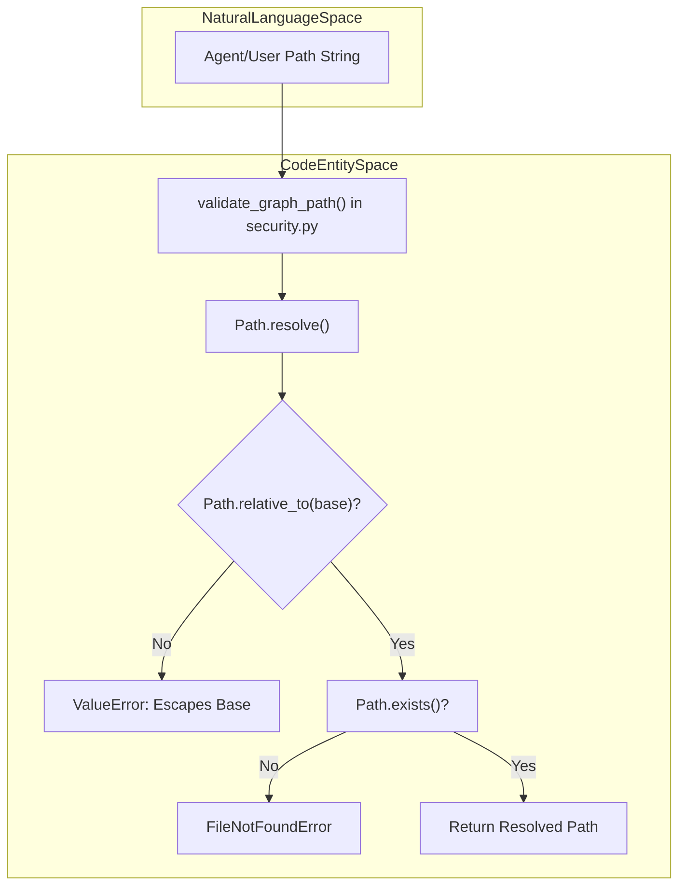
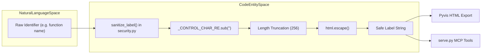

# Path Traversal과 Label Sanitization

관련 소스 파일

다음 파일들은 이 위키 페이지를 생성하기 위한 컨텍스트로 사용되었습니다.

- [graphify/detect.py](graphify/detect.py)
- [graphify/extract.py](graphify/extract.py)
- [graphify/security.py](graphify/security.py)
- [tests/test_cache.py](tests/test_cache.py)
- [tests/test_security.py](tests/test_security.py)

이 섹션은 graphify가 안전한 local development tool로 유지되도록 구현된 security mechanisms를 자세히 설명한다. 이 시스템은 directory traversal을 방지하기 위한 엄격한 path validation, XSS와 prompt injection을 완화하기 위한 강력한 label sanitization, symlink-based attacks에 대한 filesystem protections, project file parsing과 semantic fragment validation을 위한 execution guards를 사용한다.

## Path Traversal Prevention

unauthorized file access에 대한 기본 방어는 `validate_graph_path()`이다. 이 function은 시스템이 시작한 모든 file operation(특히 MCP server 또는 export modules를 통한 작업)이 지정된 output directory로 제한되도록 보장한다.

### Implementation Details
`graphify/security.py`의 validation logic은 "resolve and compare" strategy를 따른다.
1.  **Base Enforcement**: allowed base의 기본값을 현재 working directory 기준 `graphify-out` directory로 설정한다 [graphify/security.py:236-240]().
2.  **Existence Check**: 진행하기 전에 base directory가 존재하는지 verify하여, graph가 build되기 전에 callers가 시스템을 속여 files를 읽게 하는 것을 방지한다 [graphify/security.py:241-245]().
3.  **Resolution**: `..` segments를 neutralize하기 위해 base와 target path 모두 `.resolve()`를 사용해 absolute paths로 변환된다 [graphify/security.py:248-250]().
4.  **Relative Verification**: target이 base 안에 있는지 확인하기 위해 `Path.relative_to(base)`를 사용한다. path가 base를 벗어나면 `ValueError`가 발생한다 [graphify/security.py:252-258]().

### MCP Server에서의 Usage
`serve.py`의 `_load_graph` function은 Model Context Protocol(MCP) client가 요청한 JSON graph file이 legitimate하고 allowed output directory 안에 있는지 보장하기 위해 이 guard를 사용한다 [graphify/serve.py:143-154]().

### Symlink Protection
`detect.py`의 initial file discovery phase 중 시스템은 directory walking utilities에 `followlinks=True`를 전달하지 않음으로써 symlink following을 명시적으로 비활성화한다. 이를 통해 graph builder가 project root 안에 연결된 sensitive system directories나 external volumes로 우발적으로 traverse하지 않도록 보장한다 [graphify/detect.py:237-237]().

**Path Validation Data Flow**
"이 다이어그램은 user 또는 agent의 file path string이 security.py에서 filesystem boundaries를 기준으로 어떻게 validate되는지 보여준다."

출처: [graphify/security.py:236-263](), [graphify/serve.py:143-154](), [graphify/detect.py:237-237]().

## Label Sanitization

Label sanitization은 두 가지 이유로 중요하다. interactive HTML visualizations에서 Cross-Site Scripting(XSS)을 방지하고, node data가 LLM agents에 반환될 때 prompt injection이나 formatting breakage를 방지하기 위해서다.

### `sanitize_label()` Function
모든 node labels와 edge titles는 export되거나 served되기 전에 `sanitize_label()`을 거친다 [graphify/security.py:274-286]().

| Transformation | Implementation | Purpose |
| :--- | :--- | :--- |
| **Control Char Stripping** | `re.compile(r"[\x00-\x1f\x7f]")` | JSON 또는 HTML을 깨뜨리는 null bytes와 non-printable chars를 제거한다 [graphify/security.py:270-279](). |
| **Length Capping** | `_MAX_LABEL_LEN = 256` | buffer issues 또는 visual clutter를 방지하기 위해 labels를 256 characters로 truncate한다 [graphify/security.py:271-281](). |
| **HTML Escaping** | `html.escape(text)` | `vis.js` output에서 XSS를 방지하기 위해 `<`, `>`, `&`, `"`, `'`를 entities로 변환한다 [graphify/security.py:282-282](). |

### Security Impact
*   **XSS Prevention**: 악성 code comments 또는 function names(예: ``)는 browser에서 실행되지 않고 HTML visualization에서 plain text로 render된다 [graphify/security.py:282-282]().
*   **Prompt Integrity**: Sanitization은 user-controlled source files의 node labels가 MCP server를 통해 agents에게 반환되는 text format을 깨뜨리지 못하도록 보장한다 [graphify/security.py:279-281]().
*   **Metadata Cleaning**: `sanitize_metadata` function은 dictionaries를 recursively clean하여 nodes와 연결된 metadata(예: descriptions 또는 paths)가 length limits를 준수하고 control characters를 포함하지 않도록 보장한다 [graphify/security.py:293-315]().

**Sanitization Pipeline**
"이 다이어그램은 raw source code identifiers가 safe UI/Agent strings로 transformation되는 과정을 매핑한다."

출처: [graphify/security.py:270-286](), [graphify/security.py:293-315]().

## XML과 Project File Protection

`.csproj`(C#) 또는 Lazarus package files를 처리할 때 graphify는 XML-based Denial of Service(Billion Laughs attack)를 방지하기 위해 pre-screening을 구현한다.

### XML DoS Prevention
`.csproj`와 Lazarus packages의 extractors는 parsing 전에 악성 XML patterns를 확인한다.
*   **Pre-screening**: `extract.py`의 `extract_csproj`, `extract_lazarus_package` 같은 functions는 raw file text에서 `<!DOCTYPE` 또는 `<!ENTITY` tags를 scan한다.
*   **Rejection**: 이 tags가 발견되면 extractor는 XML parser가 recursive entities를 expand하지 못하도록 `ValueError`를 발생시킨다 [graphify/extract.py:1652-1657](), [graphify/extract.py:1754-1759]().

## Semantic Validation Limits

`semantic_cleanup.py` module은 memory exhaustion과 graph bloating을 방지하기 위해 LLM-generated semantic fragments에 strict limits를 강제한다.

| Constraint | Limit | Purpose |
| :--- | :--- | :--- |
| **Fragment Bytes** | `MAX_SEMANTIC_FRAGMENT_BYTES = 65536` | 단일 LLM-generated fragment의 raw size를 제한한다 [graphify/semantic_cleanup.py:21-21](). |
| **Fragment Nodes** | `MAX_SEMANTIC_FRAGMENT_NODES = 100` | 단일 file이 oversized semantic subgraph를 생성하지 못하게 한다 [graphify/semantic_cleanup.py:22-22](). |
| **ID Length** | `MAX_SEMANTIC_ID_LENGTH = 128` | semantic node IDs의 length를 제한한다 [graphify/semantic_cleanup.py:23-23](). |
| **ID Format** | `_SEMANTIC_ID_RE` | query strings에서 injection을 방지하기 위해 alphanumeric/underscore IDs를 강제한다 [graphify/semantic_cleanup.py:24-24](). |

## Git Hook Execution Safety

`graphify hook install`이 실행되면 `post-commit`과 `post-checkout` events를 위한 shell scripts가 설정된다. 이 scripts에는 built-in security constraints가 있는 robust Python interpreter detection block이 포함된다 [graphify/hooks.py:34-72]().

### Shebang Allowlist in Discovery
file detection 중 `graphify`는 extensionless files의 shebang line을 통해 valid code interpreters를 식별하기 위해 allowlist를 사용한다. 이는 시스템이 arbitrary binaries를 code로 잘못 classify하거나 처리하려는 시도를 방지한다 [graphify/detect.py:87-92]().

allowlist에는 `python`, `node`, `ruby`, `perl`, `bash`, `lua`, `php` 같은 standard interpreters가 포함된다 [graphify/detect.py:88-91](). shebang이 감지되었지만 interpreter가 `_SHEBANG_CODE_INTERPRETERS` set에 없으면, 해당 file은 `FileType.CODE`로 classify되지 않는다 [graphify/detect.py:110-113]().

## Office File과 Zip-Bomb Protection

Out-of-Memory(OOM) crashes를 유발하도록 설계되었을 수 있는 악성 `.docx` 또는 `.xlsx` files로부터 보호하기 위해, `detect.py`는 `_zip_within_caps()`에서 two-layer validation strategy를 구현한다 [graphify/detect.py:57-92]().

1.  **Pre-filter**: zip central directory에 선언된 sizes를 `_OFFICE_MAX_DECOMPRESSED_BYTES`(512 MiB) 및 `_OFFICE_MAX_COMPRESSION_RATIO`(200:1)와 비교해 확인한다 [graphify/detect.py:76-79]().
2.  **Authoritative Pass**: bounded stream-decompression을 수행한다. 실제 uncompressed data가 512 MiB ceiling을 초과하면 file이 reject된다 [graphify/detect.py:81-89]().

## Guards 요약

다음 표는 paths와 labels에 적용되는 security constraints를 요약한다.

| Feature | Limit / Constraint | File Reference |
| :--- | :--- | :--- |
| **Graph Base** | `graphify-out/`이어야 함 | [graphify/security.py:236-240]() |
| **Max Fetch Size** | 50 MB(binary), 10 MB(text) | [graphify/security.py:18-19]() |
| **Label Length** | 256 characters | [graphify/security.py:271-271]() |
| **Control Characters** | Range `\x00-\x1f` and `\x7f` stripped | [graphify/security.py:270-270]() |
| **URL Schemes** | `http`, `https` only | [graphify/security.py:17-17]() |
| **XML Security** | DOCTYPE/ENTITY를 reject | [graphify/extract.py:1652-1657]() |
| **Zip-Bomb Guard** | 512 MB decompressed / 200:1 ratio | [graphify/detect.py:45-46]() |

출처: [graphify/security.py:1-315](), [graphify/detect.py:45-113](), [graphify/extract.py:1652-1759](), [graphify/semantic_cleanup.py:21-24]().
