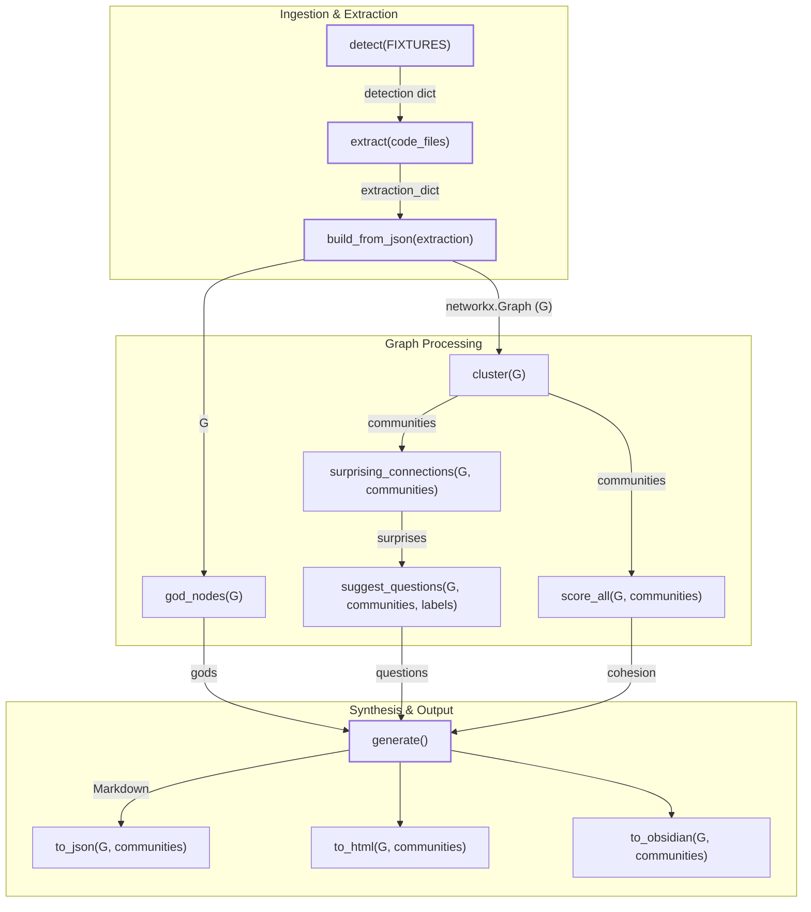
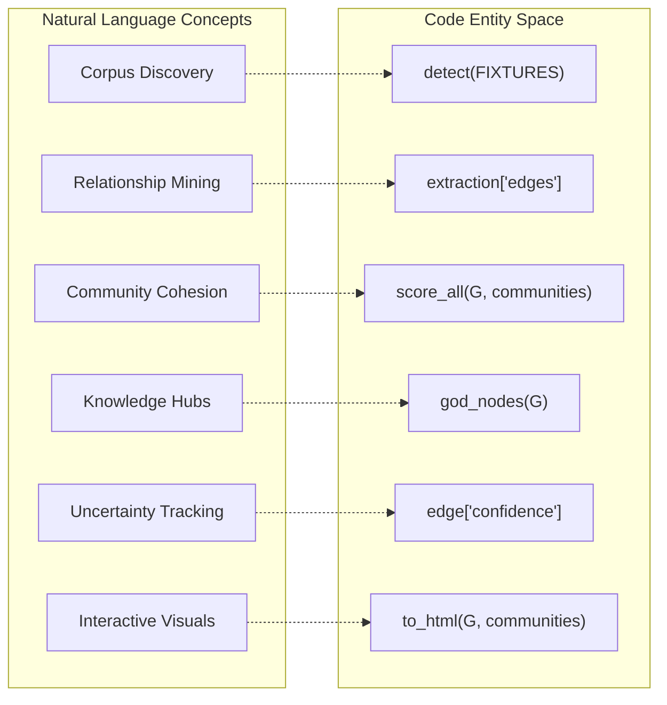

# End-to-End Pipeline Test

관련 소스 파일

다음 파일들은 이 위키 페이지를 생성하기 위한 컨텍스트로 사용되었습니다.

- [tests/test_incremental.py](tests/test_incremental.py)
- [tests/test_pipeline.py](tests/test_pipeline.py)

end-to-end(E2E) pipeline test는 file detection부터 final export까지 `graphify` system의 아홉 가지 주요 stages가 하나의 응집된 단위로 동작하는지 보장한다. 주로 `tests/test_pipeline.py`에 위치한 이 test suite는 modules 간 data flow를 validate하고 개별 unit tests가 놓칠 수 있는 regressions를 포착한다.

### Purpose와 Scope
E2E test의 주요 목표는 external LLM calls 없이 linear pipeline의 integration을 verify하는 것이다. local AST-based extraction과 static fixtures를 사용해 real-world execution environment를 simulate한다. pipeline은 엄격한 sequence를 따른다.
1.  **Detection**: `detect()`를 사용해 corpus의 files를 식별한다.
2.  **Extraction**: `extract()`를 통해 structure(AST)와 metadata를 parse한다.
3.  **Build**: `build_from_json()`으로 `networkx.Graph`를 구성한다.
4.  **Cluster**: `cluster()`로 Leiden community detection을 수행한다.
5.  **Analyze**: god nodes, surprising connections, suggested questions를 식별한다.
6.  **Report**: `generate()`를 사용해 `GRAPH_REPORT.md` summary를 생성한다.
7.  **Export**: JSON, HTML, Obsidian vault outputs를 생성한다.

출처: [tests/test_pipeline.py:1-19](), [graphify/detect.py:12-12](), [graphify/extract.py:13-13](), [graphify/build.py:14-14](), [graphify/cluster.py:15-15](), [graphify/analyze.py:16-16](), [graphify/report.py:17-17](), [graphify/export.py:18-18]()

---

### `run_pipeline()` Helper
E2E suite의 핵심은 `run_pipeline()` function이다 [tests/test_pipeline.py:23-104](). 이 helper는 `FIXTURES` directory에서 전체 workflow를 실행하고 [tests/test_pipeline.py:20-20](), 특정 test cases의 assertion을 위해 각 stage의 state를 담은 dictionary를 반환한다.

#### Pipeline Execution Flow
다음 다이어그램은 `run_pipeline()`의 logical stages를 호출되는 특정 functions 및 modules에 매핑한다.

**Pipeline Data Flow (Code Entity Space)**

출처: [tests/test_pipeline.py:23-104](), [graphify/detect.py:12-12](), [graphify/extract.py:13-13](), [graphify/build.py:14-14](), [graphify/cluster.py:15-15](), [graphify/analyze.py:16-16](), [graphify/report.py:17-17](), [graphify/export.py:18-18]()

#### Key Implementation Details
*   **Detection Verification**: test는 `detect()`가 `tests/fixtures` directory 안의 files를 찾는지 보장한다 [tests/test_pipeline.py:26-30]().
*   **AST Extraction**: `extract()`는 LLM intervention 없이 nodes와 edges를 생성하기 위해 code files에 대해 호출된다 [tests/test_pipeline.py:34-36]().
*   **Clustering Metrics**: pipeline은 `score_all()`이 모든 community에 대해 0.0과 1.0 사이의 cohesion score를 생성하는지 validate한다 [tests/test_pipeline.py:46-49]().
*   **Analysis Integrity**: `god_nodes()`는 "id"와 "degree"를 모두 포함하는 objects를 반환해야 한다 [tests/test_pipeline.py:52-54]().
*   **Export Artifacts**: test는 `graph.json`, `graph.html`(`vis-network` markers 포함), `.obsidian` configuration directory가 실제로 존재하는지 verify한다 [tests/test_pipeline.py:71-92]().

---

### Test Cases와 Assertions

suite에는 graph integrity, community assignment, idempotency를 verify하기 위한 specialized test cases가 포함되어 있다.

| Test Case | Objective | Logic |
| :--- | :--- | :--- |
| `test_pipeline_all_nodes_have_community` | Graph Integrity | `G.nodes()`를 순회해 모든 node가 `communities` mapping에 존재하는지 보장한다 [tests/test_pipeline.py:117-124](). |
| `test_pipeline_incremental_update` | Idempotency | 동일한 `tmp_path`에서 pipeline을 두 번 실행한다. node와 edge counts가 동일하게 유지되는지 assert한다 [tests/test_pipeline.py:138-144](). |
| `test_pipeline_extraction_confidence_labels` | Schema Validation | extraction output의 모든 edge가 `EXTRACTED`, `INFERRED`, `AMBIGUOUS` 중 하나의 confidence label을 갖는지 확인한다 [tests/test_pipeline.py:146-152](). |
| `test_pipeline_no_self_loops` | Graph Topology | source와 target이 같은 edge가 존재하지 않는지(`u != v`) validate한다 [tests/test_pipeline.py:154-159](). |
| `test_pipeline_report_mentions_top_god_node` | Reporting | primary god node의 label이 generated Markdown report에 언급되는지 verify한다 [tests/test_pipeline.py:126-130](). |

출처: [tests/test_pipeline.py:107-159]()

---

### Incremental과 Manifest Behavior
`tests/test_incremental.py`의 특정 integration tests는 `manifest.json`이 존재할 때 pipeline이 어떻게 동작하는지 다룬다. 이 tests는 `subprocess`를 사용해 현재 Python interpreter를 통해 `graphify` module을 실행한다 [tests/test_incremental.py:11-32]().

*   **Manifest Writing**: extraction이 실패하면(예: LLM keys 누락) pipeline은 `manifest.json`을 작성해서는 안 된다 [tests/test_incremental.py:43-51]().
*   **Incremental Detection**: `graphify-out/`에 `manifest.json`과 `graph.json`이 모두 존재하면 system은 "incremental" mode message를 trigger한다 [tests/test_incremental.py:54-63]().
*   **Full Scan**: manifest가 없으면 system은 기본적으로 full scan을 수행하고 incremental mode를 보고하지 않는다 [tests/test_incremental.py:66-74]().

출처: [tests/test_incremental.py:11-75]()

---

### Data Mapping: Natural Language에서 Code Entities까지
이 섹션은 documentation에서 논의한 high-level concepts를 E2E tests에서 사용되는 concrete variables와 functions에 연결한다.

**Entity Mapping Diagram**

출처: [tests/test_pipeline.py:20-56](), [tests/test_pipeline.py:146-152](), [graphify/cluster.py:15-15](), [graphify/analyze.py:16-16](), [graphify/export.py:18-18]()

### Fixture Structure
tests는 `tests/fixtures/`에 위치한 작고 예측 가능한 corpus에 의존한다 [tests/test_pipeline.py:20-20](). 이 directory에는 `detect`와 `extract` stages가 heterogeneous file types를 올바르게 처리하는지 verify하는 데 사용되는 multi-language code와 document files가 포함되어 있으며, 특히 "code"와 "document" types가 모두 식별되는지 보장한다 [tests/test_pipeline.py:132-136]().

출처: [tests/test_pipeline.py:20-20](), [tests/test_pipeline.py:132-136]()
