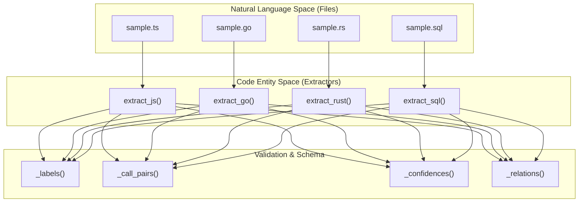
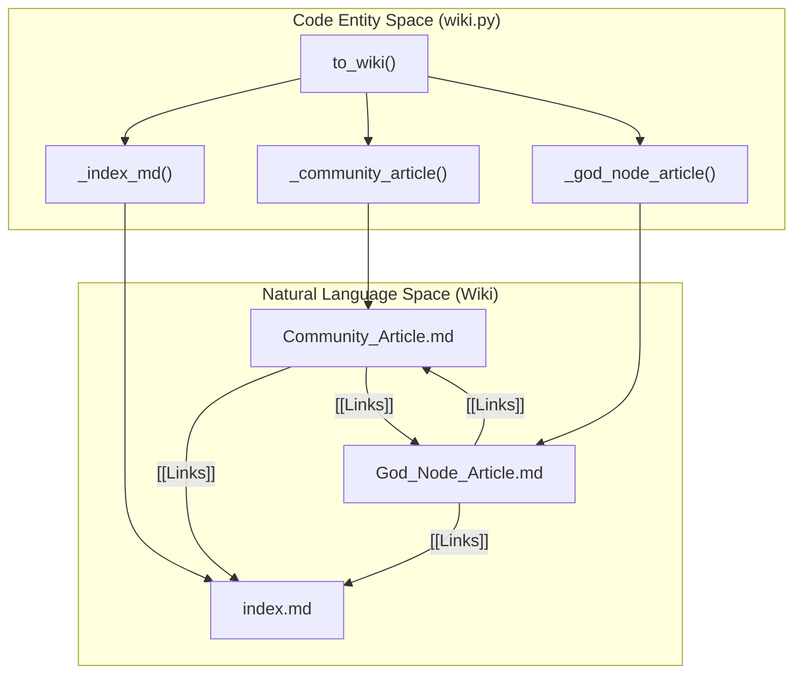

# Unit Tests와 Fixtures

관련 소스 파일

다음 파일들은 이 위키 페이지를 생성하기 위한 컨텍스트로 사용되었습니다.

- [graphify/build.py](graphify/build.py)
- [graphify/querylog.py](graphify/querylog.py)
- [graphify/symbol_resolution.py](graphify/symbol_resolution.py)
- [tests/fixtures/dynamic_import.ts](tests/fixtures/dynamic_import.ts)
- [tests/fixtures/sample.cs](tests/fixtures/sample.cs)
- [tests/fixtures/sample.java](tests/fixtures/sample.java)
- [tests/fixtures/sample_alter_fk.sql](tests/fixtures/sample_alter_fk.sql)
- [tests/fixtures/sample_schema_qualified.sql](tests/fixtures/sample_schema_qualified.sql)
- [tests/test_antigravity_install.py](tests/test_antigravity_install.py)
- [tests/test_build.py](tests/test_build.py)
- [tests/test_cpp_preprocess.py](tests/test_cpp_preprocess.py)
- [tests/test_dart.py](tests/test_dart.py)
- [tests/test_extract.py](tests/test_extract.py)
- [tests/test_file_node_id_spec.py](tests/test_file_node_id_spec.py)
- [tests/test_import_extension_resolution.py](tests/test_import_extension_resolution.py)
- [tests/test_js_import_resolution.py](tests/test_js_import_resolution.py)
- [tests/test_labeling.py](tests/test_labeling.py)
- [tests/test_languages.py](tests/test_languages.py)
- [tests/test_multilang.py](tests/test_multilang.py)
- [tests/test_obsidian_filename_cap.py](tests/test_obsidian_filename_cap.py)
- [tests/test_office_limits.py](tests/test_office_limits.py)
- [tests/test_ollama.py](tests/test_ollama.py)
- [tests/test_python_import_resolution.py](tests/test_python_import_resolution.py)
- [tests/test_querylog.py](tests/test_querylog.py)
- [tests/test_skillgen.py](tests/test_skillgen.py)
- [tests/test_terraform.py](tests/test_terraform.py)
- [tests/test_ts_inheritance.py](tests/test_ts_inheritance.py)
- [tests/test_wheel_packaging.py](tests/test_wheel_packaging.py)
- [tools/skillgen/gen.py](tools/skillgen/gen.py)
- [tools/skillgen/platforms.toml](tools/skillgen/platforms.toml)

이 페이지는 `graphify` pipeline을 verify하는 데 사용되는 unit testing suite와 static fixtures를 다룬다. test suite는 core library structure를 반영하는 module별 test files로 구성되어, file detection부터 entity deduplication까지 pipeline의 각 stage가 독립적으로 기능상 올바른지 보장한다.

## Test Suite Overview

testing architecture는 core modules와 test files 사이의 1:1 mapping을 따른다. 이 tests는 multi-language fixtures 집합을 사용해 AST extraction, graph construction, export formatting을 verify한다.

| Test File | Target Module | Primary Focus |
| :--- | :--- | :--- |
| `test_detect.py` | `graphify/detect.py` | File discovery, ignore patterns, classification. |
| `test_extract.py` | `graphify/extract.py` | Python AST extraction, ID generation, base logic. |
| `test_multilang.py` | `graphify/extract.py` | JS/TS, Go, Rust, SQL extraction logic. |
| `test_languages.py` | `graphify/extract.py` | Java, C, C++, Ruby, C#, Kotlin, Scala, PHP extraction. |
| `test_hooks.py` | `graphify/hooks.py` | Git hook installation, idempotency, removal. |
| `test_cache.py` | `graphify/cache.py` | SHA256 hashing과 YAML frontmatter stripping. |
| `test_build.py` | `graphify/build.py` | NetworkX graph assembly와 legacy key canonicalization. |
| `test_analyze.py` | `graphify/analyze.py` | God nodes, surprising connections, cross-language scoring. |
| `test_dedup.py` | `graphify/dedup.py` | MinHash/LSH와 Jaro-Winkler를 통한 entity deduplication. |
| `test_rationale.py`| `graphify/extract.py` | Docstring과 comment rationale extraction logic. |
| `test_claude_md.py`| `graphify/__main__.py`| Claude Code skill registration과 `CLAUDE.md` rules. |
| `test_terraform.py`| `graphify/extract.py`| Terraform/HCL block과 reference extraction [tests/test_terraform.py:1-7](). |
| `test_ollama.py` | `graphify/llm.py` | Ollama backend security와 SSRF guards [tests/test_ollama.py:1-6](). |
| `test_office_limits.py`| `graphify/detect.py` | Office/PDF files에 대한 zip-bomb과 resource-cap guards [tests/test_office_limits.py:1-6](). |

출처: [tests/test_detect.py:1-2](), [tests/test_extract.py:1-2](), [tests/test_multilang.py:1-6](), [tests/test_languages.py:1-12](), [tests/test_dedup.py:1-4](), [tests/test_rationale.py:1-5](), [tests/test_claude_md.py:1-4](), [tests/test_terraform.py:1-7](), [tests/test_ollama.py:1-6](), [tests/test_office_limits.py:1-6]()

## Multi-Language Fixtures

Graphify는 language-specific extractors를 validate하기 위해 `tests/fixtures/`에 위치한 포괄적인 "sample" files 집합을 사용한다. 이 files에는 AST parsers가 식별해야 하는 대표적인 code structures(classes, methods, imports, calls)가 포함되어 있다.

### Extraction Logic Verification
시스템은 language-specific extractors(예: `extract_js`, `extract_go`, `extract_rust`, `extract_sql`)가 code entities와 relations를 올바르게 식별하는지 validate한다. tests는 extraction result dictionary를 query하기 위해 `_labels`, `_call_pairs`, `_edge_labels` 같은 helper functions를 사용한다 [tests/test_multilang.py:13-44]().

### Data Flow: Fixture에서 Extraction Result까지
다음 다이어그램은 fixture file이 internal extraction schema로 처리되는 방식을 보여준다.

**Code Entity Extraction Flow**

출처: [tests/test_multilang.py:13-25](), [tests/test_extract.py:23-34](), [tests/test_languages.py:14-25]()

### Supported Language Test Cases
- **TypeScript (`sample.ts`)**: class `HttpClient`, methods `get`/`post`, `EXTRACTED` call relationships를 verify한다 [tests/test_multilang.py:49-75]().
- **Go (`sample.go`)**: `struct Server`, method `Start`, constructor `NewServer`를 verify한다 [tests/test_multilang.py:100-124](). 또한 struct/interface embedding의 `embeds` relations를 확인한다 [tests/test_multilang.py:146-154]().
- **C/C++ (`sample.c`, `sample.cpp`)**: function detection, `#include` mapping to `imports` relations, constructor capture를 verify한다 [tests/test_languages.py:119-184](). 특히 `parameter_type`과 `return_type` edge contexts를 확인한다 [tests/test_languages.py:151-162]().
- **Terraform (`main.tf`)**: `variable`, `provider`, `data`, `resource`, `module`, `locals` blocks가 nodes가 되는지 verify한다 [tests/test_terraform.py:60-76](). 또한 `depends_on`과 `contains` relations를 validate한다 [tests/test_terraform.py:88-98]().
- **Rationale Nodes**: `test_rationale.py`는 20 characters를 초과하는 docstrings와 `NOTE:` comments가 `rationale_for` edges로 연결된 `rationale` nodes로 extract되는지 보장한다 [tests/test_rationale.py:15-70](). 또한 Alembic migrations 또는 Protobuf generated headers 같은 noise docstrings의 suppression도 verify한다 [tests/test_rationale.py:93-175]().

## Entity Deduplication Pipeline

`test_dedup.py` suite는 `graphify/dedup.py`에 정의된 multi-stage deduplication logic을 실행한다.

### Pipeline Verification
- **Entropy Gate**: `_entropy`는 "AI" 같은 low-information labels(entropy < 2.5)가 false positives를 방지하기 위해 fuzzy merger에서 skip되도록 보장한다 [tests/test_dedup.py:9-17]().
- **MinHash/LSH & Jaro-Winkler**: "GraphExtractor"와 "Graph Extractor" 같은 typos는 merge되고, "UserService"와 "OrderService" 같은 unrelated services는 distinct하게 유지되는지 validate한다 [tests/test_dedup.py:49-62]().
- **Variant Protection**: chip SKU variants(예: "ASR1603" vs "ASR1605") 또는 model variants(예: "M1" vs "M1 Pro")가 merge되지 않음을 구체적으로 test하여 technical specifications에서 false positives를 방지한다 [tests/test_dedup.py:142-160](). 이는 `_is_variant_pair`와 `_short_label_blocked`가 처리한다 [graphify/dedup.py:58-88]().
- **Community Boost**: 같은 community를 공유하는 nodes가 score bonus를 받아 ambiguous pairs의 merge를 돕는지 validate한다 [tests/test_dedup.py:90-101]().

출처: [graphify/dedup.py:1-125](), [tests/test_dedup.py:1-180]()

## File Detection과 Classification

`test_detect.py` suite는 files를 discover하고 heuristics를 적용하는 시스템의 능력을 verify한다.

- **Classification**: `.py`가 `FileType.CODE`로 매핑되고 `.pdf`가 `FileType.PAPER`로 매핑되는지 validate한다 [tests/test_detect.py:6-16]().
- **Paper Signals**: 충분한 paper signals(예: "Abstract", "ArXiv", "Equation")가 있는 `.md` file은 `_looks_like_paper`를 통해 `DOCUMENT`가 아니라 `PAPER`로 classify된다 [tests/test_detect.py:63-71]().
- **Ignore Logic**: `.graphifyignore` patterns가 준수되고 hermetic scans를 유지하기 위해 `.git` boundary에서 search가 중단되는지 verify한다 [tests/test_detect.py:89-103](), [tests/test_detect.py:183-184]().
- **Noise Filtering**: `/.next/` 또는 `/.nuxt/` 같은 잘 알려진 framework caches가 자동으로 skipped되는지 보장한다 [tests/test_detect.py:50-61]().

출처: [tests/test_detect.py:1-184]()

## Security와 Resource Guards

test suite에는 security boundaries와 resource exhaustion에 대한 전용 checks가 포함되어 있다.

### Ollama SSRF Protection
`test_ollama.py`는 SSRF를 방지하기 위해 `_validate_ollama_base_url`이 link-local(169.254.x.x)과 cloud metadata addresses를 차단하는지 verify한다 [tests/test_ollama.py:9-18](). 또한 이 IPs로 resolve되는 hostnames가 포착되는지 보장한다 [tests/test_ollama.py:29-38]().

### Office와 PDF Resource Caps
`test_office_limits.py`는 `.docx`와 `.xlsx` files의 "zip-bomb" attacks에 대한 guards를 validate한다 [tests/test_office_limits.py:25-31]().
- **Ratio Checks**: decompression ratio가 의심스럽게 높은 files를 reject한다 [tests/test_office_limits.py:25-31]().
- **Streaming Ceilings**: decompressed bytes를 읽고 ceiling(예: tests에서는 64 KiB)을 넘는 즉시 중단하는 `_zip_within_caps` function을 실행한다 [tests/test_office_limits.py:64-78]().
- **Raw Caps**: `_OFFICE_MAX_RAW_BYTES`보다 큰 PDFs가 parsing 전에 skipped되는지 보장한다 [tests/test_office_limits.py:81-90]().

출처: [tests/test_ollama.py:9-38](), [tests/test_office_limits.py:1-90]()

## Wiki와 Report Verification

`test_wiki.py`와 `test_claude_md.py` suites는 사람이 읽을 수 있고 agent가 crawl할 수 있는 outputs를 verify한다.

### Wiki Generation
- **to_wiki**: wiki export가 `index.md`, community articles, god node articles를 생성하는지 validate한다 [tests/test_wiki.py:26-50]().
- **Cross-Links**: articles가 다른 communities와 god nodes로 향하는 `[[WikiLinks]]`를 포함하는지 보장한다 [tests/test_wiki.py:52-73]().
- **Audit Trail**: community articles가 confidence breakdown(EXTRACTED, INFERRED, AMBIGUOUS)을 포함하는지 verify한다 [tests/test_wiki.py:83-89]().
- **Sanitization**: `_safe_filename`은 special characters(예: `/`, `:`)가 있는 labels가 filesystem-compatible filenames로 안전하게 mapping되는지 보장하도록 test된다 [graphify/wiki.py:11-24]().

### Claude Integration
- **claude_install**: 필수 rules(예: coding 전에 `GRAPH_REPORT.md` 확인)가 포함된 `CLAUDE.md` 생성이 verify된다 [tests/test_claude_md.py:11-26]().
- **PreToolUse Hook**: `claude_install`이 tool usage 전에 graph updates를 trigger하도록 `.claude/settings.json`에 Bash hook을 등록하는지 validate한다 [tests/test_claude_md.py:104-113]().

**Wiki Navigation Structure**

출처: [graphify/wiki.py:1-198](), [tests/test_wiki.py:1-175]()

## Infrastructure와 Cache

- **SHA256 Cache**: `graphify/cache.py`는 unchanged files가 skipped되는지 보장하도록 test된다. `.md` files의 경우 metadata만 변경되었을 때 불필요한 re-extractions를 피하기 위해 YAML frontmatter를 제거한다 [graphify/cache.py:16-23]().
- **ID Disambiguation**: `test_extract.py`는 서로 다른 files의 duplicate symbol names(예: 두 개의 다른 directories에 있는 `Program.cs`)가 source path를 기준으로 unique IDs를 할당받는지 보장한다 [tests/test_extract.py:59-98]().
- **Node ID Spec**: `test_file_node_id_spec.py`는 AST와 semantic nodes가 올바르게 merge되도록 file-level node IDs가 `{parent_dir}_{stem}`(예: `script_pipeline_step`)을 사용해야 한다는 `skill.md` requirement를 강제한다 [tests/test_file_node_id_spec.py:27-43]().

출처: [graphify/cache.py:1-191](), [tests/test_extract.py:59-120](), [tests/test_file_node_id_spec.py:1-121]()
