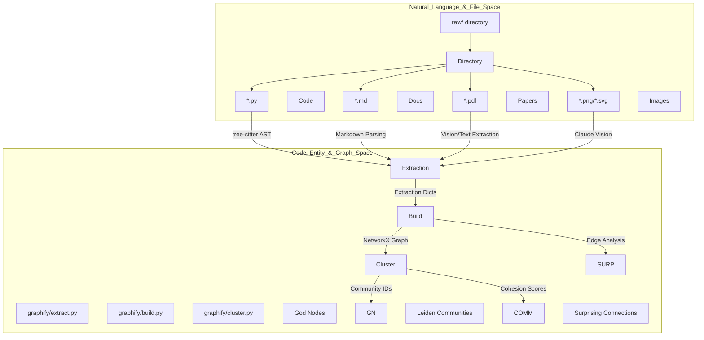
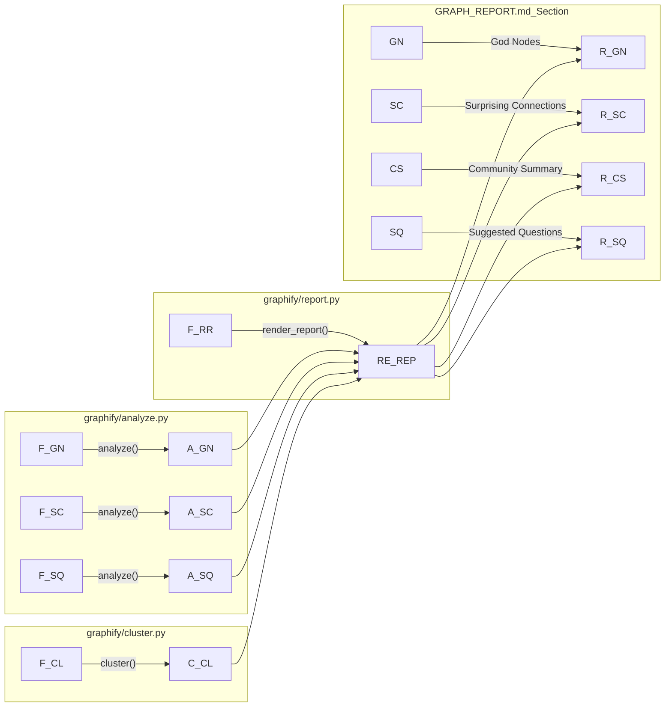

# Worked Examples와 Benchmarks

관련 소스 파일

다음 파일들은 이 위키 페이지를 생성하기 위한 컨텍스트로 사용되었습니다.

- [ARCHITECTURE.md](ARCHITECTURE.md)
- [worked/example/README.md](worked/example/README.md)
- [worked/httpx/GRAPH_REPORT.md](worked/httpx/GRAPH_REPORT.md)
- [worked/httpx/README.md](worked/httpx/README.md)
- [worked/httpx/review.md](worked/httpx/review.md)
- [worked/karpathy-repos/GRAPH_REPORT.md](worked/karpathy-repos/GRAPH_REPORT.md)
- [worked/karpathy-repos/README.md](worked/karpathy-repos/README.md)
- [worked/karpathy-repos/graph.json](worked/karpathy-repos/graph.json)
- [worked/karpathy-repos/review.md](worked/karpathy-repos/review.md)
- [worked/mixed-corpus/README.md](worked/mixed-corpus/README.md)
- [worked/mixed-corpus/review.md](worked/mixed-corpus/review.md)

이 섹션은 `worked/` directory에 위치한 reference corpora의 개요를 제공한다. 이 examples는 `graphify` pipeline의 functional tests이자 extraction accuracy, community detection quality, token reduction performance를 측정하기 위한 benchmarks 역할을 한다.

각 example은 simple AST-based code analysis부터 research papers와 images의 복잡한 multi-modal ingestion까지, system의 특정 capability를 보여준다.

## Reference Corpora Overview

`worked/` directory에는 `graphify` engine의 서로 다른 부분을 실행하도록 설계된 다섯 가지 distinct scenarios가 포함되어 있다.

| Example | Primary Focus | Key Metrics |
|:---|:---|:---|
| **Simple Example** | Document & Code Pipeline | 7 files, 2 languages, clear call hierarchy |
| **httpx Benchmark** | Library Codebase Analysis | 144 nodes, 330 edges, 6 communities |
| **Karpathy Repos** | Large-scale Cross-Repo | 52 files, 71.5x token reduction |
| **Mixed Corpus** | Multi-modal Ingestion | Python + Markdown + ArXiv + Images |
| **rsl-siege-manager** | Full-stack Monorepo | Cross-language (TS/PY), migration docs |

### System Data Flow: Source에서 Graph까지

다음 다이어그램은 이 worked examples가 `graphify` pipeline을 거치며 raw files에서 benchmark reports에 있는 structured entities로 변환되는 과정을 보여준다.

**Diagram: Worked Example Transformation Flow**

출처: [worked/example/README.md:9-18](), [worked/httpx/README.md:8-15](), [worked/karpathy-repos/README.md:32-47](), [worked/mixed-corpus/README.md:8-13](), [ARCHITECTURE.md:7-9]()

---

## [Simple Example (document pipeline)](#7.1)
`worked/example` corpus는 5개의 Python modules(`api.py`, `storage.py`, `parser.py`, `validator.py`, `processor.py`)와 2개의 Markdown files(`architecture.md`, `notes.md`)로 구성된 표준 micro-service architecture를 나타낸다. 이 example은 `graphify`가 `api.py`를 central hub로, `storage.py`를 다른 modules에서 높은 inward connectivity를 갖는 "God Node"로 식별하는 방식을 보여준다. 이 example은 semantic extraction에 대한 token cost 없이 AST와 markdown만으로 완전히 실행된다.

자세한 내용은 [Simple Example (document pipeline)](#7.1)를 참조하라.
출처: [worked/example/README.md:9-18](), [worked/example/README.md:39-45]()

## [httpx Benchmark (library codebase)](#7.2)
`httpx` library의 synthetic version을 기반으로 하는 이 benchmark는 6개의 Python files 전반에서 complex class hierarchies와 asynchronous patterns의 extraction을 test한다. 144 nodes와 330 edges의 dense graph를 생성한다. 주요 findings에는 감지된 6 communities 전반에서 주요 architectural bridges로 `Client`, `AsyncClient`, `Response`를 식별하는 것이 포함된다. 또한 header parsing을 위해 `DigestAuth`가 `Response`와 연결되는 것 같은 "surprising connections"를 강조한다.

자세한 내용은 [httpx Benchmark (library codebase)](#7.2)를 참조하라.
출처: [worked/httpx/README.md:8-15](), [worked/httpx/README.md:36-39](), [worked/httpx/GRAPH_REPORT.md:12-23]()

## [Karpathy Repos Benchmark (71.5x token reduction)](#7.3)
이것은 flagship performance benchmark이다. 세 개의 독립 repositories(`nanoGPT`, `minGPT`, `micrograd`)에 걸친 52 files와 함께 5개의 ArXiv PDFs, 4개의 images를 ingest한다. `nanoGPT`와 `minGPT`의 `Block` implementations를 연결하는 것처럼 cross-repo connections를 찾는 `graphify`의 능력을 보여주며, LLM이 전체 corpus를 추론하는 데 필요한 tokens를 **71.5x reduction**하는 성과를 달성한다.

자세한 내용은 [Karpathy Repos Benchmark (71.5x token reduction)](#7.3)을 참조하라.
출처: [worked/karpathy-repos/README.md:5-29](), [worked/karpathy-repos/README.md:68-71](), [worked/karpathy-repos/review.md:11-27]()

## [Mixed Corpus Benchmark (multi-modal)](#7.4)
`worked/mixed-corpus`는 multi-modal integration에 초점을 맞춘다. ArXiv ID patterns(예: `1706.03762`)를 사용해 files를 "papers"로 classify하고, `attention_arabic.png` 같은 technical diagrams가 vision extraction을 통해 어떻게 통합되는지 보여준다. 이 example은 Graph Analysis, Clustering/Scoring, Graph Building이라는 3개의 distinct communities를 생성한다.

자세한 내용은 [Mixed Corpus Benchmark (multi-modal)](#7.4)를 참조하라.
출처: [worked/mixed-corpus/README.md:7-15](), [worked/mixed-corpus/README.md:36-41](), [worked/mixed-corpus/review.md:19-21]()

## [rsl-siege-manager Case Study (full-stack monorepo)](#7.5)
이 case study는 Python(FastAPI)과 TypeScript(React) components를 포함한 real-world monorepo를 검토한다. test factories의 존재가 "God Node" lists를 지배할 수 있음을 강조하고 `.graphifyignore`가 community quality에 미치는 영향을 보여준다. 또한 17개의 Alembic migration docstrings 처리와 cross-language inference behavior를 문서화한다.

자세한 내용은 [rsl-siege-manager Case Study (full-stack monorepo)](#7.5)를 참조하라.
출처: [worked/rsl-siege-manager/review.md:1-20]()

---

### Entity Mapping: Benchmark Report에서 Code까지
이 다이어그램은 `worked/`의 것과 같은 `GRAPH_REPORT.md`에 있는 high-level concepts를 이를 생성하는 특정 Python functions에 매핑한다.

**Diagram: Report-to-Code Mapping**

출처: [worked/httpx/README.md:36-39](), [worked/mixed-corpus/README.md:9-11](), [worked/karpathy-repos/README.md:68-70](), [ARCHITECTURE.md:21-22]()
