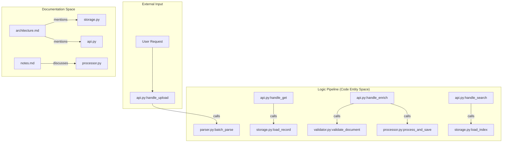
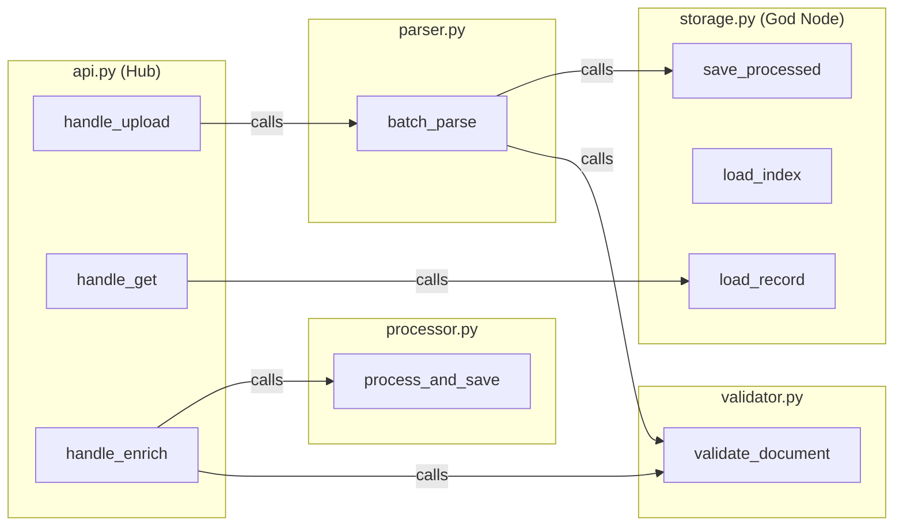

# Simple Example (document pipeline)

관련 소스 파일

다음 파일들은 이 위키 페이지를 생성하기 위한 컨텍스트로 사용되었습니다.

- [worked/example/README.md](worked/example/README.md)
- [worked/httpx/README.md](worked/httpx/README.md)
- [worked/karpathy-repos/README.md](worked/karpathy-repos/README.md)
- [worked/mixed-corpus/README.md](worked/mixed-corpus/README.md)

이 페이지는 `worked/example` corpus에 대한 technical walkthrough를 제공한다. 이 small-scale project는 `graphify`가 architectural documentation과 함께 multi-module Python application을 어떻게 처리하는지 보여주는 reference 역할을 한다. code의 linear document pipeline에서 identified hubs, "god nodes", community clusters를 가진 structured knowledge graph로 전환되는 과정을 보여준다.

## Corpus Structure

example corpus는 document ingestion system을 나타내는 7개 files로 구성된다. 이 system은 **API** layer가 orchestrate하는 linear data flow를 따른다: **Parser** $\rightarrow$ **Validator** $\rightarrow$ **Processor** $\rightarrow$ **Storage**.

| File | Type | Responsibility | Key Symbols |
| :--- | :--- | :--- | :--- |
| `api.py` | Python | Entry point/Orchestration | `handle_upload`, `handle_search` |
| `parser.py` | Python | Format detection & ingestion | `parse_file`, `batch_parse` |
| `validator.py` | Python | Schema enforcement | `validate_document`, `ValidationError` |
| `processor.py` | Python | Enrichment & keyword extraction | `extract_keywords`, `enrich_document` |
| `storage.py` | Python | Persistence & indexing | `load_index`, `save_processed` |
| `architecture.md` | Markdown | Design decisions | N/A |
| `notes.md` | Markdown | Informal research/tradeoffs | N/A |

**출처:** `[worked/example/README.md:9-18]()`

## Data Flow와 Entity Mapping

pipeline은 명시적으로 linear하게 설계되어 있어 `graphify`의 AST-based edge detection을 위한 이상적인 test case가 된다. code의 각 stage는 sequence의 다음 stage를 명시적으로 import하고 call한다. 예를 들어 `api.py`는 네 개의 functional modules 모두에 연결되는 central hub 역할을 한다.

### Code Entity Space에서 Graph Representation까지

다음 다이어그램은 Python modules의 functional logic을 `graphify` output에서 생성되는 nodes와 edges에 연결한다.

**System Logic to Code Entities**

**출처:** `[worked/example/README.md:16-17]()`, `[worked/example/README.md:41-44]()`

## Expected Graph Topology

`graphify`가 이 directory를 처리하면, connectivity(degree)와 call graph에서의 위치를 기반으로 특정 files의 structural roles를 식별한다.

### 1. Hubs와 God Nodes
*   **`storage.py` (God Node):** 모든 것이 이를 통해 읽고 쓰기 때문에 highest-degree god node로 식별된다. data를 persist하고 index를 유지한다 `[worked/example/README.md:42]()`.
*   **`api.py` (Hub Node):** primary entry point 역할을 하며 requests를 orchestrate하기 위해 네 개의 functional modules(`parser`, `validator`, `processor`, `storage`) 모두에 연결된다 `[worked/example/README.md:41-42]()`.

### 2. Community Structure
Leiden algorithm은 보통 이 corpus에서 두 개의 primary communities를 감지한다.
1.  **The Logic Cluster:** 네 개의 Python modules(`parser.py`, `validator.py`, `processor.py`, `storage.py`)는 sequential call relationships 때문에 함께 cluster되는 경우가 많다 `[worked/example/README.md:45]()`.
2.  **The Documentation Cluster:** `architecture.md`와 `notes.md`. code에 link되지만, 서로에 대한 internal references와 AST-level calls의 부재로 인해 secondary community에 배치되는 경우가 많다 `[worked/example/README.md:45]()`.
3.  **The API Cluster:** 일부 runs에서는 `api.py`가 다른 모든 modules에 대한 높은 connectivity 때문에 자체 cluster에 배치될 수 있다 `[worked/example/README.md:45]()`.

**출처:** `[worked/example/README.md:39-47]()`

## Technical Implementation Details

### Extraction Logic
*   **AST Extraction:** `graphify`는 function calls와 imports를 식별하기 위해 tree-sitter를 사용한다. `parser.py`가 `validator.py`와 `storage.py`를 call한다는 점을 감지한다 `[worked/example/README.md:43]()`.
*   **Markdown Extraction:** `graphify`는 markdown files를 parse하고 code modules에 대한 mentions를 식별하여 `architecture.md`/`notes.md`와 관련 Python files 사이에 links를 생성한다 `[worked/example/README.md:44]()`.

### Graph Interaction (Sample Queries)
graph가 `graphify-out/`에 build되면, MCP server 또는 CLI를 사용해 다음 technical queries를 resolve할 수 있다.

| Query | Resolution Logic |
| :--- | :--- |
| "what calls storage directly?" | `storage.py` node 또는 해당 functions로 들어오는 모든 incoming edges를 찾는다 `[worked/example/README.md:51]()` |
| "what is the shortest path between parser and processor?" | dependencies를 traverse하며, 보통 `api.py` 또는 linear pipeline sequence를 통과한다 `[worked/example/README.md:52]()` |
| "which module has the most connections?" | node degree를 계산한다. 일반적으로 `storage.py`가 가장 높다 `[worked/example/README.md:53]()` |
| "what does the architecture doc say about the storage design?" | `architecture.md`에서 `storage.py`로 이어지는 edge를 traverse하고 context를 retrieve한다 `[worked/example/README.md:54]()` |

**출처:** `[worked/example/README.md:49-57]()`

## Summary Diagram: Component Interactions

이 다이어그램은 document pipeline의 code structure가 final graph representation에 어떻게 반영되는지 보여준다.

**Code Interaction to Graph Edge Mapping**

**출처:** `[worked/example/README.md:41-45]()`
