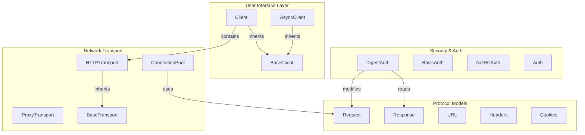

# httpx Benchmark (library codebase)

<details>
<summary>관련 소스 파일</summary>

다음 파일들은 이 위키 페이지를 생성하기 위한 컨텍스트로 사용되었습니다.

- [ARCHITECTURE.md](ARCHITECTURE.md)
- [worked/example/README.md](worked/example/README.md)
- [worked/httpx/GRAPH_REPORT.md](worked/httpx/GRAPH_REPORT.md)
- [worked/httpx/README.md](worked/httpx/README.md)
- [worked/httpx/review.md](worked/httpx/review.md)
- [worked/karpathy-repos/GRAPH_REPORT.md](worked/karpathy-repos/GRAPH_REPORT.md)
- [worked/karpathy-repos/README.md](worked/karpathy-repos/README.md)
- [worked/karpathy-repos/graph.json](worked/karpathy-repos/graph.json)
- [worked/karpathy-repos/review.md](worked/karpathy-repos/review.md)
- [worked/mixed-corpus/README.md](worked/mixed-corpus/README.md)
- [worked/mixed-corpus/review.md](worked/mixed-corpus/review.md)

</details>


`httpx` benchmark는 실제 `httpx` library architecture를 모델로 한 synthetic 6-file Python codebase를 사용한다 [worked/httpx/README.md:3-4](). 이 corpus는 low-level exceptions와 models에서 transport와 authentication을 거쳐 high-level client로 이동하는 clean layering을 가진 현실적인 library를 `graphify`가 mapping하는 능력을 test하도록 설계되었다 [worked/httpx/README.md:4-5]().

## Corpus Composition
benchmark는 `worked/httpx/raw/` directory에 위치한 6개의 core files로 구성된다 [worked/httpx/README.md:8-11](). codebase는 엄격한 functional separation을 따른다 [worked/httpx/review.md:76-85]().

| File | Role | Key Entities |
| :--- | :--- | :--- |
| `exceptions.py` | Error hierarchy | `HTTPError`, `RequestError`, `HTTPStatusError`, `ConnectError` |
| `models.py` | Data structures | `URL`, `Headers`, `Cookies`, `Request`, `Response` |
| `auth.py` | Authentication | `DigestAuth`, `BasicAuth`, `BearerAuth`, `NetRCAuth`, `Auth` |
| `utils.py` | Helpers | `build_url_with_params`, `flatten_queryparams`, `parse_content_type` |
| `transport.py` | Network layer | `HTTPTransport`, `ConnectionPool`, `ProxyTransport`, `MockTransport` |
| `client.py` | Main Interface | `Client`, `AsyncClient`, `BaseClient`, `Timeout`, `Limits` |

**출처:** [worked/httpx/README.md:8-15](), [worked/httpx/review.md:76-85]()

## Graph Statistics와 Results
처리되면 이 corpus는 token reduction보다 structural connectivity를 강조하는 graph를 생성한다. corpus가 작기 때문에(약 2,047 words) standard LLM context windows 안에 들어가며, 그 결과 token reduction ratio는 약 1x가 된다 [worked/httpx/README.md:39-41](), [worked/httpx/GRAPH_REPORT.md:4-9]().

*   **Nodes:** 144 [worked/httpx/GRAPH_REPORT.md:8]()
*   **Edges:** 330 [worked/httpx/GRAPH_REPORT.md:8]()
*   **Communities:** 6 [worked/httpx/GRAPH_REPORT.md:8]()
*   **Extraction Quality:** 53% EXTRACTED(AST), 47% INFERRED(Semantic/LLM reasoning) [worked/httpx/GRAPH_REPORT.md:9]()

### God Nodes (Core Abstractions)
`graphify`가 식별한 "God Nodes"는 library logic의 주요 hubs를 나타낸다. `Client`와 `AsyncClient`는 다른 모든 modules의 primary integration points 역할 때문에 top hubs로 나타난다 [worked/httpx/GRAPH_REPORT.md:12-14]().

1.  `Client` (26 edges) [worked/httpx/GRAPH_REPORT.md:13]()
2.  `AsyncClient` (25 edges) [worked/httpx/GRAPH_REPORT.md:14]()
3.  `Response` (24 edges) [worked/httpx/GRAPH_REPORT.md:15]()
4.  `Request` (21 edges) [worked/httpx/GRAPH_REPORT.md:16]()
5.  `BaseClient` (18 edges) [worked/httpx/GRAPH_REPORT.md:17]()
6.  `HTTPTransport` (17 edges) [worked/httpx/GRAPH_REPORT.md:18]()

**출처:** [worked/httpx/GRAPH_REPORT.md:12-22](), [worked/httpx/review.md:26-36]()

## Architectural Mapping
다음 다이어그램은 자연어 architectural concepts를 `graphify`가 extract한 특정 code entities에 연결한다.

### System Architecture to Code Entity Map

**출처:** [worked/httpx/review.md:43-46](), [worked/httpx/review.md:97-122](), [worked/httpx/README.md:8-15](), [worked/httpx/GRAPH_REPORT.md:65-66]()

## Surprising Connections
`graphify`는 서로 다른 communities를 연결하는 non-obvious dependencies를 식별하여 architectural "leaks" 또는 complex interdependencies를 강조한다.

*   **DigestAuth ↔ Response:** standard auth flows와 달리 `DigestAuth`는 challenge-response handshake를 위한 `WWW-Authenticate` headers를 parse하기 위해 `Response`를 읽어야 한다 [worked/httpx/README.md:38](). 이는 Auth와 Models communities 사이의 link를 만든다 [worked/httpx/review.md:45-46]().
*   **Timeout ↔ Model Dependencies:** `client.py`의 `Timeout` class는 `models.py`의 `URL`, `Headers`, `Cookies`와 relationships를 갖는 것으로 inferred된다. 이는 timeout logic이 model instantiation 또는 validation 중 적용되기 때문일 가능성이 높다 [worked/httpx/GRAPH_REPORT.md:25-30]().
*   **High Betweenness Bridges:** `Response`와 `Client`는 high-betweenness centrality bridges(각각 0.168, 0.177)로 동작하며, Models community를 Transport 및 Client communities에 연결한다 [worked/httpx/GRAPH_REPORT.md:65-70]().

### Cross-Community Bridge Logic
```mermaid
graph LR
    subgraph CLIENTS["Community 2: Clients"]
        Client["Client"]
    end

    subgraph MODELS2["Community 3: Models"]
        Response["Response"]
        Request["Request"]
    end

    subgraph AUTH2["Community 1: Auth"]
        DigestAuth["DigestAuth"]
    end

    subgraph TRANSPORT2["Community 0: Transport"]
        HTTPTransport["HTTPTransport"]
    end

    Client -- "bridge (0.177)" --> HTTPTransport [worked/httpx/GRAPH_REPORT.md:65-66]
    DigestAuth -- "surprising_connection" --> Response [worked/httpx/review.md:45-46]
    Response -- "bridge (0.168)" --> Client [worked/httpx/GRAPH_REPORT.md:67-68]
    Request -- "inferred_edge" --> Response [worked/httpx/GRAPH_REPORT.md:77-78]
```
**출처:** [worked/httpx/GRAPH_REPORT.md:65-78](), [worked/httpx/review.md:45-46]()

## Benchmark Execution
이 결과를 재현하려면 raw source files에 대해 `graphify` CLI를 실행한다. 작은 corpus에서의 structural value는 token savings보다 빠른 architectural onboarding에 있다 [worked/httpx/README.md:41]().

```bash
# Install and register skill
pip install graphifyy && graphify install

# Run extraction and analysis on the httpx raw corpus
graphify ./worked/httpx/raw
```
[worked/httpx/README.md:22-32]()

생성된 `GRAPH_REPORT.md`는 confidence breakdown(53% EXTRACTED vs 47% INFERRED)을 제공하고, `Client`와 관련된 12개의 inferred relationships를 검증하는 것 같은 특정 architectural questions를 제안한다 [worked/httpx/GRAPH_REPORT.md:9-72]().

**출처:** [worked/httpx/README.md:1-45](), [worked/httpx/GRAPH_REPORT.md:1-78]()
