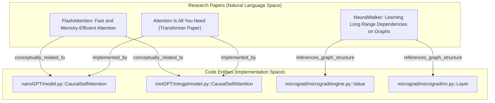
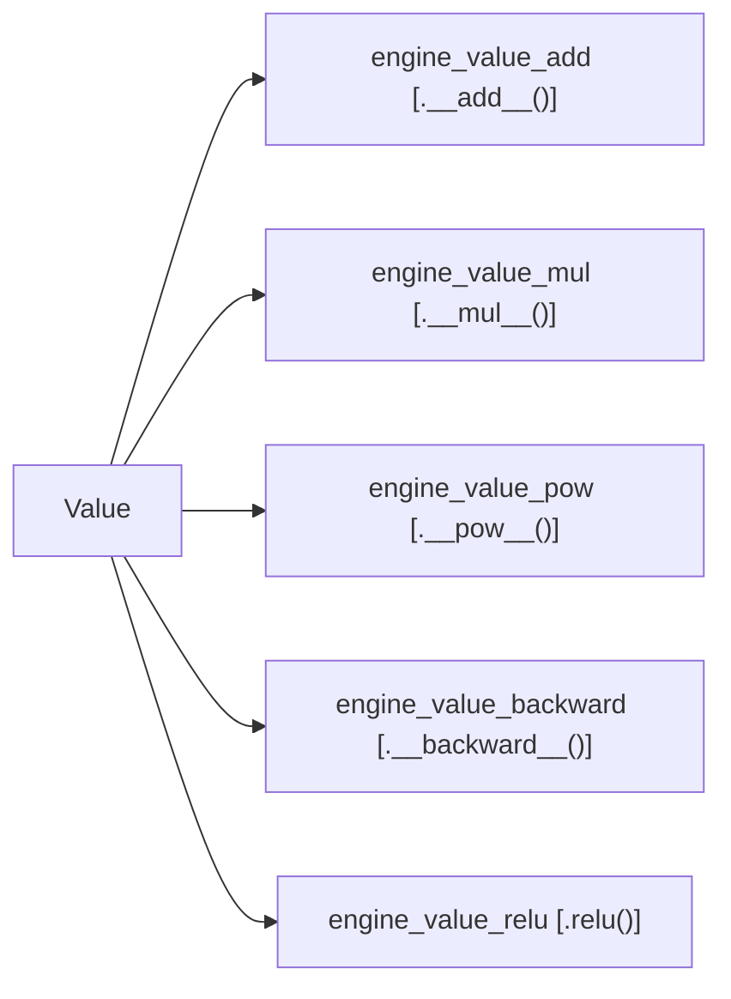

# Karpathy Repos Benchmark (71.5x token reduction)

<details>
<summary>관련 소스 파일</summary>

다음 파일들은 이 위키 페이지를 생성하기 위한 컨텍스트로 사용되었습니다.

- [ARCHITECTURE.md](ARCHITECTURE.md)
- [worked/example/README.md](worked/example/README.md)
- [worked/httpx/GRAPH_REPORT.md](worked/httpx/GRAPH_REPORT.md)
- [worked/httpx/README.md](worked/httpx/README.md)
- [worked/httpx/review.md](worked/httpx/review.md)
- [worked/karpathy-repos/GRAPH_REPORT.md](worked/karpathy-repos/GRAPH_REPORT.md)
- [worked/karpathy-repos/README.md](worked/karpathy-repos/README.md)
- [worked/karpathy-repos/graph.json](worked/karpathy-repos/graph.json)
- [worked/karpathy-repos/review.md](worked/karpathy-repos/review.md)
- [worked/mixed-corpus/README.md](worked/mixed-corpus/README.md)
- [worked/mixed-corpus/review.md](worked/mixed-corpus/review.md)

</details>


이 페이지는 multi-repo codebases, dense research papers, multi-modal assets를 처리하는 `graphify`의 능력에 대한 primary stress test 역할을 하는 `worked/karpathy-repos` corpus의 benchmark results를 자세히 설명한다.

## Overview

Karpathy Repos benchmark는 세 개의 distinct neural network libraries, 다섯 개의 academic PDFs, 여러 technical diagrams로 구성된 heterogeneous dataset에서 `graphify`를 평가한다. 이 corpus는 cross-repo entity resolution과 large-scale contexts에서 BFS-based token reduction strategy의 효과를 test하도록 설계되었다.

### Corpus Composition (52 files)
*   **Code (29 files):** `nanoGPT`, `minGPT`, `micrograd`의 cloned repositories [worked/karpathy-repos/README.md:7-13]().
*   **Papers (5 files):** "Attention Is All You Need", "FlashAttention", "FlashAttention-2", "Neural Attention Residuals", "NeuralWalker"를 포함한 arXiv PDFs [worked/karpathy-repos/README.md:15-21]().
*   **Images (4 files):** training loss curves(`gpt2_124M_loss.png`), computation graphs(`gout.svg`), decision boundaries(`moon_mlp.png`) [worked/karpathy-repos/README.md:23-28]().

**출처:** [worked/karpathy-repos/README.md:5-28](), [worked/karpathy-repos/review.md:3-5]()

## Performance Results

이 benchmark는 동일 corpus를 naive full-context injection하는 방식과 비교해 typical LLM query에 필요한 tokens를 **71.5x reduction**했음을 보여준다 [worked/karpathy-repos/review.md:27]().

### Token Reduction Metrics
| Metric | Value |
| :--- | :--- |
| Naive Full-Context Tokens | ~123,488 |
| Average BFS Subgraph Query Cost | ~1,726 |
| **Reduction Ratio** | **71.5x** |

**출처:** [worked/karpathy-repos/review.md:23-27]()

### Query-Specific Reduction
reduction efficiency는 query의 conceptual reach가 얼마나 넓은지에 따라 달라진다.
*   **"What connects micrograd to nanoGPT":** 126.7x reduction [worked/karpathy-repos/review.md:35]().
*   **"How does FlashAttention improve memory efficiency":** 100.8x reduction [worked/karpathy-repos/review.md:36]().
*   **"How does the attention mechanism work":** 43.5x reduction(많은 연결 papers/modules 때문에 더 큰 subgraph) [worked/karpathy-repos/review.md:39-41]().

**출처:** [worked/karpathy-repos/review.md:31-41]()

## Graph Topology

결과 graph는 **285 nodes**(163 AST-based, 112 semantic)와 **340 edges**로 구성된다 [worked/karpathy-repos/review.md:49-50]().

### God Nodes (High Centrality)
이 entities는 graph의 primary hubs 역할을 한다.
1.  `Value` (micrograd): 15 edges. fundamental autograd primitive [worked/karpathy-repos/GRAPH_REPORT.md:13]().
2.  `Training Script` (nanoGPT): 11 edges. model과 data를 orchestrate한다 [worked/karpathy-repos/GRAPH_REPORT.md:14]().
3.  `GPT` (nanoGPT): 9 edges. central model class [worked/karpathy-repos/GRAPH_REPORT.md:15]().
4.  `Layer` (micrograd): 8 edges. engine을 NN API에 연결한다 [worked/karpathy-repos/GRAPH_REPORT.md:16]().
5.  `FlashAttention Algorithm`: 7 edges [worked/karpathy-repos/GRAPH_REPORT.md:22]().

**출처:** [worked/karpathy-repos/GRAPH_REPORT.md:12-22](), [worked/karpathy-repos/review.md:73-81]()

### Cross-Repo와 Multi-Modal Mapping
다음 다이어그램은 `graphify`가 research papers의 natural language concepts와 서로 다른 repositories의 specific code implementations 사이의 gap을 어떻게 연결하는지 보여준다.

**Conceptual to Implementation Bridge**

**출처:** [worked/karpathy-repos/review.md:92-93](), [worked/karpathy-repos/GRAPH_REPORT.md:31-34]()

## Community Structure

Leiden algorithm은 repository structure와 일치하는 경우가 많지만 shared patterns가 감지되면 이를 넘어서는 functional boundaries를 식별한다 [worked/karpathy-repos/review.md:91-107]().

| Community ID | Description | Key Nodes |
| :--- | :--- | :--- |
| **0** | nanoGPT Model Architecture | `Block`, `GPT`, `CausalSelfAttention` |
| **4** | micrograd NN Layer | `Layer`, `MLP`, `Module`, `Neuron` |
| **5** | FlashAttention Paper | `IO-awareness`, `HBM/SRAM`, `Tiling` |
| **7** | micrograd Autograd Engine | `Value`, `backward`, `__add__` |
| **10** | micrograd README | `Backpropagation`, `Computation Graph` |
| **11** | Attention Residuals Paper | `PreNorm Dilution`, `AttnRes`, `Kimi Team` |

**출처:** [worked/karpathy-repos/GRAPH_REPORT.md:38-85](), [worked/karpathy-repos/review.md:55-68]()

### Implementation Detail: The Autograd Core
다음 다이어그램은 `micrograd` engine community의 internal structure를 보여주며, AST extraction을 통해 `Value`(God Node)가 그 methods와 어떻게 관련되는지 설명한다 [worked/karpathy-repos/graph.json:23-77]().

**micrograd Autograd Engine (Community 7)**

**출처:** [worked/karpathy-repos/graph.json:23-77](), [worked/karpathy-repos/review.md:64]()

## Surprising Connections
analysis engine은 heterogeneous corpus 전반에 걸친 non-obvious relationships를 식별한다.
*   **Structural Similarity:** `nanoGPT/model.py::Block`과 `minGPT/mingpt/model.py::Block`은 identical class names와 structural patterns를 공유하기 때문에 `conceptually_related_to`로 연결된다 [worked/karpathy-repos/review.md:91]().
*   **Functional Bridging:** `micrograd/engine.py::Value.backward()`는 `minGPT/mingpt/trainer.py::Trainer.run()`과 연결된다. 둘 다 서로 다른 scale에서 foundational forward/backward pattern을 나타내기 때문이다 [worked/karpathy-repos/review.md:104]().
*   **Inferred Dependencies:** `nanoGPT/train.py`와 `minGPT/mingpt/trainer.py`는 서로 다른 repos에 있지만 `optimizer`, `gradient clipping` 같은 shared vocabulary로 연결되어 같은 community(Community 2)에 배치된다 [worked/karpathy-repos/review.md:106]().
*   **Multi-Modal Bridge:** `FlashAttention` paper cluster(Community 5)는 `nanoGPT`와 `minGPT` 양쪽의 `CausalSelfAttention`에 edges를 만든다 [worked/karpathy-repos/review.md:105]().

**출처:** [worked/karpathy-repos/GRAPH_REPORT.md:24-35](), [worked/karpathy-repos/review.md:102-107]()

## Replication Instructions
이 결과를 재현하려면 세 개의 cloned repositories와 다운로드한 PDFs/images를 하나의 directory에 넣고 다음을 실행한다.

```bash
pip install graphifyy
graphify install
# Place files in ./raw
graphify ./raw
```
**출처:** [worked/karpathy-repos/README.md:30-64]()
