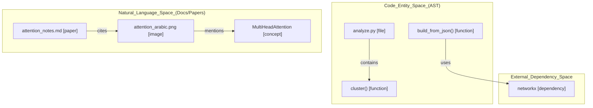
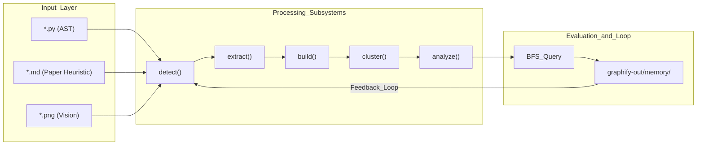

# Mixed Corpus Benchmark (multi-modal)

관련 소스 파일

다음 파일들은 이 위키 페이지를 생성하기 위한 컨텍스트로 사용되었습니다.

- [worked/example/README.md](worked/example/README.md)
- [worked/httpx/README.md](worked/httpx/README.md)
- [worked/karpathy-repos/README.md](worked/karpathy-repos/README.md)
- [worked/mixed-corpus/README.md](worked/mixed-corpus/README.md)

이 페이지는 Python source code, 특정 heuristics가 적용된 markdown research paper, 선택적 image로 구성된 multi-modal dataset인 `worked/mixed-corpus` benchmark를 다룬다. 이 benchmark는 서로 다른 file types를 classify하고, cross-modal connections를 extract하며, query results에 대한 feedback loop를 포함하는 evaluation framework를 실행하는 `graphify`의 능력을 보여준다.

### Mixed Corpus 개요
benchmark는 작지만 현실적으로 설계되어, 단일 실행에서 다양한 inputs를 처리하는 pipeline의 동작을 test한다.

| File Type | File Path | Description |
|:---|:---|:---|
| **Code** | `worked/mixed-corpus/raw/analyze.py` | Graph analysis module(god nodes, surprising connections). |
| **Code** | `worked/mixed-corpus/raw/build.py` | Graph assembly와 NetworkX wrapper. |
| **Code** | `worked/mixed-corpus/raw/cluster.py` | Leiden community detection과 scoring. |
| **Paper** | `worked/mixed-corpus/raw/attention_notes.md` | arXiv:1706.03762 citation이 포함된 Transformer paper notes. |
| **Image** | `raw/attention_arabic.png` (Optional) | Attention paper의 Arabic-language figure. |

**출처:** [worked/mixed-corpus/README.md:1-21](), [worked/mixed-corpus/README.md:36-43]()

---

### Multi-Modal Detection과 Classification
detection logic은 standard documents와 research papers를 구분하기 위해 특정 heuristics를 사용한다. 이 corpus에서 `attention_notes.md`는 arXiv IDs(`1706.03762`), DOI strings, abstract/citation structures에 대한 regex patterns를 trigger하기 때문에 `doc`이 아니라 `paper`로 classify된다.

**Heuristic Performance:**
- **Code:** extension matching을 통해 `.py` files를 올바르게 식별한다. [worked/mixed-corpus/README.md:36-36]()
- **Paper:** `1706.03762` heuristics를 사용해 markdown의 arXiv signal을 성공적으로 식별한다. [worked/mixed-corpus/README.md:39-39]()
- **Image:** vision-based extraction을 위해 PNG/JPG files를 식별한다(제공된 경우). [worked/mixed-corpus/README.md:15-15]()

**출처:** [worked/mixed-corpus/README.md:15-15](), [worked/mixed-corpus/README.md:36-40]()

---

### Community Structure와 Cohesion
Leiden algorithm은 graph를 functional communities로 partition한다. 이 benchmark에서 세 Python modules는 각자의 architectural roles에 깔끔하게 매핑된다.

| Community ID | Label | Key Nodes |
|:---|:---|:---|
| 0 | Graph Analysis | `analyze.py`, `god_nodes()`, `surprising_connections()` |
| 1 | Clustering & Scoring | `cluster.py`, `cluster()`, `score_all()` |
| 2 | Graph Building | `build.py`, `build()`, `build_from_json()` |

cohesion score는 실제 intra-community edges와 가능한 최대 edges의 비율을 나타낸다. `build.py`는 self-contained nature 때문에 일반적으로 더 높은 cohesion을 보이며, `analyze.py`는 functions가 서로 call하지 않는 standalone analysis passes이기 때문에 더 낮다.

**출처:** [worked/mixed-corpus/README.md:37-38]()

---

### Analysis: God Nodes와 Surprising Connections
`analyze.py` module은 core abstractions와 non-obvious relationships를 식별한다.

#### God Nodes
`god_nodes()`는 "File Hub" nodes(예: `analyze.py` node 자체)를 제외하면서 가장 많이 연결된 real entities를 식별한다. 이 specific benchmark에서는 corpus size가 작아(~20 nodes), tiny datasets에서 function이 결과를 채우려면 더 많은 signal이 필요하다는 finding으로 이어진다.

#### Surprising Connections
Connections는 다음 요소에 가중치를 두는 surprise score로 ranked된다.
- **Confidence:** `AMBIGUOUS` > `INFERRED` > `EXTRACTED`.
- **Cross-Modal:** 서로 다른 file categories 사이의 edges(예: `code` ↔ `paper`)에는 상당한 weight가 추가된다.
- **Structural Distance:** 서로 다른 Leiden communities를 bridge하는 edges.

이 깔끔하게 layered된 corpus에서는 세 modules가 structurally independent하고 `networkx` 같은 external dependencies를 통해서만 연결되기 때문에 surprising connections가 0개 발견되었다.

**출처:** [worked/mixed-corpus/README.md:9-11](), [worked/mixed-corpus/README.md:36-43]()

---

### Multi-Modal Data Flow: Code에서 Concepts까지
이 다이어그램은 system이 AST-extracted code entities를 high-level concepts 및 multi-modal paper/image data와 어떻게 연결하는지 보여준다.

**System Entity Mapping: Code to Natural Language**

**출처:** [worked/mixed-corpus/README.md:9-15](), [worked/mixed-corpus/README.md:36-40]()

---

### Evaluation Framework
benchmark에는 "Feedback Loop"와 vision capabilities에 대한 evaluation이 포함되어 있다.

1. **Query Execution:** system은 특정 nodes(예: `cluster()`)에서 시작하는 BFS traversals를 실행한다.
2. **Memory Persistence:** Query results는 `graphify-out/memory/`의 `.md` files로 disk에 저장될 수 있다.
3. **Feedback Loop:** 다음 `detect()` scan은 이 memory files를 찾고 graph의 new nodes로 extract한다. 이를 통해 graph는 사용자가 질문하는 내용에 따라 성장할 수 있다.

**Vision Capabilities:**
benchmark는 `attention_arabic.png`가 제공된 경우 vision models를 통한 Arabic OCR도 test한다. system은 images에서 "Multi-head attention"(الانتباه متعدد الرؤوس) 같은 concepts를 직접 extract한다.

| Arabic | English |
|:---|:---|
| الانتباه متعدد الرؤوس | Multi-head attention |
| الترميز الموضعي | Positional encoding |
| التطبيع الطبقي | Layer normalization |

**출처:** [worked/mixed-corpus/README.md:15-15](), [worked/mixed-corpus/README.md:39-40]()

---

### Pipeline Data Flow
다음 다이어그램은 raw files에서 final report와 evaluation까지 mixed corpus의 transformation을 추적한다.

**Data Flow: Mixed Corpus Pipeline**

**출처:** [worked/mixed-corpus/README.md:9-15](), [worked/mixed-corpus/README.md:31-32]()
