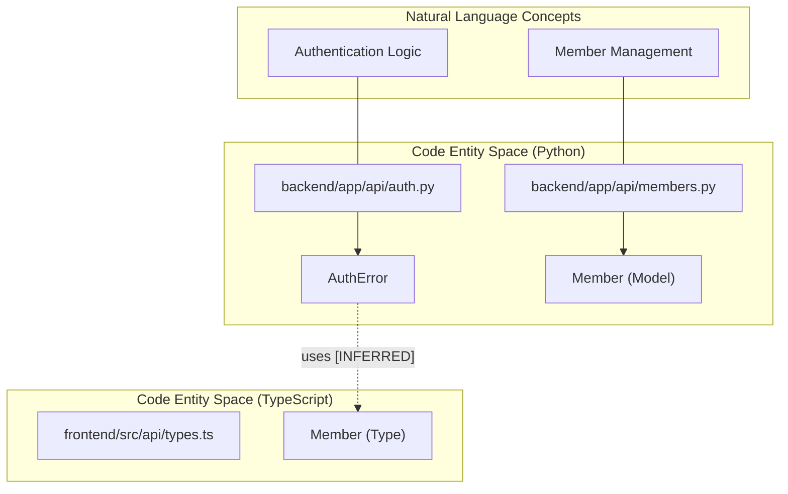
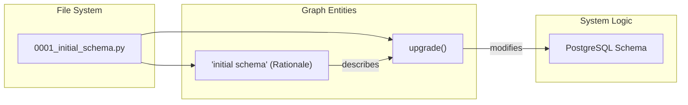

# rsl-siege-manager Case Study (full-stack monorepo)

<details>
<summary>관련 소스 파일</summary>

다음 파일들은 이 위키 페이지를 생성하기 위한 컨텍스트로 사용되었습니다.

- [worked/rsl-siege-manager/GRAPH_REPORT.md](worked/rsl-siege-manager/GRAPH_REPORT.md)
- [worked/rsl-siege-manager/README.md](worked/rsl-siege-manager/README.md)
- [worked/rsl-siege-manager/graph.html](worked/rsl-siege-manager/graph.html)
- [worked/rsl-siege-manager/graph.json](worked/rsl-siege-manager/graph.json)
- [worked/rsl-siege-manager/manifest.json](worked/rsl-siege-manager/manifest.json)
- [worked/rsl-siege-manager/review.md](worked/rsl-siege-manager/review.md)

</details>


이 페이지는 commit `6085fd66`의 `glitchwerks/rsl-siege-manager` repository에 대해 `graphify`를 실행한 결과를 문서화한다. 이 corpus는 Python(FastAPI) backend, TypeScript(React/Vite) frontend, Python Discord bot을 포함하는 real-world full-stack monorepo를 나타낸다.

이 study는 `graphify`가 mixed-language environments, large test suites, database migration documentation을 어떻게 처리하는지 살펴본다.

## Corpus Overview

`rsl-siege-manager` codebase는 구조적으로 복잡하므로 cross-language inference와 community detection을 평가하기에 이상적인 후보이다.

| Component | Technology | Location |
| :--- | :--- | :--- |
| **Backend** | Python (FastAPI + SQLAlchemy) | `backend/` |
| **Frontend** | TypeScript (React + Vite + Tailwind) | `frontend/` |
| **Bot** | Python (Discord.py) | `bot/` |
| **Database** | Alembic Migrations | `backend/alembic/` |
| **Tests** | Pytest & Vitest | `backend/tests/`, `frontend/src/**/__tests__/` |

출처: [worked/rsl-siege-manager/README.md:1-10](), [worked/rsl-siege-manager/README.md:75-83]()

## Key Findings

### 1. Test Factory Dominance
`.graphifyignore` file 없이 extraction을 실행하면 test fixtures와 factories가 "God Nodes"(highest degree centrality)를 지배하는 경향이 있다. 이번 실행에서는 top 10 nodes 중 6개가 test-related helpers였다.

*   **Observation:** `_make_siege()`(124 edges)와 `_make_member()`(92 edges)가 가장 많이 연결된 entities였다 [worked/rsl-siege-manager/GRAPH_REPORT.md:141-142]().
*   **Cause:** Test factories는 suite의 거의 모든 test case에서 domain objects를 설정하기 위해 호출되도록 설계되어 자연스럽게 edges를 축적한다 [worked/rsl-siege-manager/review.md:31-34]().
*   **Mitigation:** domain-only insights를 원하는 users는 `.graphifyignore`를 사용해 test directories를 제외해야 한다 [worked/rsl-siege-manager/review.md:35-36]().

### 2. Cross-Language Inference
`graphify`는 name-based similarity를 사용해 Python과 TypeScript entities 사이의 relationships를 성공적으로 식별하지만, 이 relationships는 `INFERRED`로 표시된다.

*   **API Contracts:** `PostPriorityResponse`(Python Pydantic schema)와 `PostPriorityConfig`(TypeScript type) 사이에서 inferred edge가 감지되었다 [worked/rsl-siege-manager/GRAPH_REPORT.md:153-156]().
*   **False Positives:** 서로 다른 languages에서 동일한 이름을 가진 types(예: `Member`)는 runtime dependency가 아니라 shared domain vocabulary를 나타내는 inferred edges를 trigger할 수 있다 [worked/rsl-siege-manager/review.md:80-91]().

### 3. Documentation & Rationale Nodes
corpus의 17개 Alembic migrations는 `graphify`가 docstrings를 어떻게 처리하는지 보여준다. 각 migration file(예: `0001_initial_schema.py`)은 "initial schema" 또는 "add autofill columns" 같은 migration purpose를 포함하는 `rationale` node를 생성한다 [worked/rsl-siege-manager/graph.json:78-103](). 이 nodes는 같은 migration 안의 code entities와 연결되어 database changes에 대한 semantic context를 제공한다.

## System Mapping: Code to Natural Language

다음 diagrams는 physical file structure와 `graphify`가 식별한 logical entities 사이의 gap을 연결한다.

### Backend Dependency Mapping
이 다이어그램은 `graphify`가 API routes를 underlying data models 및 frontend로 향하는 inferred links에 어떻게 연결하는지 보여준다.

Title: Backend to Frontend Inferred Linkage

출처: [worked/rsl-siege-manager/GRAPH_REPORT.md:159-160](), [worked/rsl-siege-manager/manifest.json:78-125]()

### Database Migration Context
`graphify`가 Alembic migration docstrings에서 semantic meaning을 extract하는 방식.

Title: Migration Rationale Mapping

출처: [worked/rsl-siege-manager/graph.json:52-85](), [worked/rsl-siege-manager/README.md:81-82]()

## Reproducing the Run

이 case study에서 제공된 artifacts를 재현하려면 다음을 수행한다.

1.  **Clone the Repo:**
    ```bash
    git clone https://github.com/glitchwerks/rsl-siege-manager
    cd rsl-siege-manager
    git checkout 6085fd66
    ```
2.  **Run Extraction:**
    tests를 포함하려면 `.graphifyignore`가 없는지 확인한다.
    ```bash
    graphify extract .
    ```
3.  **Inspect Artifacts:**
    *   `graphify-out/GRAPH_REPORT.md`: primary text summary.
    *   `graphify-out/graph.json`: raw node/edge data.
    *   `graphify-out/graph.html`: Interactive visualization.

출처: [worked/rsl-siege-manager/README.md:12-61]()

## Interpreting Artifacts

### GRAPH_REPORT.md
이 corpus의 report는 **1886 nodes**와 **3876 edges**를 식별했다 [worked/rsl-siege-manager/GRAPH_REPORT.md:7](). 주요 내용은 다음과 같다.
*   **God Nodes:** 가장 많이 연결된 functions를 나열한다(이번 실행에서는 test factories가 지배적) [worked/rsl-siege-manager/GRAPH_REPORT.md:140-150]().
*   **Surprising Connections:** cross-language 및 cross-community inferred links를 나열한다 [worked/rsl-siege-manager/GRAPH_REPORT.md:152-163]().
*   **Community Summaries:** 141 communities가 감지되었지만 cohesion은 대체로 낮았다(avg 0.05 - 0.17). 이는 graph topology가 매우 분산되어 있거나 약하게 결합되어 있음을 나타낸다 [worked/rsl-siege-manager/review.md:93-102]().

### graph.json
JSON export는 `source_location`(line numbers), `community` IDs, search용 `norm_label`을 포함해 모든 node에 대한 상세 metadata를 포함한다 [worked/rsl-siege-manager/graph.json:5-30]().

출처: [worked/rsl-siege-manager/GRAPH_REPORT.md:1-167](), [worked/rsl-siege-manager/graph.json:1-100]()
