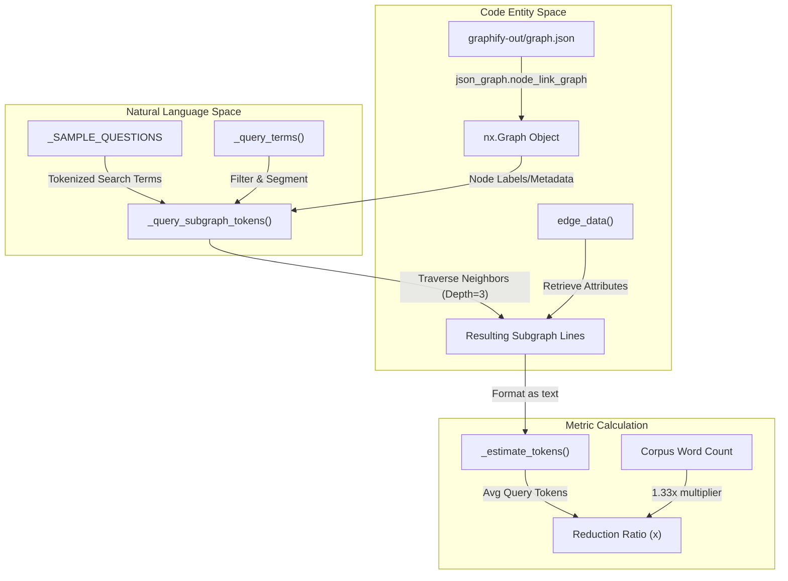
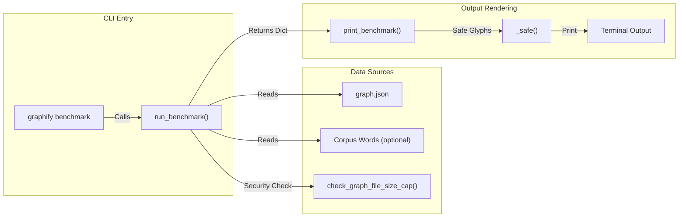

# Token Reduction Benchmark

<details>
<summary>관련 소스 파일</summary>

다음 파일들은 이 위키 페이지를 생성하기 위한 컨텍스트로 사용되었습니다.

- [graphify/benchmark.py](graphify/benchmark.py)
- [graphify/ingest.py](graphify/ingest.py)
- [graphify/serve.py](graphify/serve.py)
- [tests/test_benchmark.py](tests/test_benchmark.py)
- [tests/test_serve.py](tests/test_serve.py)

</details>


Token Reduction Benchmark는 `graphify/benchmark.py`에 위치한 diagnostic utility로, "naive" full-corpus approach와 비교해 information retrieval에 knowledge graph를 사용할 때 얻는 효율성 향상을 정량화한다. 전체 corpus의 raw text 대신 targeted graph context를 제공했을 때, 표준 architectural questions 집합에 답하기 위해 LLM이 처리해야 하는 tokens 수를 측정한다.

### Core Logic과 Flow

benchmark는 build된 graph를 load하고 일련의 Breadth-First Search(BFS) queries를 simulate하는 방식으로 동작한다. 결과 subgraphs의 estimated tokens를 input corpus의 total estimated tokens와 비교한다.

#### Benchmark Execution Pipeline

다음 다이어그램은 `run_benchmark()`가 "Natural Language Space"(questions)를 "Code Entity Space"(graph nodes와 edges)에 연결하여 reduction ratio를 계산하는 방식을 보여준다.

**Token Reduction Data Flow**

**출처:** [graphify/benchmark.py:39-75](), [graphify/benchmark.py:87-136](), [graphify/serve.py:87-101]()

---

### Implementation Details

#### Token Estimation Heuristics
`graphify`는 가능한 한 heavy dependencies를 피하기 때문에, benchmarking에 formal tokenizer(`tiktoken` 같은 것) 대신 mathematical approximations를 사용한다.
*   **`_CHARS_PER_TOKEN`**: 표준 approximation으로 `4`로 설정된다 [graphify/benchmark.py:13-13]().
*   **`_estimate_tokens()`**: `max(1, len(text) // _CHARS_PER_TOKEN)`로 계산된다 [graphify/benchmark.py:35-36]().
*   **Corpus Word-to-Token Ratio**: raw word counts에서 tokens를 estimate하기 위해 `1.33x` multiplier(`words * 100 // 75`)를 사용한다 [graphify/benchmark.py:113-113]().

#### Subgraph Context Simulation
`_query_subgraph_tokens()` function은 agent가 graph에서 context를 retrieve하는 방식을 simulate한다.
1.   **Keyword Matching**: `_query_terms()` [graphify/serve.py:87-101]()를 사용해 question에서 terms를 extract하고, node label에 terms가 나타나는지에 따라 nodes를 score한다 [graphify/benchmark.py:41-47]().
2.   **Seed Selection**: 상위 3개의 matching nodes가 BFS starting points로 선택된다 [graphify/benchmark.py:48-49]().
3.   **BFS Expansion**: 기본 `depth` 3까지 graph를 traverse하며 visited nodes와 seen edges를 추적한다 [graphify/benchmark.py:53-64]().
4.   **Serialization**: visited nodes와 edges는 labels, source files, relations를 포함하는 text representation으로 변환된다. edge attributes를 retrieve하기 위해 `edge_data()` [graphify/build.py:9-11]()를 사용한다 [graphify/benchmark.py:66-73]().

#### Sample Questions
benchmark는 서로 다른 runs에서 일관된 measurement를 보장하기 위해 `_SAMPLE_QUESTIONS`에 정의된 static list of architectural questions를 사용한다 [graphify/benchmark.py:78-84]().
*   "how does authentication work"
*   "what is the main entry point"
*   "how are errors handled"
*   "what connects the data layer to the api"
*   "what are the core abstractions"

**출처:** [graphify/benchmark.py:39-75](), [graphify/benchmark.py:78-84](), [graphify/serve.py:87-101](), [graphify/build.py:9-11]()

---

### Key Functions

| Function | Purpose | Key Inputs |
| :--- | :--- | :--- |
| `run_benchmark()` | metrics를 계산하는 primary entry point. `check_graph_file_size_cap()`을 통한 security check를 포함한다. | `graph_path`, `corpus_words`, `questions` |
| `_query_subgraph_tokens()` | BFS를 통해 특정 string에 대한 graph context의 size를 estimate한다. | `G` (Graph), `question`, `depth` |
| `print_benchmark()` | results를 사람이 읽을 수 있는 CLI report로 format한다. | `result` dict |
| `_safe()` | `UnicodeEncodeError`를 방지하기 위해 Windows consoles(cp1252)용 Unicode glyph fallbacks를 처리한다. | `unicode_char`, `ascii_fallback` |

**출처:** [graphify/benchmark.py:16-27](), [graphify/benchmark.py:39-136](), [graphify/benchmark.py:139-156](), [graphify/security.py:10-10]()

---

### Output Format과 Compatibility

`print_benchmark()` function은 효율성을 요약하는 report를 생성한다. UTF-8을 지원하지 않는 Windows consoles에서 horizontal rules와 arrows(예: `→`)가 crash를 일으키지 않도록 `_safe()`와 `_hr()`를 사용한다 [graphify/benchmark.py:16-32]().

**System Component Interaction**

**출처:** [graphify/benchmark.py:87-105](), [graphify/benchmark.py:139-156]()

**Example CLI Output Structure:**
```text
graphify token reduction benchmark
--------------------------------------------------
  Corpus:          10,000 words -> ~13,333 tokens (naive)
  Graph:           150 nodes, 300 edges
  Avg query cost:  ~250 tokens
  Reduction:       53.3x fewer tokens per query

  Per question:
    [62.1x] how does authentication work
    [45.2x] what is the main entry point
```

### Corpus Estimation
`corpus_words`가 제공되지 않으면(기존 `graph.json`에서 original detection manifest 없이 실행하는 경우), system은 node당 약 50 words of context를 가정하여 corpus size를 estimate한다: `corpus_words = G.number_of_nodes() * 50` [graphify/benchmark.py:109-111]().

**출처:** [graphify/benchmark.py:109-113](), [graphify/benchmark.py:145-156]()
