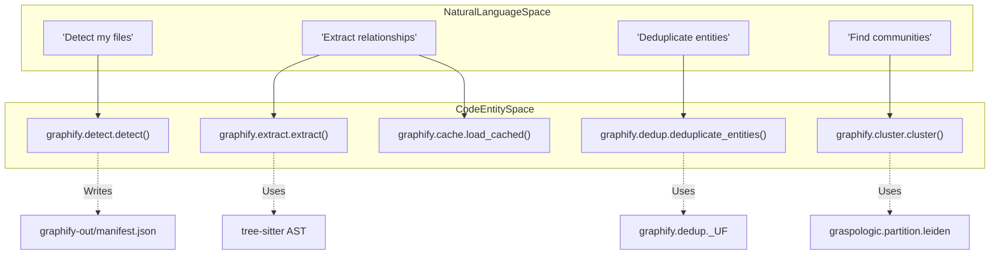
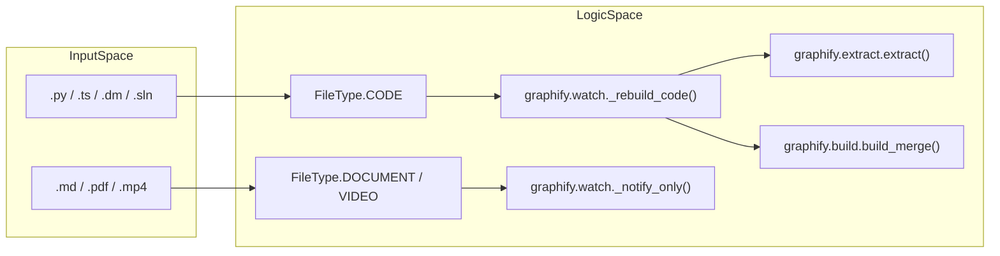

# Glossary

관련 소스 파일

다음 파일들은 이 위키 페이지를 생성하기 위한 컨텍스트로 사용되었습니다.

- [CHANGELOG.md](CHANGELOG.md)
- [docs/how-it-works.md](docs/how-it-works.md)
- [graphify/analyze.py](graphify/analyze.py)
- [graphify/build.py](graphify/build.py)
- [graphify/cache.py](graphify/cache.py)
- [graphify/cluster.py](graphify/cluster.py)
- [graphify/dedup.py](graphify/dedup.py)
- [graphify/detect.py](graphify/detect.py)
- [graphify/extract.py](graphify/extract.py)
- [graphify/google_workspace.py](graphify/google_workspace.py)
- [graphify/llm.py](graphify/llm.py)
- [graphify/querylog.py](graphify/querylog.py)
- [graphify/report.py](graphify/report.py)
- [graphify/skill.md](graphify/skill.md)
- [graphify/watch.py](graphify/watch.py)
- [pyproject.toml](pyproject.toml)
- [tests/test_analyze.py](tests/test_analyze.py)
- [tests/test_build.py](tests/test_build.py)
- [tests/test_claude_cli_backend.py](tests/test_claude_cli_backend.py)
- [tests/test_claude_md.py](tests/test_claude_md.py)
- [tests/test_cli_export.py](tests/test_cli_export.py)
- [tests/test_cluster.py](tests/test_cluster.py)
- [tests/test_dedup.py](tests/test_dedup.py)
- [tests/test_detect.py](tests/test_detect.py)
- [tests/test_google_workspace.py](tests/test_google_workspace.py)
- [tests/test_llm_backends.py](tests/test_llm_backends.py)
- [tests/test_provider_registry.py](tests/test_provider_registry.py)
- [tests/test_querylog.py](tests/test_querylog.py)
- [tests/test_rationale.py](tests/test_rationale.py)
- [tests/test_skillgen.py](tests/test_skillgen.py)
- [tests/test_watch.py](tests/test_watch.py)
- [tests/test_wheel_packaging.py](tests/test_wheel_packaging.py)
- [tools/skillgen/gen.py](tools/skillgen/gen.py)
- [tools/skillgen/platforms.toml](tools/skillgen/platforms.toml)

이 페이지는 `graphify` codebase 전반에서 사용되는 technical terms, jargon, domain-specific concepts를 정의한다. pipeline을 구동하는 data structures와 algorithmic logic을 onboarding engineers가 이해할 수 있도록 돕는 reference 역할을 한다.

## Core Concepts

### 1. God Node
"God Node"는 knowledge graph 안에서 central hub 역할을 하는 high-degree entity이다. 이는 core `Client` class나 primary `Value` object처럼 corpus에서 가장 많이 연결된 real abstractions를 나타낸다 [graphify/analyze.py:95-100]().
*   **Implementation**: `networkx`에서 degree 기준으로 nodes를 sorting하여 식별된다 [graphify/analyze.py:101-102]().
*   **Filtering**: Synthetic nodes(file hubs와 method stubs) 및 generic JSON keys(예: `id`, `type`, `name`)는 `_is_file_node`와 `_is_json_key_node`를 통해 명시적으로 제외된다 [graphify/analyze.py:50-93]().
*   **Builtin Noise**: `_PYTHON_ANNOTATION_NOISE` filter(및 analysis의 `_BUILTIN_NOISE_LABELS`)는 `str`, `int`, `bool`, `MagicMock` 같은 types가 god nodes가 되지 않도록 suppress한다 [graphify/analyze.py:11-16](), [CHANGELOG.md:9-9]().

### 2. Community와 Cohesion Score
nodes가 network의 나머지 부분보다 서로 더 조밀하게 연결된 graph partition.
*   **Detection**: `graspologic` library를 통해 **Leiden algorithm**을 사용한다 [graphify/cluster.py:21-52]().
*   **Oversized Splitting**: community가 graph size의 25%를 초과하면 `graphify`는 navigable clusters를 유지하기 위해 이를 recursively split한다 [graphify/cluster.py:55-104]().
*   **Cohesion Score**: 실제 intra-community edges와 가능한 최대 edges의 비율을 계산하는 metric(0.0부터 1.0까지) [graphify/cluster.py:125-134]().
*   **Stable IDs**: `remap_communities_to_previous`는 node overlap을 matching하여 incremental updates 전반에서 community IDs가 stable하게 유지되도록 보장한다 [graphify/cluster.py:137-175]().

### 3. Entity Deduplication (MinHash/LSH)
near-identical entities(예: `AuthManager` vs `auth_manager`)를 merge하기 위한 multi-pass pipeline [graphify/dedup.py:1-5]().
*   **Entropy Gate**: false positives를 방지하기 위해 low-entropy labels(예: `x`, `tmp`)의 deduplication을 차단한다 [graphify/dedup.py:117-119]().
*   **Blocking**: candidate pairs를 효율적으로 찾기 위해 **MinHash**와 **Locality Sensitive Hashing (LSH)**를 사용한다 [graphify/dedup.py:11-13]().
*   **Verification**: **Community Boost**와 함께 **Jaro-Winkler** similarity를 적용한다. 두 nodes가 이미 같은 community를 공유하면 score bonus를 부여한다 [graphify/dedup.py:119-120]().
*   **Union-Find**: 식별된 duplicates를 하나의 survivor node로 merge하면서 edges를 rewiring한다 [graphify/dedup.py:90-113]().

### 4. Audit Trail (Confidence Tags)
graph의 모든 relationship(edge)은 data의 "honest" representation을 유지하기 위해 confidence level로 tag된다 [graphify/report.py:45-55]().
*   **EXTRACTED**: AST analysis를 통해 source code에서 명시적으로 발견됨 [graphify/extract.py:139]().
*   **INFERRED**: LLM subagents가 만든 합리적 inferences(예: `semantically_similar_to`) [graphify/analyze.py:192-194]().
*   **AMBIGUOUS**: review 대상으로 표시됨. "Surprising Connections" scoring에서 더 높은 weight가 부여된다 [graphify/analyze.py:194-195]().

### 5. Semantic Cache
중복 LLM processing을 방지하는 SHA256-based content-addressable storage system [graphify/cache.py:1-7]().
*   **Logic**: file content(`.md` files의 경우 YAML frontmatter 제거)와 root 기준 relative path의 hash를 계산한다 [graphify/cache.py:97-146]().
*   **Portability**: cache가 clones 전반에서 portable하도록 저장 전에 payload의 `source_file` fields를 relative path로 변환한다 [graphify/cache.py:149-183]().

---

## Technical Terms와 Jargon

| Term | Definition | Code Pointer |
| :--- | :--- | :--- |
| **AST Extraction** | `tree-sitter`를 사용하는 deterministic structural analysis of code. | [graphify/extract.py:1-10]() |
| **Bifurcated Update** | `watch` logic: code에는 즉시 AST rebuilds, docs에는 deferred flags. | [graphify/watch.py:240-270]() |
| **Norm Label** | robust search에 사용되는 diacritic-insensitive, lowercase label. | [graphify/serve.py:124-127]() |
| **Ghost Duplicates** | 같은 label/file을 갖지만 ID가 다른 nodes(예: AST vs Semantic). build 시 auto-merged된다. | [CHANGELOG.md:10-10]() |
| **Surprising Connection** | structurally distant communities 또는 서로 다른 file categories를 bridge하는 edge. | [graphify/analyze.py:119-149]() |
| **Hyperedge** | visualizations에서 shaded region으로 render되는 nodes의 grouping. | [graphify/export.py:64-104]() |
| **Rationale Node** | inference 뒤의 reasoning을 설명하기 위해 LLM이 생성한 node. | [graphify/semantic_cleanup.py:1-15]() |
| **AffectedHit** | BFS reverse traversal 중 change의 영향을 받은 node를 추적하는 Dataclass. | [graphify/affected.py:15-25]() |
| **MCP** | AI agents에 graph tools를 노출하기 위한 **Model Context Protocol** server. | [graphify/serve.py:1-10]() |
| **Shrink Guard** | update가 graph의 20% 초과를 삭제하려는 경우 warn하는 `_check_shrink` logic. | [graphify/watch.py:214-233]() |
| **Whisper Prompting** | `faster-whisper` transcriber에 domain context를 제공하기 위해 God Nodes를 사용하는 것. | [graphify/transcribe.py:22-30]() |

---

## Data Flow: Natural Language에서 Code Entities까지

### Pipeline Stage Mapping
이 다이어그램은 사용자의 high-level pipeline stages를 이를 담당하는 특정 functions 및 files에 연결한다.

**출처:** [graphify/detect.py:1-20](), [graphify/extract.py:1-10](), [graphify/dedup.py:1-15](), [graphify/cluster.py:21-52]().

### File Type와 Logic Branching
이 다이어그램은 `graphify`가 incoming files를 classify하는 방식과 `watch` 및 `extraction` phases에서 어떤 code paths가 이를 처리하는지 보여준다.

**출처:** [graphify/detect.py:18-33](), [graphify/watch.py:11-20](), [graphify/build.py:107-153]().

---

## Infrastructure와 Files

### 1. manifest.json과 graphify-out
`graphify-out/` directory는 central artifact store이다. `manifest.json`은 file hashes, types, last-processed timestamps를 포함해 corpus의 state를 추적한다 [graphify/detect.py:26]().

### 2. .graphifyignore / .graphifyinclude
file discovery 중 사용자가 patterns를 명시적으로 exclude하거나 include할 수 있게 하는 control files [graphify/detect.py:194-196](). `graphify remember` data를 보존하기 위해 `graphify-out/memory/` files는 ignore filters를 우회한다는 점에 유의하라 [graphify/detect.py:202-205]().

### 3. TSConfig Alias Resolver
TypeScript path aliases(예: `@/components` -> `src/components`)를 resolve하기 위해 `tsconfig.json`의 `extends` chains를 따라가는 extraction engine의 recursive logic [graphify/extract.py:100-145]().

### 4. Payload-bearing Hooks
commits와 graph를 sync 상태로 유지하기 위해 `graphify hook install`로 설치되는 Git hooks. 0.8.31부터 GUI clients에서 reliability를 보장하기 위해 absolute `sys.executable`을 embed한다 [CHANGELOG.md:21-24]().
*   **Pending Queue**: rebuild가 locked 상태이면 changed paths가 `.pending_changes`에 queued되어 lock-holder에 의해 merge된다 [graphify/watch.py:16-36]().
*   **Advisory Lock**: `_rebuild_lock`은 concurrent builds를 방지하기 위해 `fcntl.flock`을 사용한다 [graphify/watch.py:91-149]().

### 5. Progressive-Disclosure Skills
context token usage를 줄이기 위해 lean core와 on-demand `references/` sidecar로 나뉜 host-specific `SKILL.md` files(예: Claude Code, Cursor용) [CHANGELOG.md:35-35]().

### 6. Query Logging
audit와 performance tracking을 위해 모든 `graphify query` 및 MCP calls를 JSONL format으로 `~/.cache/graphify-queries.log`에 logging한다 [graphify/querylog.py:1-15](), [CHANGELOG.md:25-25]().

**출처:** [graphify/detect.py:26-33](), [graphify/extract.py:100-145](), [graphify/watch.py:16-149](), [graphify/cache.py:1-15](), [graphify/querylog.py:1-15](), [CHANGELOG.md:5-40]().
