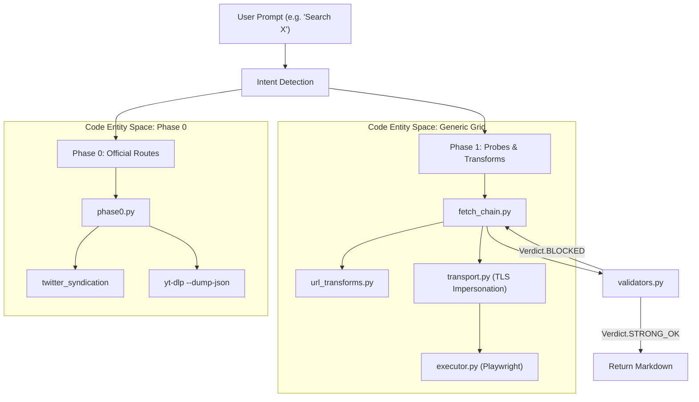
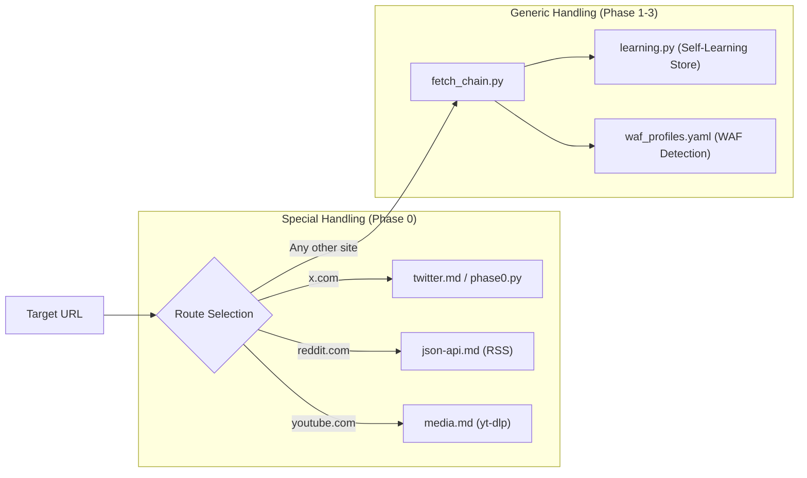

# 개요

관련 소스 파일

다음 파일들은 이 위키 페이지를 생성하기 위한 컨텍스트로 사용되었습니다.

- [.claude-plugin/plugin.json](.claude-plugin/plugin.json)
- [PLATFORMS.md](PLATFORMS.md)
- [README.es.md](README.es.md)
- [README.ja.md](README.ja.md)
- [README.ko.md](README.ko.md)
- [README.md](README.md)
- [README.zh.md](README.zh.md)
- [assets/hero.png](assets/hero.png)
- [assets/pipeline.png](assets/pipeline.png)

`insane-search`는 **Claude Code**를 위해 설계된 탄력적인 공개 페이지 검색 엔진입니다. AI 에이전트가 Web Application Firewalls(WAF), 안티봇 챌린지(CAPTCHA), 또는 플랫폼별 제한으로 보호되는 URL을 가져오려고 할 때 마주치는 "접근할 수 없다"는 문제를 해결하기 위해 존재합니다.

핵심 철학은 **적응형 단계 상승**입니다. 시스템은 URL을 미리 판단하지 않습니다. 대신 가벼운 공개 API 탐색에서 시작해, 필요한 경우에만 전체 브라우저 에뮬레이션으로 단계적으로 상승하는 다단계 파이프라인을 거칩니다.

## 상위 수준 기능

| 기능 | 설명 |
| :--- | :--- |
| **API 키 불필요** | 인증 요구사항을 피하기 위해 공개 엔드포인트, 신디케이션 피드, 신원 스푸핑을 사용합니다. |
| **WAF 우회** | Cloudflare, Akamai, DataDome을 우회하기 위해 `curl_cffi`를 사용해 브라우저 TLS 지문(JA3/JA4)을 가장합니다. |
| **Phase 0→3 파이프라인** | 공식 API에서 탐색으로, 이어서 TLS 가장으로, 마지막으로 헤드리스 브라우저로 단계적으로 상승합니다. |
| **설정 불필요** | 최초 실행 시 `yt-dlp` 또는 `curl_cffi` 같은 누락된 의존성을 자동으로 감지하고 설치합니다. |
| **개인정보 보호 중심** | 공개 콘텐츠에 대해서만 엄격히 동작하며, 로그인 장벽과 페이월에서는 중단하도록 프로그래밍되어 있습니다. |

출처: [.claude-plugin/plugin.json:1-42](), [README.md:50-68]()

## 시스템 아키텍처

엔진은 일련의 폴백 전략으로 구성됩니다. 표준 fetch가 실패하면(예: `403 Forbidden` 반환), `insane-search`는 동일한 콘텐츠로 가는 대체 경로를 찾기 위해 내부 로직을 실행합니다.

### 단계 상승 파이프라인

다음 다이어그램은 "차단된" 엔터티(예: Tweet 또는 Reddit 스레드)에 대한 요청이 자연어 의도에서 검색을 처리하는 특정 코드 엔터티로 어떻게 이동하는지 보여줍니다.

**다이어그램: 의도에서 코드 엔터티로의 매핑**

출처: [README.md:79-95](), [PLATFORMS.md:4-10]()

## Claude Code와의 통합

`insane-search`는 Claude Code용 플러그인으로 통합됩니다. 새로운 명령은 필요하지 않으며, 환경에 연결되어 향상된 `fetch` 기능을 제공합니다.

*   **플러그인 인프라**: `.claude-plugin/plugin.json`을 통해 관리됩니다.
*   **자동 설치**: `setup/setup.sh` 스크립트는 로컬 환경에 필요한 Python 헤더와 바이너리가 있는지 보장합니다.
*   **업데이트 알림기**: 백그라운드 훅(`gptaku-update-check.cjs`)이 새 버전을 확인하여, 우회 전략이 변화하는 WAF에 대응해 최신 상태를 유지하도록 합니다.

설치 및 설정에 대한 자세한 내용은 [시작하기 및 설치](#1.1)를 참조하세요.

출처: [.claude-plugin/plugin.json:1-4](), [PLATFORMS.md:73-89]()

## 지원 플랫폼

엔진은 범용적이지만, 공식적이지만 종종 숨겨져 있는 공개 엔드포인트를 제공하는 트래픽이 많은 플랫폼을 위한 "Phase 0" 로직을 포함합니다.

**다이어그램: 플랫폼 라우팅 맵**

플랫폼의 전체 목록과 각 플랫폼별 검색 방법은 [지원 플랫폼 및 참조 색인](#1.2)을 참조하세요.

출처: [PLATFORMS.md:11-48](), [README.md:46-48]()

## 윤리적 및 법적 경계

이 도구는 엄격히 **공개 콘텐츠 리더**입니다. 
*   **인증 없음**: 로그인된 세션의 쿠키를 저장하거나 페이월을 우회하지 않습니다.
*   **투명성**: 사이트가 로그인 장벽 뒤에 있으면, 엔진은 보안 우회를 시도하는 대신 `authentication required`를 반환합니다.
*   **안전성**: 에이전트가 내부 네트워크 리소스에 접근하지 못하도록 SSRF(Server-Side Request Forgery) 보호 장치를 포함합니다.

라이선스와 안전 제약에 대한 자세한 내용은 [법적 고지, 면책 조항 및 라이선스](#1.3)를 참조하세요.

출처: [README.md:97-104](), [PLATFORMS.md:90-96]()

## 하위 페이지 탐색

*   **[시작하기 및 설치](#1.1)**: 마켓플레이스를 통한 설치, 의존성 관리, 최초 실행 동작.
*   **[지원 플랫폼 및 참조 색인](#1.2)**: X, Reddit, YouTube 및 학술 플랫폼 처리에 대한 상세 지도.
*   **[법적 고지, 면책 조항 및 라이선스](#1.3)**: MIT 라이선스, 사용 경계, 책임 면책 조항.
