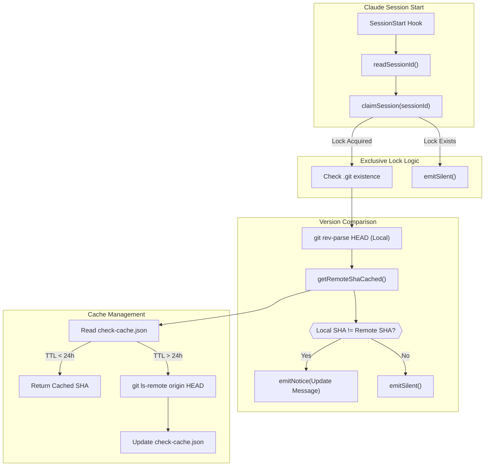
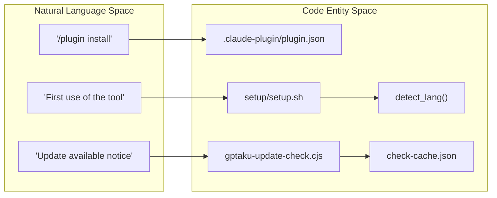

# 시작하기 및 설치

<details>
<summary>관련 소스 파일</summary>

다음 파일들은 이 위키 페이지를 생성하기 위한 컨텍스트로 사용되었습니다.

- [.claude-plugin/plugin.json](.claude-plugin/plugin.json)
- [README.md](README.md)
- [setup/gptaku-update-check.cjs](setup/gptaku-update-check.cjs)
- [setup/setup.sh](setup/setup.sh)

</details>


이 페이지는 `insane-search`를 Claude Code 플러그인으로 설치하기 위한 기술 가이드를 제공하며, 최초 실행 초기화 과정, 자동 의존성 관리, 업데이트 알림을 지원하는 인프라를 자세히 설명합니다.

## 플러그인 마켓플레이스를 통한 설치

`insane-search`는 `gptaku-plugins` 마켓플레이스의 일부로 배포됩니다. Claude Code CLI 환경과 직접 통합됩니다.

### 설치 명령
플러그인을 설치하려면 Claude Code가 활성화된 터미널에서 다음 명령을 실행하세요.

```bash
/plugin marketplace add https://github.com/fivetaku/gptaku_plugins.git
/plugin install insane-search@gptaku-plugins
/reload-plugins
```
출처: [README.md:28-32]()

### 마켓플레이스 매니페스트
플러그인의 정체성과 기능은 매니페스트 파일에 정의되며, 이 파일은 버전, 작성자, 그리고 Claude Code가 플러그인의 범위(예: `web-access`, `tls-impersonation`, `yt-dlp`)를 이해하는 데 사용하는 다양한 키워드를 지정합니다.

출처: [.claude-plugin/plugin.json:1-42]()

## 최초 실행 설정 및 초기화

설치 시 또는 최초 실행 시, 시스템은 환경이 올바르게 구성되었는지 확인하기 위해 특수 설정 스크립트를 실행합니다. 이 과정은 멱등적이며 실행을 방해하지 않도록 설계되었습니다.

### 설정 로직(`setup.sh`)
`setup/setup.sh` 스크립트는 몇 가지 중요한 인프라 작업을 수행합니다.
1.  **환경 검증**: `node`와 `python3`의 존재 여부를 확인합니다 [setup/setup.sh:105-106]().
2.  **업데이트 훅 삽입**: Claude `settings.json` 파일의 `SessionStart` 훅 아래에 `gptaku-update-check.cjs` 스크립트를 삽입합니다 [setup/setup.sh:110-123]().
3.  **언어 감지**: 과거 Claude 세션 트랜스크립트(`.jsonl` 파일)를 분석하여 문자 범위를 세는 방식으로 사용자의 선호 언어(한국어, 일본어 또는 영어)를 판단합니다 [setup/setup.sh:32-84]().
4.  **멱등성 마커**: 중복 설정 작업을 방지하기 위해 `~/.gptaku-setup/`에 마커 파일을 생성합니다 [setup/setup.sh:24-27]().

### Star 상태 머신
설정 스크립트는 방해를 최소화하면서 커뮤니티 지원을 장려하기 위해 "Star" 요청 흐름을 관리합니다. 이 흐름은 `~/.gptaku-setup/insane-search.star.json`에 기록되는 상태 머신을 사용합니다.

| 상태 | 트리거 | 동작 |
| :--- | :--- | :--- |
| `asked` | `setup.sh ask` | 어시스턴트에 `STAR_ASK <lang>`을 출력합니다 [setup/setup.sh:133-136](). |
| `yes` | `setup.sh star yes` | 사용자가 인증되어 있으면 `gh api`를 사용해 저장소에 Star를 남깁니다 [setup/setup.sh:92-100](). |
| `no` | `setup.sh star no` | 향후 프롬프트를 억제하기 위해 결정을 기록합니다 [setup/setup.sh:92-94](). |

출처: [setup/setup.sh:1-138]()

## 업데이트 알림 인프라

`insane-search`에는 세션 성능에 영향을 주지 않으면서 마켓플레이스의 새 버전을 모니터링하는 공유 업데이트 알림 시스템이 포함되어 있습니다.

### 데이터 흐름: 업데이트 확인
`gptaku-update-check.cjs` 스크립트는 모든 Claude 세션 시작 시 실행됩니다. 독점 잠금을 사용하여 여러 `gptaku` 플러그인이 설치되어 있더라도 하나만 네트워크 확인을 수행하도록 보장합니다.

제목: 업데이트 알림 로직 흐름

출처: [setup/gptaku-update-check.cjs:32-137]()

## 자동 의존성 설치

`insane-search`의 핵심 기능은 "설정 불필요" 철학입니다. 복잡한 바이너리 의존성을 수동으로 설치할 필요가 없습니다. 대신 해당 의존성이 필요한 fetch를 최초로 실행할 때 필요에 따라 처리합니다.

### 관리되는 주요 의존성
*   **`curl_cffi`**: Phase 2 TLS 가장에 사용됩니다 [README.md:52-55]().
*   **`yt-dlp`**: YouTube와 기타 플랫폼에서 Phase 0 미디어 및 자막 추출에 사용됩니다 [README.md:64-65]().
*   **`playwright`**: Phase 3 헤드리스 브라우저 실행에 사용됩니다 [README.md:52-55]().

### 단계 상승 트리거
시스템은 표준 fetch가 실패할 때만 이러한 설치를 트리거합니다. 예를 들어 요청이 `403 Forbidden` 또는 WAF(Web Application Firewall) 장벽에 부딪히면, `fetch_chain`은 여러 단계를 거치며 해당 단계에 필요한 도구를 확인하고 설치합니다.

제목: 자연어에서 코드 엔터티로의 매핑(설정)

출처: [README.md:50-55](), [setup/setup.sh:32-84](), [setup/gptaku-update-check.cjs:25-30]()
