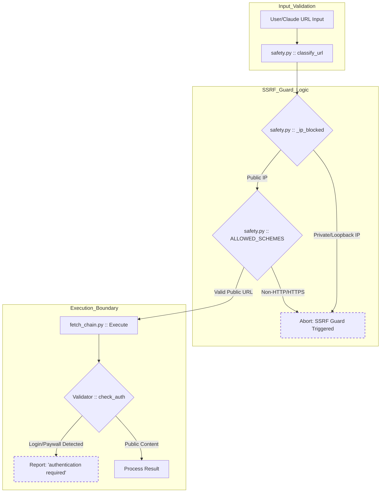
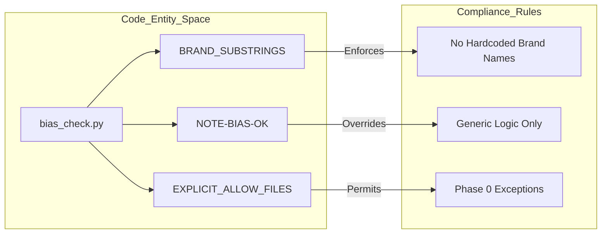

# 법적 고지, 면책 조항 및 라이선스

관련 소스 파일

다음 파일들은 이 위키 페이지를 생성하기 위한 컨텍스트로 사용되었습니다.

- [.gitignore](.gitignore)
- [DISCLAIMER.md](DISCLAIMER.md)
- [LICENSE](LICENSE)

이 페이지는 `insane-search`의 법적 프레임워크, 책임 제한, 의도된 사용 범위를 설명합니다. 복잡한 웹 환경과 Web Application Firewalls(WAF)를 탐색하도록 설계된 도구인 만큼, 사용자와 개발자는 공개 콘텐츠 검색과 무단 접근의 차이를 이해하는 것이 중요합니다.

## MIT 라이선스

`insane-search`는 허용적인 자유 소프트웨어 라이선스인 **MIT License**로 배포됩니다. 이는 소프트웨어의 모든 복사본 또는 상당 부분에 원 저작권 고지와 허가 고지가 포함되는 한, 광범위한 재배포와 수정을 허용합니다.

### 라이선스 텍스트 요약
*   **저작권**: (c) 2026 fivetaku [LICENSE:3-3]()
*   **허가**: 사용, 복사, 수정, 병합, 게시, 배포, 재라이선스 부여 및/또는 사본 판매 권한을 부여합니다 [LICENSE:5-9]().
*   **조건**: 위 저작권 고지와 허가 고지는 모든 복사본에 포함되어야 합니다 [LICENSE:12-13]().
*   **보증**: 소프트웨어는 어떤 종류의 보증도 없이 "AS IS"로 제공됩니다 [LICENSE:15-17]().

출처: [LICENSE:1-21]()

## 책임 면책

작성자와 저작권자는 이 소프트웨어 사용으로 인해 발생하는 손해나 청구에 대한 모든 책임을 명시적으로 부인합니다. 사용자는 전적으로 자신의 책임하에 `insane-search`를 사용합니다 [DISCLAIMER.md:23-27]().

### 주요 법적 조항
| 조항 | 설명 |
| :--- | :--- |
| **보증 없음** | 소프트웨어가 올바르거나 안전하거나 특정 목적에 적합하다는 보장은 없습니다 [DISCLAIMER.md:14-19](). |
| **책임 제한** | 작성자는 계약상 또는 불법행위상 청구, 손해, 손실에 대해 책임지지 않습니다 [DISCLAIMER.md:23-27](). |
| **제휴 없음** | 작성자는 보안 또는 자동화 도구를 포함하여 이 도구를 포크하거나 통합하는 제3자 프로젝트를 보증하거나 지원하지 않습니다 [DISCLAIMER.md:38-46](). |

출처: [DISCLAIMER.md:12-46]()

## 의도된 사용 및 이중 용도 성격

`insane-search`는 범용 개발자 도구입니다. TLS 가장과 요청 라우팅을 위한 정교한 기능을 제공하므로 본질적으로 **이중 용도** 성격을 가집니다 [DISCLAIMER.md:31-34](). 합법적이고 승인된 정보 검색을 위해 공개되었지만, 작성자는 제3자가 이 기술을 어떻게 적용하는지 통제할 수 없습니다.

### 접근 경계의 범위
이 도구는 엄격히 **공개적으로 이용 가능한 콘텐츠만** 읽도록 설계되었습니다 [DISCLAIMER.md:59-59]().

1.  **인증 우회 없음**: 시스템은 로그인과 페이월에서 중단되도록 설계되어 있습니다. 이러한 장벽을 무력화하려고 시도하는 대신 `authentication required`를 보고합니다 [DISCLAIMER.md:59-62]().
2.  **자격 증명 저장 없음**: 엔진은 사용자를 대신해 로그인하지 않으며, 자격 증명을 저장하거나 전송하지 않습니다 [DISCLAIMER.md:61-62]().
3.  **침투 테스트 도구 아님**: 접근 제어를 우회하거나 비공개 시스템에 무단 접근하는 용도로 의도되지 않았습니다 [DISCLAIMER.md:62-64]().

### 사용자 책임
사용자는 다음 사항에 대해 전적으로 책임을 집니다.
*   모든 관련 법률과 규정을 준수하는 것 [DISCLAIMER.md:49-50]().
*   상호작용하는 모든 플랫폼 또는 웹사이트의 서비스 약관(ToS)을 준수하는 것 [DISCLAIMER.md:51-52]().
*   자신이 소유하지 않은 시스템과 상호작용하기 전에 적절한 승인을 얻는 것 [DISCLAIMER.md:52-54]().

출처: [DISCLAIMER.md:29-67]()

## 구현: 안전 및 컴플라이언스 로직

코드베이스는 위에서 설명한 법적 및 안전 경계를 강제하기 위해 여러 기술적 보호 장치를 구현합니다. 이는 주로 `Safety`와 `Bias Check` 모듈에 위치합니다.

### 안전 강제 흐름
다음 다이어그램은 요청이 `Transport` 계층으로 전달되기 전에 `insane-search`가 안전 경계(예: SSRF 보호와 인증 제한)를 어떻게 강제하는지 보여줍니다.

**로직 흐름: 안전 및 컴플라이언스 검증**

출처: [DISCLAIMER.md:59-62](), [skills/insane-search/engine/safety.py:1-50](), [skills/insane-search/engine/fetch_chain.py:100-150]()

### Bias Check 및 No-Site-Name Rule
중립성을 유지하고 "범용" 의도에 위배될 수 있는 특정 브랜드용 하드코딩 우회를 방지하기 위해, 시스템은 린터(`bias_check.py`)를 사용해 **No-Site-Name Rule**을 강제합니다.

**엔터티 매핑: 컴플라이언스 린팅**

출처: [skills/insane-search/engine/bias_check.py:10-80]()

### 기술적 제약 표
다음 표는 법적 요구사항을 특정 코드 구현에 매핑합니다.

| 법적 요구사항 | 코드 엔터티 / 구현 | 목적 |
| :--- | :--- | :--- |
| **SSRF 방지** | `safety.py :: classify_url` | 내부/비공개 네트워크 접근을 방지합니다. |
| **공개 대상만** | `validators.py :: Verdict.AUTH_REQUIRED` | 인증 관문을 명시적으로 식별하고 그 지점에서 중단합니다. |
| **No-Site-Name Rule** | `bias_check.py` | 도구가 표적 스크래퍼가 아니라 범용 엔진으로 유지되도록 보장합니다. |
| **이중 용도 중립성** | `waf_profiles.yaml` | 사이트별 해킹이 아니라 범용 WAF 지문을 사용합니다. |

출처: [DISCLAIMER.md:59-66](), [skills/insane-search/engine/safety.py:1-40](), [skills/insane-search/engine/validators.py:5-25](), [skills/insane-search/engine/bias_check.py:5-30]()
