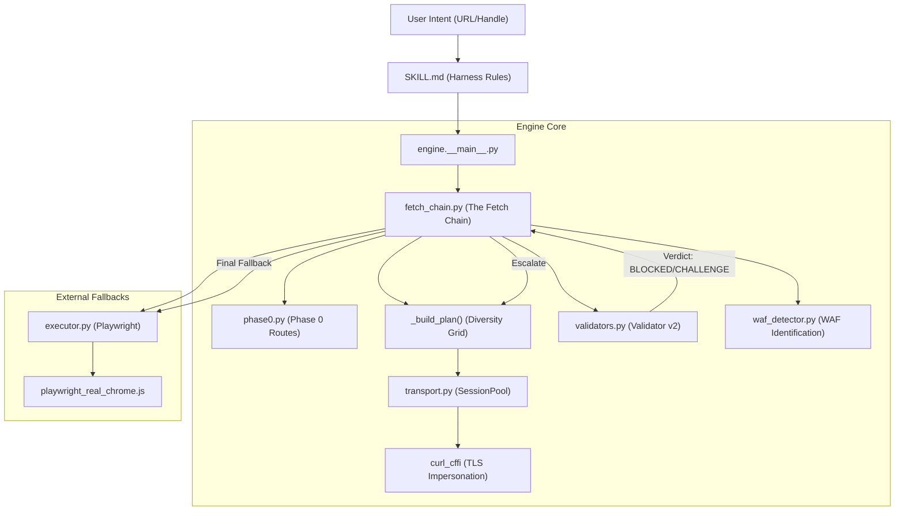
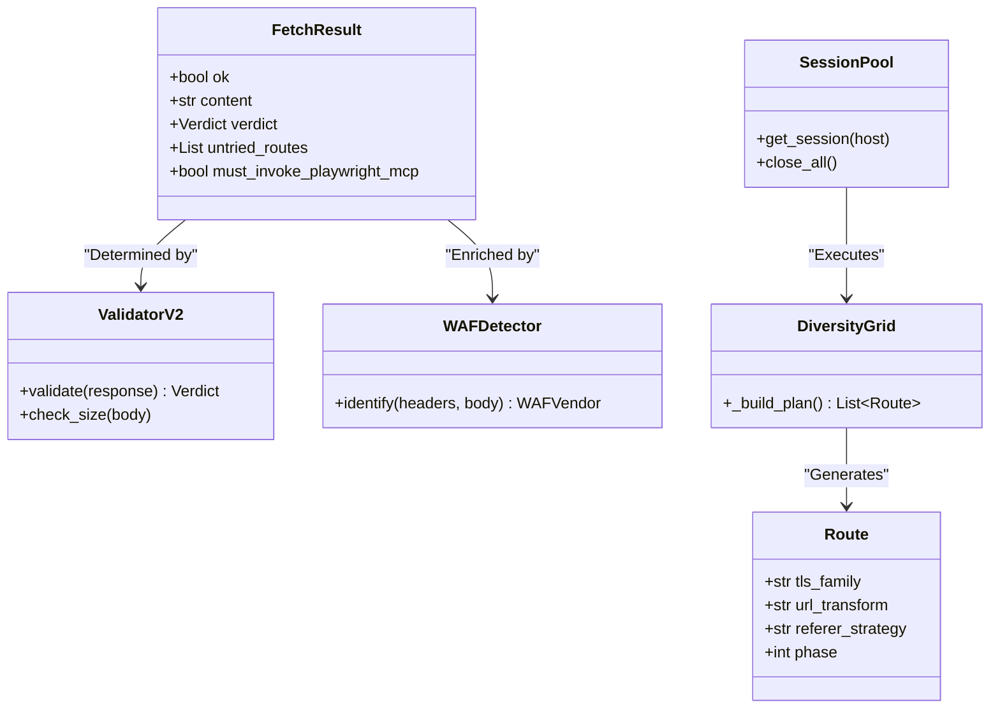

# 아키텍처 개요

관련 소스 파일

다음 파일들은 이 위키 페이지를 생성하기 위한 컨텍스트로 사용되었습니다.

- [CHANGELOG.md](CHANGELOG.md)
- [skills/insane-search/SKILL.md](skills/insane-search/SKILL.md)

`insane-search` 엔진은 Web Application Firewalls(WAF)와 봇 감지 메커니즘을 우회하도록 설계된 고성능 적응형 검색 시스템입니다. 정적 헤더에 의존하는 표준 fetch 도구와 달리, `insane-search`는 가벼운 공식 API에서 시작해 TLS 가장 요청의 대규모 다양성 그리드로 이동하고, 마지막으로 헤드리스 브라우저 자동화로 폴백하는 다단계 단계 상승 전략을 사용합니다.

시스템은 **No-Site-Name Rule**의 지배를 받습니다. 이 규칙은 핵심 엔진에 사이트별 로직을 하드코딩하는 것을 금지하여, 우회 전략이 도메인에 구애받지 않고 대상 사이트 변경에도 탄력적으로 유지되도록 보장합니다.

## Phase 0→3 단계 상승 파이프라인

엔진은 4계층 단계 상승 모델로 동작합니다. 각 Phase는 앞선 Phase가 검증된 "Success" 판정을 반환하지 못한 경우에만 트리거됩니다.

1.  **Phase 0: 공식 공개 경로** — No-Site-Name Rule에 대한 승인된 예외입니다. Reddit, X/Twitter, YouTube 같은 플랫폼에 대해 공개 비인증 엔드포인트(RSS, Atom, oEmbed, syndication APIs)를 사용합니다.
2.  **Phase 1: 경량 탐색** — 콘텐츠가 공개적으로 접근 가능한지 확인하기 위해 범용 헤더와 고속 프록시(예: Jina Reader)를 사용하는 빠르고 저비용의 시도입니다.
3.  **Phase 2: TLS 가장 그리드** — 핵심 엔진입니다. URL 변환과 결합하여 여러 계열(Chrome, Firefox, Safari, Edge)의 브라우저 TLS 지문(JA3/JA4)을 가장하도록 `curl_cffi`를 사용해 방대한 요청 그리드를 실행합니다.
4.  **Phase 3: 헤드리스 브라우저** — 최종 폴백입니다. 복잡한 JavaScript 챌린지와 쿠키 기반 게이트를 처리하기 위해 실제 브라우저 스택을 갖춘 로컬 Playwright 인스턴스를 실행합니다.

각 Phase의 트리거와 신호에 대한 자세한 설명은 [Phase 0→3 적응형 단계 상승 파이프라인](#2.1)을 참조하세요.

### 시스템 컴포넌트 맵
다음 다이어그램은 사용자의 자연어 의도가 특정 코드 엔터티와 실행 경로로 어떻게 변환되는지 보여줍니다.

**다이어그램: 의도에서 실행으로의 흐름**

**출처:** [skills/insane-search/SKILL.md:95-125](), [engine/fetch_chain.py:10-50](), [engine/__main__.py:1-50]()

---

## No-Site-Name Rule(R3)

핵심 아키텍처 제약은 **No-Site-Name Rule**입니다 [skills/insane-search/SKILL.md:47-48](). "로직 부패"를 방지하고 일반화 가능성을 유지하기 위해, 엔진(`phase0.py` 제외)에는 사이트별 문자열, 셀렉터, 도메인 고정 로직을 포함할 수 없습니다.

*   **강제**: `engine/bias_check.py`가 처리하며, CI 중 브랜드 부분 문자열과 URL 패턴을 스캔합니다 [skills/insane-search/SKILL.md:47-48]().
*   **런타임 힌트**: 사이트별 셀렉터나 리퍼러는 `--selector` CLI 인수 또는 `user_hint`를 통해 런타임에 전달되어야 합니다 [skills/insane-search/SKILL.md:49-50]().

린터와 강제 방식에 대한 자세한 내용은 [Bias Check 및 No-Site-Name Rule](#3.6)을 참조하세요.

---

## 핵심 하위 시스템

### Fetch Chain 및 Diversity Grid
`fetch_chain.py` 모듈은 요청의 생명주기를 관리합니다. "Diversity Grid" 스케줄러를 사용하여 적은 수의 시도만으로도 다양한 TLS 지문과 URL 변형(예: 모바일 서브도메인으로 전환)을 폭넓게 포괄하도록 보장합니다.

*   **R6 Exhaustive Rule**: 엔진은 전체 그리드가 소진될 때까지 실패를 선언하지 않습니다 [skills/insane-search/SKILL.md:53-59]().
*   **자기 학습**: 성공한 경로는 동일 호스트에 대한 향후 요청에서 우선순위를 높이기 위해 `learned.json`에 캐시됩니다 [CHANGELOG.md:15-19]().

자세한 내용은 [Fetch Chain 및 Diversity Grid](#2.2)를 참조하세요.

### 응답 검증 및 WAF 감지
성공 여부는 HTTP 200 상태 코드만으로 결정되지 않습니다. `validators.py` 모듈은 4계층 검사(Hard Markers, Size Fingerprinting, JSON awareness, Success Selectors)를 사용해 `Verdict`를 발행합니다 [CHANGELOG.md:52-54](). 동시에 `waf_detector.py`는 fetch 전략을 조정하기 위해 헤더와 본문 콘텐츠를 분석하여 특정 WAF 공급업체(Cloudflare, Akamai 등)를 식별합니다.

자세한 내용은 [응답 검증 및 WAF 감지](#2.4)를 참조하세요.

### Phase 0: 공식 경로
`phase0.py` 모듈은 No-Site-Name Rule에 대한 "승인된 예외" 역할을 합니다. 주요 플랫폼의 URL을 감지하고, 범용 그리드를 시도하기 전에 알려진 정상 공개 엔드포인트로 라우팅합니다 [CHANGELOG.md:42-42]().

자세한 내용은 [Phase 0: 플랫폼별 공식 경로](#2.3)를 참조하세요.

---

## 데이터 및 엔터티 관계
이 다이어그램은 내부 데이터 구조와 클래스를 검색 과정에서의 역할에 매핑합니다.

**다이어그램: 코드 엔터티 관계**

**출처:** [engine/fetch_chain.py:50-100](), [engine/validators.py:10-60](), [engine/transport.py:20-80](), [CHANGELOG.md:52-56]()

## 탐색
*   **다음 페이지**: [Phase 0→3 적응형 단계 상승 파이프라인](#2.1)
*   **관련 문서**: [Fetch Chain 및 Diversity Grid](#2.2) | [응답 검증 및 WAF 감지](#2.4)
