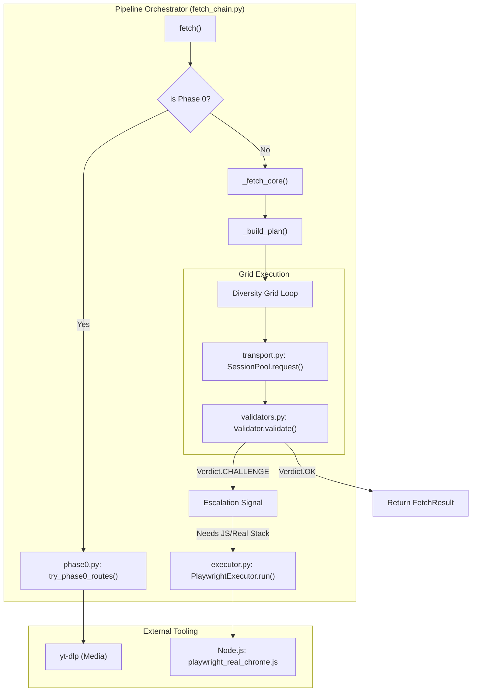
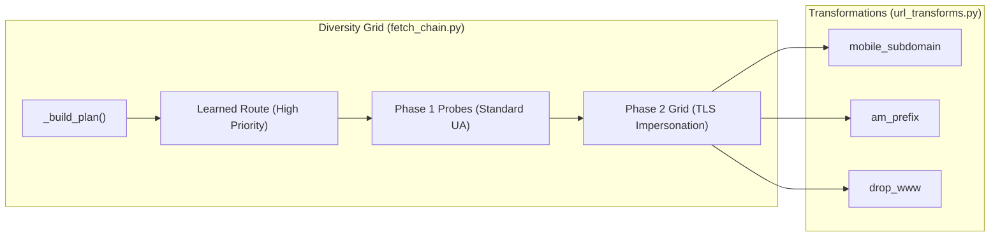

# Phase 0→3 적응형 단계 상승 파이프라인

관련 소스 파일

다음 파일들은 이 위키 페이지를 생성하기 위한 컨텍스트로 사용되었습니다.

- [CHANGELOG.md](CHANGELOG.md)
- [README.md](README.md)
- [skills/insane-search/SKILL.md](skills/insane-search/SKILL.md)
- [skills/insane-search/references/fallback.md](skills/insane-search/references/fallback.md)
- [skills/insane-search/references/tls-impersonate.md](skills/insane-search/references/tls-impersonate.md)

**Phase 0→3 적응형 단계 상승 파이프라인**은 `insane-search`의 핵심 의사결정 엔진입니다. 이 파이프라인은 더 단순한 방법이 실패하거나 방어 신호(WAF, CAPTCHA, JS 전용 셸)를 만났을 때만 복잡도와 리소스 사용량이 증가하는 일련의 검색 전략을 관리합니다. 이 모델은 가능한 경우 경량 API를 사용하여 시스템을 효율적으로 유지하면서도, Akamai나 Cloudflare 같은 정교한 봇 관리 장벽을 돌파할 만큼 충분한 탄력성을 제공합니다.

### 파이프라인 개요

파이프라인은 "성공 시 종료" 방식으로 동작합니다. 어떤 Phase든 검증된 응답(`Verdict.STRONG_OK` 또는 `Verdict.WEAK_OK`로 정의됨)을 반환하는 즉시 프로세스가 종료되고 결과를 반환합니다.

| Phase | 이름 | 주요 메커니즘 | 사용 사례 |
| :--- | :--- | :--- | :--- |
| **Phase 0** | **공식 경로** | 승인된 공개 API 및 RSS 피드 | X/Twitter, Reddit, YouTube, HN, arXiv |
| **Phase 1** | **경량 탐색** | 다양한 User-Agent를 사용하는 범용 HTTP | 블로그, 뉴스 사이트, 보호되지 않은 포털 |
| **Phase 2** | **TLS 가장** | `curl_cffi`(JA3/JA4 지문) | WAF 보호 사이트(Cloudflare, Akamai) |
| **Phase 3** | **헤드리스 브라우저** | Playwright(실제 Chrome 스택) | JS 중심 SPA, Turnstile, 행동 기반 WAF |

---

## 데이터 흐름 및 코드 엔터티 매핑

파이프라인은 `fetch_chain.py`가 오케스트레이션하며, 이 파일은 Phase 간 전환을 조정하고 요청 매개변수의 "Diversity Grid"를 관리합니다.

### 파이프라인 아키텍처 다이어그램
"이 다이어그램은 논리적 Phase를 실행을 담당하는 Python 클래스와 함수에 매핑합니다."

**출처:**
- [skills/insane-search/engine/fetch_chain.py:1-20]() (오케스트레이션 로직)
- [skills/insane-search/engine/phase0.py:1-15]() (Phase 0 진입점)
- [skills/insane-search/engine/executor.py:1-30]() (Phase 3 실행)
- [skills/insane-search/SKILL.md:51-60]() (R5/R6 단계 상승 규칙)

---

## Phase 0: 플랫폼별 공식 경로

Phase 0은 **No-Site-Name Rule**의 적용을 받지 않는 유일한 Phase입니다. 도메인을 공식 비인증 공개 엔드포인트에 매핑하는 하드코딩된 매핑을 사용합니다. 공식 경로는 더 안정적이고 스크래핑된 HTML보다 우수한 구조화 데이터(JSON/Atom)를 제공하므로 우선순위가 높습니다.

- **구현:** `phase0.py`에는 `try_phase0_routes` 함수가 포함되어 있습니다.
- **핵심 로직:** 입력 URL을 Reddit(`.rss`), X/Twitter(syndication/oEmbed), YouTube(`yt-dlp`) 패턴과 매칭합니다.
- **폴스루:** Phase 0이 실패하면(예: RSS 피드에서 429 rate limit), 파이프라인은 즉시 Phase 1로 넘어갑니다.

**출처:**
- [skills/insane-search/engine/phase0.py:10-45]() (경로 매칭 로직)
- [skills/insane-search/SKILL.md:105-125]() (Phase 0 색인)

---

## Phase 1 및 2: Diversity Grid

Phase 1과 2는 `_fetch_core` 루프 안에서 처리됩니다. "Diversity Grid"는 엔진이 동일한 TLS 지문이나 URL 변환을 반복하여 시도를 낭비하지 않도록 보장합니다.

### 단계 상승 로직(Phase 1 → 2)
Phase 1(표준 `curl`)에서 Phase 2(`curl_cffi` TLS 가장)로의 전환은 `validators.py`에 의해 트리거됩니다.

| 신호 | 감지 | 단계 상승 대상 |
| :--- | :--- | :--- |
| **WAF Header** | `cf-ray`, `x-datadome`, `server: cloudflare` | TLS Group: `chrome` |
| **WAF Cookie** | `_abck`(Akamai), `__cf_bm` | TLS Group: `safari`(Akamai용) |
| **지문 차단** | 표준 curl에서 HTTP 403 | TLS Rotation(Safari → Chrome → Firefox) |

### 코드 엔터티: 스케줄러
`fetch_chain.py`의 `_build_plan` 함수는 그리드를 구체화합니다. 이 함수는 다음 항목을 우선합니다.
1. **학습된 경로:** `learned.json`에 저장된 성공 사례 [[CHANGELOG.md:15-19]]().
2. **다양성:** TLS 계열(Safari, Chrome, Firefox)과 URL 변환(Mobile, AM-prefix, No-WWW)을 번갈아 사용합니다.

**출처:**
- [skills/insane-search/engine/fetch_chain.py:120-160]() (`_build_plan` 구현)
- [skills/insane-search/engine/url_transforms.py:1-20]() (URL 변형 규칙)
- [skills/insane-search/references/fallback.md:48-62]() (단계 상승 신호 표)

---

## Phase 3: 헤드리스 브라우저 단계 상승

Phase 3은 "최후의 수단"입니다. Phase 2가 실패하거나 특정 "행동 기반 챌린지"가 감지될 때(예: Akamai `sec-if-cpt` 또는 Cloudflare Turnstile) 트리거됩니다.

### 트리거 조건
- **Validator Verdict:** `needs_js_exec=True`인 `CHALLENGE` [[skills/insane-search/engine/validators.py:40-50]]().
- **그리드 소진:** 모든 TLS 가장 시도가 차단을 반환하는 경우.
- **WAF Profile 요구사항:** `waf_profiles.yaml`이 `capabilities_needed: [needs_real_tls_stack]`을 지정하는 경우.

### 구현: `executor.py`
`PlaywrightExecutor`는 Python 프로세스의 메인 루프 내부에서 실행되지 않습니다. 대신 다음을 수행합니다.
1. `playwright_real_chrome.js`를 사용해 Node.js 프로세스를 생성합니다.
2. 세션 격리를 유지하기 위해 `Profile` 디렉터리를 전달합니다.
3. **Cookie Bridge:** 성공한 브라우저 세션에서 쿠키를 추출해 Python `SessionPool`에 다시 저장하여, 이후 요청이 잠재적으로 Phase 2로 되돌아갈 수 있도록 합니다 [[skills/insane-search/engine/transport.py:80-95]]().

**출처:**
- [skills/insane-search/engine/executor.py:50-100]() (`PlaywrightExecutor` 생명주기)
- [skills/insane-search/references/fallback.md:106-120]() (Phase 3 조건)
- [CHANGELOG.md:52-60]() (Validator v2 및 행동 감지)

---

## 단계 상승 신호 및 Verdict

파이프라인은 중단할지 단계 상승할지 결정하기 위해 `validators.py`의 `Verdict` enum에 의존합니다.

| Verdict | 의미 | 동작 |
| :--- | :--- | :--- |
| `STRONG_OK` | 명확한 콘텐츠, 셀렉터 일치 | 종료 및 반환 |
| `WEAK_OK` | 의미 있는 텍스트이나 셀렉터 없음 | 종료 및 반환 |
| `SUSPECT_OK` | 200 OK이지만 본문이 작거나 모호함 | 로그 기록 및 그리드 계속 진행 |
| `CHALLENGE` | WAF/CAPTCHA/JS 필요 감지 | **Phase 2/3으로 단계 상승** |
| `BLOCKED` | 403/401/IP 차단 | **TLS/변환 순환** |

**출처:**
- [skills/insane-search/engine/validators.py:10-60]() (Verdict enum 및 검증 로직)
- [CHANGELOG.md:5-9]() (작은 본문 휴리스틱 수정)
