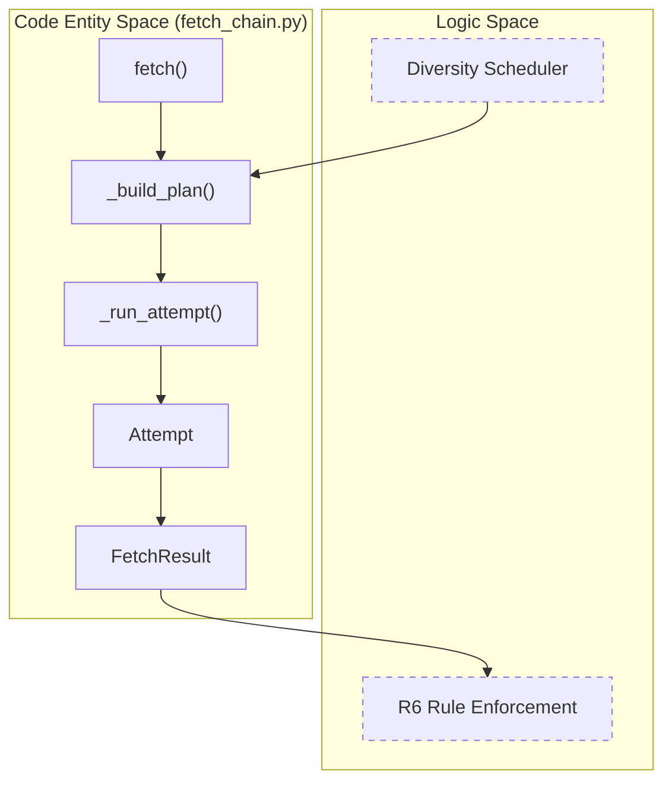
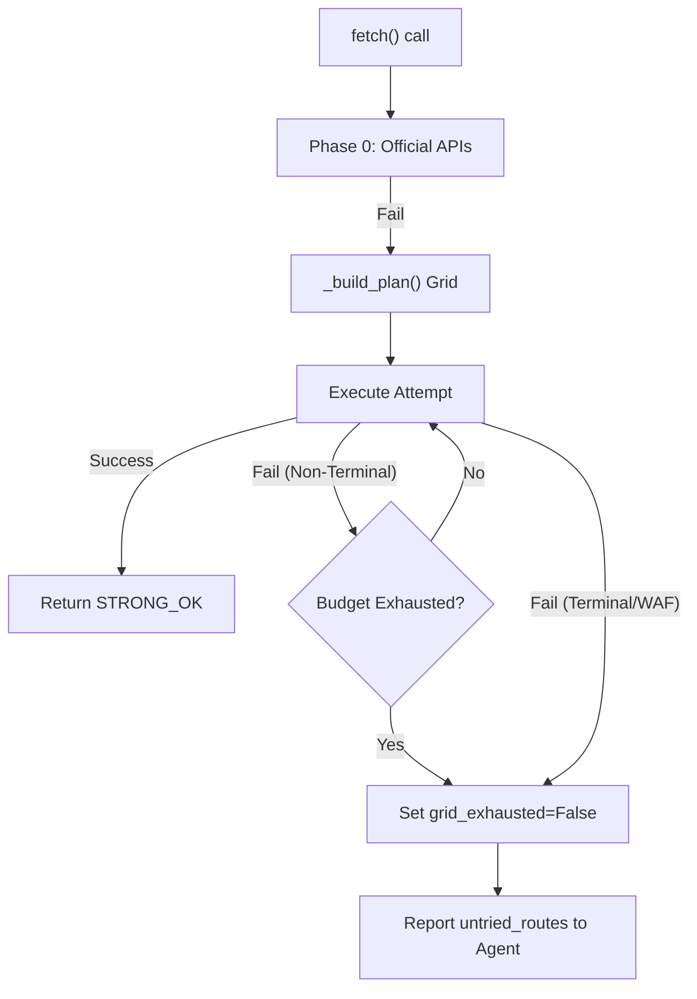

# Fetch Chain 및 Diversity Grid

관련 소스 파일

다음 파일들은 이 위키 페이지를 생성하기 위한 컨텍스트로 사용되었습니다.

- [CHANGELOG.md](CHANGELOG.md)
- [skills/insane-search/engine/__init__.py](skills/insane-search/engine/__init__.py)
- [skills/insane-search/engine/fetch_chain.py](skills/insane-search/engine/fetch_chain.py)
- [skills/insane-search/engine/templates/.gitignore](skills/insane-search/engine/templates/.gitignore)
- [skills/insane-search/engine/templates/package.json](skills/insane-search/engine/templates/package.json)
- [skills/insane-search/engine/tests/test_smoke.py](skills/insane-search/engine/tests/test_smoke.py)
- [skills/insane-search/engine/url_transforms.py](skills/insane-search/engine/url_transforms.py)

이 페이지는 `insane-search`의 핵심 실행 로직을 깊이 있게 다룹니다. fetch 요청의 생명주기, Web Application Firewalls(WAF)에 대해 높은 성공률을 보장하는 정교한 스케줄링 알고리즘, 그리고 R6 전체 그리드 소진 규칙의 강제를 설명합니다.

## Fetch 생명주기 개요

`fetch_chain.py` 모듈은 범용 fetching의 단일 진입점 역할을 합니다 [skills/insane-search/engine/fetch_chain.py:1-4](). 이 모듈은 **Probe → Validate → Detect → Plan → Execute → Report**라는 다단계 프로세스를 조정합니다 [skills/insane-search/engine/fetch_chain.py:9]().

### 1. Probe 및 Validate
모든 요청은 기본 설정으로 대상 URL에 접근할 수 있는지 확인하기 위해 `curl_cffi`를 사용하는 가벼운 "Probe" 시도로 시작됩니다 [skills/insane-search/engine/fetch_chain.py:121-132](). 응답은 즉시 validator로 전달되어 `Verdict`(예: `STRONG_OK`, `CHALLENGE`, `BLOCKED`)를 결정합니다 [skills/insane-search/engine/fetch_chain.py:166-171]().

### 2. WAF 감지
probe가 명확히 성공하지 못하면, 엔진은 헤더, 쿠키, 본문 마커를 기반으로 WAF 제공자(예: Cloudflare, Akamai)를 식별하기 위해 `detect()`를 실행합니다 [skills/insane-search/engine/fetch_chain.py:41](). 이 감지는 이후의 "Diversity Grid"를 안내하기 위해 `waf_profiles.yaml`에서 해당 프로필을 로드합니다 [skills/insane-search/engine/fetch_chain.py:199-202]().

### 3. Diversity Grid 계획(`_build_plan`)
스케줄러는 TLS 지문, URL 변환, referer 전략의 가능한 모든 조합으로 이루어진 "grid"를 구체화합니다 [skills/insane-search/engine/fetch_chain.py:14-17]().

### 4. 실행 및 보고
엔진은 최종 성공 또는 실패에 도달할 때까지 계획을 반복하며, 진단을 위해 모든 시도를 상세한 `trace`에 기록합니다 [skills/insane-search/engine/fetch_chain.py:10-11]().

**출처:** [skills/insane-search/engine/fetch_chain.py:1-171](), [skills/insane-search/engine/__init__.py:7-11]()

---

## Diversity Grid 스케줄러

v2 스케줄러는 시도당 "다양성"을 극대화하도록 설계되었습니다. 단일 URL 변환에 대해 모든 TLS 버전을 소진하는 대신, 여러 차원을 동시에 순환합니다 [skills/insane-search/engine/fetch_chain.py:13-17]().

### `_build_plan` 구현
`_build_plan` 함수는 작은 예산(예: `max_attempts=5`)으로도 여러 TLS 계열과 URL 변형을 접할 수 있도록 그리드를 라운드로 구성합니다 [skills/insane-search/engine/fetch_chain.py:246-285]().

| 기능 | 구현 세부사항 |
| :--- | :--- |
| **TLS 계열 순환** | `curl_cffi` 지문을 `safari`, `chrome`, `edge`, `firefox`로 그룹화합니다. 한 계열을 반복하기 전에 각 계열에서 하나씩 시도합니다 [skills/insane-search/engine/fetch_chain.py:185-192](). |
| **URL 변환** | `mobile_subdomain`(`www.` → `m.`) 또는 `am_prefix` 같은 도메인 비의존적 변형을 적용합니다 [skills/insane-search/engine/url_transforms.py:7-15](). |
| **우선순위 하향** | WAF 프로필에서 `tls_impersonate_avoid`로 표시된 TLS 지문은 삭제되지 않고 큐의 끝으로 이동됩니다 [skills/insane-search/engine/fetch_chain.py:18-19](). |
| **자기 학습 승격** | 호스트가 `learned.json`에 성공 이력을 가지고 있으면, 해당 특정 경로가 그리드의 맨 앞으로 승격됩니다 [CHANGELOG.md:15-16](). |

### 코드-로직 매핑: 스케줄러 엔터티
다음 다이어그램은 개념적 그리드를 Python 클래스 및 함수와 연결합니다.

**Diversity Grid 로직 맵**

**출처:** [skills/insane-search/engine/fetch_chain.py:13-31](), [skills/insane-search/engine/fetch_chain.py:64-117](), [skills/insane-search/engine/fetch_chain.py:246-285]()

---

## URL 변환 및 Referer 전략

변환과 referer는 표준 데스크톱 스크래퍼를 대상으로 하는 단순한 봇 감지 규칙을 우회하는 데 사용됩니다.

### URL 변환
`url_transforms.py`에 위치한 이 규칙들은 도메인 비의존적입니다 [skills/insane-search/engine/url_transforms.py:3-5]().
*   **`mobile_subdomain`**: `www.example.com`을 `m.example.com`으로 변경합니다. 모바일 사용자에게 더 가볍고 덜 보호된 콘텐츠를 제공하는 사이트에 효과적입니다 [skills/insane-search/engine/url_transforms.py:32-42]().
*   **`am_prefix`**: apex 도메인에 `m.`을 추가합니다(예: `example.com` → `m.example.com`) [skills/insane-search/engine/url_transforms.py:44-55]().
*   **`drop_www`**: apex 도메인에 직접 접근하기 위해 `www.` 접두사를 제거합니다 [skills/insane-search/engine/url_transforms.py:58-63]().

### Referer 전략
`fetch_chain.py`에 정의되어 있으며, 서로 다른 트래픽 출처를 시뮬레이션합니다 [skills/insane-search/engine/fetch_chain.py:49-60]().
1.  **`self_root`**: referer를 대상 도메인의 루트로 설정합니다(예: `https://example.com/`).
2.  **`google_search`**: referer를 `https://www.google.com/`로 설정합니다.
3.  **`none`**: referer 헤더를 보내지 않습니다.

**출처:** [skills/insane-search/engine/url_transforms.py:1-98](), [skills/insane-search/engine/fetch_chain.py:49-60]()

---

## R6 전체 그리드 소진 규칙

"R6 Rule"은 URL을 "blocked"로 선언하기 전에 엔진이 실행 가능한 모든 경로를 시도해야 한다는 구조적 요구사항입니다 [CHANGELOG.md:40-43]().

### `FetchResult`에서의 구현
fetch가 실패하면(`ok=False`), `FetchResult` 객체는 호출 에이전트에 소진 상태를 알리기 위한 진단 필드를 포함합니다 [skills/insane-search/engine/fetch_chain.py:97-100]().
*   **`grid_exhausted`**: 계획된 전체 그리드를 시도했는지 나타내는 Boolean입니다 [skills/insane-search/engine/fetch_chain.py:95]().
*   **`untried_routes`**: 예산(`max_attempts`) 또는 조기 최종 실패로 인해 계획되었지만 실행되지 않은 경로 목록입니다 [skills/insane-search/engine/fetch_chain.py:99]().
*   **`must_invoke_playwright_mcp`**: 전체 브라우저(Phase 3)가 필요한 최종 WAF 챌린지를 엔진이 만났을 때 트리거되는 플래그입니다 [skills/insane-search/engine/fetch_chain.py:100]().

### 실패 흐름
엔진이 포기할 때 남은 경로가 있으면 stderr에 `⛔ NOT EXHAUSTED (R6)` 블록을 출력합니다 [CHANGELOG.md:43](). 이는 시스템이 예산을 늘리거나 Playwright executor로 단계 상승하도록 강제합니다.

**R6 강제 흐름**

**출처:** [CHANGELOG.md:40-46](), [skills/insane-search/engine/fetch_chain.py:84-117]()

---

## TLS 계열 순환 세부사항

엔진은 브라우저 TLS 스택을 가장하기 위해 `curl_cffi`를 사용합니다. 스케줄러는 특정 브라우저 버전을 차단하는 WAF에 의해 지문이 특정되지 않도록 그리드가 이러한 계열을 순환하게 보장합니다 [skills/insane-search/engine/fetch_chain.py:185-192]().

| 계열 | 지문(예시) | 우선순위 |
| :--- | :--- | :--- |
| `safari` | `safari_15_5`, `safari_16_0` | 높음 |
| `chrome` | `chrome_110`, `chrome_120` | 높음 |
| `firefox` | `firefox_102`, `firefox_117` | 중간 |
| `edge` | `edge_101` | 중간 |

`_family(tls)` 함수는 다양성 로직이 올바르게 작동하도록 특정 지문을 이러한 넓은 범주에 다시 매핑합니다 [skills/insane-search/engine/fetch_chain.py:188-192]().

**출처:** [skills/insane-search/engine/fetch_chain.py:185-197](), [skills/insane-search/engine/fetch_chain.py:246-285]()
