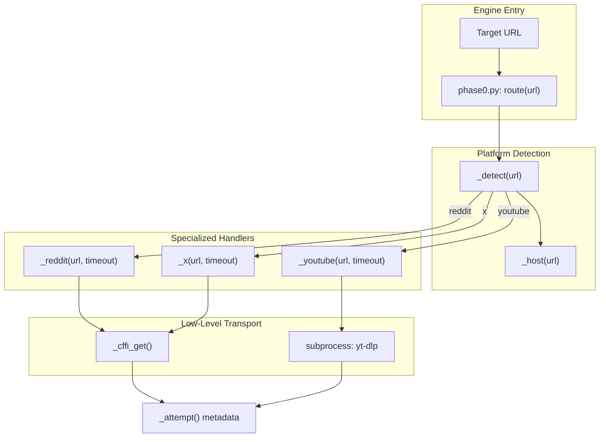
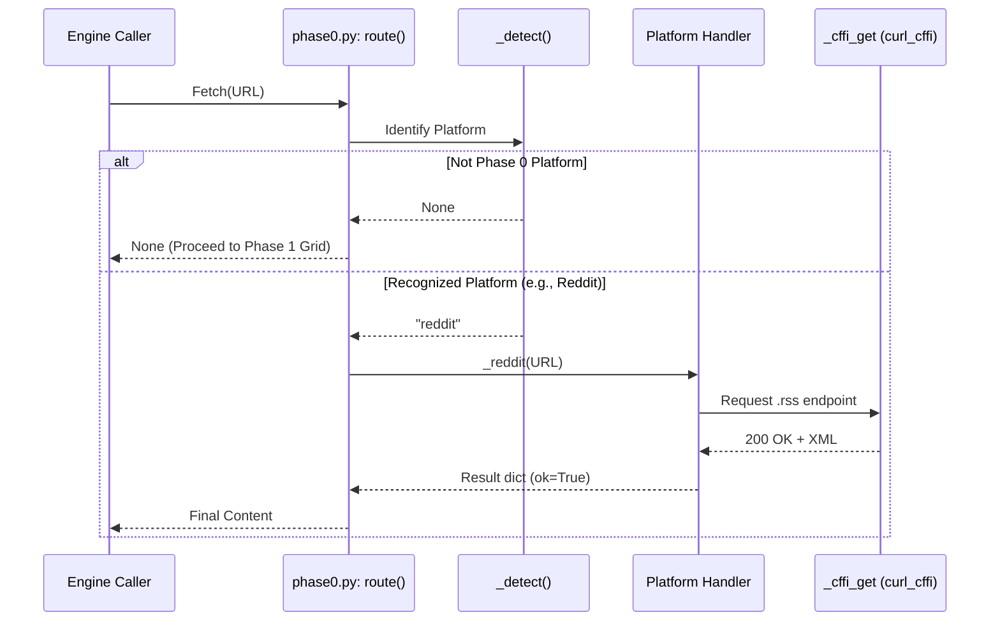

# Phase 0: 플랫폼별 공식 경로

<details>
<summary>관련 소스 파일</summary>

다음 파일들은 이 위키 페이지를 생성하기 위한 컨텍스트로 사용되었습니다.

- [skills/insane-search/engine/phase0.py](skills/insane-search/engine/phase0.py)
- [skills/insane-search/references/json-api.md](skills/insane-search/references/json-api.md)
- [skills/insane-search/references/rss.md](skills/insane-search/references/rss.md)
- [skills/insane-search/references/twitter.md](skills/insane-search/references/twitter.md)

</details>


Phase 0은 `insane-search` 엔진 안에서 "No-Site-Name Rule"에 대한 승인된 예외 역할을 합니다. 시스템의 나머지 부분은 깨지기 쉬운 스크래핑 로직을 피하기 위해 사이트 비의존적으로 설계되어 있지만, `phase0.py`는 공식 비인증 공개 엔드포인트를 제공하는 고가치 플랫폼(Reddit, X/Twitter, YouTube)을 명시적으로 대상으로 삼습니다. 이러한 요청을 Phase 0을 통해 먼저 라우팅함으로써, 시스템은 안정적인 대안이 있는 사이트에 대해 범용 WAF 그리드의 오버헤드와 잠재적 차단을 피합니다 [skills/insane-search/engine/phase0.py:1-11]().

## 목적 및 범위

Phase 0의 주된 목표는 "공식" 경로가 범용 Phase 1-3 단계 상승보다 **먼저** 시도되도록 보장하는 것입니다. 이를 통해 RSS 피드나 syndication API 같은 특수 엔드포인트였다면 성공했을 상황에서, 범용 브라우저 유사 요청이 실패했다는 이유만으로 에이전트가 사이트를 "blocked"로 잘못 선언하는 일을 방지합니다 [skills/insane-search/engine/phase0.py:3-7]().

### 주요 특징
*   **결정적 라우팅**: 인식된 도메인에 대한 요청은 자동으로 특수 핸들러로 우회됩니다.
*   **인증 없는 공개 엔드포인트**: API 키나 사용자 인증이 필요 없는 경로만 포함됩니다.
*   **린터 예외**: 이 모듈은 일반적으로 플랫폼별 문자열을 금지하는 `bias_check.py` 린터에서 제외되는 유일한 모듈입니다 [skills/insane-search/engine/phase0.py:9-11]().
*   **폴스루 설계**: Phase 0이 실패하면(예: 404 또는 rate limit), 엔진은 투명하게 범용 diversity grid로 넘어갑니다 [skills/insane-search/engine/phase0.py:15-16]().

## 구현 및 데이터 흐름

이 Phase의 진입점은 `route(url)` 함수입니다. 이 함수는 플랫폼을 식별하고 요청을 특정 내부 핸들러로 디스패치합니다.

### 시스템 엔터티 매핑

다음 다이어그램은 "Platform Routing"이라는 자연어 개념을 `phase0.py`의 특정 코드 엔터티와 연결합니다.

**Phase 0 엔터티 매핑**

출처: [skills/insane-search/engine/phase0.py:27-70](), [skills/insane-search/engine/phase0.py:73-152]()

## 플랫폼 라우팅 로직

### Reddit(.json보다 .rss)
2026년 중반 기준, Reddit은 인증되지 않은 `.json` 엔드포인트를 WAF 챌린지로 강하게 제한합니다 [skills/insane-search/references/json-api.md:8-10](). Phase 0은 Reddit의 WAF에 대한 안정적인 비인증 예외로 남아 있는 `.rss`(Atom) 피드를 우선합니다 [skills/insane-search/references/json-api.md:12-18]().

*   **기본 경로**: URL 경로에 `.rss`를 추가합니다 [skills/insane-search/engine/phase0.py:77]().
*   **보조 경로**: 저비용 폴백으로 `curl_cffi`를 통해 `.json`을 시도합니다 [skills/insane-search/engine/phase0.py:78-94]().
*   **데이터 구조**: `title`, `author`, `content`(HTML 본문)를 파싱할 수 있는 Atom XML을 반환합니다 [skills/insane-search/references/json-api.md:26-40]().

### X/Twitter(Syndication 및 oEmbed)
`x.com`을 직접 가져오면 보통 402가 반환되거나 단순 probe가 읽을 수 없는 JS 중심 SPA가 반환됩니다 [skills/insane-search/references/twitter.md:3-11](). Phase 0은 세 가지 서로 다른 공개 엔드포인트를 사용합니다.

| 경로 | 함수 | 이점 |
| :--- | :--- | :--- |
| **tweet-result** | `cdn.syndication.twimg.com/tweet-result` | 구조화된 JSON, 높은 안정성, 참여 지표 포함 [skills/insane-search/references/twitter.md:89-97](). |
| **oEmbed** | `publish.twitter.com/oembed` | 단일 Tweet에 대한 신뢰할 수 있는 HTML blockquote 폴백 [skills/insane-search/references/twitter.md:64-72](). |
| **Syndication** | `syndication.twitter.com/srv/timeline-profile` | API 키 없이 프로필의 최근 약 100개 Tweet을 검색합니다 [skills/insane-search/references/twitter.md:13-21](). |

출처: [skills/insane-search/engine/phase0.py:109-152](), [skills/insane-search/references/twitter.md:89-114]()

### YouTube(yt-dlp)
YouTube 및 기타 미디어 사이트의 경우, Phase 0은 전체 페이지를 렌더링하지 않고 메타데이터와 자막을 추출하기 위해 `yt-dlp`를 활용합니다 [skills/insane-search/references/rss.md:101-102]().

## 데이터 흐름 아키텍처

다음 다이어그램은 URL이 결과를 반환하거나 범용 엔진으로 넘겨지기 전에 Phase 0 파이프라인을 통해 어떻게 처리되는지 보여줍니다.

**Phase 0 데이터 흐름**

출처: [skills/insane-search/engine/phase0.py:13-24](), [skills/insane-search/engine/phase0.py:59-69](), [skills/insane-search/engine/phase0.py:80-88]()

## 핸들러 명세

### `_attempt` 메타데이터
Phase 0에서 수행되는 모든 요청은 `_attempt` 딕셔너리로 래핑됩니다. 이를 통해 플랫폼별 경로가 실패하더라도, 엔진 호출자는 범용 그리드가 이어받기 전에 무엇이 시도되었는지에 대한 진단 흔적을 확보할 수 있습니다 [skills/insane-search/engine/phase0.py:17-24]().

```python
# Internal metadata structure
{
    "route": "rss",
    "platform": "reddit",
    "ok": True,
    "status": 200,
    "bytes": 14500,
    "note": "feed"
}
```
출처: [skills/insane-search/engine/phase0.py:53-55]()

### 전송 계층: `_cffi_get`
Phase 0은 요청에 `curl_cffi`를 사용하여 "공식" 엔드포인트에도 유효한 브라우저 유사 TLS 지문(기본값은 `safari`)이 보이도록 보장합니다. 이는 정상적인 브라우저 트래픽을 기대하는 API에서 기본적인 헤더 기반 차단을 방지합니다 [skills/insane-search/engine/phase0.py:34-45]().

출처: [skills/insane-search/engine/phase0.py:34-45](), [skills/insane-search/references/twitter.md:99-103]()
