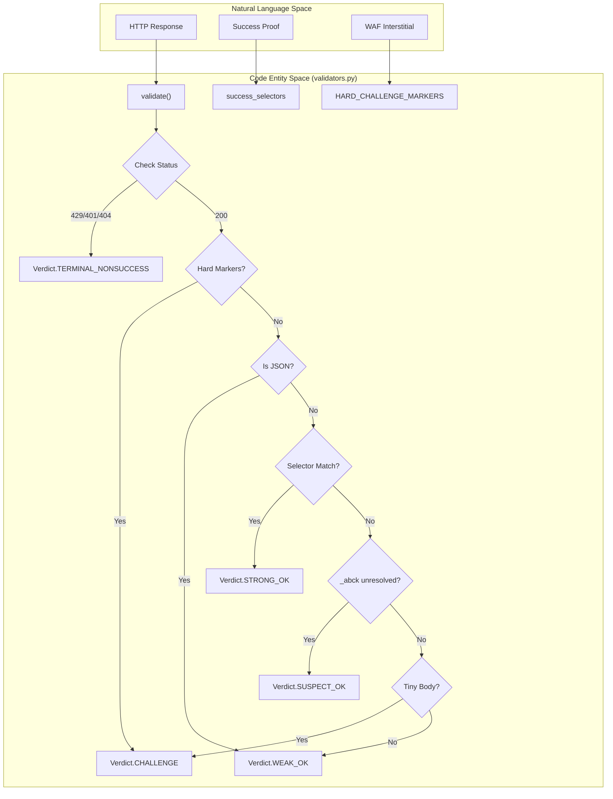
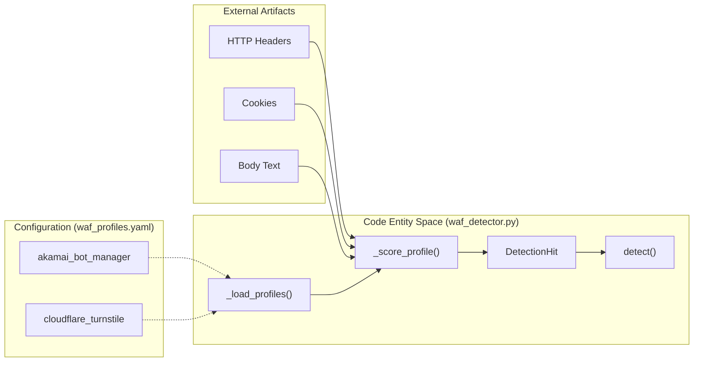

# 응답 검증 및 WAF 감지

관련 소스 파일

다음 파일들은 이 위키 페이지를 생성하기 위한 컨텍스트로 사용되었습니다.

- [skills/insane-search/engine/tests/test_u1.py](skills/insane-search/engine/tests/test_u1.py)
- [skills/insane-search/engine/validators.py](skills/insane-search/engine/validators.py)
- [skills/insane-search/engine/waf_detector.py](skills/insane-search/engine/waf_detector.py)
- [skills/insane-search/engine/waf_profiles.yaml](skills/insane-search/engine/waf_profiles.yaml)

이 모듈은 HTTP 응답을 분류하고 대상을 보호하는 특정 Web Application Firewall(WAF) 제품을 식별하는 지능 계층을 제공합니다. 단순한 HTTP 상태 코드 검사를 넘어서기 때문에, `insane-search`는 일시적인 네트워크 오류, 영구 차단, 해결 가능한 챌린지를 구분할 수 있으며, 이를 통해 `fetch_chain.py`가 실시간으로 전략을 조정할 수 있습니다.

## Validator v2 아키텍처

`validators.py` 모듈은 6계층 검증 파이프라인을 구현합니다 [skills/insane-search/engine/validators.py:3-10](). 이 파이프라인은 **No-Site-Name Rule**을 준수하며 완전히 범용적이고 사이트 비의존적으로 설계되어 있습니다.

### 6계층 검증 파이프라인

| 계층 | 이름 | 설명 |
| :--- | :--- | :--- |
| 1 | **HTTP Status** | 표준 의미론(429 Rate Limit, 401 Auth, 404 Not Found)을 평가합니다 [skills/insane-search/engine/validators.py:236-250](). |
| 2 | **Hard Markers** | 정상 콘텐츠에는 절대 나타나지 않는 구조적 WAF 컨테이너(예: `sec-if-cpt-container`)를 확인합니다 [skills/insane-search/engine/validators.py:40-50](). |
| 3 | **Size Fingerprints** | 응답 바이트 크기를 호출자가 제공한 `known_bad_sizes`와 비교합니다 [skills/insane-search/engine/validators.py:257-260](). |
| 4 | **JSON Awareness** | 작은 JSON 페이로드(API)가 챌린지 스텁으로 잘못 분류되지 않도록 보장합니다 [skills/insane-search/engine/validators.py:263-270](). |
| 5 | **Success Selectors** | `BeautifulSoup`을 사용해 호출자가 제공한 CSS 셀렉터를 찾습니다. 여기서 일치가 발생하면 "Soft Markers"보다 우선합니다 [skills/insane-search/engine/validators.py:273-281](). |
| 6 | **Heuristics** | "Soft Markers", 미해결 쿠키, 작은 본문 조각에 대한 최종 검사입니다 [skills/insane-search/engine/validators.py:284-310](). |

### 데이터 흐름: 응답에서 Verdict로

다음 다이어그램은 원시 응답이 `validate()`에 의해 `Verdict` enum으로 어떻게 변환되는지 보여줍니다.

**다이어그램: 검증 로직 흐름**

출처: [skills/insane-search/engine/validators.py:69-80](), [skills/insane-search/engine/validators.py:192-310](), [skills/insane-search/engine/tests/test_u1.py:90-118]()

## Verdict 분류

`Verdict` enum [skills/insane-search/engine/validators.py:69-80]()은 `fetch_chain`의 다음 단계를 결정합니다.

*   **STRONG_OK**: 최종 성공입니다. 긍정적 증거(CSS 셀렉터)가 발견되었습니다 [skills/insane-search/engine/validators.py:72]().
*   **WEAK_OK**: 최종 성공입니다. 응답이 깨끗해 보이지만, 특정 증거가 요청되지 않았거나 발견되지 않았습니다 [skills/insane-search/engine/validators.py:73]().
*   **SUSPECT_OK**: **비최종**입니다. 응답이 유효할 수도 있지만, 미해결 Akamai `_abck` 쿠키 같은 의심스러운 산출물이 발견되었습니다. 체인은 더 나은 결과를 찾기 위해 계속 진행합니다 [skills/insane-search/engine/validators.py:74]().
*   **CHALLENGE**: 요청이 WAF 챌린지(JS/Captcha)에 의해 가로채졌습니다 [skills/insane-search/engine/validators.py:75]().
*   **TERMINAL_NONSUCCESS**: `RATE_LIMITED`(429), `AUTH_REQUIRED`(401), `NOT_FOUND`(404)를 포함합니다. TLS 지문을 순환해도 이러한 문제는 해결되지 않으므로 그리드가 중단됩니다 [skills/insane-search/engine/validators.py:84-86]().

출처: [skills/insane-search/engine/validators.py:69-86](), [skills/insane-search/engine/tests/test_u1.py:119-126]()

## WAF 감지 엔진

`waf_detector.py` 모듈은 헤더, 쿠키, 본문 콘텐츠를 검사하여 WAF 공급업체를 식별합니다. 단일 boolean 대신, 순위가 매겨진 `DetectionHit` 객체 목록을 반환합니다 [skills/insane-search/engine/waf_detector.py:53-57]().

### 감지 메커니즘

감지는 주요 공급업체의 지문을 정의하는 `waf_profiles.yaml`에 의해 구동됩니다.

| 공급업체 | 감지 신호 | 필요한 기능 |
| :--- | :--- | :--- |
| **Akamai** | Cookies: `_abck`, `bm_sz`. Server: `AkamaiGHost`. Body: `sec-if-cpt-container` | `needs_real_tls_stack`, `needs_js_exec` |
| **Cloudflare** | Cookies: `cf_clearance`. Headers: `cf-ray`. Body: `Just a moment...` | `needs_js_exec` |
| **DataDome** | Cookies: `datadome`. Body: `DataDome` | `needs_real_tls_stack`, `needs_js_exec` |
| **AWS WAF** | Cookies: `aws-waf-token`. Headers: `x-amzn-waf-*` | `needs_real_tls_stack` |

출처: [skills/insane-search/engine/waf_profiles.yaml:19-135](), [skills/insane-search/engine/waf_detector.py:132-179]()

### 프로필 게이팅 및 신뢰도

`detect()` 함수 [skills/insane-search/engine/waf_detector.py:182-207]()는 YAML에 정의된 `confidence_rules`를 적용합니다 [skills/insane-search/engine/waf_profiles.yaml:25-28]().
*   **Strong(0.9)**: 여러 신호가 일치했습니다(예: 쿠키와 헤더가 모두 일치).
*   **Weak(0.6)**: 단일 신호가 일치했습니다.
*   **Fallback(0.1)**: 어떤 신호도 일치하지 않으면 `unknown_challenge`를 반환합니다 [skills/insane-search/engine/waf_detector.py:201-206]().

**다이어그램: WAF 감지 엔터티 매핑**

출처: [skills/insane-search/engine/waf_detector.py:132-179](), [skills/insane-search/engine/waf_profiles.yaml:1-15]()

## 구현 세부사항

### 바이트 크기와 문자 수
Validator v2는 Unicode 문자 수가 아니라 원시 바이트 단위로 본문 크기를 측정합니다 [skills/insane-search/engine/validators.py:21](). 이는 한국어나 일본어 같은 멀티바이트 언어가 문자 수가 낮다는 이유만으로 `SMALL_BODY_THRESHOLD`(3000 bytes) [skills/insane-search/engine/validators.py:66]()를 우회하는 것을 방지합니다 [skills/insane-search/engine/tests/test_u1.py:127-134]().

### 완전한 페이지 휴리스틱
`example.com` 같은 작지만 유효한 페이지를 WAF 스텁으로 잘못 식별하지 않기 위해, `_looks_complete_content_page`는 스크립트와 스타일을 제거한 뒤 닫는 `</html>` 태그와 최소한의 표시 텍스트(64 chars)를 확인합니다 [skills/insane-search/engine/validators.py:159-171]().

### 프로필 복원력
`waf_detector.py`는 코드 안에 `_DEFAULT_PROFILES` 안전망을 포함합니다 [skills/insane-search/engine/waf_detector.py:31-45](). `waf_profiles.yaml`이 없거나 손상된 경우, 시스템은 충돌하는 대신 보수적인 "unknown" 전략으로 폴백합니다 [skills/insane-search/engine/waf_detector.py:65-95]().

출처: [skills/insane-search/engine/validators.py:152-171](), [skills/insane-search/engine/waf_detector.py:31-45](), [skills/insane-search/engine/tests/test_u1.py:137-148]()
