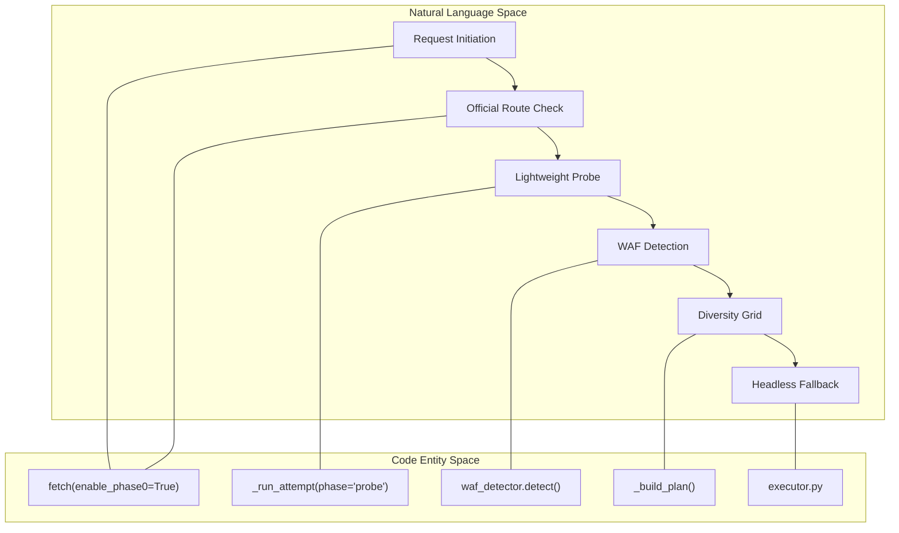
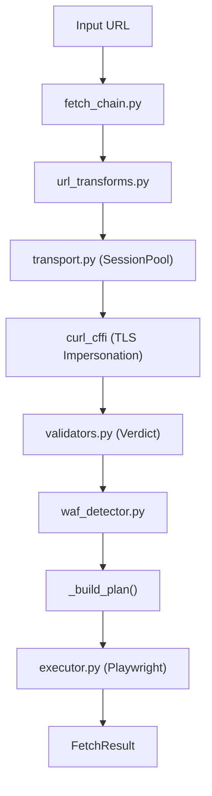

# 핵심 엔진 모듈

관련 소스 파일

다음 파일들은 이 위키 페이지를 생성하기 위한 컨텍스트로 사용되었습니다.

- [skills/insane-search/engine/__init__.py](skills/insane-search/engine/__init__.py)
- [skills/insane-search/engine/__main__.py](skills/insane-search/engine/__main__.py)
- [skills/insane-search/engine/fetch_chain.py](skills/insane-search/engine/fetch_chain.py)
- [skills/insane-search/engine/templates/.gitignore](skills/insane-search/engine/templates/.gitignore)
- [skills/insane-search/engine/templates/package.json](skills/insane-search/engine/templates/package.json)
- [skills/insane-search/engine/tests/test_smoke.py](skills/insane-search/engine/tests/test_smoke.py)
- [skills/insane-search/engine/url_transforms.py](skills/insane-search/engine/url_transforms.py)

`insane-search` 엔진은 `skills/insane-search/engine/`에 위치한 Python 기반 검색 시스템입니다. Web Application Firewalls(WAF)를 우회하고 LLM 소비에 적합한 깨끗한 콘텐츠를 가져오도록 설계된 견고하고 도메인 비의존적인 fetch 파이프라인을 제공합니다. 

엔진의 주요 진입점은 `skills/insane-search/engine/fetch_chain.py`의 `fetch` 함수입니다 [skills/insane-search/engine/fetch_chain.py:3-7](). 이 함수는 경량 probe에서 TLS 지문과 URL 변환의 방대한 "Diversity Grid"로 이어지고, 마지막으로 헤드리스 브라우저로 폴백하는 다단계 단계 상승 프로세스를 오케스트레이션합니다.

### 엔진 아키텍처 및 로직 흐름

엔진은 "No-Site-Name Rule"에 따라 동작합니다. 즉, Phase 0 공식 API 라우팅을 제외하면 특정 도메인에 대한 하드코딩 로직을 포함하지 않습니다. 대신 응답 크기, HTTP 상태 코드, CSS 셀렉터 같은 범용 신호를 사용해 성공 또는 실패를 판단합니다 [skills/insane-search/engine/__init__.py:1-5]().

#### 시스템-코드 매핑: Fetch 생명주기
다음 다이어그램은 상위 수준의 fetch Phase를 이를 구현하는 특정 Python 엔터티와 연결합니다.

**다이어그램: 범용 Fetch 생명주기**

출처: [skills/insane-search/engine/fetch_chain.py:1-31](), [skills/insane-search/engine/fetch_chain.py:54-62]()

### 공개 API 및 CLI

엔진은 Python 라이브러리 또는 CLI로 사용할 수 있습니다.

*   **Python API**: `fetch` 함수는 가져온 `content`, `final_url`, 그리고 수행된 모든 시도의 상세 `trace`를 포함하는 `FetchResult` dataclass를 반환합니다 [skills/insane-search/engine/fetch_chain.py:84-117]().
*   **CLI**: `python3 -m engine URL`은 CSS 셀렉터, 디바이스 고정, JSON 출력 플래그를 사용한 수동 테스트를 허용합니다 [skills/insane-search/engine/__main__.py:4-17]().

### 하위 모듈 개요

엔진의 복잡도는 여러 특화 모듈에 분산되어 있습니다.

#### [Transport Layer 및 Session Pool](#3.1)
`transport.py`가 관리하는 이 계층은 기반 `curl_cffi` 연결을 처리합니다. 호스트별 세션 `POOL`을 유지하여 시도 간 쿠키와 WAF 센서를 보존합니다 [skills/insane-search/engine/fetch_chain.py:130-131]().
자세한 내용은 [Transport Layer 및 Session Pool](#3.1)을 참조하세요.

#### [TLS Impersonation 및 URL Transforms](#3.2)
엔진은 지문 식별을 회피하기 위해 브라우저 TLS 지문(예: Chrome, Safari, Firefox)을 순환합니다 [skills/insane-search/engine/fetch_chain.py:185-192](). 동시에 `url_transforms.py`는 저항이 가장 낮은 경로를 찾기 위해 `mobile_subdomain`(www → m) 같은 도메인 비의존적 변형을 적용합니다 [skills/insane-search/engine/url_transforms.py:7-16]().
자세한 내용은 [TLS Impersonation 및 URL Transforms](#3.2)를 참조하세요.

#### [Playwright Executor 및 Browser Templates](#3.3)
`curl_cffi`가 실패하면 `executor.py`가 Playwright를 사용한 Phase 3 폴백을 트리거합니다. 전체 JavaScript 실행 또는 복잡한 TLS 스택이 필요한 사이트를 처리하기 위해 `playwright_real_chrome.js` 같은 Node.js 템플릿을 활용합니다 [skills/insane-search/engine/fetch_chain.py:67-67]().
자세한 내용은 [Playwright Executor 및 Browser Templates](#3.3)를 참조하세요.

#### [Self-Learning Store](#3.4)
`learning.py`에 구현된 이 모듈은 성공한 "routes"(transform, TLS impersonation, referer의 조합)를 로컬 JSON 저장소에 영속화합니다. 동일한 호스트에 대한 향후 요청은 이러한 학습된 경로를 우선시합니다 [skills/insane-search/engine/fetch_chain.py:240-250]().
자세한 내용은 [Self-Learning Store](#3.4)를 참조하세요.

#### [Safety 및 SSRF Guard](#3.5)
`safety.py`는 DNS-rebinding 보호와 private IP 차단을 포함한 중요한 보안 경계를 제공하여, 엔진이 내부 네트워크를 탐색하는 데 사용될 수 없도록 보장합니다 [skills/insane-search/engine/fetch_chain.py:34-36]().
자세한 내용은 [Safety 및 SSRF Guard](#3.5)를 참조하세요.

#### [Bias Check 및 No-Site-Name Rule](#3.6)
`bias_check.py`는 엔진이 사이트 비의존적으로 유지되어야 한다는 아키텍처 요구사항을 강제하는 린터 역할을 합니다. 엔진 코드에서 브랜드 부분 문자열과 하드코딩된 URL 패턴을 스캔합니다 [skills/insane-search/engine/__init__.py:1-5]().
자세한 내용은 [Bias Check 및 No-Site-Name Rule](#3.6)을 참조하세요.

### 데이터 흐름: URL에서 결과까지

다음 다이어그램은 URL이 엔진의 내부 컴포넌트를 통해 어떻게 이동하는지 보여줍니다.

**다이어그램: 엔진 데이터 흐름**

출처: [skills/insane-search/engine/fetch_chain.py:134-172](), [skills/insane-search/engine/url_transforms.py:82-98](), [skills/insane-search/engine/__init__.py:7-11]()
