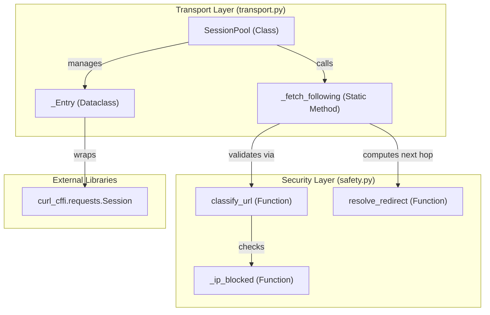
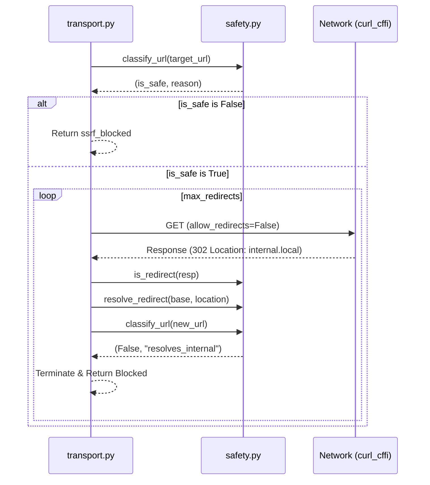

# Transport Layer 및 Session Pool

관련 소스 파일

다음 파일들은 이 위키 페이지를 생성하기 위한 컨텍스트로 사용되었습니다.

- [skills/insane-search/engine/safety.py](skills/insane-search/engine/safety.py)
- [skills/insane-search/engine/transport.py](skills/insane-search/engine/transport.py)

`insane-search`의 transport layer는 저수준 HTTP 통신을 관리하고, 연결 및 쿠키 지속성을 보장하며, 엄격한 보안 경계를 강제하는 역할을 합니다. 이 계층은 가벼운 TLS 가장 요청과 무거운 브라우저 폴백 사이의 간극을 메우는 스레드 안전 session pooling 메커니즘을 중심으로 구성됩니다.

## 개요

transport layer의 주요 목표는 높은 성능을 유지하면서 Web Application Firewalls(WAF)에 대한 성공률을 극대화하는 것입니다. 이를 위해 다음을 사용합니다.
*   **Session Persistence**: 동일 호스트에 대한 여러 요청에서 TCP 연결과 쿠키를 재사용합니다.
*   **Warmup Requests**: 사이트 루트에 사전 요청을 보내 WAF 센서 쿠키(예: Akamai `_abck`)를 성숙시킵니다.
*   **Cookie Bridging**: 헤드리스 브라우저(Phase 3)가 수집한 쿠키를 더 빠른 `curl_cffi` 세션에 다시 주입하는 "FlareSolverr" 패턴을 구현합니다.
*   **SSRF Protection**: 모든 hop이 private IP 범위에 대해 검증되도록 리다이렉트를 수동으로 따라갑니다.

### 시스템 컴포넌트 및 코드 엔터티

다음 다이어그램은 `SessionPool`이 통신과 보안을 어떻게 관리하는지 보여줍니다.

**Transport 아키텍처 및 보안 흐름**

출처: [skills/insane-search/engine/transport.py:43-46](), [skills/insane-search/engine/transport.py:164-168](), [skills/insane-search/engine/safety.py:37-39]()

## Session Pool 관리

`SessionPool` 클래스는 `(host, impersonate)` 조합을 키로 사용하는 스레드 안전 컨테이너입니다. 이를 통해 서로 다른 TLS 지문(예: `chrome` 대 `safari`)이 동일한 세션 상태를 공유하지 않도록 하며, 이는 WAF 이상 징후를 유발할 수 있는 상황을 방지합니다.

### 주요 작업

| 함수 | 역할 | 코드 참조 |
| :--- | :--- | :--- |
| `get()` | 특정 host/impersonation 쌍에 대한 `curl_cffi` 세션을 가져오거나 생성합니다. | [skills/insane-search/engine/transport.py:51-71]() |
| `warmup()` | 세션 쿠키를 초기화하기 위해 사이트 루트에 멱등 요청을 수행합니다. | [skills/insane-search/engine/transport.py:73-90]() |
| `inject_cookies()` | 외부 executor(예: Playwright)에서 수집한 쿠키와 User-Agent로 세션을 시드합니다. | [skills/insane-search/engine/transport.py:92-116]() |
| `request()` | SSRF guard와 세션 재사용을 적용해 URL을 가져오는 주요 진입점입니다. | [skills/insane-search/engine/transport.py:118-125]() |

출처: [skills/insane-search/engine/transport.py:43-125]()

## Browser-to-Curl Cookie Bridge

transport layer의 가장 강력한 기능 중 하나는 비용이 큰 헤드리스 브라우저 통과를 저렴한 HTTP 처리량으로 변환하는 능력입니다. 브라우저 폴백이 Cloudflare Turnstile 같은 JS 챌린지를 성공적으로 해결하면, 결과로 얻은 `cf_clearance` 또는 세션 쿠키가 `inject_cookies`로 전달됩니다.

동일한 `(host, impersonate)` 키를 사용하는 이후 요청은 `_Entry.injected_ua`와 시드된 cookie jar를 사용하게 되어, 이전에는 전체 브라우저가 필요했던 챌린지를 `curl_cffi`로 우회할 수 있습니다.

출처: [skills/insane-search/engine/transport.py:9-12](), [skills/insane-search/engine/transport.py:92-116]()

## 수동 리다이렉트 및 SSRF Guard

`curl_cffi`는 기본적으로 리다이렉트를 자동으로 따르지만, 각 hop의 목적지 IP를 검증할 수 있는 hook을 제공하지 않습니다. Server-Side Request Forgery(SSRF)를 방지하기 위해 `insane-search`는 자동 리다이렉트를 비활성화하고 `_fetch_following`을 구현합니다.

### 리다이렉트 해석 로직
1.  `request()` 함수는 초기 대상에 대해 `safety.classify_url`을 호출합니다.
2.  안전하면 `_fetch_following`이 `allow_redirects=False`로 요청을 실행합니다.
3.  응답이 리다이렉트(3xx)이면 `Location` 헤더를 추출하고 `safety.resolve_redirect`를 통해 해석합니다.
4.  새 URL은 DNS-rebinding 또는 내부 IP 대상(예: `169.254.169.254`) 여부를 확인하기 위해 다시 `safety.classify_url`로 전달됩니다.
5.  비-3xx 응답을 받거나 `max_redirects`에 도달할 때까지 루프가 계속됩니다.

**SSRF Guard 실행 흐름**

출처: [skills/insane-search/engine/safety.py:3-7](), [skills/insane-search/engine/safety.py:37-71](), [skills/insane-search/engine/transport.py:164-172]()

## 보안 제약

`safety.py` 모듈은 가져올 수 있는 대상에 대해 엄격한 경계를 강제합니다.
*   **Allowed Schemes**: `http`와 `https`만 허용됩니다. [skills/insane-search/engine/safety.py:20-20]()
*   **IP Blocking**: `_ip_blocked` 함수는 private, loopback, link-local, reserved, multicast, unspecified 주소를 식별합니다. [skills/insane-search/engine/safety.py:28-34]()
*   **DNS-Rebinding Defense**: 호스트명의 경우 `classify_url`은 모든 A/AAAA 레코드를 해석하고, 해석된 IP 중 *하나라도* 내부 IP이면 요청을 차단합니다. [skills/insane-search/engine/safety.py:59-71]()
*   **Environment Override**: 로컬 개발을 위해 `INSANE_ALLOW_PRIVATE=1`을 설정하면 private 범위를 허용할 수 있습니다. [skills/insane-search/engine/safety.py:24-25]()

출처: [skills/insane-search/engine/safety.py:1-71]()
