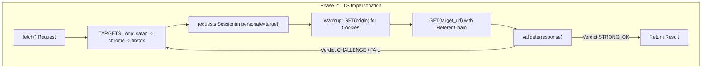
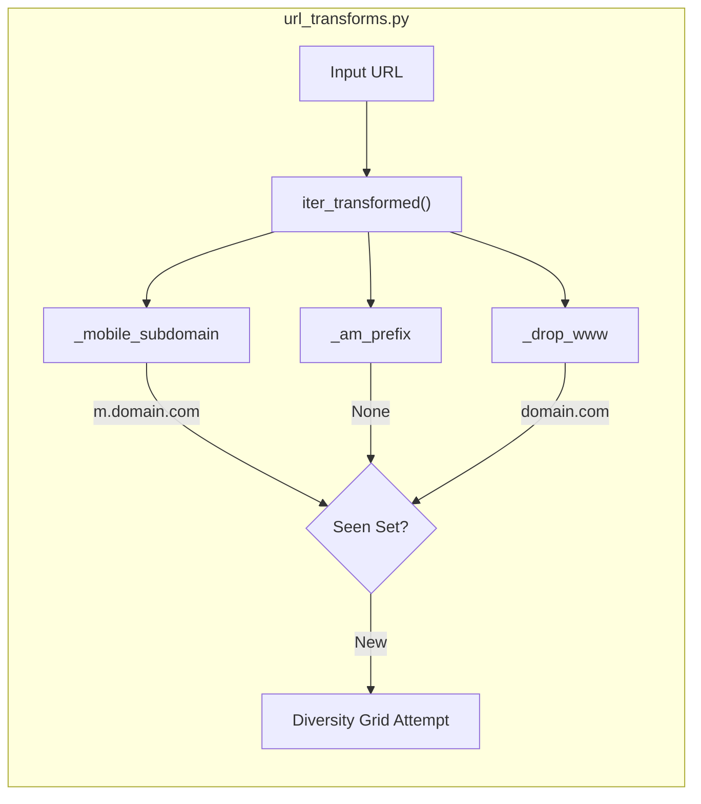

# TLS Impersonation 및 URL Transforms

관련 소스 파일

다음 파일들은 이 위키 페이지를 생성하기 위한 컨텍스트로 사용되었습니다.

- [skills/insane-search/engine/__init__.py](skills/insane-search/engine/__init__.py)
- [skills/insane-search/engine/templates/.gitignore](skills/insane-search/engine/templates/.gitignore)
- [skills/insane-search/engine/templates/package.json](skills/insane-search/engine/templates/package.json)
- [skills/insane-search/engine/tests/test_smoke.py](skills/insane-search/engine/tests/test_smoke.py)
- [skills/insane-search/engine/url_transforms.py](skills/insane-search/engine/url_transforms.py)
- [skills/insane-search/references/fallback.md](skills/insane-search/references/fallback.md)
- [skills/insane-search/references/tls-impersonate.md](skills/insane-search/references/tls-impersonate.md)

이 페이지는 `insane-search`가 TLS 지문 기반 Web Application Firewalls(WAF)를 우회하고, 도메인 비의존적 URL 변형을 활용해 콘텐츠를 가져오는 방식을 자세히 설명합니다. JA3/JA4 가장을 위한 `curl_cffi` 구현과 `url_transforms.py`의 규칙 기반 변환에 초점을 맞춥니다.

## curl_cffi를 사용한 TLS Impersonation

표준 HTTP 라이브러리(`requests` 또는 표준 `curl` 등)는 OpenSSL을 사용하며, 이는 Cloudflare, Akamai, DataDome 같은 WAF가 "봇 트래픽"으로 쉽게 식별하는 고유한 TLS 지문(JA3/JA4)을 생성합니다 [skills/insane-search/references/tls-impersonate.md:1-5](). `insane-search`는 `curl_cffi`를 활용해 최신 브라우저의 정확한 TLS 핸드셰이크를 재현합니다 [skills/insane-search/references/tls-impersonate.md:31-56]().

### TLS 계열 그룹 및 선택 전략
시스템은 서로 다른 브라우저 계열에 걸쳐 순차 재시도 전략을 구현합니다. 하나의 "impersonate" 대상이 실패하면 스케줄러는 다음 대상으로 순환합니다 [skills/insane-search/references/tls-impersonate.md:15-19]().

| 별칭 | 구현(2026 대상) | 주요 사용 사례 |
| :--- | :--- | :--- |
| `safari` | `safari260` | 한국 사이트(예: Coupang, FMKorea)에 최적화 [skills/insane-search/references/tls-impersonate.md:64-64]() |
| `chrome` | `chrome146` | 범용 목적; Cloudflare 및 Akamai에 효과적 [skills/insane-search/references/tls-impersonate.md:65-65]() |
| `firefox` | `firefox135` | Chrome/Safari가 차단될 때의 대체 폴백 [skills/insane-search/references/tls-impersonate.md:66-66]() |
| `chrome_android` | `chrome131_android` | 모바일 전용 API 엔드포인트 대상 [skills/insane-search/references/tls-impersonate.md:67-67]() |

### 코드 흐름: TLS 대상 순환
다음 다이어그램은 TLS 가장 fetch 시도 내부의 데이터 흐름을 보여줍니다.

**다이어그램: TLS 순환 및 세션 워밍**

출처: [skills/insane-search/references/tls-impersonate.md:31-56](), [skills/insane-search/references/fallback.md:76-100]()

## URL Transforms

`url_transforms.py`는 도메인 비의존적 변형 규칙을 정의합니다. 이 규칙들은 사이트별 규칙이 아니며(No-Site-Name Rule 준수), 모바일 서브도메인이나 apex-to-www 리다이렉트 같은 일반적인 인프라 패턴을 대상으로 합니다 [skills/insane-search/engine/url_transforms.py:1-16]().

### 핵심 변환 규칙
`TRANSFORMS` 딕셔너리는 규칙 이름을 변환 함수에 매핑합니다 [skills/insane-search/engine/url_transforms.py:66-71]().

1.  **`mobile_subdomain`**: `www.example.com`을 `m.example.com`으로 변환합니다. 모바일 사용자에게 더 가볍고 덜 보호된 콘텐츠를 제공하는 Server-Side Rendered(SSR) 사이트에 매우 효과적입니다 [skills/insane-search/engine/url_transforms.py:32-41]().
2.  **`am_prefix`**: 다른 서브도메인이 없으면 apex 도메인(예: `example.com`)을 `m.example.com`으로 변환합니다 [skills/insane-search/engine/url_transforms.py:44-56]().
3.  **`drop_www`**: apex 도메인에 더 약한 WAF 게이팅이 있는지 테스트하기 위해 `www.` 접두사를 제거합니다 [skills/insane-search/engine/url_transforms.py:58-63]().

### 구현 로직
`iter_transformed` 함수는 이러한 규칙의 실행을 처리하며, 중복 URL(예: `original`과 `drop_www`가 같은 문자열을 만드는 경우)이 두 번 처리되지 않도록 보장합니다 [skills/insane-search/engine/url_transforms.py:82-98]().

**다이어그램: URL 변형 파이프라인**

출처: [skills/insane-search/engine/url_transforms.py:32-98](), [skills/insane-search/engine/tests/test_smoke.py:82-93]()

## Referer 전략 및 신원 모방

정상적인 사용자 행동을 더 잘 가장하기 위해, `insane-search`는 referer 체이닝과 신원 모방을 구현합니다 [skills/insane-search/references/tls-impersonate.md:31-46]().

1.  **Origin Warmup**: 대상 deep-link에 접근하기 전에, 세션은 세션 쿠키를 획득하고 "history"를 만들기 위해 도메인의 홈페이지(origin)에 `GET`을 수행하는 경우가 많습니다 [skills/insane-search/references/tls-impersonate.md:41-45]().
2.  **Referer Chain**: 초기 요청은 종종 `https://www.google.com/`을 referer로 사용합니다. 같은 세션 내 후속 요청은 내부 탐색을 모방하기 위해 referer를 사이트 자체 origin으로 업데이트합니다 [skills/insane-search/references/tls-impersonate.md:31-46]().
3.  **Locale Injection**: `Accept-Language` 헤더는 로컬 사용자의 예상 프로필과 일치하도록 대상 locale(예: 한국 사이트의 `ko-KR`)에 기반해 동적으로 생성됩니다 [skills/insane-search/references/tls-impersonate.md:39-39]().

## Diversity Grid와의 통합

TLS impersonation과 URL transforms는 `fetch_chain.py` diversity grid가 오케스트레이션합니다. 그리드는 (Transform × TLS Target × Referer)의 각 조합을 단계 상승 파이프라인의 고유한 시도로 취급합니다 [skills/insane-search/references/fallback.md:4-11]().

| 신호 | 감지 방법 | 단계 상승 동작 |
| :--- | :--- | :--- |
| **HTTP 403/430** | Status Code | Phase 2(TLS Impersonation) 트리거 [skills/insane-search/references/fallback.md:54-54]() |
| **WAF Headers** | `cf-ray`, `x-datadome` | 특정 TLS 대상 선택(예: CF에는 Chrome) [skills/insane-search/references/fallback.md:56-56]() |
| **JS Challenge** | `sec-if-cpt-container` | TLS 순환을 건너뛰고 Phase 3(Playwright)으로 이동 [skills/insane-search/references/tls-impersonate.md:49-50]() |

### 고급: Cookie Bridging
JS 챌린지를 만나면 시스템은 헤드리스 브라우저(Phase 3)를 사용해 챌린지를 해결한 뒤, `cf_clearance` 또는 `_abck` 쿠키를 `curl_cffi` 세션으로 다시 내보내 이후 요청을 고속으로 처리할 수 있습니다 [skills/insane-search/references/tls-impersonate.md:110-128]().

출처: [skills/insane-search/references/fallback.md:48-62](), [skills/insane-search/references/tls-impersonate.md:110-128]()
