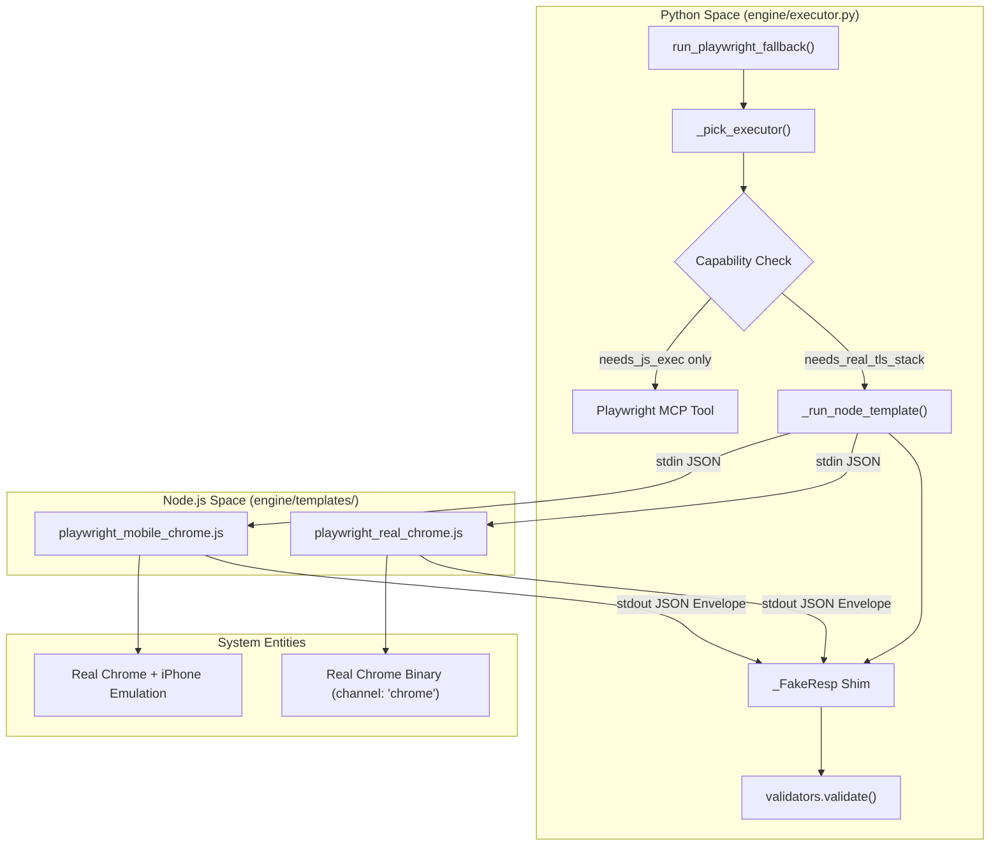
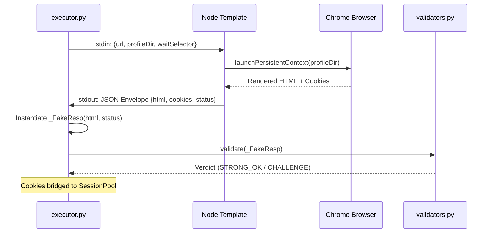

# Playwright Executor 및 Browser Templates

관련 소스 파일

다음 파일들은 이 위키 페이지를 생성하기 위한 컨텍스트로 사용되었습니다.

- [skills/insane-search/engine/executor.py](skills/insane-search/engine/executor.py)
- [skills/insane-search/engine/templates/playwright_mobile_chrome.js](skills/insane-search/engine/templates/playwright_mobile_chrome.js)
- [skills/insane-search/engine/templates/playwright_real_chrome.js](skills/insane-search/engine/templates/playwright_real_chrome.js)
- [skills/insane-search/references/playwright.md](skills/insane-search/references/playwright.md)

Playwright Executor 모듈은 가벼운 `curl_cffi` probe가 정교한 Web Application Firewalls(WAF)를 우회하지 못하거나 사이트가 렌더링을 위해 많은 JavaScript 실행을 요구할 때 사용하는 고충실도 폴백 메커니즘을 제공합니다. 사이트의 감지된 WAF 프로필에 따라 적절한 브라우저 환경을 선택하고, 결과 데이터(HTML 및 쿠키)를 기본 Python session pool로 다시 연결합니다.

## 실행 흐름 개요

`fetch_chain`이 대상에 TLS impersonation 이상의 처리가 필요하다고 판단하면 `executor.py`를 호출합니다 [skills/insane-search/engine/executor.py:123-132](). 시스템은 WAF 프로필에 정의된 `capabilities_needed`를 평가하여 두 가지 주요 접근법 중 하나를 선택합니다.

1.  **Playwright MCP**: 표준 JS 렌더링을 위한 가벼운 Claude 통합 도구입니다 [skills/insane-search/references/playwright.md:15-16]().
2.  **Local Node + Real Chrome**: Akamai 같은 고급 TLS 지문 기반 WAF를 우회하기 위해 시스템에 설치된 Chrome 바이너리를 사용하는 특수 로컬 실행 환경입니다 [skills/insane-search/references/playwright.md:51-52]().

### 기능 매칭 로직

`_pick_executor` 함수는 태그를 기반으로 도구를 결정합니다 [skills/insane-search/engine/executor.py:65-75]().

| 기능 태그 | 선택된 Executor | 로직 경로 |
| :--- | :--- | :--- |
| `needs_real_tls_stack` + `needs_js_exec` | `playwright_real_chrome` | Akamai, DataDome, PerimeterX |
| `needs_js_exec` only | `playwright_mcp` | Cloudflare Turnstile, SPA 렌더링 |
| `needs_mobile_context` | `playwright_mobile_chrome` | 모바일 전용 서브도메인 |

**출처:** [skills/insane-search/engine/executor.py:65-75](), [skills/insane-search/references/playwright.md:112-121]()

## 코드 엔터티 맵: Executor 라우팅

다음 다이어그램은 Python 엔진이 Node.js 템플릿 및 executor 선택을 위한 의사결정 트리와 어떻게 상호작용하는지 보여줍니다.

**다이어그램: Executor 선택 및 데이터 흐름**

**출처:** [skills/insane-search/engine/executor.py:65-101](), [skills/insane-search/engine/executor.py:144-180](), [skills/insane-search/engine/templates/playwright_real_chrome.js:88-101]()

## Node.js Templates 및 Stealth 전략

시스템은 `engine/templates/`에 위치한 두 가지 주요 JavaScript 템플릿을 사용합니다. 이 템플릿들은 엄격한 "No-Site-Name Rule"을 따릅니다. 즉, 사이트별 로직을 포함하지 않으며 `stdin`을 통해 전달된 매개변수에만 기반해 분기합니다 [skills/insane-search/engine/templates/playwright_real_chrome.js:10-12]().

### 1. playwright_real_chrome.js
이 템플릿은 번들 Chromium의 BoringSSL 지문을 감지하는 봇 관리자를 우회하도록 설계되었습니다.
*   **Channel**: 시스템에 설치된 Google Chrome을 실행하기 위해 `channel: 'chrome'`을 사용합니다 [skills/insane-search/engine/templates/playwright_real_chrome.js:94]().
*   **Warmup Hop**: Akamai 스타일 센서가 세션 쿠키를 설정할 수 있도록 deep URL 전에 사이트 루트(`/`)를 방문합니다 [skills/insane-search/engine/templates/playwright_real_chrome.js:112-118]().
*   **Retry Logic**: `waitSelector`가 제공되었고 실패하면, 챌린지가 해결된 뒤의 페이지를 잡기 위해 "hard reload"를 수행합니다 [skills/insane-search/engine/templates/playwright_real_chrome.js:131-135]().
*   **Automation Stack**: 사용 가능한 경우 stealth가 강화된 Playwright 포크인 `patchright`를 선호하며, 그렇지 않으면 `stealth` 플러그인을 포함한 `playwright-extra`로 폴백합니다 [skills/insane-search/engine/templates/playwright_real_chrome.js:67-86]().

### 2. playwright_mobile_chrome.js
실제 Chrome 스택을 상속하지만 `playwright.devices['iPhone 13 Pro']`를 사용해 디바이스 descriptor(UA, viewport, touch support)를 주입합니다 [skills/insane-search/engine/templates/playwright_mobile_chrome.js:73-85](). 이는 WAF가 모바일 서명에 더 관대하거나 콘텐츠가 모바일 서브도메인에서만 제공될 때 사용됩니다.

**출처:** [skills/insane-search/engine/templates/playwright_real_chrome.js:1-165](), [skills/insane-search/engine/templates/playwright_mobile_chrome.js:1-112]()

## 프로필 디렉터리 격리

동시 fetch 중 쿠키 유출과 프로필 잠금 충돌을 방지하기 위해 executor는 격리된 프로필 디렉터리를 관리합니다 [skills/insane-search/engine/executor.py:184-189]().

`_profile_dir_for(url, choice)` 함수는 다음을 기반으로 경로를 생성합니다.
1.  **Host Hash**: 호스트명의 SHA-1 해시입니다(No-Site-Name Rule 보존) [skills/insane-search/engine/executor.py:44-47]().
2.  **Device Class**: emulation 상태가 섞이지 않도록 `desktop`과 `mobile`에 대해 별도 하위 디렉터리를 사용합니다 [skills/insane-search/engine/executor.py:48-49]().

**출처:** [skills/insane-search/engine/executor.py:37-50]()

## 응답 브리징 및 쿠키 동기화

브라우저는 별도 프로세스에서 실행되므로, 결과를 Python `SessionPool`로 다시 연결해야 합니다.

### JSON Envelope
Node 템플릿은 결과를 다음 항목을 포함하는 구조화된 JSON envelope로 래핑합니다 [skills/insane-search/engine/templates/playwright_real_chrome.js:30-40]().
*   `html`: 렌더링된 전체 페이지 소스입니다.
*   `finalUrl`: 모든 리다이렉트 이후의 URL입니다.
*   `status`: HTTP 상태 코드입니다.
*   `cookies`: 쿠키 객체(name, value, domain)의 배열입니다.
*   `userAgent`: 브라우저가 사용한 특정 UA입니다.

### _FakeResp Shim
Python에서 `_FakeResp` 클래스 [skills/insane-search/engine/executor.py:103-111]()는 `requests` 또는 `curl_cffi` 응답 객체를 모방합니다. 이를 통해 표준 `validators.validate()` 함수가 수정 없이 Playwright 결과를 처리할 수 있습니다 [skills/insane-search/engine/executor.py:207-211]().

**다이어그램: Browser-to-Session Bridge**

**출처:** [skills/insane-search/engine/executor.py:103-112](), [skills/insane-search/engine/executor.py:197-211](), [skills/insane-search/engine/templates/playwright_real_chrome.js:30-40]()

## 주요 함수 참조

| 함수 | 파일 | 설명 |
| :--- | :--- | :--- |
| `run_playwright_fallback` | [skills/insane-search/engine/executor.py:123]() | 브라우저 기반 검색의 주요 진입점입니다. |
| `_pick_executor` | [skills/insane-search/engine/executor.py:65]() | 기능 태그를 JS 템플릿에 매핑합니다. |
| `_run_node_template` | [skills/insane-search/engine/executor.py:78]() | subprocess 실행과 JSON 통신을 처리합니다. |
| `_profile_dir_for` | [skills/insane-search/engine/executor.py:37]() | Chrome 프로필을 위한 해시 기반 격리 경로를 생성합니다. |
| `buildEnvelope` | [skills/insane-search/engine/templates/playwright_real_chrome.js:30]() | Python 부모 프로세스를 위해 브라우저 상태를 직렬화합니다. |

**출처:** [skills/insane-search/engine/executor.py:1-211](), [skills/insane-search/engine/templates/playwright_real_chrome.js:1-165]()
