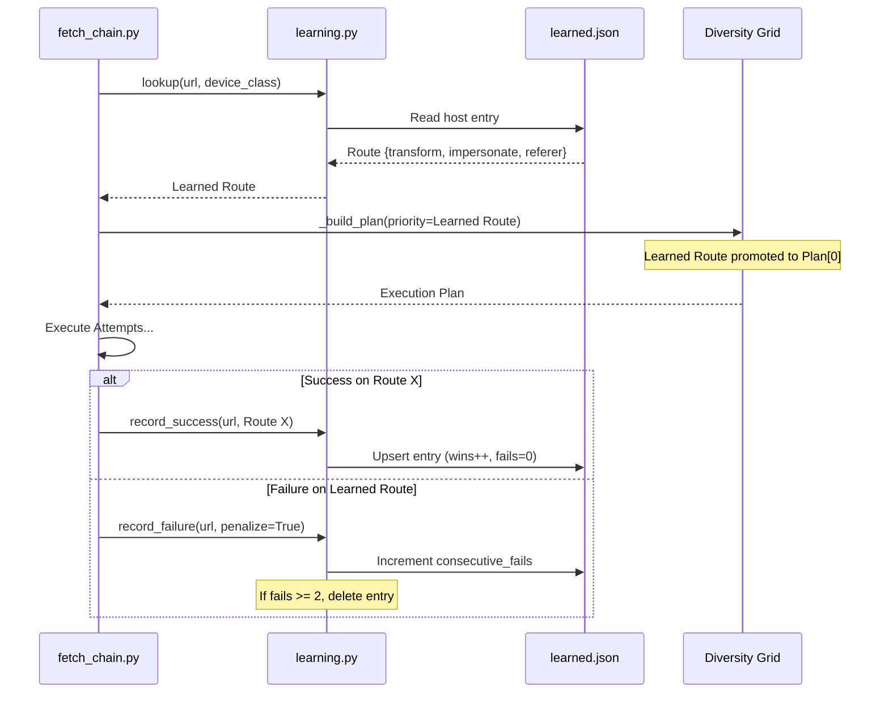
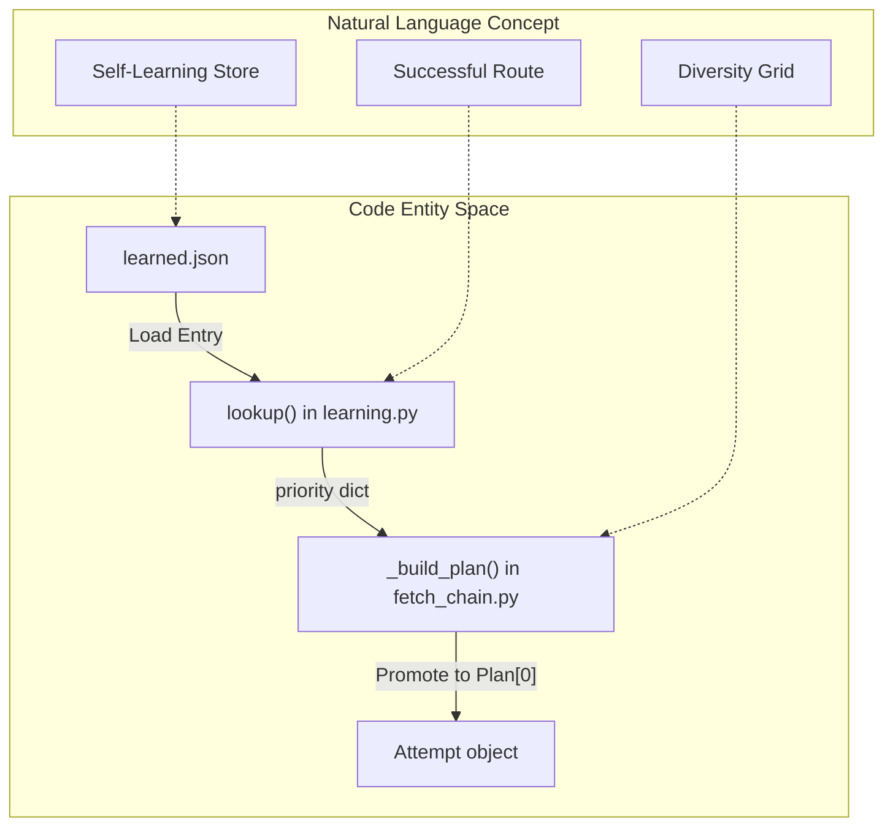

# Self-Learning Store

관련 소스 파일

다음 파일들은 이 위키 페이지를 생성하기 위한 컨텍스트로 사용되었습니다.

- [skills/insane-search/engine/learning.py](skills/insane-search/engine/learning.py)
- [skills/insane-search/engine/tests/test_u5.py](skills/insane-search/engine/tests/test_u5.py)

Self-Learning Store는 호스트의 방어를 성공적으로 우회한 특정 요청 매개변수 조합을 기억하여 fetch 과정을 최적화하는 경량 영속성 계층입니다. 성공한 "routes"를 캐시함으로써, 시스템은 동일 호스트를 다시 방문할 때 [Diversity Grid](2.2.-the-fetch-chain-&-diversity-grid)의 시행착오 단계를 건너뛸 수 있습니다.

## 개요

store는 `learning.py`에 구현되어 있으며 JSON 파일(일반적으로 `~/.insane_search/learned.json`)을 유지합니다 [skills/insane-search/engine/learning.py:44-48](). 이 파일은 호스트명을 다음으로 구성된 특정 **Route Schema**에 매핑합니다.
*   **URL Transform**: URL에 적용된 변형입니다(예: `mobile_subdomain`).
*   **Impersonation**: 사용된 TLS/JA3 지문입니다(예: `chrome`).
*   **Referer Strategy**: 사용된 헤더 전략입니다(예: `self_root`).
*   **Phase**: 성공이 발생한 단계 상승 수준입니다(일반적으로 `grid`).

### 데이터 흐름: 학습 루프

다음 다이어그램은 성공한 fetch가 동일 호스트에 대한 향후 요청에 어떻게 반영되는지 보여줍니다.

**Route 학습 및 승격 흐름**

출처: [skills/insane-search/engine/learning.py:122-176](), [skills/insane-search/engine/fetch_chain.py:134-142]() (테스트 로직에서 추론).

## Route Schema 및 저장

store는 모바일과 데스크톱 경로가 독립적으로 학습되도록 `host::device_class`(예: `example.com::desktop`) 복합 키를 사용합니다 [skills/insane-search/engine/learning.py:56-59]().

### 엔트리 구조
`learned.json`의 일반적인 엔트리는 다음을 포함합니다.
| 필드 | 설명 |
| :--- | :--- |
| `route` | `transform`, `impersonate`, `referer`, `phase`를 포함하는 딕셔너리입니다. |
| `wins` | 이 특정 경로가 성공한 총 횟수입니다. |
| `consecutive_fails` | 퇴출에 사용되는 실제 차단의 카운터입니다. |
| `last_used` | 마지막 시도(성공 여부와 무관)의 ISO 타임스탬프입니다. |
| `last_success` | 마지막 성공 fetch의 ISO 타임스탬프입니다. |

출처: [skills/insane-search/engine/learning.py:144-150]()

## Strike 기반 퇴출 정책

store는 환경 변화(예: 사이트가 WAF 구성을 업데이트하는 경우)를 처리하기 위해 "two-strike" 정책을 사용합니다. 

### 실패 분류
모든 실패가 패널티로 이어지지는 않습니다. 시스템은 경로 실패와 일시적/URL 실패를 구분합니다.
*   **실제 실패(패널티 부여)**: `exhausted`, `challenge`, `blocked` 같은 결과는 경로가 더 이상 효과적이지 않음을 시사합니다 [skills/insane-search/engine/learning.py:37-38]().
*   **일시적/URL 실패(패널티 없음)**: `429 (Rate Limit)`, `404 (Not Found)`, `network_error` 같은 결과는 요청 헤더나 TLS 지문 때문에 발생한 것이 아닐 가능성이 높으므로 경로에 strike를 주지 않습니다 [skills/insane-search/engine/learning.py:11-12](), [skills/insane-search/engine/learning.py:51-54]().

### 퇴출 로직
1.  **Strike**: 학습된 경로가 "실제 실패"를 일으키면 `consecutive_fails`가 증가합니다 [skills/insane-search/engine/learning.py:169]().
2.  **Evict**: `consecutive_fails >= 2`(`EVICT_AFTER_FAILS`로 정의)에 도달하면 엔트리가 store에서 삭제됩니다 [skills/insane-search/engine/learning.py:32](), [skills/insane-search/engine/learning.py:171-172]().
3.  **Reset**: 해당 경로를 사용한 fetch가 성공하면 `consecutive_fails`가 `0`으로 재설정됩니다 [skills/insane-search/engine/learning.py:147]().

출처: [skills/insane-search/engine/learning.py:8-16](), [skills/insane-search/engine/learning.py:32-38]()

## Pruning 및 유지관리

store가 무한히 커지는 것을 방지하기 위해 `learning.py`는 `load()` 작업 중 유지관리를 수행합니다.

*   **TTL(Time-To-Live)**: 30일(기본값) 넘게 사용되지 않은 엔트리는 제거됩니다 [skills/insane-search/engine/learning.py:30](), [skills/insane-search/engine/learning.py:77-82]().
*   **LRU(Least Recently Used) 제한**: store는 500개 엔트리(기본값)로 제한됩니다. 제한을 초과하면 `last_used` 기준으로 가장 오래된 엔트리가 제거됩니다 [skills/insane-search/engine/learning.py:31](), [skills/insane-search/engine/learning.py:83-90]().

유지관리는 "best-effort" 방식이며 `load()` 중 메모리에서 수행됩니다. 결과는 불필요한 디스크 I/O를 피하기 위해 다음 `save()` 호출 때 영속화됩니다 [skills/insane-search/engine/learning.py:97-98]().

출처: [skills/insane-search/engine/learning.py:74-91]()

## `_build_plan`을 통한 그리드 승격

fetch chain의 `_build_plan` 함수는 학습된 데이터를 실행 전략에 통합하는 역할을 담당합니다.

**코드 엔터티의 승격 로직**

`_build_plan`이 `lookup`을 통해 가져온 `priority` 경로를 받으면 다음을 수행합니다.
1.  표준 전체 후보 그리드를 생성합니다.
2.  학습된 `transform`, `impersonate`, `referer`와 일치하는 후보를 식별합니다.
3.  해당 후보를 목록의 맨 앞으로 이동합니다(`plan[0]`) [skills/insane-search/engine/tests/test_u5.py:132-142]().
4.  재정렬 중 후보가 손실되지 않도록 하여 전체 그리드의 폴백 안전성을 유지합니다.

출처: [skills/insane-search/engine/tests/test_u5.py:132-142](), [skills/insane-search/engine/learning.py:3-5]()
