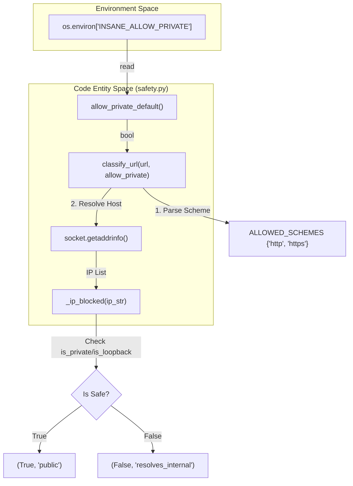
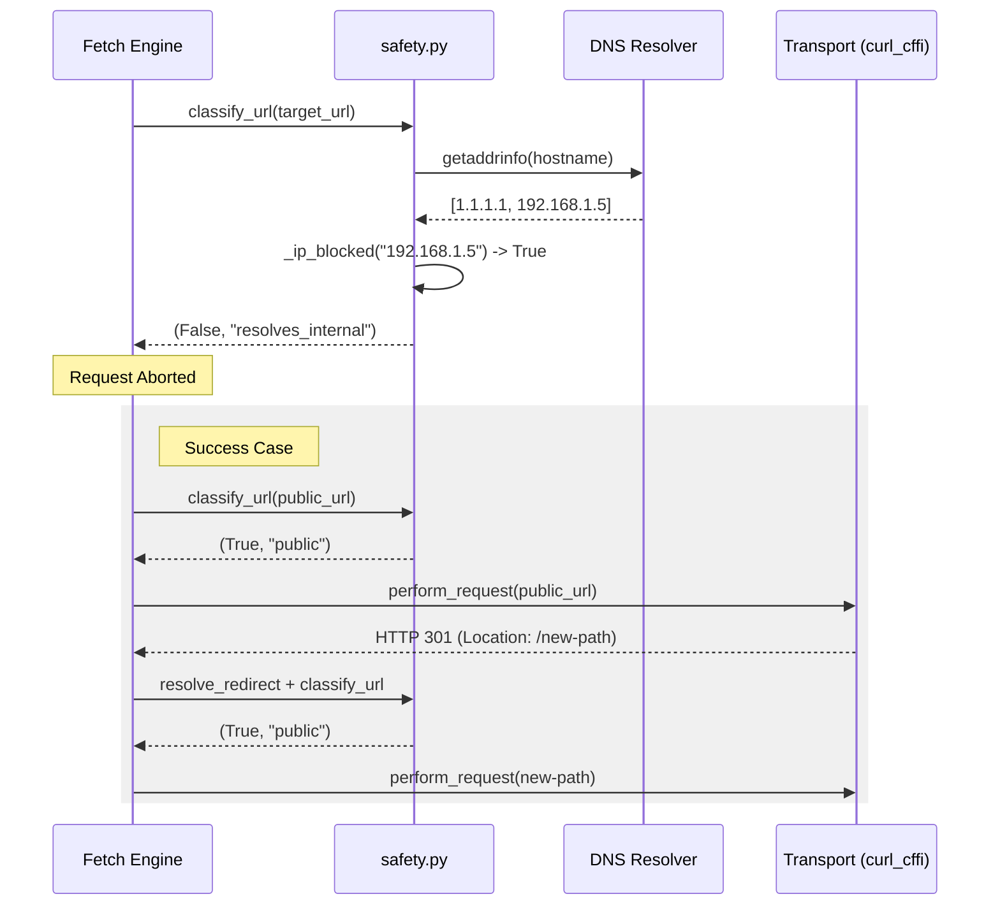

# Safety 및 SSRF Guard

관련 소스 파일

다음 파일들은 이 위키 페이지를 생성하기 위한 컨텍스트로 사용되었습니다.

- [skills/insane-search/engine/safety.py](skills/insane-search/engine/safety.py)

`safety.py` 모듈은 **Server-Side Request Forgery(SSRF)**를 방지하도록 설계된 결정적 보안 계층을 제공합니다. `insane-search` 엔진은 외부 에이전트의 영향을 받는 URL을 가져오고 리다이렉트를 따르기 때문에, 요청을 내부 인프라(예: loopback, RFC-1918 private networks, 또는 `169.254.169.254` 같은 클라우드 메타데이터 엔드포인트)로 리다이렉트할 수 있는 악의적 페이지에 취약할 수 있습니다.

기반 transport 라이브러리(`curl_cffi`)는 리다이렉트 목적지를 private IP 범위와 대조해 검증하는 내장 기능을 제공하지 않으므로, `safety.py`는 요청이 전송되거나 리다이렉트를 따르기 전에 반드시 통과해야 하는 수동 검증 게이트를 구현합니다.

## 구현 개요

safety 시스템은 내부 대상에 대해 "default-deny" 원칙으로 동작합니다. 호스트명을 IP 주소로 해석하고 비공개 범위의 blocklist와 대조하여, 초기 URL과 리다이렉트 체인의 모든 후속 hop을 검증합니다.

### URL 분류 흐름

핵심 로직은 `classify_url`에 있으며, 이 함수는 다단계 검증을 수행합니다.

1.  **Scheme Whitelisting**: `http`와 `https`만 허용됩니다 [skills/insane-search/engine/safety.py:20-20]().
2.  **IP Literal Check**: host가 IP 주소이면 즉시 `_ip_blocked` 필터와 대조해 확인합니다 [skills/insane-search/engine/safety.py:53-55]().
3.  **DNS-Rebinding Defense**: 호스트명의 경우, 시스템은 `socket.getaddrinfo`를 사용해 DNS 해석을 수행합니다. 연결된 모든 IP 주소(A/AAAA 레코드)를 추출하고, 해석된 IP 중 *하나라도* 제한 범위에 속하면 요청을 차단합니다 [skills/insane-search/engine/safety.py:60-70]().

### DNS 해석 및 IP 차단 로직

`_ip_blocked` 함수는 제한 범위를 식별하기 위해 표준 `ipaddress` 라이브러리를 사용합니다.

| 범주 | 설명 | 구현 |
| :--- | :--- | :--- |
| **Private** | RFC-1918(10.0.0.0/8, 172.16.0.0/12, 192.168.0.0/16) | `ip.is_private` |
| **Loopback** | 127.0.0.1/8, ::1 | `ip.is_loopback` |
| **Link-Local** | 169.254.0.0/16(Cloud Metadata) | `ip.is_link_local` |
| **Reserved** | IETF 예약 범위 | `ip.is_reserved` |
| **Multicast** | 224.0.0.0/4 | `ip.is_multicast` |

출처: [skills/insane-search/engine/safety.py:28-34]()

## 코드 엔터티 맵: Safety 검증

다음 다이어그램은 safety 함수들이 네트워크 및 환경 변수와 상호작용하여 대상 URL을 분류하는 방식을 보여줍니다.

**Safety 분류 로직**

출처: [skills/insane-search/engine/safety.py:20-71]()

## 수동 리다이렉트 검증

엔진은 다음 hop을 검증하기 위해 리다이렉트를 가로채야 하므로, transport layer가 진행하기 전에 응답 객체를 검사하는 helper 함수를 사용합니다.

*   **`is_redirect(resp)`**: HTTP 상태 코드 301, 302, 303, 307, 308을 식별합니다 [skills/insane-search/engine/safety.py:83-87]().
*   **`location_of(resp)`**: `Location` 헤더를 대소문자 구분 없이 안전하게 추출합니다 [skills/insane-search/engine/safety.py:74-80]().
*   **`resolve_redirect(base_url, location)`**: base URL과 리다이렉트 location(상대 경로 처리 포함)을 결합하여 다음 safety check를 위한 절대 목적지를 생성합니다 [skills/insane-search/engine/safety.py:90-91]().

## 보안 구성

### 환경 변수 override
시스템은 기본적으로 엄격한 public-only 접근을 사용하지만, 개발자는 로컬 테스트나 내부 scraping 작업을 위해 private network 접근을 활성화할 수 있습니다.

*   **변수**: `INSANE_ALLOW_PRIVATE`
*   **허용 값**: `1`, `true`, `yes`
*   **효과**: 활성화되면 `classify_url`은 host의 IP 주소와 관계없이 `(True, "allow_private")`를 반환합니다 [skills/insane-search/engine/safety.py:24-25](), [skills/insane-search/engine/safety.py:49-50]().

### 데이터 흐름: 요청 보호
이 다이어그램은 safety 모듈이 fetch 엔진의 gatekeeper로 작동하는 방식을 보여줍니다.

**요청 보호 데이터 흐름**

출처: [skills/insane-search/engine/safety.py:37-71](), [skills/insane-search/engine/safety.py:90-91]()
