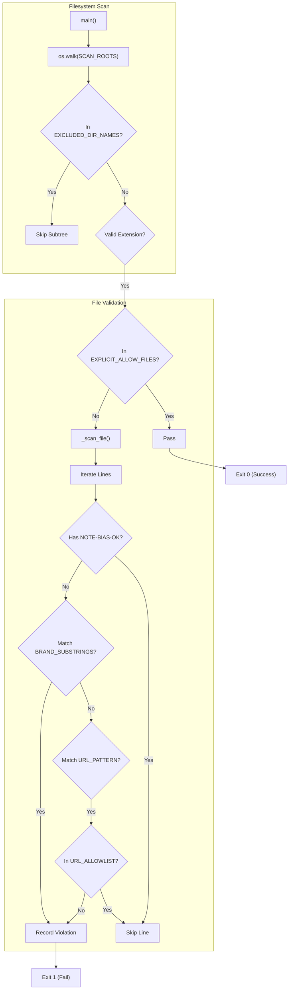

# Bias Check 및 No-Site-Name Rule

<details>
<summary>관련 소스 파일</summary>

다음 파일들은 이 위키 페이지를 생성하기 위한 컨텍스트로 사용되었습니다.

- [skills/insane-search/engine/bias_check.py](skills/insane-search/engine/bias_check.py)

</details>


**No-Site-Name Rule**은 검색 엔진이 범용적이고 도메인 비의존적인 유틸리티로 유지되도록 설계된 `insane-search`의 핵심 아키텍처 원칙입니다. 이 규칙은 "Fetch Chain"이 특정 플랫폼에 편향되는 것을 방지하고(예: 특정 retailer만을 위한 특수 헤더 하드코딩), 모든 사이트별 로직이 **Phase 0**에 격리되거나 **References**에 문서화되도록 보장합니다.

`bias_check.py` 스크립트는 코드베이스에서 하드코딩된 브랜드명, 도메인, URL을 스캔하여 이 규칙을 강제하는 CI 린터 역할을 합니다.

### 목적 및 범위
린터는 세 가지 주요 기능을 수행합니다.
1.  **중립성 강제**: `engine/` 로직(변환, 세션, 스케줄링)이 모든 대상에 대해 동일하게 동작하도록 보장합니다 [skills/insane-search/engine/bias_check.py:4-5]().
2.  **아키텍처 가드레일**: 개발자가 사이트별 "hacks"를 `if "site.com" in url:` 블록 대신 `phase0.py`에 배치하거나 범용 WAF 프로필 시스템을 사용하도록 강제합니다.
3.  **CI 검증**: 범용 fetch grid에 사이트별 편향을 도입하는 pull request를 차단합니다 [skills/insane-search/engine/bias_check.py:7-9]().

---

### 로직 흐름 및 구현

`bias_check.py` 스크립트는 디렉터리 트리를 순회하고 위반 사항을 식별하기 위해 다단계 필터링 프로세스를 적용합니다. 부분 문자열 매칭, regex 패턴 추출, "중립적" 인프라 호스트 allowlist를 조합해 사용합니다.

#### 데이터 흐름 다이어그램: 린터 실행
다음 다이어그램은 파일이 파일시스템에서 여러 검사 계층을 거쳐 처리되는 방식을 보여줍니다.

**린터 로직 흐름**

**출처:** [skills/insane-search/engine/bias_check.py:98-134](), [skills/insane-search/engine/bias_check.py:154-164]()

---

### 감지 메커니즘

#### 1. 브랜드 부분 문자열 Denylist
스크립트는 `engine/` 디렉터리 내에서 엄격히 금지되는 알려진 브랜드 및 도메인 부분 문자열 목록을 유지합니다. 여기에는 주요 retailer, 소셜 미디어 플랫폼, 포털 사이트가 포함됩니다.

| 범주 | 금지된 부분 문자열(예시) |
| :--- | :--- |
| **Retailers** | `coupang`, `11st`, `musinsa`, `kurly`, `ohou` |
| **Communities** | `fmkorea`, `dcinside`, `daangn` |
| **Portals** | `naver.com`, `daum.net`, `kakao.com` |

**출처:** [skills/insane-search/engine/bias_check.py:25-34]()

#### 2. URL 패턴 스캔
denylist에 명시적으로 나열되지 않은 도메인을 잡아내기 위해, 스크립트는 정규식 `URL_PATTERN`을 사용해 호스트명을 추출합니다 [skills/insane-search/engine/bias_check.py:38-41]().

*   **패턴**: `https?://[\w\.-]+|[\w-]+\.(?:com|net|org|co\.kr|kr|io)\b`
*   **중립 Allowlist**: 기술 인프라 또는 문서화에 필요한 도메인은 예외 처리됩니다. 예시로는 중립 Referer로 사용되는 `google.com`, `playwright.dev`, `curl.se`, `httpbin.org`가 있습니다 [skills/insane-search/engine/bias_check.py:48-57]().

---

### 예외 및 Override

No-Site-Name Rule은 기능 또는 설명에 사이트명이 필요한 특정 문서화된 예외를 허용합니다.

#### EXPLICIT_ALLOW_FILES(Phase 0 예외)
`phase0.py`는 엔진 디렉터리에서 사이트명을 포함할 수 있는 **유일한** 파일입니다. 이 파일은 플랫폼별 공개 엔드포인트(예: Reddit RSS, YouTube metadata)를 위한 공식 라우터 역할을 합니다 [skills/insane-search/engine/bias_check.py:82-90]().

#### NOTE-BIAS-OK 주석 마커
개발자는 주석 마커를 추가하여 특정 줄에 대해 린터를 우회할 수 있습니다. 이는 일반적으로 설명 주석이나 코드의 합법적인 예시에 사용됩니다 [skills/insane-search/engine/bias_check.py:73-79]().

| 언어 | 마커 |
| :--- | :--- |
| **Python** | `# NOTE-BIAS-OK` |
| **JavaScript** | `// NOTE-BIAS-OK` |
| **Markdown** | `<!-- NOTE-BIAS-OK -->` |

**출처:** [skills/insane-search/engine/bias_check.py:93-95](), [skills/insane-search/engine/bias_check.py:112-113]()

---

### CLI 사용 및 CI 통합

`bias_check.py` 스크립트는 CI 환경(예: GitHub Actions) 또는 pre-commit hook으로 실행되도록 설계되었습니다.

#### Strict Mode
기본적으로 린터는 `engine/` 디렉터리만 스캔합니다. `--strict` 플래그를 사용하면 스캔 범위가 `references/` 디렉터리까지 확장됩니다 [skills/insane-search/engine/bias_check.py:10-11](). references에는 자연스럽게 많은 사이트명이 포함되므로, 이는 일반적으로 심층 감사에 사용됩니다 [skills/insane-search/engine/bias_check.py:61]().

#### 명령 예시
| 명령 | 설명 |
| :--- | :--- |
| `python3 engine/bias_check.py` | 표준 검사(Engine만). |
| `python3 engine/bias_check.py --strict` | 전체 검사(Engine + References). |
| `python3 engine/bias_check.py --root .` | 사용자 지정 skill root를 지정합니다. |

**출처:** [skills/insane-search/engine/bias_check.py:138-146]()

---

### 시스템 엔터티 매핑
다음 다이어그램은 논리적 "Bias Rules"를 `bias_check.py`의 특정 코드 엔터티에 매핑합니다.

**코드 엔터티 매핑**
```mermaid
classDiagram
    class BiasCheckLinter {
        +BRAND_SUBSTRINGS: list
        +URL_PATTERN: Pattern
        +URL_ALLOWLIST: set
        +EXPLICIT_ALLOW_FILES: set
        +main(argv)
        +_scan_file(path, root)
        +_line_is_exempt(line, ext)
    }

    class FileSystem {
        +SCAN_ROOTS_STRICT_OFF: list
        +EXCLUDED_DIR_NAMES: set
    }

    BiasCheckLinter ..> FileSystem : "Walks roots"
    BiasCheckLinter --> "phase0.py" : "Exempts via EXPLICIT_ALLOW_FILES"
    BiasCheckLinter --> "COMMENT_OK_MARKERS" : "Checks for # NOTE-BIAS-OK"
```
**출처:** [skills/insane-search/engine/bias_check.py:25-90](), [skills/insane-search/engine/bias_check.py:137-164]()
