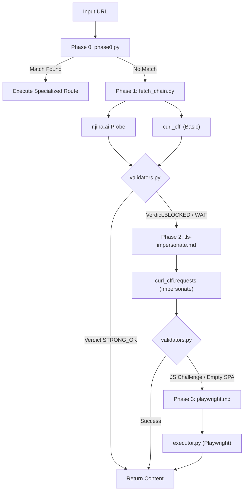
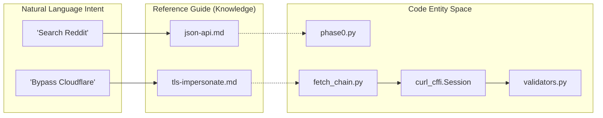

# 참조 가이드

관련 소스 파일

다음 파일들은 이 위키 페이지를 생성하기 위한 컨텍스트로 사용되었습니다.

- [PLATFORMS.md](PLATFORMS.md)
- [assets/hero.png](assets/hero.png)
- [assets/pipeline.png](assets/pipeline.png)
- [skills/insane-search/references/fallback.md](skills/insane-search/references/fallback.md)
- [skills/insane-search/references/tls-impersonate.md](skills/insane-search/references/tls-impersonate.md)

`skills/insane-search/references/` 디렉터리는 엔진의 지식 베이스 역할을 합니다. 이 디렉터리에는 시스템이 다양한 플랫폼과 콘텐츠 유형에 대해 최적의 검색 경로를 결정하는 데 사용하는 기법별 문서가 포함되어 있습니다. 이 가이드들은 범용 웹 fetching에서 특수 API 및 브라우저 기반 추출로 전환하는 방식을 정의합니다.

## 적응형 단계 상승 파이프라인

`insane-search`의 핵심 로직은 4단계 단계 상승 모델을 따릅니다. 시스템은 각 단계에서 응답을 평가하고, 성공으로 종료할지 더 복잡하고 비용이 큰 방법으로 단계 상승할지 결정합니다.

### Phase 개요
| Phase | 기법 | 트리거 |
|-------|-----------|---------|
| **Phase 0** | **특수 엔드포인트** | 알려진 고효율 경로(RSS, JSON APIs, yt-dlp)와 일치합니다. |
| **Phase 1** | **경량 Probe** | 알 수 없는 사이트의 기본값이며, Jina Reader 또는 기본 `curl`을 사용합니다. |
| **Phase 2** | **TLS Impersonation** | WAF 감지(403, 429, 또는 WAF별 헤더/쿠키)에 의해 트리거됩니다. |
| **Phase 3** | **Playwright MCP** | JS 중심 챌린지, CAPTCHA, SPA 셸을 위한 최종 폴백입니다. |

단계 상승 로직과 응답 검증 마커에 대한 자세한 설명은 **[JSON APIs 및 RSS Feeds](#4.1)**와 [skills/insane-search/references/fallback.md:1-160]()의 엔진 폴백 로직을 참조하세요.

### 단계 상승 워크플로
다음 다이어그램은 시스템이 코드 수준 엔터티를 사용하여 URL 요청에서 검증된 응답으로 이동하는 방식을 보여줍니다.

**다이어그램: 파이프라인 단계 상승 로직**

출처: [skills/insane-search/references/fallback.md:15-121](), [skills/insane-search/references/tls-impersonate.md:1-56]()

---

## 4.1 JSON APIs 및 RSS Feeds
이 가이드는 고효율, 저대역폭 검색 패턴을 다룹니다. Reddit의 `.rss` 피드, Hacker News의 Firebase API, 다양한 개발자 플랫폼 API(npm, PyPI, dev.to) 같은 직접 데이터 스트림에 접근하여 프런트엔드 제한을 우회하는 방법을 문서화합니다.
*   **주요 패턴**: URL 변형(`.json` 또는 `/rss` 추가), OAuth 없는 공개 엔드포인트, rate-limit jitter 전략.
*   **세부사항**: [JSON APIs 및 RSS Feeds](#4.1)를 참조하세요(참조: [skills/insane-search/references/json-api.md](), [skills/insane-search/references/rss.md]()).

## 4.2 Public APIs(Bluesky, Mastodon, Stack Overflow 등)
공개 데이터에 인증이 필요 없는 안정적이고 문서화된 REST 또는 Atom API를 가진 플랫폼에 초점을 맞춥니다. 여기에는 Bluesky용 AT Protocol, Stack Exchange API v2.3, arXiv와 CrossRef 같은 학술 소스가 포함됩니다.
*   **주요 패턴**: Mastodon의 인스턴스별 API 발견 및 GitHub용 `gh` CLI 통합.
*   **세부사항**: [Public APIs (Bluesky, Mastodon, Stack Overflow, arXiv, GitHub)](#4.2)를 참조하세요(참조: [skills/insane-search/references/public-api.md]()).

## 4.3 Media Extraction(yt-dlp)
`yt-dlp`를 Phase 0 도구로 통합하는 방식을 문서화합니다. 이를 통해 엔진은 페이지를 렌더링하지 않고 메타데이터와 자막을 추출하여 비디오 및 오디오 플랫폼(YouTube, TikTok, SoundCloud)을 구조화된 데이터 소스로 취급할 수 있습니다.
*   **주요 패턴**: 메타데이터에는 `--dump-json`, 콘텐츠 검색에는 `--write-auto-subs` 사용.
*   **세부사항**: [Media Extraction (yt-dlp)](#4.3)을 참조하세요(참조: [skills/insane-search/references/media.md]()).

## 4.4 Jina Reader Integration
주요 Phase 1 probe로서 `r.jina.ai`의 역할을 설명합니다. 이는 설정이 필요 없는 HTML-to-markdown 변환기 역할을 하며, 엔진이 복잡한 TLS impersonation을 시도하기 전에 사이트의 중요한 "경량" 보기를 제공합니다.
*   **주요 패턴**: RSS 자동 발견 및 SPA 콘텐츠 추출에 Jina 사용.
*   **세부사항**: [Jina Reader Integration](#4.4)을 참조하세요(참조: [skills/insane-search/references/jina.md]()).

## 4.5 Cache 및 Archive Fallbacks
"Sidecar" 전략을 다룹니다. origin 서버에 접근할 수 없거나 엄격히 차단된 경우, 엔진은 Google AMP Cache, archive.today, Wayback Machine을 동시에 확인합니다.
*   **주요 패턴**: 사용자가 데이터가 캐시된 소스에서 왔음을 알 수 있도록 하는 출처 태깅 요구사항.
*   **세부사항**: [Cache & Archive Fallbacks](#4.5)를 참조하세요(참조: [skills/insane-search/references/cache-archive.md]()).

## 4.6 Metadata Extraction(OGP 및 JSON-LD)
최후의 데이터 복구 방법을 자세히 설명합니다. 전체 본문을 가져올 수 없는 경우, 엔진은 `metadata.md` 패턴을 사용해 Open Graph Protocol(OGP) 태그와 JSON-LD 구조화 데이터를 스크래핑하여 최소한 요약, 가격 또는 제목을 제공합니다.
*   **주요 패턴**: JSON-LD에서 `articleBody` 복구 및 e-commerce 사이트의 product schemas 복구.
*   **세부사항**: [Metadata Extraction (OGP & JSON-LD)](#4.6)을 참조하세요(참조: [skills/insane-search/references/metadata.md]()).

---

## 기술 매핑: 자연어에서 코드 엔터티로

다음 표와 다이어그램은 사용자-facing 개념을 특정 코드 구현 파일 및 클래스와 연결합니다.

| 개념 | 코드 엔터티 | 구현 파일 |
|:---|:---|:---|
| **TLS Fingerprinting** | `curl_cffi` | [skills/insane-search/references/tls-impersonate.md:1-5]() |
| **WAF Detection** | `WafDetector` | [skills/insane-search/engine/waf_detector.py]() |
| **Grid Scheduling** | `_build_plan` | [skills/insane-search/engine/fetch_chain.py]() |
| **Browser Execution** | `PlaywrightExecutor` | [skills/insane-search/engine/executor.py]() |
| **Site-Specific Rules** | `Phase0Router` | [skills/insane-search/engine/phase0.py]() |

**다이어그램: 엔터티 관계 맵**

출처: [PLATFORMS.md:11-40](), [skills/insane-search/references/fallback.md:15-106]()
