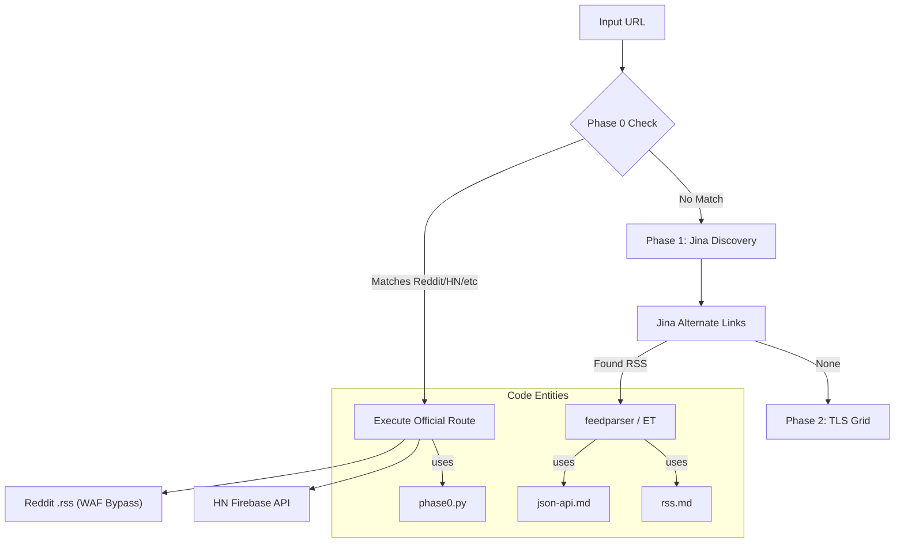
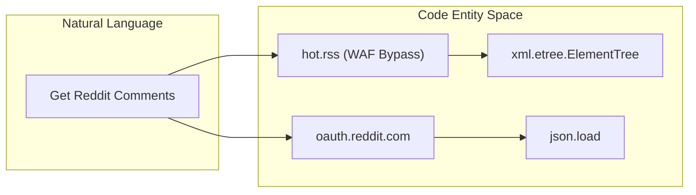

# JSON APIs 및 RSS Feeds

관련 소스 파일

다음 파일들은 이 위키 페이지를 생성하기 위한 컨텍스트로 사용되었습니다.

- [skills/insane-search/references/json-api.md](skills/insane-search/references/json-api.md)
- [skills/insane-search/references/rss.md](skills/insane-search/references/rss.md)

이 페이지는 공개 JSON API와 RSS/Atom syndication feeds를 통한 직접 구조화 데이터 검색을 위한 기술 참조입니다. 이러한 방법은 무거운 HTML scraping을 우회하고, 더 깨끗한 데이터를 제공하며, 표준 웹 페이지보다 rate limit이 더 높은 경우가 많기 때문에 단계 상승 파이프라인의 **Phase 0**에서 우선됩니다.

## 아키텍처 역할: 구조화 데이터와 HTML

`insane-search` 엔진은 처리 오버헤드를 최소화하고 데이터 신뢰성을 극대화하기 위해 구조화 엔드포인트를 우선합니다. 

| 방식 | Phase | 장점 | 단점 |
| :--- | :--- | :--- | :--- |
| **JSON API** | 0 | 가장 높은 정확도, 메타데이터(votes, IDs) 포함. | 특정 URL 변환이 필요한 경우가 많습니다. |
| **RSS/Atom** | 0 | 높은 WAF 면역성, 표준 스키마. | 제한된 메타데이터(보통 comments/votes 누락). |
| **Jina Reader** | 1 | 피드 자동 발견, Markdown 변환. | 제3자 의존성, 업데이트 지연. |

### 데이터 흐름: 발견에서 추출까지
다음 다이어그램은 시스템이 범용 URL에서 구조화된 피드 또는 API 응답으로 전환하는 방식을 보여줍니다.

**다이어그램: 구조화 데이터 발견 및 검색**

출처: [skills/insane-search/references/json-api.md:1-11](), [skills/insane-search/references/rss.md:1-18]()

---

## Reddit: WAF 우회 전략

2024년 중반 기준, Reddit은 `www`와 `old` 서브도메인 전반의 비인증 `.json` 엔드포인트에 공격적인 WAF 챌린지를 구현했으며, 고품질 TLS impersonation을 사용해도 403 Forbidden 오류가 발생합니다 [skills/insane-search/references/json-api.md:8-10]().

### 1. Atom/RSS(비인증)
`.rss` 확장자는 Reddit의 WAF가 일반적으로 예외 처리하는 신뢰할 수 있는 "backdoor"로 남아 있습니다.
*   **패턴**: `hot.rss`, `new.rss`, `rising.rss`, `top.rss?t=week`.
*   **검색**: `search.rss?q={query}&restrict_sr=1`.
*   **제한사항**: `score`, `num_comments`, `flair`가 누락됩니다 [skills/insane-search/references/json-api.md:12-28]().

### 2. OAuth API(인증)
전체 메타데이터를 위해 시스템은 `application-only` OAuth 토큰을 활용합니다.
*   **엔드포인트**: `https://oauth.reddit.com`(표준 웹 WAF에서 제외).
*   **Rate Limit**: 클라이언트당 분당 100 requests [skills/insane-search/references/json-api.md:44-63]().

**Reddit 로직 브리지**

출처: [skills/insane-search/references/json-api.md:31-40](), [skills/insane-search/references/json-api.md:56-63]()

---

## 선별된 JSON API 참조

다음 플랫폼들은 HTML scraping보다 선호되는 안정적인 비인증 JSON 엔드포인트를 제공합니다.

| 플랫폼 | 엔드포인트 패턴 | 주요 필드 | Rate Limit |
| :--- | :--- | :--- | :--- |
| **Hacker News** | `hacker-news.firebaseio.com/v0/item/{id}.json` | `score`, `descendants`, `kids` | 무시 가능 |
| **Lobste.rs** | `lobste.rs/hottest.json` | `tags`, `submitter_user` | 낮음 |
| **dev.to** | `dev.to/api/articles?tag={tag}` | `public_reactions_count`, `reading_time` | 보통 |
| **npm** | `registry.npmjs.org/{pkg}/latest` | `version`, `dependencies` | 높음 |
| **PyPI** | `pypi.org/pypi/{pkg}/json` | `info`, `releases` | 높음 |
| **Wikipedia** | `en.wikipedia.org/api/rest_v1/page/summary/{title}` | `extract`, `thumbnail` | 높음 |

출처: [skills/insane-search/references/json-api.md:65-166]()

---

## RSS 및 Atom Syndication

RSS 피드는 JavaScript 기반 안티봇 조치를 만나지 않고 뉴스와 블로그 콘텐츠를 검색하는 주요 메커니즘입니다.

### 피드 발견 및 파싱
1.  **자동 발견**: `Accept: application/json`과 함께 Jina Reader를 사용하여 HTML `<head>`에서 `external.alternate` 링크를 추출합니다 [skills/insane-search/references/rss.md:13-18]().
2.  **브루트포스 발견**: 일반적인 접미사 `/rss`, `/feed`, `/atom.xml`, `/rss.xml`을 시도합니다 [skills/insane-search/references/rss.md:22-30]().
3.  **파싱**: 단순 Atom 구조에는 `feedparser` 또는 `xml.etree.ElementTree`를 통해 표준화됩니다 [skills/insane-search/references/rss.md:108-118]().

### 글로벌 뉴스 및 언론
*   **Google News**: 키워드 검색(`/rss/search?q=...`)과 주제 기반 헤드라인을 지원합니다. `when:7d` 구문을 사용해 시간 필터링을 허용합니다 [skills/insane-search/references/rss.md:32-43]().
*   **한국 언론**: 주요 매체(SBS, Chosun, JoongAng, Donga, Khan, MK, MBC, Hankyung, Yonhap)는 직접 비인증 XML 피드를 제공합니다 [skills/insane-search/references/rss.md:45-76]().

### 플랫폼별 피드
*   **Naver Blog**: `rss.blog.naver.com/{id}.xml`
*   **GitHub Releases**: `github.com/{owner}/{repo}/releases.atom`
*   **YouTube Channels**: `youtube.com/feeds/videos.xml?channel_id={id}`
*   **Substack**: `{publication}.substack.com/feed`

출처: [skills/insane-search/references/rss.md:78-106]()

---

## 구현 세부사항

### WAF 우회 전략: User-Agent 및 Headers
RSS/JSON이라도 일부 플랫폼은 범용 봇으로 표시되지 않도록 모바일 User-Agent 또는 특정 헤더를 요구합니다.
*   **권장 UA**: `Mozilla/5.0 (iPhone; CPU iPhone OS 17_0 like Mac OS X) AppleWebKit/605.1.15` [skills/insane-search/references/json-api.md:15]().
*   **헤더 일관성**: `v2ex.com` 등에서는 휴리스틱 차단을 유발하지 않도록, 위조된 브라우저 문자열보다 식별 가능한 `User-Agent: insane-search/1.0`이 더 안전한 경우가 많습니다 [skills/insane-search/references/json-api.md:165]().

### Rate Limit 완화
1.  **간격**: `429 Too Many Requests`에서의 연속 재시도는 권장되지 않습니다. 엔진은 `429`를 다른 프록시로 단계 상승하거나 대기해야 한다는 신호로 식별합니다 [skills/insane-search/references/json-api.md:42]().
2.  **IP와 Client ID**: Reddit의 경우 IP 기반 제한은 RSS에 적용되고, Client ID 제한은 OAuth에 적용됩니다. 시스템은 응답 코드에 따라 둘 사이를 전환합니다 [skills/insane-search/references/json-api.md:42-63]().

출처: [skills/insane-search/references/json-api.md:15-63](), [skills/insane-search/references/rss.md:126-128]()
