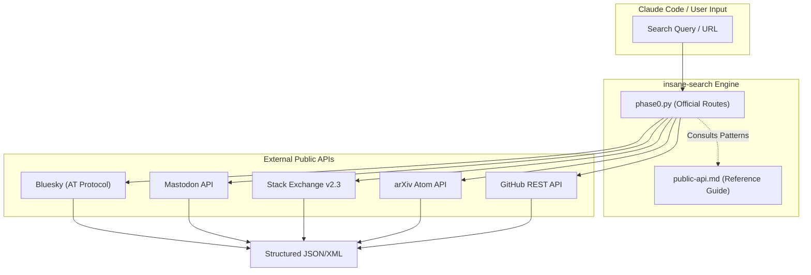
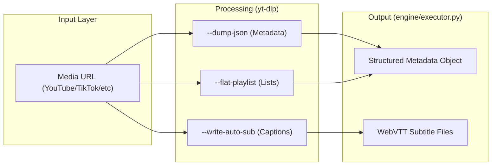

# Public APIs(Bluesky, Mastodon, Stack Overflow, arXiv, GitHub)

관련 소스 파일

다음 파일들은 이 위키 페이지를 생성하기 위한 컨텍스트로 사용되었습니다.

- [skills/insane-search/references/media.md](skills/insane-search/references/media.md)
- [skills/insane-search/references/public-api.md](skills/insane-search/references/public-api.md)

이 페이지는 인증이 필요 없는 안정적인 공개 REST API와 통합하기 위한 기술 참조를 제공합니다. 이러한 엔드포인트는 `insane-search` 생태계에서 신뢰도 높은 데이터 소스로 활용되며, 더 복잡한 scraping 또는 브라우저 기반 방식으로 단계 상승하기 전에 검색 파이프라인의 Phase 0에서 주요 대상으로 사용되는 경우가 많습니다.

## 개요 및 통합 전략

`insane-search` 엔진은 가능한 경우 HTML scraping보다 공식 공개 API를 우선합니다. 이러한 API는 구조화된 JSON 또는 Atom/XML 데이터를 제공하므로 DOM 파싱에 비해 정확도가 더 높고 유지관리 오버헤드가 낮습니다.

### Public APIs의 데이터 흐름

다음 다이어그램은 시스템이 public API 엔드포인트를 통해 요청을 라우팅하는 방식을 보여줍니다.

**Public API 요청 생명주기**

출처: [skills/insane-search/references/public-api.md:1-5](), [skills/insane-search/references/media.md:1-5]()

---

## 지원 플랫폼 및 구현

### 1. Bluesky(AT Protocol)
Bluesky 프로필과 피드는 AT Protocol의 공개 XRPC 엔드포인트를 통해 접근할 수 있습니다. 검색 기능은 제한되어 있지만(403), actor profile과 author feed는 계속 공개되어 있습니다.

*   **주요 함수**:
    *   `getProfile`: 표시 이름, follower 수, post 수를 가져옵니다.
    *   `getAuthorFeed`: 지정된 handle의 최근 게시물 10개를 가져옵니다.
*   **Rate Limit**: 시간당 약 3,000 requests.

출처: [skills/insane-search/references/public-api.md:6-20]()

### 2. Mastodon API
Mastodon은 인스턴스별로 동작합니다. `mastodon.social`은 공개 timeline 접근을 제한하는 경우가 많지만, `hachyderm.io`나 `fosstodon.org` 같은 다른 인스턴스는 일반적으로 비인증 lookup을 허용합니다.

*   **엔드포인트 패턴**:
    *   Account Lookup: `https://{instance}/api/v1/accounts/lookup?acct={username}`
    *   Statuses: `https://{instance}/api/v1/accounts/{id}/statuses`
    *   Hashtags: `https://{instance}/api/v1/timelines/tag/{tag}`

출처: [skills/insane-search/references/public-api.md:21-34]()

### 3. Stack Exchange API(v2.3)
Stack Overflow 및 관련 사이트에서 고품질 기술 답변을 가져오는 데 사용됩니다.

*   **구현 세부사항**:
    *   실제 답변 콘텐츠를 메타데이터만이 아니라 함께 가져오기 위해 `filter=withbody` 매개변수를 사용합니다.
    *   커뮤니티 검증을 받은 가장 관련성 높은 콘텐츠를 우선하기 위해 `votes` 기준 정렬을 지원합니다.
*   **Rate Limit**: 비인증 요청은 IP당 하루 300 requests.

출처: [skills/insane-search/references/public-api.md:36-50]()

### 4. arXiv 및 학술 API
학술 논문을 위해 시스템은 arXiv Atom API와 CrossRef를 활용합니다.

| 플랫폼 | 프로토콜 | 주요 기능 | Rate Limit |
| :--- | :--- | :--- | :--- |
| **arXiv** | Atom/XML | 제목(`ti`), 저자(`au`), 초록(`abs`)으로 검색. | 3 req/sec(1s sleep 필요) |
| **CrossRef** | JSON | DOI lookup 및 peer-reviewed 메타데이터. | 50 req/sec |
| **OpenLibrary** | JSON | ISBN lookup 및 도서 메타데이터. | 제한 없음 |

출처: [skills/insane-search/references/public-api.md:51-82]()

### 5. GitHub REST API
시스템은 사용 가능한 경우 기본적으로 `gh` CLI를 사용합니다. 그렇지 않으면 repository 검색, release 추적, code snippets를 위해 REST API로 폴백합니다.

*   **Rate Limit**: 비인증 사용자는 시간당 60 requests.
*   **주요 사용 사례**: Stars 기반 repository 정렬 및 release versioning.

출처: [skills/insane-search/references/public-api.md:93-106]()

---

## yt-dlp를 통한 Media Extraction
전통적인 의미의 REST API는 아니지만, `yt-dlp`는 1,800개 이상의 플랫폼에 대한 표준화된 인터페이스 역할을 하며 `--dump-json` 플래그를 통해 구조화된 메타데이터를 제공합니다.

**Media Extraction 아키텍처**

출처: [skills/insane-search/references/media.md:1-26](), [skills/insane-search/references/media.md:52-59]()

### 기술적 기능
*   **Metadata Extraction**: 미디어 파일을 다운로드하지 않고 `title`, `uploader`, `duration`, `description`을 가져옵니다 [skills/insane-search/references/media.md:18-26]().
*   **Subtitle Retrieval**: 자동 speech-to-text(YouTube) 및 `.vtt` 형식의 수동 자막을 지원합니다 [skills/insane-search/references/media.md:27-35]().
*   **Platform Specifics**: Naver TV, Chzzk, Soop 같은 한국 플랫폼용 특수 extractor를 포함합니다 [skills/insane-search/references/media.md:93-105]().

---

## Archive 및 Fallback Services
라이브 엔드포인트가 WAF(Web Application Firewalls)에 의해 차단되면, 시스템은 Wayback Machine CDX API를 사용해 과거 snapshot을 확인합니다.

*   **Availability Check**: `https://archive.org/wayback/available?url={URL}`
*   **CDX Search**: 사용 가능한 snapshot의 timestamp와 status code 목록을 가져오는 데 사용됩니다.

출처: [skills/insane-search/references/public-api.md:83-91]()

## Rate Limit 요약

| API | 비인증 제한 | 권장사항 |
| :--- | :--- | :--- |
| **Bluesky** | ~3,000/hr | profile/feed에만 사용하세요. |
| **Stack Exchange** | 300/day | `filter=withbody`를 사용하세요. |
| **arXiv** | 3/sec | 호출 사이에 1s sleep 필수. |
| **GitHub** | 60/hr | REST API보다 `gh` CLI를 선호하세요. |
| **CrossRef** | 50/sec | "Polite Pool"을 위해 User-Agent에 email을 추가하세요. |

출처: [skills/insane-search/references/public-api.md:108-120]()
