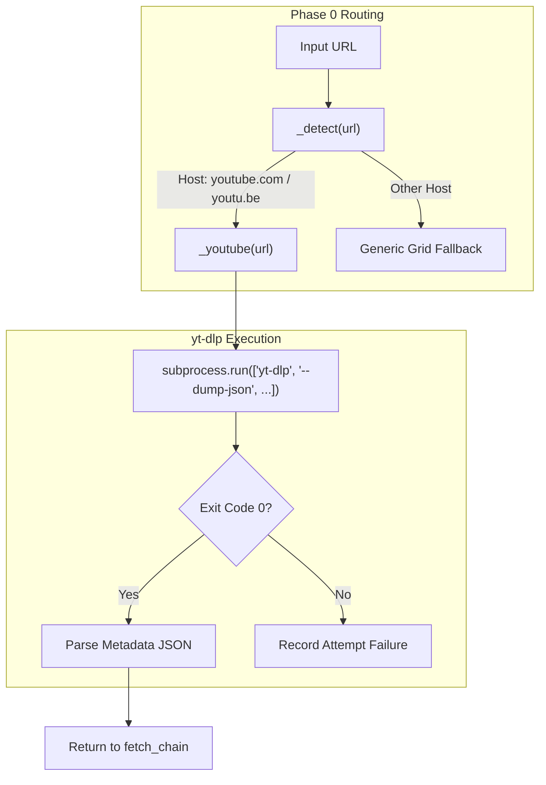
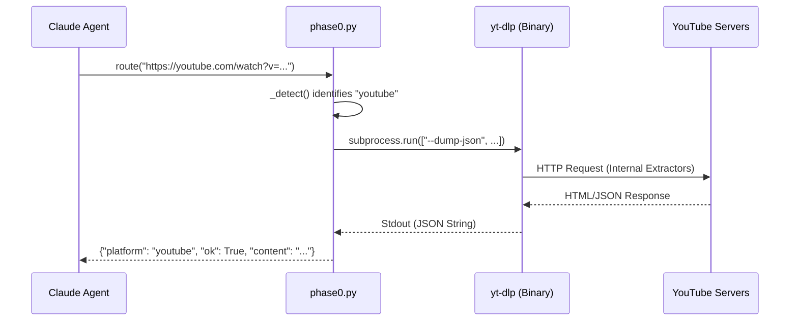

# Media Extraction(yt-dlp)

<details>
<summary>관련 소스 파일</summary>

다음 파일들은 이 위키 페이지를 생성하기 위한 컨텍스트로 사용되었습니다.

- [skills/insane-search/engine/phase0.py](skills/insane-search/engine/phase0.py)
- [skills/insane-search/references/media.md](skills/insane-search/references/media.md)
- [skills/insane-search/references/public-api.md](skills/insane-search/references/public-api.md)

</details>


이 페이지는 `insane-search`가 비디오 및 오디오 플랫폼에서 메타데이터와 콘텐츠를 추출하기 위한 특수 엔진으로 `yt-dlp`를 활용하는 방식을 설명합니다. 주로 YouTube용으로 알려져 있지만, `yt-dlp`는 Phase 0 단계 상승 로직 안에서 1,800개 이상의 플랫폼을 위한 범용 미디어 extractor 역할을 합니다.

## 개요 및 통합

`insane-search` 아키텍처에서 미디어 추출은 **Phase 0** 공식 경로로 처리됩니다. 즉, URL이 지원되는 미디어 플랫폼(예: YouTube, TikTok, SoundCloud)에 속한다고 식별되면, 시스템은 범용 WAF 회피 그리드로 폴백하기 전에 `yt-dlp` 사용을 시도합니다.

### 주요 기능
*   **Metadata Extraction**: `--dump-json`을 통해 제목, 업로더, 조회수, 설명을 포함하는 구조화된 JSON을 가져옵니다.
*   **Subtitle/Caption Retrieval**: 비디오 파일을 다운로드하지 않고 수동 또는 자동 생성 자막을 가져옵니다.
*   **Playlist/Channel Scanning**: `--flat-playlist`를 사용해 컬렉션의 모든 미디어 항목을 빠르게 나열합니다.
*   **Multi-Platform Search**: `ytsearch` 또는 `scsearch` 같은 내부 extractor를 활용해 콘텐츠를 직접 찾습니다.

| 컴포넌트 | 역할 |
| :--- | :--- |
| `phase0.py` | 미디어 URL을 감지하고 `yt-dlp`로 디스패치합니다. |
| `yt-dlp` | 쿠키 없이 인증된 것처럼 추출하는 데 사용되는 외부 바이너리입니다. |
| `media.md` | LLM이 유효한 `yt-dlp` 명령을 구성하기 위한 참조 가이드입니다. |

출처: [skills/insane-search/engine/phase0.py:67-69](), [skills/insane-search/references/media.md:1-4]()

---

## 구현 세부사항

미디어 추출 로직은 `phase0.py` 내부의 `_youtube`(및 범용 미디어 감지)에 캡슐화되어 있습니다. 시스템은 사용 가능한 경우 `yt-dlp` 바이너리 사용을 선호하며, 그렇지 않으면 `python3 -m yt_dlp`로 폴백합니다.

### 미디어 감지 로직
`_detect` 함수는 `yt-dlp` 경로를 트리거하기 위해 미디어 host를 식별합니다.


출처: [skills/insane-search/engine/phase0.py:59-69](), [skills/insane-search/engine/phase0.py:165-188]()

### 메타데이터 추출 명령
추출의 기본 방식은 `--dump-json` 플래그입니다. 이는 실제 미디어 비트스트림 다운로드를 방지하면서 포괄적인 기술 및 설명 메타데이터를 가져옵니다.

```python
# Simplified implementation in phase0.py
cmd = ["yt-dlp", "--dump-json", "--no-playlist", "--no-check-certificate", url]
res = subprocess.run(cmd, capture_output=True, text=True, timeout=timeout)
```
출처: [skills/insane-search/engine/phase0.py:173-178]()

---

## 데이터 흐름: URL에서 구조화 콘텐츠까지

이 다이어그램은 YouTube URL이 초기 요청에서 `yt-dlp` 래퍼를 거쳐 LLM을 위한 구조화 데이터가 되는 과정을 보여줍니다.


출처: [skills/insane-search/engine/phase0.py:165-195](), [skills/insane-search/references/media.md:18-22]()

---

## 자막 및 캡션 검색

`yt-dlp`는 YouTube 내부 timed-text API의 복잡성을 우회하는 데 특화되어 활용됩니다. 시스템은 캡션만 분리하기 위해 특정 플래그를 사용합니다.

1.  `--write-sub` / `--write-auto-sub`: 수동 자막과 AI 생성 자막을 모두 요청합니다.
2.  `--skip-download`: 비디오 데이터가 전송되지 않도록 보장합니다.
3.  `--sub-lang "en,ko"`: 특정 locale을 대상으로 합니다.

초기 메타데이터가 충분하지 않을 때, 보통 에이전트가 `media.md`의 패턴을 따라 shell을 통해 실행합니다.

| 플래그 | 목적 |
| :--- | :--- |
| `--write-comments` | 상위 수준 댓글을 추출합니다(특정 extractor args 필요). |
| `--flat-playlist` | 각 페이지를 방문하지 않고 채널의 모든 비디오 메타데이터를 추출합니다. |
| `ytsearchN:` | `yt-dlp`를 통해 직접 검색을 수행하는 내부 접두사입니다. |

출처: [skills/insane-search/references/media.md:27-35](), [skills/insane-search/references/media.md:52-66]()

---

## 지원 플랫폼(참조 색인)

`yt-dlp`는 특정 지역 및 미디어 유형에 대한 고충실도 extractor를 제공하며, `insane-search`는 이를 공식 경로로 활용합니다.

### 글로벌 플랫폼
*   **Video**: YouTube, Vimeo, Twitch(VODs), TikTok(Public), Dailymotion.
*   **Audio**: SoundCloud(search 포함), Apple Podcasts, TuneIn.

### 지역 플랫폼(대한민국)
엔진은 `yt-dlp`의 특수 extractor를 사용해 한국 미디어 추출에 최적화되어 있습니다.
*   **Naver TV / Chzzk**: `Naver`, `Naver:live`, `chzzk:video`.
*   **Broadcasters**: SBS, JTBC, Kakao.
*   **Community**: Soop(AfreecaTV), Weverse.

출처: [skills/insane-search/references/media.md:70-104]()

---

## 오류 처리 및 폴백

`phase0.py`에서 `_youtube` 함수는 `yt-dlp` 호출을 try-except 블록으로 감쌉니다. `yt-dlp`가 실패하면(예: 403 또는 지역 차단으로 인해), 시스템은 실패를 `attempts` 목록에 기록하고 `fetch_chain`이 Phase 1(Probes) 또는 Phase 2(Diversity Grid)로 진행하도록 허용합니다.

```python
try:
    # yt-dlp execution
    ...
except Exception as e:
    attempts.append(_attempt("youtube", "yt-dlp", False, 0, "", f"{type(e).__name__}"))
```
출처: [skills/insane-search/engine/phase0.py:186-191]()
